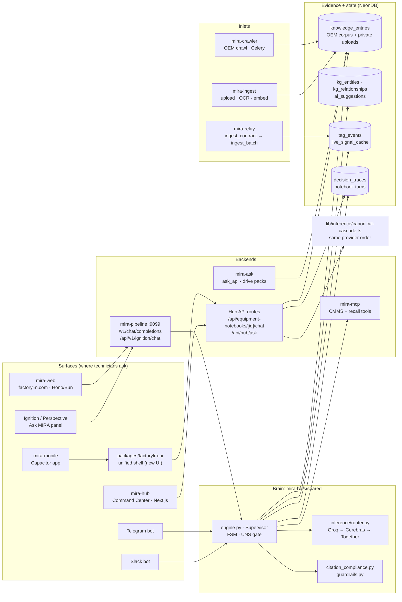
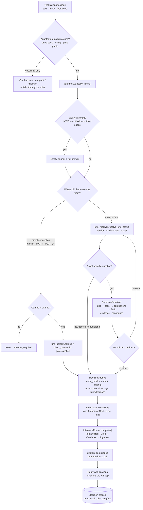
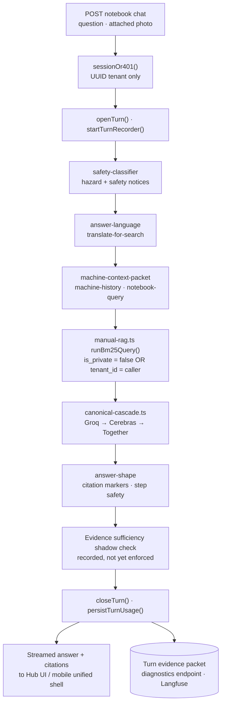
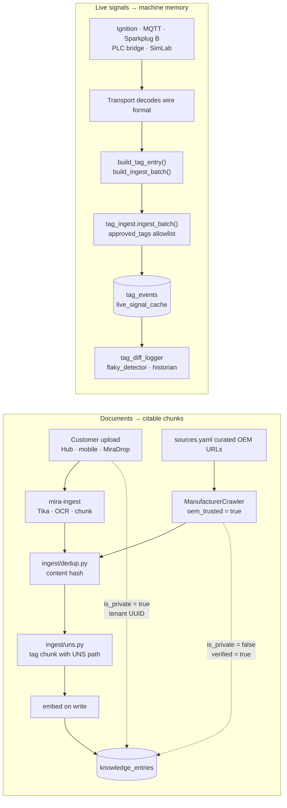
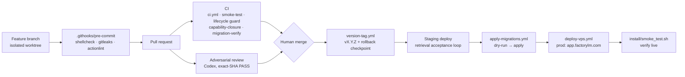

# MIRA Codebase Flowchart — baseline 2026-09-29

**Start here to understand the codebase.** Five module-level diagrams: what talks to what, how a chat turn is answered, how data gets in, and how code ships. Baseline snapshot of `main` on 2026-09-29 — when the architecture changes, add a new dated section or file rather than silently rewriting this one, so the baseline stays comparable.

Deeper references: [`docs/ARCHITECTURE.md`](../ARCHITECTURE.md) (layer rules) · [`container-map.md`](container-map.md) · [`database-map.md`](database-map.md) · [`ENGINE_REFERENCE.md`](ENGINE_REFERENCE.md) · [`INGEST_PIPELINES.md`](INGEST_PIPELINES.md) · [`docs/THEORY_OF_OPERATIONS.md`](../THEORY_OF_OPERATIONS.md) (why).

| # | Diagram | Answers |
|---|---|---|
| 1 | [System map](#1--system-map) | Which surfaces, backends, brain modules and tables exist, and how they connect |
| 2 | [Engine chat turn](#2--engine-chat-turn-slack-telegram-web-ignition) | How `Supervisor.process()` answers a Slack/Telegram/web/Ignition message |
| 3 | [Hub notebook turn](#3--hub-notebook-turn-command-center--mobile-app) | How the Hub/mobile notebook chat answers (separate TypeScript engine) |
| 4 | [Ingest pipelines](#4--ingest-pipelines) | How documents and live tag data enter |
| 5 | [Branch to production](#5--branch-to-production) | How a change goes from branch to prod |

## 1 · System map

Every consumption surface renders the same approved-context answer. There are two answer engines: the Python Supervisor behind the bots and `mira-pipeline`, and the Hub's TypeScript notebook route. Both read the same NeonDB evidence and use the same free-tier model cascade.

- 
**No Anthropic in the cascade** Chat and diagnosis use Groq, Cerebras and Together only (removed in PR #610). PrintSynth print-photo vision is the single exception.
- **Two chat engines** The Hub notebook route builds its own retrieval and prompt in TypeScript. A fix to `engine.py` does not reach the phone app.
- **Legacy, not in prod** `mira-sidecar` (ChromaDB), Open WebUI and `mira-connect` are dormant or removed.

## 2 · Engine chat turn (Slack, Telegram, web, Ignition)

The path through `Supervisor.process()` in `mira-bots/shared/engine.py`. Chat surfaces must pass the UNS location-confirmation gate before troubleshooting. Direct machine connections are certified by the connection itself.

- 
**Hard rule** A code path that starts troubleshooting before the technician confirms (chat surfaces) is a bug.
- **Safety never withholds** Since 2026-09-27, a safety hit shows a banner alongside the full answer; it does not stop the reply.
- **Read-only** No PLC or control writes anywhere in the beta product.

## 3 · Hub notebook turn (Command Center + mobile app)

`mira-hub/src/app/api/equipment-notebooks/[id]/chat/route.ts`. The notebook is already bound to one asset, so there is no chat gate. The flight recorder writes an evidence packet for every turn.

## 4 · Ingest pipelines

Documents and live signals take separate roads. Each has one canonical path, and CI rejects forks of either (Contract 5 in `tests/test_architecture.py` covers the tag path).

- 
**Hybrid corpus law** Per-tenant reads must use `(is_private = false OR tenant_id = caller)` on the raw pool. Filtering on tenant alone hides the OEM library; no filter leaks uploads.
- **Recall before recompute** Expensive stages (OCR, vision, embeddings) are materialized as versioned evidence keyed by source hash (`printsense/cas.py`).

## 5 · Branch to production

Dev on CHARLIE, staging on a Neon branch plus the staging VPS, production on the OVH host. Merge and deploy are human-gated.

- 
**Never** psql against prod, restart VPS containers by hand, or point a branch at `@FactoryLM_Diagnose`. `prod-guard.sh` blocks the obvious cases.

---

_Built 2026-09-29 from `origin/main` directory listings, the Hub notebook chat route's imports, and the repo's `CLAUDE.md` + `.claude/rules/`. Module-level only; not every service or table is drawn._
