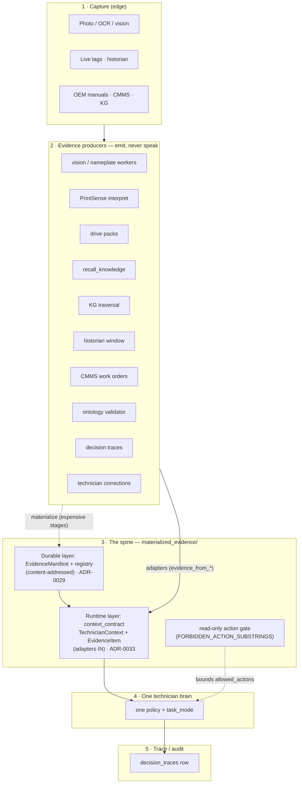

# The Bravo Evidence Lane — end-to-end architecture (hub)

**Status:** Living architecture index · **Owner:** Bravo node · **Date:** 2026-07-30

> **One-line:** Bravo (and every other specialist) is an **evidence producer**, never a
> second assistant. Specialized systems emit *typed evidence with provenance and confidence*
> into a common contract; **one** technician policy consumes it and answers with citations.
> This doc is the single navigable map of that lane — capture → producers → spine → one brain
> → trace — for both agents and humans.

This is a **hub**: it maps the lane and links out to the authoritative decisions
(ADRs), the C4 model, and the machine-readable catalog. It does **not** restate them.
When something here and a linked ADR disagree, the ADR wins — open an issue.

- **Catalog (the traceable table):** [`evidence-catalog.md`](./evidence-catalog.md)
- **Runbooks:** [add a producer](../runbooks/evidence-add-a-producer.md) ·
  [trace an item](../runbooks/evidence-trace-an-item.md) ·
  [verify the spine](../runbooks/evidence-verify-the-spine.md)
- **Decisions:** ADR-[0027](../adr/0027-mira-visual-technician-architecture.md) (visual technician) ·
  [0028](../adr/0028-vision-zero-token-architecture.md) (vision zero-token) ·
  [0029](../adr/0029-materialized-evidence.md) (materialized evidence) ·
  [0033](../adr/0033-one-technician-brain.md) (one brain, many producers)
- **Prior maps this supersedes-as-index (not content):** the C4 set in this dir
  (`c4-context.md`, `c4-components.md`, `c4-dynamic-fault-flow.md`), the
  [materialized-evidence architecture](./materialized-evidence.md) + its
  [inventory](./materialized-evidence-inventory.md), and the
  [context-spine unification plan](../plans/2026-06-25-context-spine-unification-plan.md).

---

## 0 · How to use this doc

- **Agent, "where does X live / what feeds the prompt?"** → §2 (producers) + the
  [catalog](./evidence-catalog.md) table (every kind → adapter → `file:line`).
- **Agent/human adding a new evidence source** → [add-a-producer runbook](../runbooks/evidence-add-a-producer.md).
- **Human, "is this real or invented in an answer?"** → §3 (the read-only + trust invariants)
  + [trace-an-item runbook](../runbooks/evidence-trace-an-item.md).
- **Reviewer, "is the spine healthy?"** → [verify-the-spine runbook](../runbooks/evidence-verify-the-spine.md).

---

## 1 · The doctrine (why the lane is shaped this way)

Per **ADR-0033**: MIRA has exactly **one conversational technician policy**. Drive Commander,
PrintSense, graph reasoning, live-state diagnosis, and work-order assist are **task modes**
(`TaskMode` metadata) of that one policy — *not* separate models or personas. Everything
specialized stays **below** the conversation and emits typed evidence. A system that cannot
express its output as *evidence + confidence + provenance* in the contract **does not
participate in answers** (ADR-0033 Rule 3).

Bravo's local VLM/OCR contribution obeys this exactly: it is a producer that materializes
observations, never a chatbot. See `NORTH_STAR.md` § "Bravo runtime boundary".

---

## 2 · The five layers

**Layer 1 — Capture.** Photo/OCR/vision at the Bravo edge; live tags + historian from
`mira-relay`; OEM manuals, CMMS work orders, and the KG from the shared corpus.

**Layer 2 — Producers.** ~12 specialist systems. Each one is *deterministic or narrow* and
maps its output into the contract through an **adapter** (`evidence_from_*`). The adapters are
the only sanctioned door in. The full list with `file:line` is the
[catalog](./evidence-catalog.md).

**Layer 3 — The spine (`materialized_evidence/`).** Two related layers in one package:

| Sub-layer | Files | What it is | Decision |
|---|---|---|---|
| **Durable materialization** | `schema.py`, `hashing.py`, `registry.py`, `resolver.py`, `invalidation.py` | Content-addressed `EvidenceManifest`/`EvidenceRecord` store + recall-first resolver + lineage invalidation. "What was computed, at what cost, is it still valid, can we reuse it?" | ADR-0029 |
| **Runtime context contract** | `context_contract.py` | `TechnicianContext` + typed `EvidenceItem`s assembled per turn + the read-only action gate. "What the one brain sees this turn." | ADR-0033 |

**Layer 4 — One brain.** One policy + `task_mode`; bounded by the read-only gate
(`ALLOWED_ACTION_VOCAB`, `FORBIDDEN_ACTION_SUBSTRINGS`).

**Layer 5 — Trace.** `decision_traces` becomes a *consumer* of the same contract shape, so
the audit row and the prompt context are one shape (ADR-0033 Consequences).

---

## 3 · The invariants (what a reviewer must be able to trust)

1. **Read-only.** No evidence item, adapter, or task mode may carry a write/control action.
   The gate rejects any `allowed_actions` string containing a `FORBIDDEN_ACTION_SUBSTRINGS`
   member (`write`, `set_`, `reset`, `force`, `start`, `stop`, `energize`, …). Enforced by
   `tests/test_context_contract.py` in lockstep with `agent_registry._WRITE_VERBS`.
2. **Trust is earned, never asserted.** `EvidenceItem.trust` defaults to `"candidate"`.
   Only a **human** review signal promotes to `"verified"` — model confidence and
   machine-verification states never do. Rejected/superseded rows drop.
3. **Provenance on every item.** Every `EvidenceItem` carries a `producer_name` and a
   citation id; a claim with no citable evidence is a refusal, not an answer (ADR-0033).
4. **The manifest is hash-law.** `EvidenceManifest` is content-addressed; adapters *compose*
   it, never mutate its fields. Adding a manifest field invalidates every existing recall key.

---

## 4 · Current wiring status (read this before assuming it's live)

The spine is **built and tested, but the runtime does not consume it yet.** The
`evidence_from_*` adapters have **no runtime callers** on `main` today — their only callers
are the contract's own tests. The runtime path (`mira-pipeline` / Supervisor / the workers)
still assembles context the old way.

- ✅ **Durable layer** — schema/hashing/registry/resolver/invalidation exist (ADR-0029 PR ladder).
- ✅ **Adapters** — 12 producers adapt IN to `TechnicianContext` (see catalog).
- ⏳ **Runtime migration** — wiring the adapters into `mira-pipeline`/Supervisor is a
  *separate, separately-reviewed* slice. Explicitly not done here.
- ⏳ **`evidence_from_visual_session`** (Bravo VisualSession → `PRINT_OBSERVATION`) lands in
  **PR #3016**, not yet on `main`. The catalog footnotes it as *incoming*.

This "built but unwired" state is deliberate (additive, no big-bang — ADR-0029 §E migration
plan). The catalog's **status** column tracks per-piece readiness.

---

## 5 · Keeping this map honest

The [catalog](./evidence-catalog.md) is the part most likely to drift from code. A drift-guard
test (`tests/test_evidence_catalog_sync.py`) fails if any `EvidenceKind` or `evidence_from_*`
adapter in `context_contract.py` is missing from the catalog. Auto-generating the catalog from
source (so it *cannot* drift) is the tracked follow-up — see the
[add-a-producer runbook](../runbooks/evidence-add-a-producer.md) § "Follow-up: generate the catalog".
