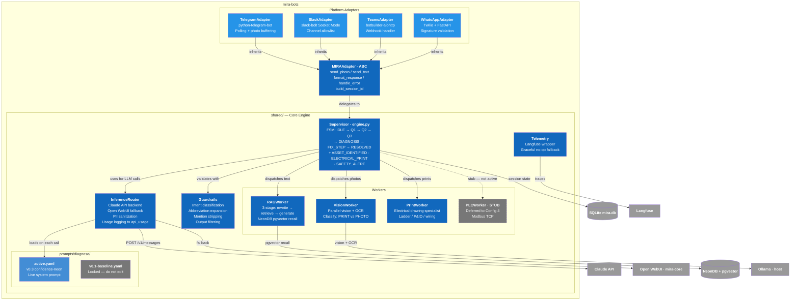

# C4 Component Diagram — mira-bots

Internal components of the bot layer: adapters, Supervisor FSM, workers, inference router, guardrails, and telemetry.

```mermaid
flowchart TB
    subgraph bots["mira-bots"]
        subgraph adapters["Platform Adapters"]
            tga["<b>TelegramAdapter</b><br/>python-telegram-bot<br/>Polling + photo buffering"]
            sla["<b>SlackAdapter</b><br/>slack-bolt Socket Mode<br/>Channel allowlist"]
            tea["<b>TeamsAdapter</b><br/>botbuilder-aiohttp<br/>Webhook handler"]
            waa["<b>WhatsAppAdapter</b><br/>Twilio + FastAPI<br/>Signature validation"]
        end

        base["<b>MIRAAdapter · ABC</b><br/>send_photo / send_text<br/>format_response / handle_error<br/>build_session_id"]

        subgraph shared["shared/ — Core Engine"]
            engine["<b>Supervisor · engine.py</b><br/>FSM: IDLE → Q1 → Q2 → Q3<br/>→ DIAGNOSIS → FIX_STEP → RESOLVED<br/>+ ASSET_IDENTIFIED · ELECTRICAL_PRINT<br/>· SAFETY_ALERT"]
            guardrails["<b>Guardrails</b><br/>Intent classification<br/>Abbreviation expansion<br/>Mention stripping<br/>Output filtering"]
            router["<b>InferenceRouter</b><br/>Claude API backend<br/>Open WebUI fallback<br/>PII sanitization<br/>Usage logging to api_usage"]

            subgraph workers["Workers"]
                vision["<b>VisionWorker</b><br/>Parallel vision + OCR<br/>Classify: PRINT vs PHOTO"]
                rag["<b>RAGWorker</b><br/>3-stage: rewrite →<br/>retrieve → generate<br/>NeonDB pgvector recall"]
                print_w["<b>PrintWorker</b><br/>Electrical drawing specialist<br/>Ladder / P&ID / wiring"]
                plc["<b>PLCWorker · STUB</b><br/>Deferred to Config 4<br/>Modbus TCP"]
            end

            subgraph prompts["prompts/diagnose/"]
                active["<b>active.yaml</b><br/>v0.3 confidence-neon<br/>Live system prompt"]
                baseline["<b>v0.1-baseline.yaml</b><br/>Locked — do not edit"]
            end

            telemetry["<b>Telemetry</b><br/>Langfuse wrapper<br/>Graceful no-op fallback"]
        end
    end

    claude_ext["<b>Claude API</b>"]
    openwebui_ext["<b>Open WebUI · mira-core</b>"]
    neon_ext[("<b>NeonDB + pgvector</b>")]
    sqlite_ext[("<b>SQLite mira.db</b>")]
    ollama_ext["<b>Ollama · host</b>"]
    langfuse_ext["<b>Langfuse</b>"]

    tga & sla & tea & waa -- "inherits" --> base
    base -- "delegates to" --> engine
    engine -- "validates with" --> guardrails
    engine -- "uses for LLM calls" --> router
    engine -- "dispatches photos" --> vision
    engine -- "dispatches text" --> rag
    engine -- "dispatches prints" --> print_w
    engine -. "stub — not active" .-> plc

    router -- "loads on each call" --> active
    router -- "POST /v1/messages" --> claude_ext
    router -- "fallback" --> openwebui_ext
    rag -- "pgvector recall" --> neon_ext
    vision -- "vision + OCR" --> ollama_ext
    engine -- "session state" --> sqlite_ext
    telemetry -- "traces" --> langfuse_ext

    style tga fill:#2694E8,color:#fff
    style sla fill:#2694E8,color:#fff
    style tea fill:#2694E8,color:#fff
    style waa fill:#2694E8,color:#fff
    style base fill:#1168BD,color:#fff
    style engine fill:#1168BD,color:#fff
    style guardrails fill:#1168BD,color:#fff
    style router fill:#1168BD,color:#fff
    style vision fill:#1168BD,color:#fff
    style rag fill:#1168BD,color:#fff
    style print_w fill:#1168BD,color:#fff
    style plc fill:#777,color:#fff,stroke-dasharray:5 5
    style active fill:#438DD5,color:#fff
    style baseline fill:#777,color:#fff
    style telemetry fill:#1168BD,color:#fff
    style claude_ext fill:#999,color:#fff
    style openwebui_ext fill:#999,color:#fff
    style neon_ext fill:#999,color:#fff
    style sqlite_ext fill:#999,color:#fff
    style ollama_ext fill:#999,color:#fff
    style langfuse_ext fill:#999,color:#fff
```
