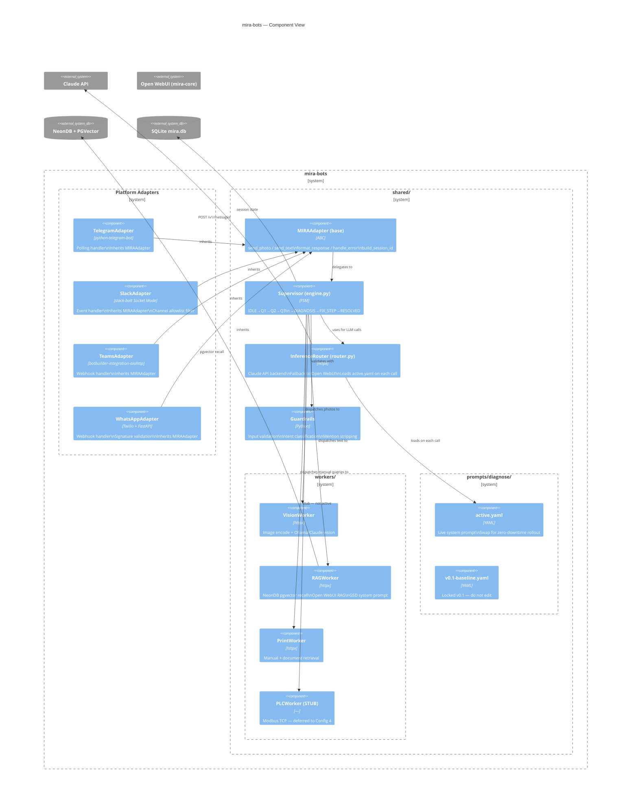

# C4 Component Diagram — mira-bots

Internal components of the bot layer.

```mermaid
C4Component
    title mira-bots — Component View

    Boundary(bots, "mira-bots") {
        Boundary(adapters, "Platform Adapters") {
            Component(tgadapter, "TelegramAdapter", "python-telegram-bot", "Polling handler\nInherits MIRAAdapter")
            Component(sladapter, "SlackAdapter", "slack-bolt Socket Mode", "Event handler\nInherits MIRAAdapter\nChannel allowlist filter")
            Component(teamadapter, "TeamsAdapter", "botbuilder-integration-aiohttp", "Webhook handler\nInherits MIRAAdapter")
            Component(waadapter, "WhatsAppAdapter", "Twilio + FastAPI", "Webhook handler\nSignature validation\nInherits MIRAAdapter")
        }

        Boundary(shared, "shared/") {
            Component(base, "MIRAAdapter (base)", "ABC", "send_photo / send_text\nformat_response / handle_error\nbuild_session_id")
            Component(engine, "Supervisor (engine.py)", "FSM", "IDLE→Q1→Q2→Q3\n→DIAGNOSIS→FIX_STEP→RESOLVED")
            Component(router, "InferenceRouter (router.py)", "httpx", "Claude API backend\nFallback to Open WebUI\nLoads active.yaml on each call")
            Component(guardrails, "Guardrails", "Python", "Input validation\nIntent classification\nMention stripping")

            Boundary(workers, "workers/") {
                Component(vision, "VisionWorker", "httpx", "Image encode + Ollama/Claude vision")
                Component(rag, "RAGWorker", "httpx", "NeonDB pgvector recall\nOpen WebUI RAG\nGSD system prompt")
                Component(print_, "PrintWorker", "httpx", "Manual + document retrieval")
                Component(plc, "PLCWorker (STUB)", "—", "Modbus TCP — deferred to Config 4")
            }

            Boundary(prompts, "prompts/diagnose/") {
                Component(active, "active.yaml", "YAML", "Live system prompt\nSwap for zero-downtime rollout")
                Component(baseline, "v0.1-baseline.yaml", "YAML", "Locked v0.1 — do not edit")
            }
        }
    }

    System_Ext(claude, "Claude API")
    System_Ext(openwebui, "Open WebUI (mira-core)")
    SystemDb_Ext(neon, "NeonDB + PGVector")
    SystemDb_Ext(sqlite, "SQLite mira.db")

    Rel(tgadapter, base, "inherits")
    Rel(sladapter, base, "inherits")
    Rel(teamadapter, base, "inherits")
    Rel(waadapter, base, "inherits")

    Rel(base, engine, "delegates to")
    Rel(engine, router, "uses for LLM calls")
    Rel(engine, guardrails, "validates with")
    Rel(engine, vision, "dispatches photos to")
    Rel(engine, rag, "dispatches text to")
    Rel(engine, print_, "dispatches manual queries to")
    Rel(engine, plc, "stub — not active")

    Rel(router, active, "loads on each call")
    Rel(router, claude, "POST /v1/messages")
    Rel(rag, neon, "pgvector recall")
    Rel(engine, sqlite, "session state")
```
