# C4 Container Diagram — MIRA

All 9 Docker containers, 2 Docker networks, Ollama on host, and external dependencies.

```mermaid
flowchart TB
    tech["<b>Field Technician</b>"]

    subgraph mac["Mac Mini M4 16 GB — bravonode · 192.168.1.11"]
        subgraph corenet["core-net · Docker bridge"]
            webui["<b>mira-core</b><br/>Open WebUI v0.8.10<br/>Chat UI + KB admin<br/>:3000 → 8080"]
            mcpo["<b>mira-mcpo</b><br/>mcpo v0.0.20 + fastmcp<br/>MCP tool proxy<br/>:8000"]
            ingest["<b>mira-ingest</b><br/>FastAPI · Python 3.12<br/>Photo/PDF pipeline<br/>:8002 → 8001"]
            bridge["<b>mira-bridge</b><br/>Node-RED 4.1.7-22<br/>Orchestration + dashboard<br/>:1880"]
            mcp["<b>mira-mcp</b><br/>FastMCP · Python 3.12<br/>4 MCP tools + REST API<br/>:8009 → 8000 / :8001"]
        end

        subgraph botnet["bot-net · Docker bridge"]
            tgbot["<b>mira-bot-telegram</b><br/>python-telegram-bot 21<br/>Polling — no open port"]
            slbot["<b>mira-bot-slack</b><br/>slack-bolt 1.x<br/>Socket Mode — no open port"]
            tebot["<b>mira-bot-teams</b><br/>botbuilder 4.17<br/>Webhook :8030"]
            wabot["<b>mira-bot-whatsapp</b><br/>FastAPI + Twilio 9.x<br/>Webhook :8010"]
        end

        ollama["<b>Ollama</b><br/>HOST process · Metal GPU<br/>:11434<br/>qwen2.5vl:7b · glm-ocr<br/>nomic-embed-text/vision"]
        sqlite[("<b>mira.db</b><br/>SQLite WAL<br/>mira-bridge/data/")]
    end

    claude["<b>Claude API</b><br/>LLM inference"]
    neon[("<b>NeonDB + pgvector</b><br/>Cloud RAG store")]
    langfuse["<b>Langfuse</b><br/>Observability · optional"]
    slack_ext["<b>Slack</b>"]
    telegram_ext["<b>Telegram</b>"]
    teams_ext["<b>Teams / Azure</b>"]
    twilio_ext["<b>WhatsApp / Twilio</b>"]

    tech --> slack_ext & telegram_ext & teams_ext & twilio_ext

    slack_ext -- "WebSocket" --> slbot
    telegram_ext -- "HTTPS polling" --> tgbot
    teams_ext -- "POST /api/messages" --> tebot
    twilio_ext -- "POST /webhook" --> wabot

    tgbot & slbot & tebot & wabot -- "POST /v1/messages" --> claude
    tgbot & slbot & tebot & wabot -- "Read/write sessions" --> sqlite
    tgbot & slbot & tebot & wabot -- "Traces" --> langfuse

    tgbot & slbot & tebot & wabot -- "POST /ingest/photo" --> ingest
    ingest -- "Embed + describe" --> ollama
    ingest -- "pgvector recall" --> neon

    mcpo -- "SSE" --> mcp
    mcp -- "Read" --> sqlite
    bridge -- "Orchestration state" --> sqlite
    webui -- "Ollama chat" --> ollama

    style tech fill:#08427B,color:#fff
    style webui fill:#1168BD,color:#fff
    style mcpo fill:#1168BD,color:#fff
    style ingest fill:#1168BD,color:#fff
    style bridge fill:#1168BD,color:#fff
    style mcp fill:#1168BD,color:#fff
    style tgbot fill:#2694E8,color:#fff
    style slbot fill:#2694E8,color:#fff
    style tebot fill:#2694E8,color:#fff
    style wabot fill:#2694E8,color:#fff
    style ollama fill:#E87C26,color:#fff
    style sqlite fill:#438DD5,color:#fff
    style claude fill:#999,color:#fff
    style neon fill:#999,color:#fff
    style langfuse fill:#999,color:#fff
    style slack_ext fill:#999,color:#fff
    style telegram_ext fill:#999,color:#fff
    style teams_ext fill:#999,color:#fff
    style twilio_ext fill:#999,color:#fff
```

**Notes:**
- All 4 bots are on **both** `core-net` and `bot-net`
- `mira-core` is on both networks; all other core services are `core-net` only
- Ollama runs on the Mac Mini host, not inside Docker (Metal GPU acceleration)
- SQLite in WAL mode is shared via bind-mount to `mira-bridge/data/`
