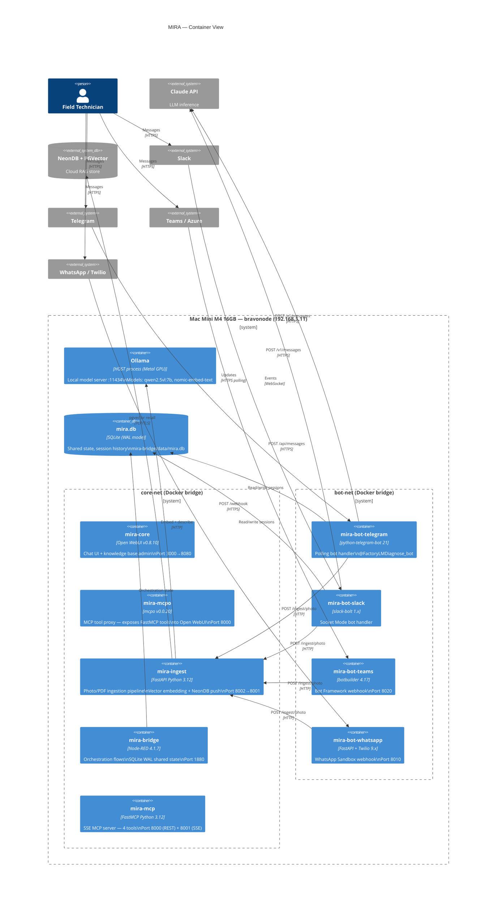

# C4 Container Diagram — MIRA

All 7 Docker containers + Ollama on host.

```mermaid
C4Container
    title MIRA — Container View

    Person(tech, "Field Technician")

    Boundary(mac, "Mac Mini M4 16GB — bravonode (192.168.1.11)") {
        Boundary(core, "core-net (Docker bridge)") {
            Container(webui, "mira-core", "Open WebUI v0.8.10", "Chat UI + knowledge base admin\nPort 3000→8080")
            Container(mcpo, "mira-mcpo", "mcpo v0.0.20", "MCP tool proxy — exposes FastMCP tools\nto Open WebUI\nPort 8000")
            Container(ingest, "mira-ingest", "FastAPI Python 3.12", "Photo/PDF ingestion pipeline\nVector embedding + NeonDB push\nPort 8002→8001")
            Container(bridge, "mira-bridge", "Node-RED 4.1.7", "Orchestration flows\nSQLite WAL shared state\nPort 1880")
            Container(mcp, "mira-mcp", "FastMCP Python 3.12", "SSE MCP server — 4 tools\nPort 8000 (REST) + 8001 (SSE)")
        }

        Boundary(botnet, "bot-net (Docker bridge)") {
            Container(tgbot, "mira-bot-telegram", "python-telegram-bot 21", "Polling bot handler\n@FactoryLMDiagnose_bot")
            Container(slbot, "mira-bot-slack", "slack-bolt 1.x", "Socket Mode bot handler")
            Container(tebot, "mira-bot-teams", "botbuilder 4.17", "Bot Framework webhook\nPort 8020")
            Container(wabot, "mira-bot-whatsapp", "FastAPI + Twilio 9.x", "WhatsApp Sandbox webhook\nPort 8010")
        }

        Container(ollama, "Ollama", "HOST process (Metal GPU)", "Local model server :11434\nModels: qwen2.5vl:7b, nomic-embed-text")
        ContainerDb(sqlite, "mira.db", "SQLite (WAL mode)", "Shared state, session history\nmira-bridge/data/mira.db")
    }

    System_Ext(claude, "Claude API", "LLM inference")
    SystemDb_Ext(neon, "NeonDB + PGVector", "Cloud RAG store")
    System_Ext(slack, "Slack")
    System_Ext(telegram, "Telegram")
    System_Ext(teams, "Teams / Azure")
    System_Ext(twilio, "WhatsApp / Twilio")

    Rel(tech, slack, "Messages", "HTTPS")
    Rel(tech, telegram, "Messages", "HTTPS")
    Rel(tech, teams, "Messages", "HTTPS")
    Rel(tech, twilio, "Messages", "HTTPS")

    Rel(slack, slbot, "Events", "WebSocket")
    Rel(telegram, tgbot, "Updates", "HTTPS polling")
    Rel(teams, tebot, "POST /api/messages", "HTTPS")
    Rel(twilio, wabot, "POST /webhook", "HTTPS")

    Rel(tgbot, ingest, "POST /ingest/photo", "HTTP")
    Rel(slbot, ingest, "POST /ingest/photo", "HTTP")
    Rel(tebot, ingest, "POST /ingest/photo", "HTTP")
    Rel(wabot, ingest, "POST /ingest/photo", "HTTP")

    Rel(tgbot, claude, "POST /v1/messages", "HTTPS")
    Rel(slbot, claude, "POST /v1/messages", "HTTPS")

    Rel(ingest, neon, "pgvector recall", "TCP/TLS")
    Rel(ingest, ollama, "Embed + describe", "HTTP")

    Rel(tgbot, sqlite, "Read/write sessions")
    Rel(slbot, sqlite, "Read/write sessions")
    Rel(bridge, sqlite, "Orchestration state")
```
