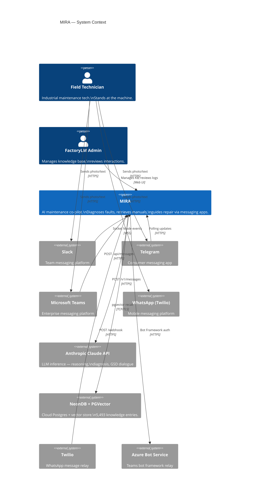

# C4 Context Diagram — MIRA

MIRA as a black box: who uses it and what external systems it depends on.

```mermaid
C4Context
    title MIRA — System Context

    Person(tech, "Field Technician", "Industrial maintenance tech.\nStands at the machine.")
    Person(admin, "FactoryLM Admin", "Manages knowledge base,\nreviews interactions.")

    System(mira, "MIRA", "AI maintenance co-pilot.\nDiagnoses faults, retrieves manuals,\nguides repair via messaging apps.")

    System_Ext(slack, "Slack", "Team messaging platform")
    System_Ext(telegram, "Telegram", "Consumer messaging app")
    System_Ext(teams, "Microsoft Teams", "Enterprise messaging platform")
    System_Ext(whatsapp, "WhatsApp (Twilio)", "Mobile messaging platform")

    System_Ext(claude, "Anthropic Claude API", "LLM inference — reasoning,\ndiagnosis, GSD dialogue")
    System_Ext(neondb, "NeonDB + PGVector", "Cloud Postgres + vector store.\n5,493 knowledge entries.")
    System_Ext(twilio, "Twilio", "WhatsApp message relay")
    System_Ext(azure, "Azure Bot Service", "Teams bot framework relay")

    Rel(tech, slack, "Sends photo/text", "HTTPS")
    Rel(tech, telegram, "Sends photo/text", "HTTPS")
    Rel(tech, teams, "Sends photo/text", "HTTPS")
    Rel(tech, whatsapp, "Sends photo/text", "HTTPS")

    Rel(admin, mira, "Manages KB, reviews logs", "Web UI")

    Rel(slack, mira, "Socket Mode events", "WSS")
    Rel(telegram, mira, "Polling updates", "HTTPS")
    Rel(teams, mira, "POST /api/messages", "HTTPS")
    Rel(twilio, mira, "POST /webhook", "HTTPS")

    Rel(mira, claude, "POST /v1/messages", "HTTPS")
    Rel(mira, neondb, "pgvector recall", "TCP/TLS")
    Rel(mira, azure, "Bot Framework auth", "HTTPS")
```
