# C4 Deployment Diagram — MIRA

Physical and cloud deployment topology for Config 1 MVP.

```mermaid
flowchart TB
    subgraph mac["Apple Mac Mini M4 16 GB · macOS<br/>bravonode · LAN 192.168.1.11 · Tailscale 100.86.236.11"]
        subgraph docker["Docker Engine"]
            subgraph corenet2["core-net"]
                d_webui["mira-core<br/>open-webui:v0.8.10<br/>:3000"]
                d_mcpo["mira-mcpo<br/>mcpo:v0.0.20<br/>:8000"]
                d_ingest["mira-ingest<br/>python:3.12.13-slim<br/>:8002"]
                d_bridge["mira-bridge<br/>node-red:4.1.7-22<br/>:1880"]
                d_mcp["mira-mcp<br/>python:3.12.13-slim<br/>:8009 / :8001"]
            end
            subgraph botnet2["bot-net"]
                d_tg["mira-bot-telegram<br/>python:3.12.13-slim<br/>polling"]
                d_sl["mira-bot-slack<br/>python:3.12.13-slim<br/>Socket Mode"]
                d_te["mira-bot-teams<br/>python:3.12.13-slim<br/>:8030"]
                d_wa["mira-bot-whatsapp<br/>python:3.12.13-slim<br/>:8010"]
            end
        end

        subgraph host["Host Processes"]
            d_ollama["Ollama<br/>Metal GPU inference<br/>:11434"]
        end

        d_sqlite[("mira.db<br/>SQLite WAL<br/>~/Mira/mira-bridge/data/")]
    end

    subgraph neoncloud["NeonDB · us-east-1 AWS"]
        d_pgvector[("neondb<br/>pgvector 768-dim<br/>5,493 knowledge entries")]
    end

    subgraph anthropic["Anthropic Cloud"]
        d_claude["Claude API<br/>claude-3-5-sonnet-20241022"]
    end

    subgraph twilio_cloud["Twilio Cloud"]
        d_twilio["WhatsApp Relay<br/>Sandbox → Production"]
    end

    subgraph azure_cloud["Azure · Microsoft"]
        d_azure["Azure Bot Service<br/>F0 free tier"]
    end

    subgraph langfuse_cloud["Langfuse Cloud · optional"]
        d_langfuse["LLM observability"]
    end

    subgraph doppler_cloud["Doppler"]
        d_doppler["Secret Manager<br/>factorylm/prd config"]
    end

    d_ingest -- "pgvector recall · TCP/TLS :5432" --> d_pgvector
    d_tg & d_sl -- "POST /v1/messages · HTTPS" --> d_claude
    d_twilio -- "POST /webhook · HTTPS :8010" --> d_wa
    d_azure -- "POST /api/messages · HTTPS :8030" --> d_te
    d_ingest -- "embed + describe · HTTP :11434" --> d_ollama
    d_tg & d_sl -- "traces · HTTPS" --> d_langfuse
    d_doppler -. "env injection at compose up" .-> docker

    style mac fill:#f5f5f5,color:#333,stroke:#333
    style docker fill:#e8f4fd,color:#333,stroke:#1168BD
    style host fill:#fff3e0,color:#333,stroke:#E87C26
    style d_webui fill:#1168BD,color:#fff
    style d_mcpo fill:#1168BD,color:#fff
    style d_ingest fill:#1168BD,color:#fff
    style d_bridge fill:#1168BD,color:#fff
    style d_mcp fill:#1168BD,color:#fff
    style d_tg fill:#2694E8,color:#fff
    style d_sl fill:#2694E8,color:#fff
    style d_te fill:#2694E8,color:#fff
    style d_wa fill:#2694E8,color:#fff
    style d_ollama fill:#E87C26,color:#fff
    style d_sqlite fill:#438DD5,color:#fff
    style d_pgvector fill:#999,color:#fff
    style d_claude fill:#999,color:#fff
    style d_twilio fill:#999,color:#fff
    style d_azure fill:#999,color:#fff
    style d_langfuse fill:#999,color:#fff
    style d_doppler fill:#999,color:#fff
```

**Color Key:**
- **Dark blue** — Core infrastructure containers
- **Light blue** — Bot relay containers
- **Orange** — Host process (not containerized)
- **Grey** — External cloud services
