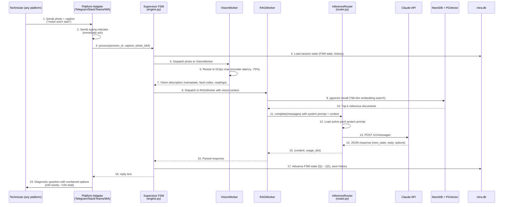

# C4 Dynamic Diagram — Fault Diagnosis Flow

End-to-end sequence: technician sends photo → MIRA responds with diagnosis question.



## Timing Budget (target: <10s end-to-end)

| Step | Typical Latency |
|------|----------------|
| Photo download + resize | 200ms |
| Vision worker (Ollama local) | 1-3s |
| NeonDB pgvector recall | 100-300ms |
| Claude API call | 1-3s |
| Total | **3-7s** |

## FSM States

```
IDLE → Q1 → Q2 → Q3 → DIAGNOSIS → FIX_STEP → RESOLVED
                                ↗
                         SAFETY_ALERT (always reachable from any state)
```
