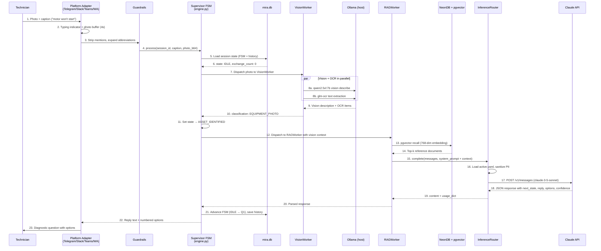

# C4 Dynamic Diagram — Fault Diagnosis Flow

End-to-end sequence: technician sends a photo, MIRA responds with a diagnostic question.



## Timing Budget (target: under 10s end-to-end)

| Step | Typical Latency |
|------|----------------|
| Photo download + resize (512px max) | 200 ms |
| VisionWorker (Ollama local, parallel) | 1–3 s |
| NeonDB pgvector recall | 100–300 ms |
| Claude API call | 1–3 s |
| **Total** | **3–7 s** |

## FSM States

```
IDLE → Q1 → Q2 → Q3 → DIAGNOSIS → FIX_STEP → RESOLVED

Special states (reachable from any state):
  SAFETY_ALERT       — hazard detected, de-energize warning
  ASSET_IDENTIFIED   — photo analyzed, equipment recognized
  ELECTRICAL_PRINT   — photo classified as drawing/schematic
```
