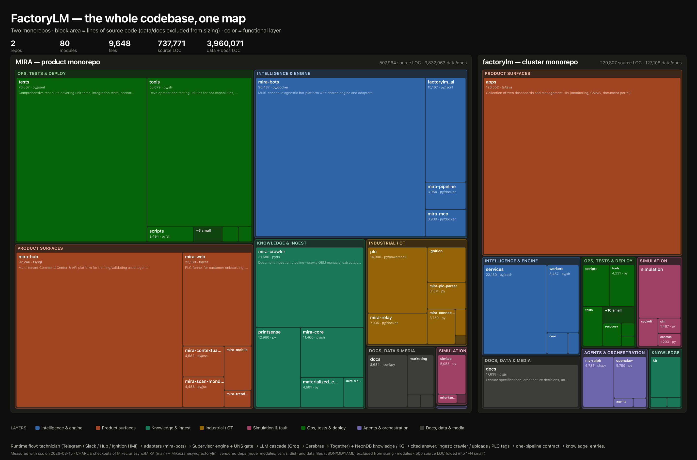

# Gate 0 Discovery — Summary & Index

**Date:** 2026-08-15 · **Program:** `docs/architecture/FACTORYLM_MIRA_ARCHITECTURE_CONVERGENCE.md`
**Method:** 12-agent module scan (map) + 10 parallel read-only explorer agents + 1 identity probe, all evidence file:line-cited; deterministic measurements via scc. **No repo code was modified** — this PR is docs + registry only, per "Gate 0 is read-only".

## Deliverables (§16 checklist)

| § | Deliverable | Where | Status |
|---|---|---|---|
| 1 | Architecture Registry | `REGISTRY.yaml` (80 modules, machine-generated sizing + scan purposes + declared-state citations) | ✅ seed |
| 2-3 | Dependency graphs (source/runtime/DB/queues/deploy) | woven through `DRIFT_REPORT.md`, `DUPLICATE_CAPABILITIES.md` §5, `ASSET_IDENTITY.md`; full agent output archived in session workflow journal | ✅ findings-level |
| 4 | Declared-vs-observed drift report | `DRIFT_REPORT.md` — 6 confirmed, 3 drifted, 1 stale | ✅ |
| 5 | Semantic duplicate report | `DUPLICATE_CAPABILITIES.md` — 4 families | ✅ |
| 6 | Canonical ownership decisions | `OWNERSHIP.md` — proposed, needs Mike's ADR ratification | ⏳ proposed |
| 7 | Executable architecture contracts | CU-06 in backlog (not yet built — implementation, so post-Gate-0) | ⏳ planned |
| 8 | Ranked migration backlog | `BACKLOG.md` — 10 units, sequenced | ✅ |
| 9 | Personal SWE-Bench starter set | `SWE_BENCH_SEED.md` — ~30 cases, 10 categories | ✅ seed |
| 10 | One evidenced pilot migration | CU-P1 ✅ DONE (PR #3249, v3.273.2) — full gate walk incl. a round-1 adversarial BLOCK on a real defect, fixed and re-passed; record in `units/CU-P1.md` | ✅ |

## The five headline discoveries

1. **Asset identity is bifurcated 5 ways** (`ASSET_IDENTITY.md`) — the product-spine invariant "same canonical asset identity throughout" is not yet true. This is the flagship convergence program (CU-05), deliberately sequenced last.
2. **The §4 ownership split describes layers, not repos** — MIRA owns both industrial truth and intelligence today; factorylm repo is cluster-infra + frozen 2026-03 predecessors; zero cross-repo runtime calls. Convergence is about truth/code ownership, not untangling a live distributed system.
3. **The mobile app is architecturally clean** — pure consumer of 12 canonical Hub endpoints, fail-closed auth (it even avoids Hub's own `role ?? 'owner'` fallback) — with exactly **one** contract drift: the asset-tag grammar. That drift is small, real, and on the product spine → chosen as the pilot (CU-P1).
4. **Apparent duplication mostly collapses under evidence** — 5 "PLC parsers" are one canonical per distinct job; 3 sim lineages reduce to SimLab canonical + bench standalones + dormant legacy. The genuinely dangerous duplicates are the frozen factorylm bot/engine predecessors (strangulation, CU-04).
5. **Two standing write-path gaps in knowledge ingestion** (is_private hardcoded false in `insert_chunk`; no sources.yaml validation in `ingest_url`) — already partially known to the rules docs, now scheduled as CU-03 with xhigh review.

## What needs Mike (the human gate)

1. **Approve this Gate 0 PR** — merging it makes the doctrine + registry canonical repo content.
2. **Ratify OWNERSHIP.md** as ADRs (esp. "factorylm repo = cluster infra only").
3. ~~**GO/no-GO on pilot CU-P1**~~ — **RESOLVED 2026-08-15.** GO given; the pilot walked every gate and shipped (PR #3249 → `a353a334a` → v3.273.2). Record: `units/CU-P1.md`.
4. **ADR-0033 status decision** (D-3), any time. Scheduled as **CU-09**.
5. **§Gate 7 external reviewer lane — still owed.** §Gate 7 names GPT-5.6 Sol/Codex as the independent adversarial reviewer. That lane was **not** wired for the pilot: an independent fresh-context reviewer agent substituted (and did its job — it returned a round-1 BLOCK on a real case-sensitivity defect, fixed in `855a5153d`). The deviation is recorded in `units/CU-P1.md` and now tracked as **CU-11** in `BACKLOG.md`. CU-02 (docs-only) can survive another substitute; **CU-03 is xhigh and cannot legitimately walk Gate 7 until this lane exists.**

Merging this PR makes the doctrine + registry canonical. It does **not** by itself satisfy item 2 — ratifying `OWNERSHIP.md` as ADRs is a separate ADR PR.

## Corrections this discovery forced on prior beliefs

- Earlier session measurements (2.5M "source" LOC) were inflated ~5× by vendored deps; true source is ~738k across both repos. Blind spot §13.13 confirmed in practice.
- Root CLAUDE.md's own container map and sidecar status were stale (D-2, D-4) — the doc-drift problem the registry exists to solve applies to the primary context file itself.
