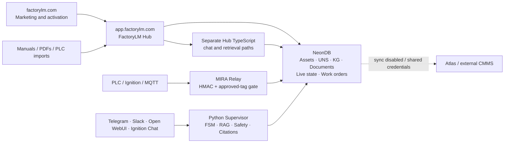

# FactoryLM end-to-end interoperability assessment

**Assessment date:** 2026-08-07

**Repository baseline:** `2147f40b1bd8bc38f5a2d50b9ae0535d92f74681`

**Live Hub at assessment:** `3.253.1`, the same `2147f40b1` revision

**Scope:** `factorylm.com`, `app.factorylm.com`, MIRA Hub, diagnostic adapters,
Ignition/PLC ingestion, knowledge ingestion, NeonDB, and CMMS handoff

## Executive verdict

FactoryLM is a real full-stack industrial maintenance platform with several
working vertical slices. It is **not yet one fully interoperating, repeatable
customer solution**.

The honest product boundary today is:

> **Pilot-capable with manual commissioning; not yet self-service or behaviorally
> unified across every interface.**

The platform has the major parts required for the complete product: tenant-aware
SaaS, asset and namespace context, document ingestion, live tag ingestion,
diagnostics, citations, work management, and CMMS integration code. The remaining
gaps are concentrated at the seams between those parts:

1. customer factory activation does not provision everything the production tag
   stream requires;
2. Hub chat surfaces do not use the same diagnostic engine as the messaging and
   Ignition adapters;
3. the canonical Python pipeline does not yet derive a Hub tenant per chat
   request;
4. external CMMS synchronization is intentionally off by default and is not
   safely provisioned per tenant;
5. live history and uploaded-document binding are not yet represented by one
   authoritative contract;
6. deployment contains residual root-path and provider-configuration drift; and
7. no release gate proves the whole customer journey from activation through
   CMMS closure.

This is a documentation assessment. It makes no runtime, schema, deployment, or
configuration changes.

## URL and deployment boundary

- The authenticated product is `https://app.factorylm.com`, not
  `https://factorylm.com/app`.
- At assessment time, `GET https://app.factorylm.com/api/health/` returned HTTP
  200 and identified `mira-hub` version `3.253.1` at commit `2147f40b1`.
- `GET https://factorylm.com/app` returned HTTP 404.
- The repository's default activation relay hosts, `connect.factorylm.com` and
  the collector fallback `api.factorylm.com`, did not resolve in public DNS at
  assessment time. A private or Doppler-provided override may exist, but it is
  not provable from the repository.

## Intended system flow



The intended doctrine is already explicit in `docs/THEORY_OF_OPERATIONS.md`: the
adapters should use the **same engine, same gate, and same grounding**. That is
the correct interoperability standard for this assessment.

## Capability scorecard

| Capability | Status | Assessment |
|---|---|---|
| SaaS application | **Real** | Authentication, users, roles, assets, namespace, knowledge, contextualization, command center, PMs, and work orders exist. |
| Tenant isolation | **Real** | Hub database calls can switch to `factorylm_app`, set transaction-local tenant IDs, and enforce RLS. |
| Manual to cited answer | **Proven on one path** | The namespace NodeChat `/files/` route is covered by the real staging beta gate. |
| Live current state | **Real when commissioned** | Relay ingestion writes approved readings into the canonical current-state cache used by Hub context. |
| Live history | **Partial** | Production relay tables and demo-oriented Hub event tables coexist. |
| Diagnostic engine | **Substantial** | The Python `Supervisor` provides FSM, RAG, safety, memory, evidence, and citations. |
| Cross-channel diagnostic parity | **Not achieved** | Hub asset chat, NodeChat, and `/api/mira/ask` use separate TypeScript reasoning paths. |
| Work management | **Real in Hub** | Tenant-scoped work orders and PM schedules exist. |
| External CMMS write-back | **Partial / gated** | Atlas sync exists but defaults off; other advertised providers do not share the same Hub sync implementation. |
| Self-service factory activation | **Not complete** | Activation does not provision the HMAC key and the committed timer package is incomplete. |
| Repeatable clean deployment | **Partial** | Containers and workflows exist, but schema and integration bootstrapping remain distributed. |
| Complete golden journey | **Missing** | No gate covers activation → telemetry → diagnosis → work order → external CMMS. |

## What is genuinely wired

### 1. Tenant-aware Hub

`mira-hub/src/lib/tenant-context.ts` uses a transaction to:

- switch from the owner connection to the limited `factorylm_app` role;
- set both `app.tenant_id` and `app.current_tenant_id`; and
- commit or roll back the entire tenant operation.

`mira-hub/src/lib/session.ts` reloads the user's current role instead of trusting
a stale browser role. This is a strong foundation for a multi-tenant product.

Some routes intentionally use the owner/BYPASSRLS pool with explicit tenant
predicates. Those paths can be valid, but they expand the route-by-route audit
surface and should not become the default pattern.

### 2. Namespace manual upload to cited answer

The namespace-node ingestion path is a real vertical slice:

1. upload a PDF to a namespace node;
2. extract and chunk it;
3. write tenant-private `knowledge_entries` rows;
4. make those chunks available to NodeChat retrieval; and
5. require a citation in the returned answer.

`tests/beta/beta_ready_upload_retrieval_citation.py` and
`.github/workflows/beta-gate.yml` exercise this against a stranger-style staging
tenant over HTTP. This proves the specific NodeChat `/files/` door. It does not
prove every Hub upload door or every chat surface.

### 3. Read-only industrial tag ingestion

`mira-relay/tag_ingest.py` provides a credible production boundary:

- HMAC-authenticated tenant identity at the relay;
- a fail-closed `approved_tags` allowlist;
- append-only writes to `tag_events`;
- latest-value writes to `live_signal_cache`;
- freshness, quality, and real-versus-simulated provenance; and
- protection against simulated values overwriting real values.

The Hub command center and machine-context code can consume the same current
cache. Once the edge is manually configured, the following slice is materially
real:

`Ignition/Sparkplug → relay → approved tags → NeonDB → Hub current state`

### 4. Shared Python diagnostic path

`mira-pipeline/main.py`, Telegram, Slack, and the Ignition Ask MIRA service all
construct or call the shared `mira-bots/shared/engine.py::Supervisor`. That path
contains the mature diagnostic behavior: UNS confirmation, RAG, safety handling,
conversation state, work-order evidence, provider routing, and decision traces.

### 5. Hub work management

Hub work orders and PM schedules are tenant-scoped records rather than UI-only
fixtures. The work-order routes validate equipment and expose synchronization
fields for Atlas. The local Hub work-management layer can be treated as a real
system of record even while external CMMS synchronization remains gated.

## Interoperability gaps

### G1 — Factory activation cannot fully bootstrap the production tag stream

The collector requires:

- an ingest URL;
- tenant identity; and
- a per-tenant HMAC signing key.

Current evidence:

- `ignition/gateway-scripts/tag-stream.py:191-202` reads the endpoint, tenant, and
  HMAC key and refuses to stream without tenant/key.
- `ignition/webdev/FactoryLM/api/connect/doPost.py:63-70` persists tenant IDs and
  `RELAY_URL`.
- `doPost.py:97-99` explicitly states that activation does **not** provision the
  HMAC key; it must be installed out of band.
- `mira-web/src/lib/connect.ts:16-17` defaults the assigned relay URL to
  `https://connect.factorylm.com/ingest`.
- `/ingest` is the legacy `{type: "tags", equipment: ...}` route, while the
  collector sends the Phase-2 batch expected by `/api/v1/tags/ingest`.
- `ignition/project-resources/FactoryLMCollector/ignition/timer/MiraTagStream/resource.json`
  declares `handleTimerEvent.py`, but that file is absent from the committed
  resource directory.

**Impact:** a manually configured bench may work, but the repository does not
provide a complete clean-gateway activation path. Activation can succeed as a
pairing event without proving that production telemetry will start.

**Closure criterion:** one activation response must securely bootstrap the exact
production ingest endpoint, tenant identity, and per-tenant signing credential;
the exported Ignition project must include its executable timer resource; and a
fresh 8.3.4 gateway must stream an approved test tag without hand-editing files.

### G2 — Hub diagnostic surfaces bypass the canonical engine

The Hub currently has multiple reasoning stacks:

- `mira-hub/src/app/api/assets/[id]/chat/route.ts` owns a TypeScript
  Groq → Cerebras → Gemini cascade. It calls `mira-ask` only as a deterministic
  drive-pack pre-check before falling back to its local prompt/retrieval path.
- `mira-hub/src/app/api/namespace/node/[id]/chat/route.ts` has another local
  cascade and subtree retrieval contract.
- `mira-hub/src/app/api/mira/ask/route.ts` builds its own KG/live context and calls
  `cascadeComplete` directly.
- Open WebUI, Telegram, Slack, and Ignition chat use the Python `Supervisor`.

**Impact:** the answer, safety behavior, UNS gate, memory, citations, evidence,
and work-order behavior can differ solely because a technician changed
interface. This violates the same-engine doctrine and prevents a credible claim
that one MIRA agent operates everywhere.

**Closure criterion:** retain deterministic drive-pack or NodeChat pre-checks if
useful, but route the final diagnostic turn through one request contract owned by
the canonical engine. Add cross-adapter conformance tests that submit the same
tenant, asset, evidence, and question and assert the same safety/evidence class.

### G3 — The canonical pipeline is not yet a general Hub multi-tenant backend

`mira-pipeline/main.py` constructs one `Supervisor` using the process-level
`MIRA_TENANT_ID`. The engine itself now accepts per-call tenant arguments, but
the OpenAI-compatible chat handler does not derive and pass an authenticated Hub
tenant for every request.

**Impact:** simply pointing Hub chat at `/v1/chat/completions` would not establish
safe request-scoped tenant behavior. The separate Hub chat implementations are
partly a symptom of this missing service boundary.

**Closure criterion:** authenticate an internal Hub-to-pipeline request, resolve
the tenant server-side, pass it to `Supervisor.process`, and prove concurrent
requests for two tenants cannot cross-contaminate retrieval, state, traces, or
quota attribution.

### G4 — External CMMS interoperability is not generalized

Atlas support is materially implemented, but its production guardrails show the
remaining boundary:

- `mira-hub/src/lib/atlas/sync.ts:31-34` says tenants share environment-level
  Atlas credentials.
- `CMMS_SYNC_ENABLED` defaults to `false`; forward and reverse synchronization
  are no-ops unless explicitly enabled.
- `docker-compose.saas.yml` preserves that off-by-default setting.
- `mira-hub/src/lib/cmms/registry.ts` registers only Atlas.
- MaintainX credential vault/proxy code and Python adapters exist, but they are
  not the same as a tenant-scoped Hub synchronization implementation.
- committed Atlas compose has `ENABLE_SSO: "false"` while the Hub exposes an SSO
  route.
- the Hub CMMS configuration UI can update local component state without
  persisting a tenant integration configuration.

**Impact:** Hub work orders are real, but a general customer cannot assume those
records will safely synchronize to the advertised external CMMS providers.

**Closure criterion:** provision credentials and external account identity per
tenant, persist the selected provider, implement an outbox/retry boundary, and
prove create/update/close round trips for each provider that is marketed as
supported. Until then, describe Atlas as the implemented integration and label
the others as connection scaffolding or beta.

### G5 — Live current state and live history do not use one authoritative model

The production relay writes `tag_events` and `live_signal_cache`. However:

- `mira-hub/src/app/api/assets/[id]/signals/route.ts` describes itself as
  demo-only and reads `live_signal_events`.
- `mira-hub/src/app/api/mira/ask/route.ts` reads current state from
  `live_signal_cache` but recent samples and transition counts from
  `live_signal_events`.

**Impact:** a real relay value may inform current-state context while remaining
absent from some history, trend, transition, and asset-signal views.

**Closure criterion:** choose `tag_events` plus `live_signal_cache` as the
authoritative write model, migrate all product readers to that model or a single
historian API over it, and remove the demo-table dependency from customer paths.

### G6 — Document ingestion is not uniformly bound to the selected asset or node

The proven node `/files/` route binds chunks to the chosen namespace node.
Generic local upload behaves differently:

- `mira-hub/src/lib/local-upload.ts` resolves or creates the tenant Inbox and
  writes PDF/text chunks there.
- onboarding can point NodeChat at the returned Inbox node, so the uploaded
  document may still be citable even though it is not attached to the line the
  user selected.
- asset upload accepts an asset tag, but asset document discovery and asset chat
  rely substantially on manufacturer/model matching rather than one durable
  upload-to-asset binding.

**Impact:** a document can be successfully parsed and stored yet not appear in
the expected asset document list or the retrieval scope used by asset chat.

**Closure criterion:** preserve `target_node_id` and/or `asset_id` through every
upload source, write one durable binding, and make asset documents, NodeChat, and
asset chat retrieve from that same binding. Extend the stranger beta gate to
cover onboarding upload, asset upload, and cloud-picker upload.

### G7 — Deployment routing and provider configuration retain old contracts

The SaaS Hub is built with an empty `NEXT_PUBLIC_BASE_PATH`, and nginx permanently
redirects `/hub/*` to the root. Several active components still issue requests to
`/hub/api/...`, including asset intelligence, machine memory, QR generation, and
work-order mutation paths.

GET and SSE calls may survive the redirect. Browser POST/PATCH behavior across a
301 can change the method and make the failure dependent on the caller.

The Hub TypeScript cascade also declares Gemini as its third provider, while the
Hub compose environment supplies Together rather than `GEMINI_API_KEY`. That
silently reduces the deployed Hub cascade unless an unlisted environment source
injects Gemini.

**Closure criterion:** generate every Hub URL through one root-aware helper,
remove active `/hub/api` literals, use a redirect status that preserves methods
only during the transition, and make the provider list and compose variables one
shared contract.

### G8 — Schema and deployment bootstrap are distributed

The repository has separate Hub and ingest migrations, runtime-created tables,
and compatibility helpers that assume some base tables already exist. The
migration-drift tooling is valuable, but it also demonstrates that multiple
migration directories share responsibility for one database.

**Impact:** an existing environment can be maintained, but a fresh environment
does not have one obvious, declarative bootstrap that proves all product modules
agree on the schema.

**Closure criterion:** publish one ordered bootstrap manifest/command, prohibit
runtime `CREATE TABLE` for production-owned schema, and run the full service
startup plus golden journey against a blank database in CI or ephemeral staging.

### G9 — Tests prove slices, not the commercial loop

The repository has extensive unit, route, relay, diagnostic, and staging journey
coverage. The technician journey swarm is particularly useful for the Python
diagnostic path. Its v1 core scenario uses `pipeline_http` and a seeded asset; it
does not commission a gateway or verify external CMMS synchronization.

No single automated gate was found for:

```text
new tenant
→ factory activation
→ complete Ignition timer installation
→ signed approved-tag ingest
→ live cache/history
→ the same grounded answer in Hub and a messaging adapter
→ tenant work order
→ external CMMS synchronization
→ work-order closeout visible back in FactoryLM
```

Without this gate, every subsystem can be green while a customer journey remains
broken at a seam.

## Honest commercial boundary today

A constrained pilot is deliverable when FactoryLM performs commissioning:

1. manually install or verify the relay endpoint and HMAC key;
2. operate a known tenant and approved tag map;
3. select one canonical diagnostic surface for the engagement;
4. upload manuals through the proven namespace path;
5. use Hub/Neon work orders as the system of record, or explicitly commission one
   Atlas integration; and
6. validate UNS and asset mappings before enabling answers.

That is a legitimate solution, but it is a **commissioned industrial
integration**, not yet plug-and-play SaaS interoperability.

Claims that are supportable now:

- tenant-aware maintenance context platform;
- node-scoped manual upload with cited answers;
- read-only approved-tag ingestion when the edge is configured;
- live current-state context in the Hub;
- a mature shared diagnostic engine on the messaging/Ignition adapter path; and
- tenant-scoped Hub work orders and PMs.

Claims that should wait for the closure criteria:

- one-click/self-service factory connection;
- identical MIRA behavior across every interface;
- turnkey multi-tenant external CMMS synchronization;
- arbitrary asset upload immediately grounding every chat surface; and
- a fully automated factory-to-CMMS lifecycle.

## Prioritized closure plan

| Priority | Workstream | Required outcome |
|---|---|---|
| P0 | Edge bootstrap contract | Activation provisions the exact production endpoint, tenant, and per-tenant HMAC secret; a clean Gateway starts streaming without hand edits. |
| P0 | Canonical diagnostic service | Hub and adapters use one request-scoped tenant/evidence contract owned by `Supervisor`. |
| P0 | Golden customer journey | A production-like staging gate proves activation through CMMS closeout with real services and no route mocks. |
| P1 | Canonical telemetry model | Every customer surface reads `tag_events`/`live_signal_cache` or one historian API over them. |
| P1 | Durable knowledge binding | Every upload preserves and uses its selected asset/node relationship. |
| P1 | Per-tenant CMMS | Persist provider/credentials per tenant, enable safe sync, retries, and conflict handling. |
| P1 | Root-path/provider cleanup | Remove `/hub/api` literals and align provider declarations with deployed credentials. |
| P2 | Clean schema bootstrap | One ordered migration entrypoint provisions a blank environment and detects drift. |

## Definition of fully interoperating

FactoryLM can be called a fully interoperating solution when one automated,
production-like test proves all of the following without administrator repair:

1. a stranger creates or activates a tenant;
2. a clean Ignition gateway installs and authenticates the collector;
3. an approved real tag reaches the canonical history and current-state stores;
4. an asset receives its UNS/tag/document/CMMS bindings;
5. the technician asks the same fault question in Hub and a messaging adapter;
6. both surfaces use the same engine and return the same evidence/safety class;
7. the technician creates or accepts a work order;
8. the work order appears in the configured external CMMS;
9. external closeout returns to FactoryLM; and
10. the entire trace remains tenant-isolated, cited, read-only toward equipment,
    and auditable.

## Final assessment

FactoryLM has almost all the required product components, and important slices
already interoperate. The main risk is no longer missing features inside each
box. It is **contract fragmentation between the boxes**.

Closing the activation, canonical-engine, telemetry, knowledge-binding, and CMMS
seams—and proving them with one golden customer journey—would change the answer
from “strong commissioned pilot” to “full interoperating solution.”
