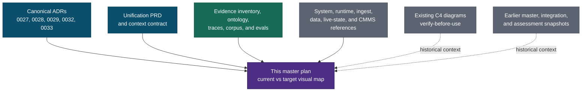
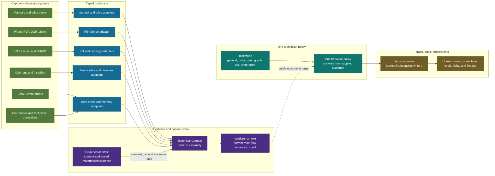
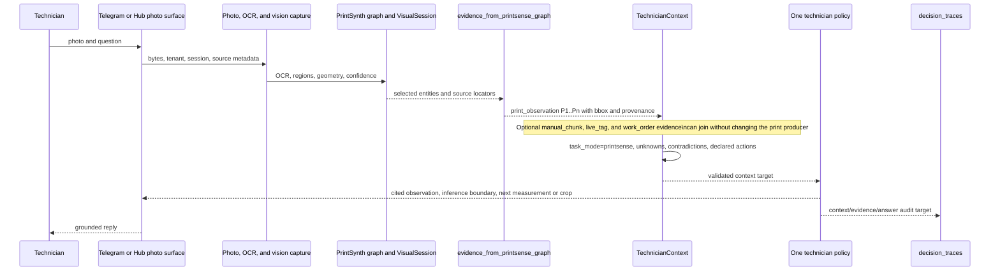
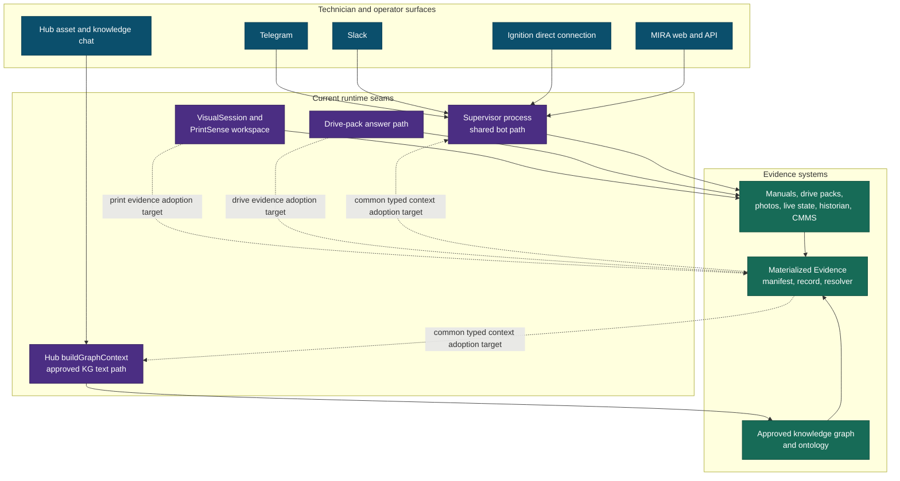
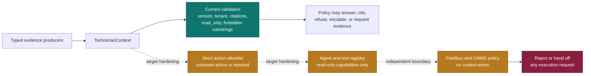
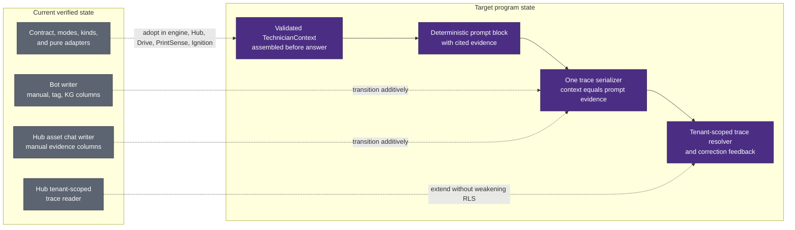

# FactoryLM + MIRA Grounding-Verification Master Architecture Plan

**Status:** Planning reference. It records current verified structure and target seams; it does not authorize implementation, deployment, or a schema change.

**Date:** 2026-07-30

**Scope:** FactoryLM evidence/governance foundations and the MIRA product runtime: troubleshooting, Drive Commander, PrintSense, graph reasoning, live-state diagnosis, and work-order assistance.

## How to read this plan

This is the visual entry point for grounding-verification unification, not a replacement for the source documents.

- **Solid arrows** are an existing contract, producer, storage path, or surface verified in the repository.
- **Dashed arrows** are a target integration already named in the unification program; they are not deployed merely because this diagram exists.
- **Amber nodes** are known gaps or controls that require a separate implementation PR.
- Older C4 and earlier master plans remain useful snapshots but are labelled historical or verify-before-use, never deploy truth.

The governing design is: **one conversational technician policy, many typed evidence producers**. Products select a task mode; they do not acquire a separate conversational persona or adapter.

## 1. Source authority and document navigation

### Authority ledger

| Class | Source | Use in this plan |
|---|---|---|
| Canonical | [ADR-0027](../adr/0027-mira-visual-technician-architecture.md), [ADR-0028](../adr/0028-vision-zero-token-architecture.md), [ADR-0029](../adr/0029-materialized-evidence.md), [ADR-0032](../adr/0032-ontology-foundation.md), [ADR-0033](../adr/0033-one-technician-brain.md) | Immutable architectural decisions and hard boundaries. |
| Canonical | [Unification PRD](../prd/2026-07-30-mira-unification-program.md), [context contract](../../materialized_evidence/context_contract.py) | Current program state and the implemented mode/evidence vocabulary. |
| Canonical supporting | [Materialized Evidence architecture](materialized-evidence.md), [inventory](materialized-evidence-inventory.md), [ontology](../../ontology/), [unified inventory](../zta/technician-unified/inventory.md), [eval manifest](../zta/technician-unified/eval-manifest.md) | Evidence lifecycle, implementation inventory, ontology constraints, corpus and evaluation posture. |
| Supporting, verify-before-use | [Architecture index](README.md), [root architecture](../ARCHITECTURE.md), [engine reference](ENGINE_REFERENCE.md), [system overview](SYSTEM_OVERVIEW.md), [FactoryLM data tier](FactoryLM_Data_Tier_Architecture.md), [database map](database-map.md), [container map](container-map.md), [environment quick reference](environment-quick-ref.md), [real vs simulated](real-vs-simulated.md), [known issues](KNOWN_ISSUES.md), [branch and PR status](branch-and-pr-status.md) | Detailed component, data, deployment, credibility, and operational snapshots. Verify dated claims before operational use. |
| Supporting, domain-specific | [ingest pipelines](INGEST_PIPELINES.md), [photo KB pipeline](photo-kb-pipeline.md), [RAG pipeline](rag-pipeline.md), [Open WebUI routing](open-webui-routing.md), [i3x ingestion/context](i3x-aligned-ingestion-and-context-model.md), [Ignition module](mira-ignition-module-architecture.md), [FlowFuse/Ignition](mira-flowfuse-ignition-application.md), [Node-RED patterns](node-red-ignition-bidirectional-patterns.md), [MES stack](mes-stack-diagram.md) | Source-specific producer and runtime details. |
| Supporting, project framing | [context architecture](../context/ARCHITECTURE.md), [project brief](../context/PROJECT_BRIEF.md), [tech stack](../context/TECH_STACK.md), [file structure](../context/FILE_STRUCTURE.md), [context rules](../context/RULES.md), [context progress](../context/PROGRESS.md), [developer architecture](../developer/architecture.md), [work-order API](../api-reference/work-orders.md) | Product framing, project conventions, and work-order surface reference. |
| Historical snapshots | [C4 context](c4-context.md), [C4 containers](c4-containers.md), [C4 components](c4-components.md), [C4 deployment](c4-deployment.md), [C4 dynamic flow](c4-dynamic-fault-flow.md), [June master plan](../plans/2026-06-01-mira-master-architecture-plan.md), [July integration plan](../discovery/factorylm-mira-integration-master-plan.md), [unification assessment](../proveit/ARCHITECTURE_UNIFICATION_ASSESSMENT.md) | Navigation and historical reasoning only. Re-verify hosts, versions, container counts, and open gaps before relying on them operationally. |

## 2. Layered architecture: capture to audit

This is the primary requested view. `EvidenceManifest` remains the hash-stable materialized-evidence object; `TechnicianContext` is the per-answer object that composes evidence references, identity, task mode, freshness, contradictions, unknowns, and allowed actions.

### Contract boundary

| Object | Responsibility | Must not become |
|---|---|---|
| `EvidenceManifest` / `EvidenceRecord` | Content-addressed identity, provenance, lifecycle, recall, and status overlays under ADR-0029. | A mutable chat session, a task-mode registry, or a new approval system. |
| `TechnicianContext` | Per-answer assembly of selected typed evidence, asset identity, live overlay, unknowns, contradictions, mode, and declared read-only actions. | A second evidence store or a per-product policy. |
| Producer adapter | Pure translation from an upstream shape to cited evidence. | A conversation owner, trust promoter, or execution path. |
| Decision trace | Audit of what an answer used and said. | The authority that upgrades a prior answer into verified fact. |

## 3. Catalog: modes, evidence kinds, and producer coverage

### Task modes

| Task mode | Product framing | Evidence emphasis |
|---|---|---|
| `general_troubleshooting` | Default technician conversation | Manual, graph, live-state, and unknowns. |
| `drive_commander` | Drive-pack-assisted diagnosis | Drive pack facts, manuals, live tags, historian. |
| `printsense` | Print/photo interpretation | Print observations, manual chunks, technician correction. |
| `graph_reasoning` | Relationship and impact questions | KG paths, ontology validation, prior decision. |
| `live_state_diagnosis` | Time-bounded machine condition | Live tags, historian windows, work orders. |
| `work_order_assist` | Maintenance-history and next-action assistance | Work orders, prior decisions, corrections, manuals. |

### Evidence catalogue

| Evidence kind | Current producer function | Upstream source | Current status |
|---|---|---|---|
| `manual_chunk` | `evidence_from_recall_chunks` | RAG/manual rows | Adapter exists; runtime adoption is pending. |
| `drive_pack_fact` | `evidence_from_drive_pack_answer` | Drive Commander pack answer | Adapter exists; runtime adoption is pending. |
| `print_observation` | `evidence_from_printsense_graph` | PrintSynth graph/visual workspace | Adapter exists; runtime adoption is pending. |
| `kg_path` | `evidence_from_kg_context` | Approved KG traversal | Adapter exists; producer must preserve approval filtering. |
| `ontology_validation` | `evidence_from_ontology_validation` | OWL/SHACL result | Adapter exists; a violation is evidence against a claim. |
| `live_tag` | `live_overlay_from_machine_packet` | Machine context packet | Overlay exists, but there is no standalone citable `EvidenceItem` adapter yet. |
| `historian_window` | `evidence_from_historian_window` | Historian trend window | Adapter exists; incomplete windows are dropped. |
| `work_order` | `evidence_from_work_orders` | Atlas/CMMS row | Adapter exists; system-of-record read is provenance-bearing. |
| `prior_decision` | `evidence_from_prior_decisions` | `decision_traces` row | Adapter exists; deliberately `candidate`, never self-promoted. |
| `technician_correction` | `evidence_from_technician_corrections` | Immutable correction event | Adapter exists; candidate evidence with audit hash. |

**Coverage conclusion:** The contract currently exposes eleven named adaptation functions: nine that make `EvidenceItem` values plus a live-state overlay and UNS identity mapper. The plan treats a direct citable `live_tag` adapter as a named target rather than claiming all ten kinds are already uniformly represented.

## 4. Concrete data flow: a print photo to a grounded answer

This is the second requested view. It makes the evidence kind emitted at each stage explicit and keeps the target runtime adoption distinct from the current producer library.

The design rule is deliberate: visual extraction supplies observations; it does not independently speak as a specialist persona. A photo is not proof of a safe energy state, and the answer must preserve uncertainty, freshness, and the need for field verification.

## 5. Product surfaces and evidence plane

The Hub graph context builder is an existing, approval-filtered reuse point. It currently produces an independently formatted text block; it must be adapted into the common typed context rather than copied into a new context framework.

## 6. Read-only enforcement: separate declaration from execution

`FORBIDDEN_ACTION_SUBSTRINGS` and `ALLOWED_ACTION_VOCAB` are useful contract controls, but the present validator only detects forbidden substrings. It does not enforce strict membership in the allowed vocabulary; for example, an unknown string without a forbidden substring can pass today. No planning document should portray this as a completed hard execution fence.

### Enforcement rules

1. A context declaration never grants execution authority.
2. Contract validation must reject an action not in the explicit allowlist as well as known write-shaped variants.
3. Tool registration and fieldbus/CMMS access enforce read-only independently of prompt text, mode, or confidence.
4. Any future execution path requires independent authorization outside this contract and outside this planning scope.

## 7. Current versus target: adoption and trace unification

### Adoption order and proof

| Order | Bounded change | Proof before the next step |
|---|---|---|
| 1 | Make action vocabulary a strict allowlist and add a citable live-tag adapter. | Contract tests show unknown actions fail and every evidence kind has a defined representation. |
| 2 | Assemble and validate `TechnicianContext` on one bot-engine path. | Prompt fixture and trace fixture cite the same selected evidence; reply behavior remains non-blocking. |
| 3 | Store serialized context additively in `decision_traces`; retain compatibility columns during transition. | Tenant-scoped reader returns exactly the evidence used; cross-tenant reads remain absent. |
| 4 | Adopt Drive Commander, PrintSense workspace, equipment photo memory, Hub, and Ignition one surface per PR. | Each surface proves task mode, provenance, freshness/unknown handling, read-only actions, and no prompt fork. |

## 8. Verification and learning loop

This loop preserves the program's governance boundaries: knowledge remains in evidence/retrieval, corrections are immutable candidate events rather than self-approved truth, and training remains gated by rights, frozen manifests, lineage separation, signed spend, and per-slice evaluation.

## 9. Planning boundary and next documents

This master plan creates no runtime or deployment change. The companion documents are:

- [Approved architecture design](../superpowers/specs/2026-07-30-grounding-verification-architecture-design.md)
- [Future implementation plan](../superpowers/plans/2026-07-30-grounding-verification-unification.md)

Before code work begins, the next design inputs are the detailed catalog schema and runbooks. They should refine producer ownership, source fields, freshness/retention, review and correction workflow, and per-surface operating proof—without changing the core rule that one technician policy receives typed, provenance-bearing evidence.
