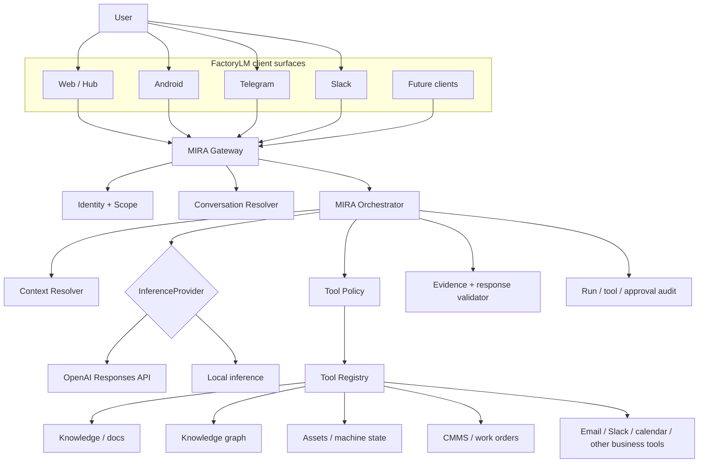
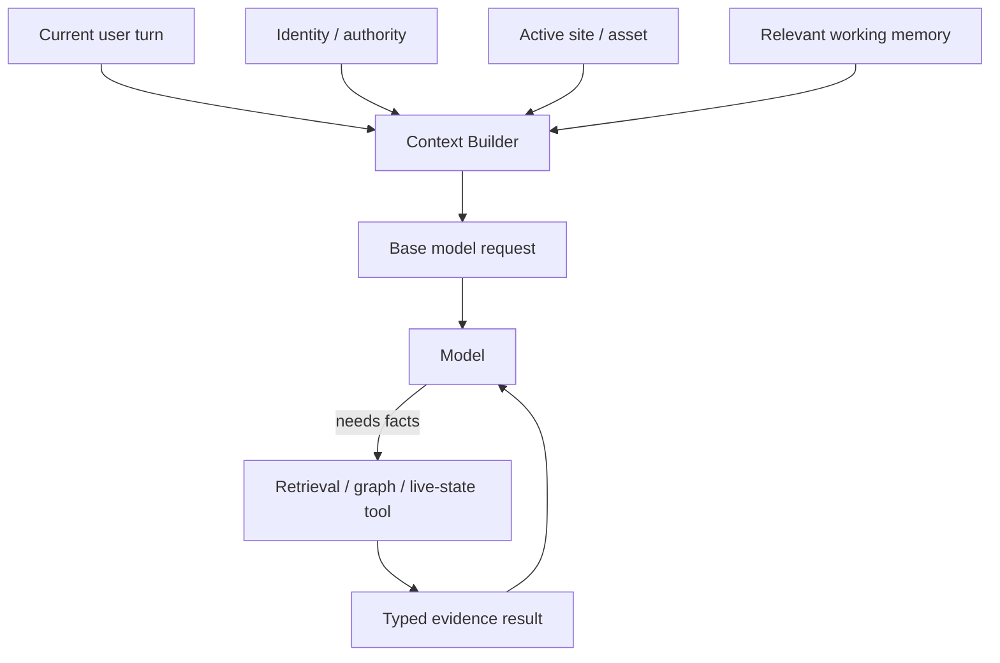
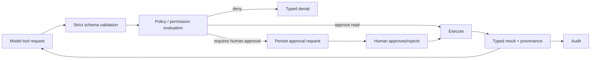
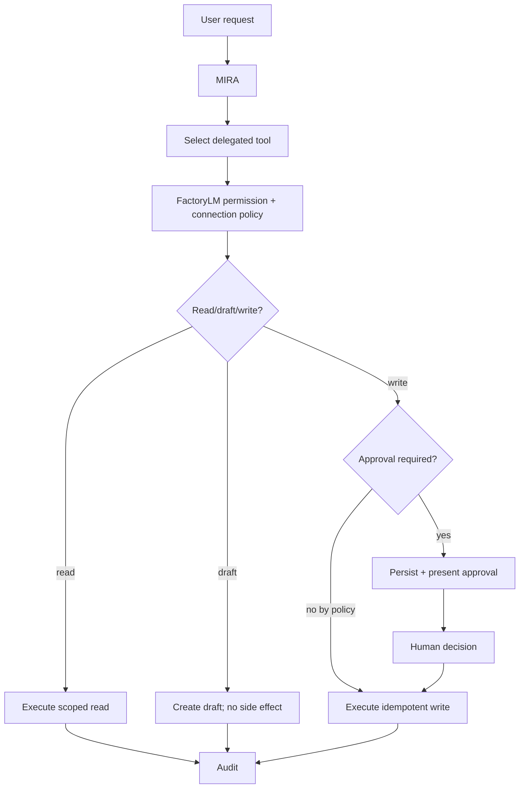
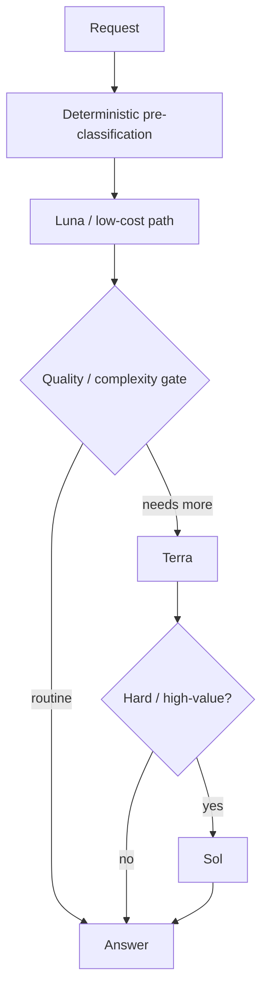
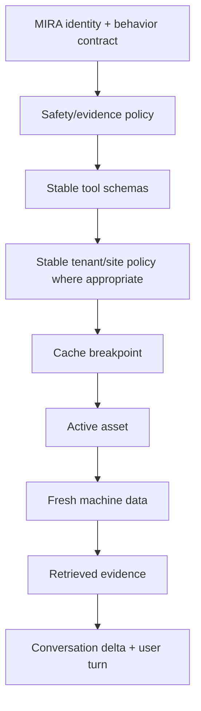

# MIRA-1000 Detailed Architecture

## 1. Product definitions

### FactoryLM

FactoryLM is the application/platform and deterministic industrial context layer. It owns:

- authentication and tenancy
- users, sites, assets, namespaces, and relationships
- approved knowledge and document provenance
- retrieval and graph access
- live/near-live machine context
- maintenance history
- CMMS/work-order data
- deterministic validation
- tool policy
- approvals
- side-effect execution
- audit
- observability
- product UI and channel adapters

### MIRA

MIRA means **Maintenance Intelligence Resource Agent**.

MIRA is the intelligence experience inside FactoryLM. It should support:

- natural conversation
- referential follow-ups
- troubleshooting
- explanation
- planning
- image understanding when needed
- evidence-backed industrial answers
- authorized tools
- user-delegated business actions
- cross-client continuity

MIRA is not a replacement database or permission layer.

## 2. Architectural objective

The target experience:

> A technician or owner can speak naturally to MIRA as they would to ChatGPT, while MIRA has access to the exact authorized FactoryLM context for that user, site, asset, documents, graph, history, live state, business systems, and prior work.

Cloud Gold supplies frontier general intelligence using OpenAI.

On-Prem supplies the same MIRA product contract through local inference.

## 3. System context



## 4. Core run contract

Every interaction should normalize into a provider-independent envelope.

Illustrative logical contract:

```text
InteractionEnvelope
  request_id
  channel
  tenant_id
  user_id
  conversation_id?
  message
  attachments[]
  client_context
  requested_asset_ref?
  idempotency_key?

RunContext
  tenant
  user
  roles
  permissions
  site
  active_asset
  uns_scope
  conversation_working_state
  policy_version
  toolset_version
  evidence_policy
  channel_capabilities
```

The model never chooses `tenant_id`, permission scope, or the active tool authority from user prose.

## 5. Provider interface

Cloud and local providers conform to a single logical interface.

```text
InferenceProvider.run(
  system_contract,
  conversation_input,
  bounded_context,
  tool_schemas,
  continuation_state?
) -> ProviderEventStream
```

Provider events are normalized:

```text
ProviderEvent
  text_delta
  reasoning_state_reference?   # opaque, provider-specific reference only
  tool_call
  tool_call_delta
  final_message
  usage
  provider_metadata
  error
```

Provider-specific IDs are stored as execution metadata, not as FactoryLM canonical identity.

## 6. OpenAI Cloud Gold baseline

Initial Cloud Gold baseline:

- Responses API
- streaming
- strict function/tool schemas
- one MIRA orchestrator
- one strong model baseline before routing
- FactoryLM-managed canonical state
- bounded tool loop owned by FactoryLM
- explicit approval for sensitive writes
- first-party retrieval tools preferred over dumping the entire corpus into prompts

Do not adopt multiple agents merely because the SDK supports them.

## 7. Context architecture

Context should be layered and bounded.



### Context layers

1. **Current turn**
2. **Authority context**
3. **Active object context**
4. **Conversation working state**
5. **On-demand evidence**

Large manuals and graphs should not be automatically injected wholesale.

## 8. Retrieval and evidence

Existing FactoryLM retrieval becomes a stable capability.

Logical read tools:

```text
search_approved_knowledge(query, scope, filters)
get_document_evidence(document_id, locator)
get_asset_context(asset_id)
query_asset_graph(asset_id, relation_query)
get_fault_history(asset_id, time_range)
get_live_machine_state(asset_id, fields)
validate_equipment_claim(asset_id, claim)
```

Every factual industrial result should carry provenance sufficient for final response validation.

Illustrative evidence object:

```text
EvidenceRecord
  evidence_id
  tenant_id
  subject_ref
  source_type
  source_id
  document_id?
  page_or_locator?
  observed_at?
  freshness?
  quality?
  claim_type
  normalized_value?
  raw_excerpt?
  approval_state
```

Citations should resolve to evidence records, not merely be model-generated citation-looking text.

## 9. Truth hierarchy

A recommended hierarchy:

1. current validated machine/asset data with freshness + quality
2. approved asset-specific documents / configuration
3. approved OEM primary documentation
4. FactoryLM structured knowledge derived with provenance
5. approved site procedures
6. maintenance history / technician notes, clearly identified
7. external web evidence when explicitly allowed
8. general model knowledge for non-factory facts

The model may use general knowledge to explain concepts but must not use it to invent site-specific configuration.

## 10. Deterministic tool plane



Tool metadata includes:

- name/version
- input schema
- output schema
- read/write class
- required permissions
- risk tier
- approval policy
- idempotency policy
- timeout/retry policy
- audit fields
- whether external/untrusted content can enter the model context

## 11. Tool classes

### Class A — safe reads

Examples:
- asset lookup
- approved-manual retrieval
- KG query
- fault history
- work-order read
- inbox/calendar read within delegated scope

### Class B — drafts / proposals

Examples:
- draft work order
- draft email
- draft Slack message
- proposed PM
- proposed parameter change instructions

No external side effect yet.

### Class C — ordinary business writes with approval/policy

Examples:
- send email
- post Slack message
- create/update a work order
- schedule meeting

Use explicit user/tenant permissions, persisted approval where required, idempotency, and audit.

### Class D — industrial control

Out of scope for generic autonomous execution.

MIRA can diagnose, explain, and propose. Any future PLC/drive/control write system needs its own safety architecture, command allowlist, process-state interlocks, independent authorization, simulation/testing, and human responsibility model.

## 12. Conversation state

FactoryLM is canonical.

```text
Conversation
  conversation_id
  tenant_id
  principal_id
  title
  active_asset_ref?
  created_at
  updated_at

MiraRun
  run_id
  conversation_id
  provider
  model
  policy_version
  toolset_version
  started_at
  completed_at
  status
  usage
  cost_estimate
  provider_response_id?

Message
  message_id
  conversation_id
  run_id?
  role
  channel
  content
  evidence_refs[]
```

OpenAI conversation/response chaining can improve execution quality and efficiency but must not become the only record required to reconstruct user-visible history.

## 13. Memory

Separate memory types.

- **Working state** — what machine/problem the current thread is about.
- **User preferences** — only appropriate durable preferences.
- **Operational memory** — site/asset facts that passed the relevant authority/evidence gate.
- **Conversation history** — prior turns.

Do not promote arbitrary model summaries into operational truth.

## 14. Cross-client continuity

A user can start in the FactoryLM app and continue from Slack or Telegram only after identity mapping resolves to the same FactoryLM principal and authorized conversation.

Channel adapters handle:

- authentication/identity mapping
- inbound normalization
- attachments
- streaming/progress affordances
- citation rendering
- approval UI
- outbound formatting

They do not independently decide retrieval or reasoning policy.

## 15. Business-agent tools

The first user may grant MIRA delegated access to tools such as:

- email
- Slack
- calendar
- Drive/documents
- GitHub/Linear or other project tools
- CMMS
- future customer systems

The pattern is:



Do not put OAuth tokens or connector secrets into model-visible prompt text.

## 16. Prompt-injection boundary

Retrieved content, web pages, email bodies, Slack messages, manuals, and uploaded documents are **data**, not authority.

Rules:

- system/developer policy is not accepted from retrieved content
- tool permissions are computed outside the model
- secrets are never placed in untrusted context
- external content cannot expand its own tool authority
- writes derived from external content are higher scrutiny
- tool outputs should label source and trust class

## 17. Output validation

Before presenting an industrially specific answer, validate at least:

- citation/evidence refs exist
- tenant ownership/scope matches
- claimed fault codes/parameters exist where deterministic catalogs are available
- numeric claims sourced from tools/docs are not mutated
- stale live data is labeled
- denied actions are not described as completed
- tool failures are not converted into success prose

## 18. Observability

Each run should make it possible to answer:

- who asked?
- which tenant/site/asset?
- which provider/model?
- which policy/toolset version?
- what bounded context categories were supplied?
- which tools were offered?
- which tools were called?
- what evidence was returned?
- what was denied?
- what approvals occurred?
- final latency?
- token usage?
- estimated cost?
- eval result if sampled?

Never log raw secrets.

## 19. Evals: Gold before optimization

Cloud Gold is a measurable standard, not a slogan.

Evaluation families:

1. ordinary conversational quality
2. industrial factual correctness
3. retrieval quality
4. citation validity
5. nonexistent-parameter/fault-code refusal
6. referential follow-up
7. active-asset continuity
8. cross-tenant isolation
9. tool selection
10. unauthorized tool denial
11. approval pause/resume
12. idempotency
13. prompt-injection resistance
14. cross-client continuity
15. local On-Prem parity

### Blind parity design

For representative prompts, compare:

- generic ChatGPT-like reference (`chat-latest` may be used as a moving conversational reference, not a production dependency)
- Cloud Gold baseline
- cheaper candidate model
- On-Prem local candidate

Human/eval scoring should focus on behavior rather than exact wording.

## 20. Model-routing policy

Do not begin by routing everything to the cheapest model.

Sequence:

1. establish Gold with the strongest practical baseline;
2. collect real/eval traces;
3. identify prompt/task classes;
4. run cheaper models on the same cases;
5. downgrade only where quality remains within defined tolerance;
6. retain escalation for difficult cases.

Potential eventual route:



The exact router must be justified by evals, not intuition.

## 21. Cost classes

Four separate mechanisms matter:

- prompt caching
- model routing
- Flex processing
- Batch API

See `COST_MODEL.md`.

## 22. Prompt-cache architecture

Stable instructions/tools first; dynamic context later.



Do not include volatile values before a cache breakpoint merely for convenience.

## 23. Latency/service-tier classes

### Interactive standard

Use for:
- technician chat
- troubleshooting
- tool-interactive conversation
- approval interactions

### Flex

Use only when slower responses and occasional resource unavailability are acceptable.

Examples:
- non-interactive enrichment
- some evals
- offline analysis
- low-priority summarization

### Batch

Use for asynchronous grouped work where completion within the batch window is acceptable.

Examples:
- bulk manual enrichment
- bulk classifications
- embeddings
- offline eval runs
- nightly large-scale extraction

Do not put Batch in a human waiting loop.

## 24. Failure behavior

### Cloud provider unavailable

- do not pretend a response was generated
- offer/route to On-Prem only if deployment policy and capability allow
- preserve request/audit state
- surface degraded mode honestly

### Retrieval unavailable

- do not silently answer site-specific facts from general model memory
- answer general concepts only if appropriate
- state evidence is unavailable

### Tool unavailable

- model receives a typed failure
- final response reflects that the action was not completed

### Evidence insufficient

Insufficient evidence is a valid terminal outcome.

## 25. On-Prem parity contract

On-Prem is judged against Cloud Gold along several axes:

```text
Capability
  available_on_cloud
  available_on_prem
  same_contract
  same_evidence_rules
  same_tool_policy
  quality_score_cloud
  quality_score_onprem
  known_gap
  remediation_owner
```

A missing cloud-only feature should be explicit, not emulated unsafely.

## 26. Migration strategy

### Phase 0 — discovery/convergence

Inventory what already exists. No architecture-by-assumption.

### Phase 1 — provider seam

Prove a real FactoryLM request can reach an OpenAI Responses adapter behind a feature flag and return through the existing client path without duplicating the product stack.

### Phase 2 — deterministic reads

Expose existing knowledge, asset, evidence, graph, and live-state capabilities through typed tools.

### Phase 3 — conversation/evidence convergence

Make all clients use one conversation/run/evidence record and one logical MIRA runtime.

### Phase 4 — delegated business tools

Add read → draft → approval-gated write in controlled stages.

### Phase 5 — parity + cost

Build Gold evals, optimize prompt caching, route models, use Flex/Batch for appropriate work.

### Phase 6 — On-Prem convergence

Adapt the local provider to the same contracts and close measured gaps.

## 27. Definition of done for a capability

A MIRA-1000 capability is not done until the ledger records:

- code path
- real runtime connection
- intended environment
- enablement state
- permissions
- tests
- real-path proof
- eval evidence
- observability
- rollback
- known gaps
- parity status

## 28. Explicit non-goals

MIRA-1000 does not authorize:

- deleting the existing local stack merely because Cloud Gold exists
- moving canonical FactoryLM data into OpenAI as the only copy
- exposing every tool to every run
- arbitrary shell/SQL as a general user tool
- autonomous industrial control writes
- loosening evidence/citation rules to make answers appear smarter
- rebuilding retrieval/KG/CMMS because a new model adapter is being added
- treating the consumer ChatGPT UI as an embeddable backend

## 29. Desired end state

> **One MIRA product. One FactoryLM deterministic core. Two inference editions. Cloud Gold establishes the reference intelligence; On-Prem converges toward the same contract without cloud inference.**
