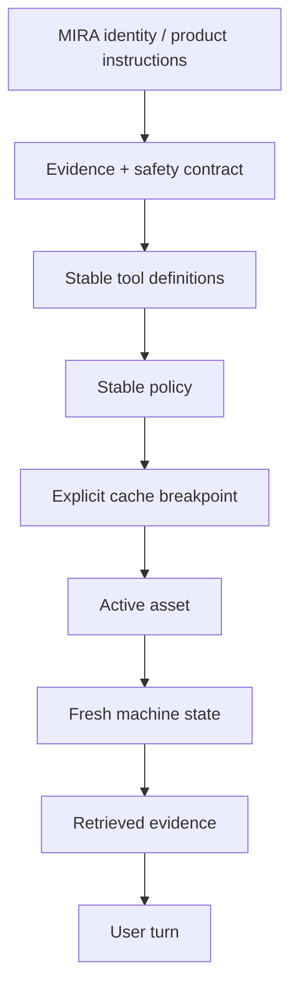
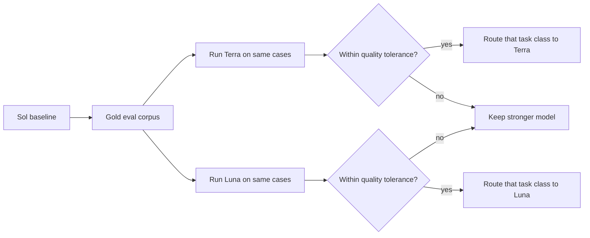
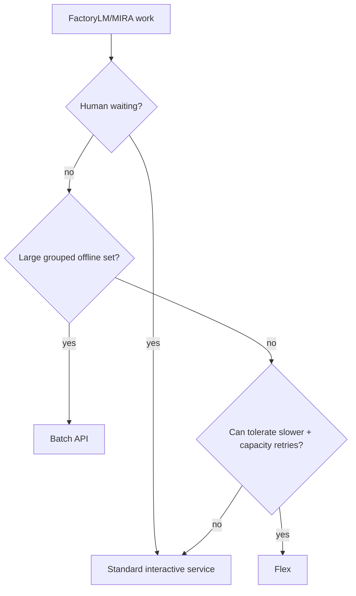

# MIRA-1000 Cost and Throughput Model

**Verified against OpenAI developer documentation:** 2026-08-19

This document separates four cost levers that are easy to conflate.

## 1. Current GPT-5.6 token prices

Per 1M text tokens, current standard prices:

| Model | Input | Cached input | Output | Intended role |
|---|---:|---:|---:|---|
| GPT-5.6 Sol | $5.00 | $0.50 | $30.00 | Cloud Gold / hardest work |
| GPT-5.6 Terra | $2.00 | $0.20 | $12.00 | strong routine reasoning |
| GPT-5.6 Luna | $0.20 | $0.02 | $1.20 | high-volume low-cost work |

Official model docs:
- https://developers.openai.com/api/docs/models/gpt-5.6-sol
- https://developers.openai.com/api/docs/models/gpt-5.6-terra
- https://developers.openai.com/api/docs/models/gpt-5.6-luna

Do not hardcode these numbers into product pricing logic. They are planning inputs and can change.

## 2. Prompt caching

Prompt caching is the most directly useful discount mechanism for **interactive MIRA chat**.

For GPT-5.6-family models:

- minimum cacheable prefix: 1,024 tokens
- cache reads: currently 0.1× ordinary input rate
- cache writes: currently 1.25× ordinary uncached input rate
- explicit cache breakpoints are supported
- current documented TTL is 30 minutes

Official guide:
https://developers.openai.com/api/docs/guides/prompt-caching

### Why MIRA is cache-friendly

MIRA repeatedly sends stable material:

- MIRA behavior contract
- evidence policy
- safety policy
- output rules
- tool schemas
- stable site/tenant policy fragments
- stable integration schemas

Dynamic material changes each turn:

- current question
- active asset
- retrieved evidence
- live values
- current work-order state
- new conversation delta

Put the stable prefix first.



### Important economic caveat

Because writes cost more than uncached input, a cache that is constantly rewritten and rarely read can cost more.

Track at minimum:

```text
input_tokens
cached_tokens
cache_write_tokens
output_tokens
cache_hit_ratio
cost_per_run
```

Do not optimize only for cache-hit percentage; optimize total cost without lowering eval quality.

## 3. Flex processing

Flex is a **lower-priority request tier**, not a batch file job.

OpenAI currently documents:

- lower cost in exchange for slower response times
- occasional `429 Resource Unavailable`
- token pricing at Batch API rates
- prompt-caching discounts can additionally apply
- it is intended for lower-priority/non-production/asynchronous work

Official guide:
https://developers.openai.com/api/docs/guides/flex-processing

### Good MIRA uses

- non-urgent enrichment
- offline report preparation
- background analysis
- some eval/judge workloads
- bulk-ish tasks that still fit normal request semantics

### Bad MIRA uses

- technician standing at a broken machine waiting for an answer
- approval UI interactions
- latency-sensitive troubleshooting
- anything where occasional capacity failure cannot be retried or escalated

### Retry policy

If Flex returns resource unavailable, background workloads can retry with exponential backoff. High-value jobs may escalate to standard service according to deterministic policy.

## 4. Batch API

Batch is explicitly asynchronous grouped work.

OpenAI currently documents:

- 50% lower cost than synchronous APIs
- separate/higher rate-limit pool
- completion within 24 hours, often faster
- Responses API requests are supported in Batch

Official guide:
https://developers.openai.com/api/docs/guides/batch

### Good FactoryLM uses

```text
bulk manual classification
manual metadata extraction
offline evidence-quality checks
knowledge-graph enrichment
large eval campaigns
large embedding jobs
nightly maintenance-history summarization
offline synthetic-question generation
```

### Bad use

Do not route an interactive technician turn through Batch.

## 5. Model routing

Model routing is not a special discount. It is our architecture using cheaper models when they pass the same behavior/evidence contract.

Do not start by making Gold cheap.

Recommended sequence:



Possible eventual policy:

- Luna: classification, routing, extraction, simple transformations, easy requests
- Terra: routine MIRA conversation and ordinary tool use
- Sol: difficult troubleshooting, ambiguous multi-system reasoning, high-value analysis, escalation

This is a hypothesis until eval evidence supports it.

## 6. Example unit economics

Illustrative interaction:

- 4,000 input tokens
- 1,000 output tokens

Ignoring cache-write effects and tools:

| Model | Approx standard cost |
|---|---:|
| Sol | $0.050 |
| Terra | $0.020 |
| Luna | $0.002 |

With most stable input served from cache, actual input cost can drop substantially. Output tokens can dominate the bill on strong models, so verbosity controls matter too.

Do not use these illustrative numbers as billing guarantees.

## 7. Service-class router



The service-class decision is deterministic software policy, not left to the model.

## 8. Cost telemetry required before optimization

Per run:

```text
provider
model
service_tier
input_tokens
cached_tokens
cache_write_tokens
output_tokens
tool_call_count
tool_cost
latency
task_class
escalated_from?
eval_result?
estimated_cost
```

Aggregate:

- cost / successful technician answer
- cost / tenant / month
- cost by task class
- cache read/write ratio
- escalation rate
- quality score by model
- refusal/error rate by service tier
- cost of evals/background enrichment separately from interactive usage

## 9. Guardrail

> **Never reduce model cost by bypassing FactoryLM evidence, context, permissions, or validation.**

The optimization target is cost per **successful trustworthy outcome**, not cost per API call.
