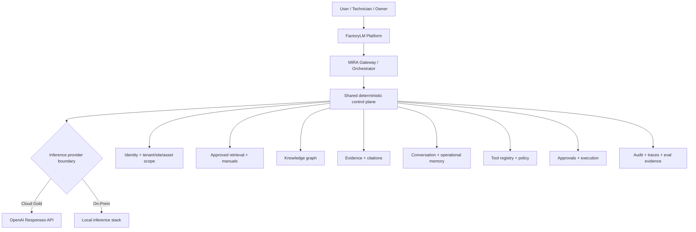
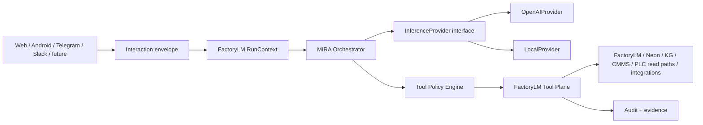
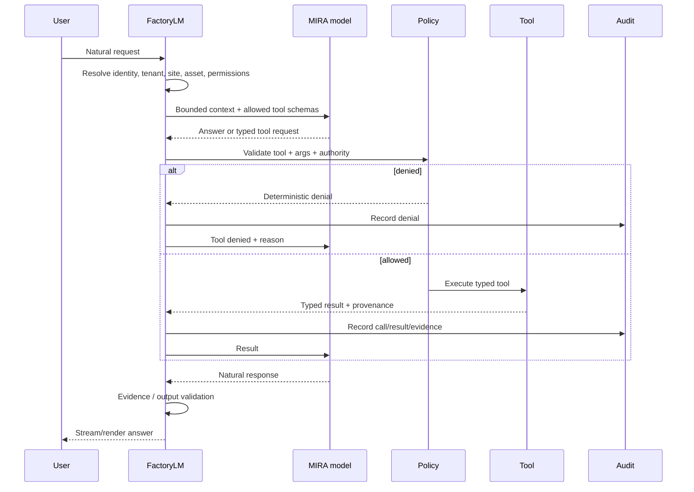
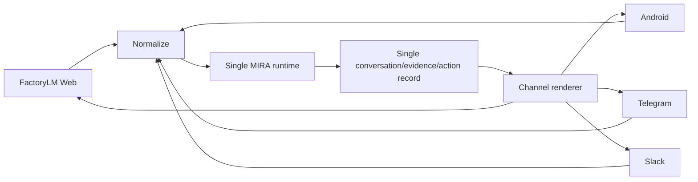

# MIRA-1000 — MIRA CLOUD GOLD: The Divergence

**Architecture ID:** MIRA-1000  
**Working name:** MIRA CLOUD GOLD — The Divergence  
**Status:** Living architecture + prompt control surface  
**Created:** 2026-08-19  
**Baseline main SHA:** `5dfcbb8940bc2e724cf2b9b111f1837182f20688`

## Why this exists

This directory is the durable control surface for the point where MIRA deliberately becomes **two inference editions over one FactoryLM product architecture**:

- **MIRA Cloud Gold** — the online reference implementation using OpenAI's Responses API for frontier general intelligence.
- **MIRA On-Prem** — the existing/local-inference line for customers who cannot or will not send inference traffic to a cloud model provider.

The divergence is intentionally narrow.

> **We do not fork FactoryLM. We fork at the inference/provider boundary.**

FactoryLM remains the platform, application surface, deterministic control plane, industrial context system, data authority, evidence system, tool host, permission system, audit system, and integration layer.

MIRA remains the **Maintenance Intelligence Resource Agent** — one product identity and one behavioral contract.

Cloud Gold becomes the quality reference. On-Prem is continuously measured against the same behavioral contract and improved toward it without requiring cloud inference.

## North-star product statement

> **OpenAI supplies general intelligence. FactoryLM supplies the truth, context, permissions, tools, evidence, execution, and industrial constraints.**

The user experience target is that MIRA feels as natural and capable as a high-quality ChatGPT conversation while being materially better at FactoryLM-specific work because it can access authoritative plant context that a generic chat product does not have.

## Product split

## What stays shared

The following are **not** cloud-only concepts and should not be independently reimplemented for On-Prem:

- FactoryLM tenant/user/site/asset identity
- UNS identity and scope
- asset registry and attachment relationships
- approved manuals and document provenance
- knowledge retrieval
- knowledge graph
- deterministic fault/parameter validators
- live machine-state adapters
- work order / CMMS access
- evidence and citation records
- conversation records
- operational memory
- tool schemas
- tool policy and least-privilege exposure
- approval records
- action audit
- client normalization/rendering contracts
- eval datasets and behavioral scorecards

Provider-specific inference code is isolated behind one adapter boundary.

## What Cloud Gold adds

Cloud Gold is the online reference path. It may use OpenAI capabilities that inherently require network access, including:

- Responses API reasoning and generation
- streaming
- function/tool calling
- structured outputs
- image understanding where appropriate
- optional hosted OpenAI tools where explicitly chosen
- MCP/connectors where their security model fits
- prompt caching
- standard / Flex / Batch service paths according to latency class

Cloud Gold is **not** permission to hand FactoryLM authority to the model.

## What On-Prem means

On-Prem is the no-cloud-inference edition.

Initially it can preserve the substantial local-agent work that already exists. It does not have to equal Cloud Gold on day one. It does have to:

1. implement the same stable MIRA request/context/tool/evidence contracts where possible;
2. fail clearly when a cloud-only capability is unavailable;
3. avoid fabricating equivalent capabilities;
4. run the same parity evals;
5. record the delta against Gold.

If a customer permits hybrid behavior later, the provider boundary can support policy-based hybrid routing. That is a later decision, not assumed here.

## Critical architectural boundary

The provider receives bounded context and may request typed tools. It does **not** become the database, authorization system, or executor.

## Runtime principle

The model is probabilistic. The cage is deterministic.

## One MIRA, many clients

No Telegram brain, Slack brain, Android brain, and web brain.

Clients can have channel-specific rendering but not channel-specific truth or orchestration.

## Documents in this control surface

| File | Purpose |
|---|---|
| `README.md` | Architecture anchor and rules |
| `ARCHITECTURE.md` | Detailed target architecture and contracts |
| `CURRENT.md` | Human-readable active state and next prompt |
| `TRACKER.yaml` | Machine-readable work ledger |
| `HISTORY.md` | Append-only narrative history |
| `COST_MODEL.md` | Standard/caching/Flex/Batch/model-routing economics |
| `prompts/P0000-master-operating-prompt.md` | Persistent Claude Code operating prompt |
| `prompts/P0001-discovery-convergence.md` | First active slice |
| future `prompts/Pxxxx-*.md` | Immutable prompts issued over time |

## Prompt ledger rules

Prompt files are historical artifacts.

- Never silently edit an already-executed prompt to make history look cleaner.
- If instructions change, create a new prompt ID and mark the old one superseded in `TRACKER.yaml`.
- Every prompt has: goal, scope, non-goals, required discovery, acceptance gates, expected evidence, and stop conditions.
- Child PRs cite `MIRA-1000/Pxxxx`.
- On completion, update `TRACKER.yaml` and append `HISTORY.md`.
- `CURRENT.md` names exactly one default next prompt. Concurrent slices must have explicit non-overlapping claims per the repo's global session protocol.

## Master-PR model

The GitHub master PR is the **historical anchor** for the divergence decision. This repo directory is the durable source of truth.

Recommended lifecycle:

1. create the MIRA-1000 master PR;
2. review the architecture/control-surface itself;
3. merge the control-surface promptly once accepted so every new Claude session sees it on `main`;
4. execute implementation in smaller child PRs that reference MIRA-1000 and update this ledger.

Do not turn one long-lived mega-PR into the implementation branch for the entire program.

## Non-negotiables

1. **Converge, do not rewrite by default.**
2. **Existing deterministic systems are assets.** Wrap them behind stable contracts.
3. **FactoryLM owns authority.**
4. **The model proposes; software authorizes and executes.**
5. **No generic autonomous OT write tool.**
6. **Cloud Gold quality first; cost optimization second.**
7. **On-Prem parity is measured, not asserted.**
8. **Every client reaches the same logical MIRA runtime.**
9. **Evidence is a data contract, not decorative prose.**
10. **A feature is not complete until it is connected, enabled as intended, evaluated through a real path, observable, and rollback-safe.**

## Current entry point

Read `CURRENT.md` next.
