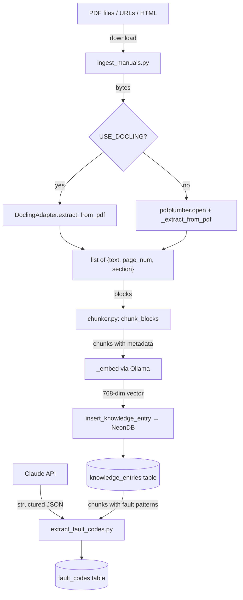
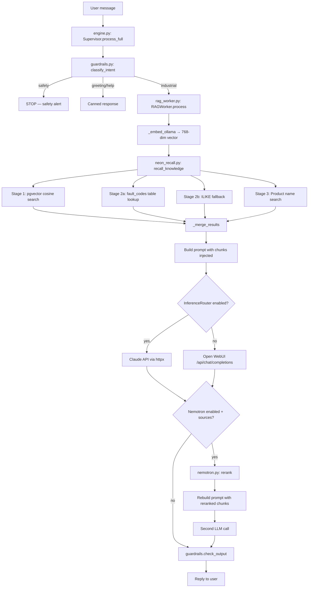

# MIRA RAG Pipeline — Architecture Reference

*Snapshot: 2026-03-28 | MIRA v0.5.3 | Source of truth for RAG system design*

---

## Table of Contents

1. [System Overview](#1-system-overview)
2. [Data Flow — Ingest Pipeline](#2-data-flow--ingest-pipeline)
3. [Data Flow — Query Pipeline](#3-data-flow--query-pipeline)
4. [NeonDB Schema — As Built](#4-neondb-schema--as-built)
5. [Retrieval Logic — In Detail](#5-retrieval-logic--in-detail)
6. [Intent Classification Pipeline](#6-intent-classification-pipeline)
7. [Embedding Model](#7-embedding-model)
8. [Known Limitations and Gaps](#8-known-limitations-and-gaps)
9. [What Was Built 2026-03-27](#9-what-was-built-2026-03-27)
10. [Architecture Classification](#10-architecture-classification)
11. [Future Architecture (Planned)](#11-future-architecture-planned)

---

## 1. System Overview

MIRA's RAG system answers industrial maintenance questions by retrieving relevant documentation from a knowledge base of equipment manuals, then grounding an LLM's diagnostic response in that documentation. Field technicians send messages (text, photos, fault codes) via Telegram or Slack. The system identifies the equipment, retrieves the most relevant manual chunks, and generates a Guided Socratic Dialogue response that walks the tech toward self-diagnosis.

The knowledge base lives in NeonDB (hosted PostgreSQL with pgvector extension). As of 2026-03-28, it contains **25,219 knowledge entries** covering Rockwell Automation, Siemens, ABB, Eaton, and other industrial manufacturers. Data enters through five offline ingest pipelines (manufacturer PDFs, Google Drive documents, equipment photos, Google Takeout, and interaction logs). Data exits through a runtime query pipeline that combines dense vector search, structured fault code lookup, and keyword-based product filtering.

The ingest and query pipelines are completely separate codebases with no shared runtime. Ingest is batch scripts run via cron or manually. Query is an async Python service running inside Docker containers. The only shared state is the NeonDB `knowledge_entries` and `fault_codes` tables. No framework (LlamaIndex, LangChain, etc.) orchestrates these — all RAG logic is hand-written Python using httpx, SQLAlchemy, and pgvector SQL operators directly.

---

## 2. Data Flow — Ingest Pipeline

### Mermaid Diagram



### Step-by-Step

**Step 1: Source Discovery**
- File: `mira-core/scripts/discover_manuals.py`
- Input: Equipment make/model pairs
- Output: URLs inserted into `manual_cache` table in NeonDB
- Config: Cron `0 3 * * 0` (Sundays 3am)
- Losses: Only discovers publicly accessible URLs; paywalled manuals are missed

**Step 2: Download**
- File: `mira-core/scripts/ingest_manuals.py:300-315` — `process_url()`
- Input: URL from `get_pending_urls()` (reads `source_fingerprints`, `manual_cache`, `manuals` tables)
- Output: Raw bytes (PDF or HTML)
- Config: `DOWNLOAD_TIMEOUT=60`, `REQUEST_DELAY=0.5s`, `User-Agent: MIRA-IngestBot/1.0`
- Losses: Redirects followed; sites that block bots return 403 → 0 chunks

**Step 3: Text Extraction**
- File: `mira-core/scripts/ingest_manuals.py:142-197` — `_extract_from_pdf()` or `_extract_from_html()`
- Input: Raw bytes
- Output: List of `{text, page_num, section}` dicts
- Config: `MAX_PDF_PAGES=300`, `MIN_CHUNK_CHARS=80`
- Alternate: When `USE_DOCLING=true`, uses `mira-core/scripts/docling_adapter.py` for OCR + semantic parsing
- Losses: **pdfplumber flattens tables to prose** — column alignment, headers, and row structure are lost. Multi-column layouts may interleave. Scanned-image PDFs produce no text (Docling handles these via OCR).

**Step 4: Section Detection**
- File: `mira-core/scripts/ingest_manuals.py:106-139` — `_detect_sections()`
- Input: Raw page text
- Output: List of `(heading, body)` tuples
- Config: Heuristic — headings are lines <80 chars, not ending in `.` or `,`, title/uppercase, <=12 words
- Losses: Non-standard heading formats are missed; body text may be attributed to wrong heading

**Step 5: Chunking**
- File: `mira-crawler/ingest/chunker.py:209-272` — `chunk_blocks()`
- Input: List of `{text, page_num, section}` blocks
- Output: List of `{text, page_num, section, source_url, source_file, source_type, equipment_id, chunk_index, chunk_type}` chunks
- Config: `max_chars=800` (from ingest_manuals.py:34), `min_chars=80`, `overlap=100`
- Sub-step: `_split_block_with_tables()` detects pipe-table and tab-table regions, splits tables at row boundaries preserving header, splits prose at character boundaries
- Losses: **Character-based prose splitting** — cuts mid-sentence. No sentence boundary awareness. Overlap (100 chars) partially mitigates but does not eliminate broken context.

**Step 6: Manufacturer/Model Extraction**
- File: `mira-core/scripts/ingest_manuals.py:226-306` — `_extract_mfr_from_url()`, `_extract_model_from_url()`, `_catalog_lookup()`
- Input: URL or filename
- Output: `(manufacturer, model_number)` strings
- Config: `_MFR_HINTS` dict (9 manufacturers), `_CATALOG_MAP` dict (17 Rockwell catalog prefixes)
- Losses: Unknown manufacturers or non-standard filenames return `None`; some chunks have empty manufacturer/model

**Step 7: Deduplication Check**
- File: `mira-core/mira-ingest/db/neon.py:185-194` — `knowledge_entry_exists()`
- Input: `(tenant_id, source_url, chunk_index)`
- Output: Boolean
- Config: None
- Losses: None — prevents duplicate inserts on re-runs

**Step 8: Embedding**
- File: `mira-core/scripts/ingest_manuals.py:208-219` — `_embed()`
- Input: Chunk text string
- Output: 768-dim float vector
- Config: `EMBED_MODEL=nomic-embed-text:latest`, `EMBED_TIMEOUT=30`, Ollama at `OLLAMA_BASE_URL`
- Losses: Embedding is per-chunk — no document-level or cross-chunk context. Alphanumeric codes (F-201, OC1) are poorly represented in dense vector space.

**Step 9: NeonDB Insert**
- File: `mira-core/mira-ingest/db/neon.py:197-243` — `insert_knowledge_entry()`
- Input: All chunk fields + embedding vector
- Output: UUID row ID
- Config: `NullPool`, `sslmode=require`
- Losses: None — all metadata preserved

**Step 10: Structured Fault Code Extraction (Phase 3A)**
- File: `mira-core/scripts/extract_fault_codes.py`
- Input: knowledge_entries chunks matching `_FAULT_CODE_RE`
- Output: Structured rows in `fault_codes` table
- Config: Uses Claude API for extraction, `ON CONFLICT ... DO UPDATE` for idempotent writes
- Losses: Only extracts from chunks that contain regex-detectable fault code patterns; codes in unusual formats may be missed

---

## 3. Data Flow — Query Pipeline

### Mermaid Diagram



### Step-by-Step

**Step 1: Intent Classification**
- File: `mira-bots/shared/guardrails.py:131-167` — `classify_intent()`
- Input: Raw user message string
- Output: `"safety" | "help" | "greeting" | "industrial"` (default: `"industrial"`)
- See [Section 6](#6-intent-classification-pipeline) for full detail
- Losses: Short industrial queries may hit `greeting` path; overly broad `industrial` default means off-topic queries reach RAG

**Step 2: Query Preprocessing**
- File: `mira-bots/shared/guardrails.py:207-239` — `expand_abbreviations()` + `rewrite_question()`
- Input: Raw message + optional `asset_identified` context
- Output: Expanded, rewritten query string
- Config: `MAINTENANCE_ABBREVIATIONS` dict (70+ entries), `rewrites` dict (6 vague→precise mappings)
- Losses: Only exact word matches in abbreviations; partial matches missed

**Step 3: Embedding**
- File: `mira-bots/shared/workers/rag_worker.py:336-349` — `_embed_ollama()`
- Input: User message text
- Output: 768-dim float vector (or `None` on failure)
- Config: `OLLAMA_BASE_URL`, `EMBED_TEXT_MODEL=nomic-embed-text:latest`, timeout=30s
- Losses: Same as ingest — alphanumeric codes poorly embedded. No retry on failure.

**Step 4: Multi-Stage Retrieval**
- File: `mira-bots/shared/neon_recall.py:246-378` — `recall_knowledge()`
- Input: Embedding vector, `tenant_id`, `query_text`
- Output: List of dicts with `{content, manufacturer, model_number, equipment_type, source_type, similarity}`
- See [Section 5](#5-retrieval-logic--in-detail) for full SQL and merge logic

**Step 5: Prompt Assembly**
- File: `mira-bots/shared/workers/rag_worker.py:251-334` — `_build_prompt()`
- Input: FSM state, rewritten message, optional photo_b64, NeonDB chunks
- Output: OpenAI-format messages list `[{role, content}, ...]`
- Config: `GSD_SYSTEM_PROMPT` (121-line system prompt), conversation history capped at 10 turns
- Structure: System message = GSD prompt + state context + NeonDB chunks. User message = rewritten query (or multipart image+text for photos).
- Losses: Ad-hoc string concatenation — no structured template system. Chunk injection order follows merge order (product first, then vector, then ILIKE).

**Step 6: LLM Inference**
- File: `mira-bots/shared/workers/rag_worker.py:352-363` — `_call_llm()`
- Primary: `InferenceRouter.complete()` → Claude API (when `INFERENCE_BACKEND=claude`)
  - File: `mira-bots/shared/inference/router.py:117-127`
  - PII sanitization: strips IPv4, MAC addresses, serial numbers before API call
  - Model: `CLAUDE_MODEL` env var, default `claude-sonnet-4-6`
- Fallback: `_call_openwebui()` → Open WebUI `/api/chat/completions`
  - Uses collection_id for Open WebUI's internal RAG (separate from NeonDB pipeline)
  - Model: `mira:latest` (Ollama)

**Step 7: Nemotron Reranking (Conditional)**
- File: `mira-bots/shared/workers/rag_worker.py:201-213`
- Condition: `self.nemotron.enabled` (NVIDIA_API_KEY set) AND `self._last_sources` non-empty AND no photo
- File: `mira-bots/shared/nemotron.py:157-214` — `NemotronClient.rerank()`
- Input: Original query + source chunks from Stage 6
- Output: Reranked chunks sorted by logit score
- Action: Rebuilds prompt with reranked chunks via `_build_prompt_with_chunks()`, makes second LLM call
- Config: `NEMOTRON_RERANK_MODEL=nvidia/llama-nemotron-rerank-1b-v2`, timeout=10s, top_n=5

**Step 8: Self-Correction Loop (Conditional)**
- File: `mira-bots/shared/engine.py:445-481` — `_call_with_correction()`
- Condition: First response not grounded (word overlap <5 significant words with sources) AND Nemotron enabled
- Action: Rewrites query via `nemotron.rewrite_query()` (Q2E expansion), retries once
- Config: `max_attempts=2` (text), `max_attempts=1` (photo)

**Step 9: Output Validation**
- File: `mira-bots/shared/guardrails.py:170-204` — `check_output()`
- Input: LLM response, intent classification, photo flag
- Output: Cleaned response string
- Checks: Strips "Transcribing" artifacts on text-only, blocks industrial jargon in greeting responses, blocks system prompt leakage

---

## 4. NeonDB Schema — As Built

### knowledge_entries

Primary RAG knowledge base. 25,219 rows as of 2026-03-23.

```sql
-- Schema inferred from insert_knowledge_entry() in mira-core/mira-ingest/db/neon.py:197-243
-- and recall_knowledge() in mira-bots/shared/neon_recall.py:287-307
CREATE TABLE knowledge_entries (
    id              UUID PRIMARY KEY,
    tenant_id       TEXT NOT NULL,
    source_type     TEXT,              -- 'manual', 'gdrive', 'seed', 'gphotos'
    manufacturer    TEXT,              -- 'Rockwell Automation', 'Siemens', etc.
    model_number    TEXT,              -- 'PowerFlex 40', 'Micro820', etc.
    equipment_type  TEXT,
    content         TEXT NOT NULL,     -- chunk text
    embedding       vector(768),       -- nomic-embed-text output
    source_url      TEXT,
    source_page     INTEGER,           -- chunk_index (NOT page number)
    metadata        JSONB,             -- {source_url, chunk_index, page_num, section, chunk_type}
    is_private      BOOLEAN DEFAULT false,
    verified        BOOLEAN DEFAULT false,
    chunk_type      TEXT,              -- 'text' or 'table'
    created_at      TIMESTAMP DEFAULT now()
);

-- Indexes (inferred from query patterns)
CREATE INDEX ON knowledge_entries USING ivfflat (embedding vector_cosine_ops);
CREATE INDEX ON knowledge_entries (tenant_id);
CREATE INDEX ON knowledge_entries (tenant_id, source_url, source_page);  -- dedup guard
```

**Note on `source_page`:** Despite the column name, this stores `chunk_index` (0-based within a document), not the PDF page number. The actual page number is in `metadata->>'page_num'`.

### fault_codes

Structured fault code lookup table. Built by Phase 3A extraction pipeline.

```sql
-- From docs/wip/phase3-structured-retrieval/design.md:33-52
CREATE TABLE IF NOT EXISTS fault_codes (
    id               UUID PRIMARY KEY DEFAULT gen_random_uuid(),
    tenant_id        TEXT NOT NULL,
    code             TEXT NOT NULL,           -- F4, E001, OC1, etc.
    description      TEXT NOT NULL,           -- "UnderVoltage"
    cause            TEXT,                    -- "DC bus voltage below threshold"
    action           TEXT,                    -- "Check input line fuse. Monitor incoming line."
    severity         TEXT,                    -- "trip", "warning", "alarm"
    equipment_model  TEXT,                    -- "PowerFlex 40"
    manufacturer     TEXT,                    -- "Rockwell Automation"
    source_chunk_id  TEXT,                    -- FK back to knowledge_entries
    source_url       TEXT,
    page_num         INTEGER,
    created_at       TIMESTAMP DEFAULT now(),
    UNIQUE (tenant_id, code, equipment_model)
);

CREATE INDEX ON fault_codes (tenant_id, code);
CREATE INDEX ON fault_codes (tenant_id, equipment_model);
```

### Supporting Tables (Ingest Tracking)

```sql
-- manual_cache: URL discovery queue
--   Columns: id, manufacturer, model, manual_url, manual_title, pdf_stored, source, confidence
--   Read by: get_pending_urls()
--   Written by: discover_manuals.py, queue_manual_url()

-- source_fingerprints: Crawled URL tracking
--   Columns: id, url, source_type, atoms_created
--   Read by: get_pending_urls()

-- manuals: Verified manual registry
--   Columns: id, file_url, manufacturer, model_number, title, is_verified, access_count
--   Read by: get_pending_urls()

-- tenants: Tenant configuration
--   Columns: id, tier, ...
--   Read by: check_tier_limit()

-- tier_limits: Per-tier rate limits
--   Columns: tier, daily_requests, ...
--   Read by: check_tier_limit()
```

---

## 5. Retrieval Logic — In Detail

All retrieval logic lives in `mira-bots/shared/neon_recall.py`.

### Stage 1: Dense Vector Search

```python
# neon_recall.py:287-310
# Cosine similarity via pgvector <=> operator (1 - cosine distance)
```

```sql
SELECT
    content,
    manufacturer,
    model_number,
    equipment_type,
    source_type,
    1 - (embedding <=> cast(:emb AS vector)) AS similarity
FROM knowledge_entries
WHERE tenant_id = :tid
  AND embedding IS NOT NULL
ORDER BY embedding <=> cast(:emb AS vector)
LIMIT :lim
```

- Parameters: `:emb` = 768-dim float vector (stringified), `:tid` = tenant UUID, `:lim` = 5
- Post-filter: `similarity >= MIN_SIMILARITY` (0.45) — `neon_recall.py:45`
- Index: IVFFlat (approximate nearest neighbor)
- Known issue: IVFFlat with metadata filters can return fewer results than LIMIT when matching rows are sparse across index cells

### Stage 2: Fault Code Lookup

Two sub-stages, tried in order:

**Stage 2a: Structured `fault_codes` table (deterministic)**

```python
# neon_recall.py:55-100 — recall_fault_code()
# Regex: _FAULT_CODE_RE = r"\b[A-Z]{1,3}[-]?\d{1,4}\b"  (line 24)
# Matches: F-201, CE2, OC1, EF, E014, etc.
```

```sql
SELECT code, description, cause, action, severity,
       equipment_model, manufacturer
FROM fault_codes
WHERE tenant_id = :tid AND code = :code
-- Optional: AND equipment_model ILIKE :model
```

Results are formatted as pseudo-chunks with `similarity=0.95` and injected at the TOP of merged results (highest priority).

**Stage 2b: ILIKE fallback (when structured lookup returns 0)**

```python
# neon_recall.py:110-136 — _like_search()
```

```sql
SELECT
    content, manufacturer, model_number,
    equipment_type, source_type,
    0.5 AS similarity
FROM knowledge_entries
WHERE tenant_id = :tid
  AND (content ILIKE :pat0 OR content ILIKE :pat1 ...)
LIMIT :lim
```

- Patterns: `%F201%`, `%OC1%`, etc. (up to 5 fault codes)
- Fixed similarity score: 0.5

### Stage 3: Product Name Search

```python
# neon_recall.py:139-190 — _product_search()
# Regex: _PRODUCT_NAME_RE (line 28-43)
# Matches: PowerFlex 40, Micro820, CompactLogix, GS20, DURApulse, SINAMICS, ACS580, etc.
```

```sql
WITH product_chunks AS (
  SELECT content, manufacturer, model_number, equipment_type,
         source_type, embedding
  FROM knowledge_entries
  WHERE tenant_id = :tid
    AND model_number ILIKE :pat           -- e.g. '%PowerFlex 40%'
    AND model_number NOT ILIKE :exclude   -- e.g. '%PowerFlex 400%'
    AND embedding IS NOT NULL
)
SELECT content, manufacturer, model_number, equipment_type,
       source_type,
       1 - (embedding <=> cast(:emb AS vector)) AS similarity
FROM product_chunks
ORDER BY embedding <=> cast(:emb AS vector)
LIMIT :lim
```

**Why the CTE?** IVFFlat index scans cells and filters post-scan. When matching rows are sparse across cells, the index returns far fewer results than LIMIT. The CTE forces Postgres to materialize the filtered set BEFORE vector sort, ensuring the full LIMIT is returned from matching products.

### Merge Logic

```python
# neon_recall.py:193-243 — _merge_results()
# Priority order (first items = most prominent in LLM context):
#   1. structured_fault_results  (from fault_codes table, similarity=0.95)
#   2. product_results           (from product-name CTE search)
#   3. vector_results            (from pgvector cosine search)
#   4. like_results              (from ILIKE text search)
# Deduplication: by first 100 chars of content
```

Retrieval path is logged for observability:
- `structured_fault+product_promoted` — fault code found + product named
- `product_promoted` — product named, no fault code
- `hybrid_promoted` — product + ILIKE results
- `like_augmented` — ILIKE results merged with vector
- `vector_only` — only vector search returned results

---

## 6. Intent Classification Pipeline

File: `mira-bots/shared/guardrails.py:131-167` — `classify_intent()`

### Decision Tree

```
1. strip_mentions(message)  → remove Slack @mention tags
2. expand_abbreviations(message)  → "mtr trpd" → "motor tripped"
3. Check SAFETY_KEYWORDS (21 phrases)  → return "safety"
4. Check HELP_PATTERNS (7 phrases)  → return "help"
5. Check GREETING_PATTERNS (14 phrases) AND len < 20  → return "greeting"
6. Check INTENT_KEYWORDS (80+ words) against expanded message  → return "industrial"
7. Check _FAULT_CODE_RE (regex)  → return "industrial"
8. Check _EQUIPMENT_NAME_RE (regex)  → return "industrial"
9. Default  → return "industrial"
```

### INTENT_KEYWORDS (full set, 80+ terms)

Categories:
- **Fault/alarm**: fault, error, fail, trip, alarm, down, not working, broken, stopped, issue, warning, faulting, tripping, wrong, problem, diagnose, analyze
- **Symptoms**: vibration, noise, leak, hot, cold, smell, spark, reading, pressure, temperature, speed, current, voltage
- **Actions**: nameplate, model, serial, reset, calibrate, replace, code, showing, display, mean
- **Negation**: not respond, not activat, not working, not turning, not start, output, input, no power, no signal, no output, no response
- **Operation**: parameter, setting, configure, mode, stop, start, run, accel, decel, ramp, frequency, torque, overload
- **Specifications**: spec, specification, rating, rated, capacity, range, limit, tolerance, ambient, altitude, enclosure, dimension
- **Installation**: wire, wiring, install, mount, connect, terminal, cable, ground, grounding, shield, conduit
- **Maintenance**: maintenance, inspect, lubricate, procedure, schedule, troubleshoot, repair, overhaul, manual
- **Equipment types**: drive, motor, pump, conveyor, compressor, sensor, switch, relay, breaker, fuse, transformer, contactor, plc, hmi, vfd, servo, encoder, actuator

### _EQUIPMENT_NAME_RE

```python
# guardrails.py:49-57
r"\b(PowerFlex|CompactLogix|ControlLogix|PanelView|Micro8\d{2}"
r"|Allen.?Bradley|Rockwell|Siemens|ABB|AutomationDirect"
r"|SINAMICS|SIMATIC|ACS\d{3,4}|GS[12]\d|DURApulse|SMC-?\d"
r"|Eaton|Omron|Fanuc|Mitsubishi|Schneider)\b"
```

### Default Behavior

The default return is `"industrial"` (not `"off_topic"`). This was a deliberate design decision: the cost of blocking a real maintenance question is much higher than the cost of running RAG on an off-topic query. There is no `"off_topic"` return in the current implementation — the engine.py Supervisor checks for `off_topic` via `classify_intent()` but `classify_intent()` never returns it (it was removed when the default was changed to `"industrial"`).

**Note:** `engine.py:225-243` still contains an `if intent == "off_topic"` branch. This is dead code — `classify_intent()` cannot return `"off_topic"` as of the current implementation.

---

## 7. Embedding Model

| Property | Value |
|----------|-------|
| Model | `nomic-embed-text` (v1.5 for ingest, `:latest` tag) |
| Dimensions | 768 |
| Host | Ollama (local, not cloud) |
| API endpoint | `POST {OLLAMA_BASE_URL}/api/embeddings` (query path) or `/api/embed` (ingest path) |
| Typical latency | ~1.5s per chunk (ingest), ~200ms per query (runtime) |

### Where It's Called

| Path | File | Function | Purpose |
|------|------|----------|---------|
| Ingest (manuals) | `mira-core/scripts/ingest_manuals.py:208` | `_embed()` | Embed each chunk before NeonDB insert |
| Ingest (gdrive) | `mira-core/scripts/ingest_gdrive_docs.py:~202` | `_embed()` | Same pattern |
| Ingest (photos) | `mira-core/mira-ingest/main.py:142` | `_embed_text()` | Embed photo description |
| Query (runtime) | `mira-bots/shared/workers/rag_worker.py:336` | `_embed_ollama()` | Embed user query for NeonDB recall |

### Known Limitations

1. **Alphanumeric exact-match blindspot**: Dense embeddings represent semantic meaning, not lexical tokens. Fault codes like "F-201", "OC1", "CE2" embed poorly — the vector for "F-201" is not meaningfully close to a chunk containing "F-201". This is why Stage 2 (structured fault code lookup + ILIKE) exists.

2. **No cross-encoder**: nomic-embed-text is a bi-encoder — query and document are embedded independently. A cross-encoder (or the Nemotron reranker) scores query-document pairs jointly, which is more accurate but slower.

3. **Single model for all content**: The same model embeds maintenance procedures, spec tables, fault code lists, and user queries. Domain-specific fine-tuning could improve retrieval quality for industrial vocabulary.

4. **Ingest vs query model mismatch**: Ingest scripts use `nomic-embed-text:latest` while `rag_worker.py` uses `EMBED_TEXT_MODEL` env var (default `nomic-embed-text:latest`). If the Ollama model tag resolves to different versions, embeddings become incomparable.

---

## 8. Known Limitations and Gaps

### PDF Extraction Quality

- **What**: pdfplumber flattens tables to prose, losing column alignment and row structure. Multi-column layouts may interleave text from different columns.
- **Why**: pdfplumber extracts text from PDF content streams in reading order, which doesn't always match visual layout for complex tables.
- **Planned fix**: Docling adapter (Phase 2, `USE_DOCLING=true`) handles OCR and semantic layout parsing. Currently deployed on Bravo but not default.
- **Workaround**: Table-aware chunker (`chunker.py`) detects pipe-table markdown in Docling output and splits at row boundaries.

### Dense Vector Exact-Match Blindspot

- **What**: Fault codes, part numbers, and model numbers don't embed well. "F-201" query doesn't reliably surface chunks containing "F-201".
- **Why**: Bi-encoder embeddings capture semantic similarity, not lexical overlap. Short alphanumeric tokens have minimal semantic content.
- **Planned fix**: Phase 3A (structured fault_codes table) is DONE. Phase 3 planned: tsvector hybrid retrieval for keyword matching alongside vector search.
- **Current workaround**: 3-stage retrieval with ILIKE fallback and structured fault code table.

### No Cross-Reference Preservation

- **What**: Manual cross-references ("See Chapter 7 for wiring diagrams") are chunked as plain text. The system cannot follow cross-references to retrieve the referenced content.
- **Why**: Chunking is document-linear; no link extraction or graph construction.
- **Planned fix**: Phase 3B (agentic retrieval loop) would enable multi-pass retrieval where the LLM can request additional context.
- **Workaround**: None.

### No Document Hierarchy

- **What**: Chunks know their page number and section heading, but not their position in the document's chapter/section/subsection tree. A chunk from "Chapter 4 > Troubleshooting > Fault Codes" only stores `section: "Fault Codes"`.
- **Why**: `_detect_sections()` uses a flat heading heuristic, not a hierarchical parser.
- **Planned fix**: Phase 3C (section-level metadata tagging) would enrich chunks with `section_type` (troubleshooting, specifications, installation, etc.).
- **Workaround**: Product-name search (Stage 3) partially compensates by filtering to the correct manual first.

### No Entity/Relationship Graph

- **What**: No knowledge graph connecting equipment → components → fault codes → procedures. Each chunk is an isolated text fragment.
- **Why**: Not yet implemented. The `kg_entities` and `kg_relationships` tables referenced in Phase 3 design do not exist yet.
- **Planned fix**: GraphRAG phase — extract entities and relationships from chunks, store in NeonDB, use for multi-hop reasoning.
- **Workaround**: Structured `fault_codes` table provides one dimension of entity extraction (fault code → equipment → description → action).

### Single-Tenant Assumption

- **What**: All queries and ingestion are scoped to `MIRA_TENANT_ID` env var. Multi-tenant isolation exists at the SQL level (`WHERE tenant_id = :tid`) but the application assumes one tenant per deployment.
- **Why**: MVP scope — single customer (FactoryLM internal).
- **Planned fix**: Per-tenant ChromaDB collections or NeonDB row-level security (see Phase 3 design, Section 11).
- **Workaround**: Deploy separate MIRA instances per tenant.

### NeonDB Cloud Dependency

- **What**: All knowledge retrieval requires a live NeonDB connection. If NeonDB is unreachable, the bot falls back to Open WebUI's internal RAG (if collection_id is configured) or generates an ungrounded response.
- **Why**: NeonDB was chosen for pgvector + managed Postgres. No local fallback store.
- **Planned fix**: None currently planned. `neon_recall.py` fails gracefully (returns `[]`, logs warning, never crashes).
- **Workaround**: Open WebUI collection serves as a degraded backup — less sophisticated retrieval but functional.

### Character-Based Chunking

- **What**: Prose chunks are split at character boundaries (800 chars), not sentence boundaries. A chunk may start or end mid-sentence.
- **Why**: Simple implementation in `_chunk_text()` (`mira-crawler/ingest/chunker.py:25-31`).
- **Planned fix**: Replace with sentence-aware splitting (nltk.sent_tokenize or regex-based). Small change, large retrieval quality improvement.
- **Workaround**: 100-char overlap partially mitigates broken context at boundaries.

### No Embed Retry Logic

- **What**: Both ingest and query embedding calls have no retry on transient failure. A single timeout or 500 from Ollama drops the chunk (ingest) or skips NeonDB recall (query).
- **Why**: Not implemented.
- **Planned fix**: Add exponential backoff retry (3 attempts). ~10 lines of code.
- **Workaround**: Re-run ingest to fill gaps; query path falls through to Open WebUI.

---

## 9. What Was Built 2026-03-27

### Phase 3A: Structured Fault Codes Table + Extraction Pipeline

Commit: `72c5c6d feat: Phase 3A — structured fault_codes table + extraction pipeline`

| File | Change |
|------|--------|
| `mira-core/scripts/extract_fault_codes.py` | **NEW** — Batch extraction script. Reads chunks with fault code patterns from knowledge_entries, sends to Claude for structured JSON extraction, writes to fault_codes table. Supports `--dry-run`, `--limit`, `--model` flags. |
| `mira-core/mira-ingest/db/neon.py` | Added fault_codes CREATE TABLE DDL in design doc (table created via psql, not migration file) |
| `mira-bots/shared/neon_recall.py` | Added `recall_fault_code()` (lines 55-100) — deterministic lookup from fault_codes table. Wired into `recall_knowledge()` as Stage 2a: structured lookup runs first, ILIKE only fires as fallback when structured table has no match. Structured results injected at top of merged results with similarity=0.95. |

### Phase 3 Design Document

Commit: `c596539 docs: Phase 3 design — structured data extraction + agentic retrieval`

| File | Change |
|------|--------|
| `docs/wip/phase3-structured-retrieval/design.md` | **NEW** — Design doc covering Phase 3A (fault codes), 3B (agentic retrieval loop), 3C (section-level metadata), 3D (vision extraction prep) |

### Docling Adapter Fix

Commit: `fe0698b fix: docling adapter — use temp file path instead of BytesIO`

| File | Change |
|------|--------|
| `mira-core/scripts/docling_adapter.py` | Fixed Docling extraction to use temp file path instead of BytesIO (Docling's DocumentConverter requires file path) |

---

## 10. Architecture Classification

### Pattern: Advanced Hybrid RAG

MIRA's RAG system is classified as **Advanced Hybrid RAG** in the standard taxonomy. It exceeds Naive RAG (single-stage vector search → LLM) but has not yet reached Agentic RAG or GraphRAG.

**Justification:**

| Capability | Naive RAG | MIRA (current) | Agentic RAG | GraphRAG |
|-----------|-----------|----------------|-------------|----------|
| Dense vector retrieval | Yes | Yes (pgvector) | Yes | Yes |
| Keyword/lexical search | No | Yes (ILIKE stages) | Sometimes | Yes |
| Structured data lookup | No | Yes (fault_codes table) | Sometimes | Yes |
| Metadata-filtered retrieval | No | Yes (product name CTE) | Yes | Yes |
| Reranking | No | Yes (Nemotron) | Yes | Yes |
| Query expansion | No | Yes (abbreviation expansion + Nemotron Q2E) | Yes | Yes |
| Multi-pass retrieval | No | Partial (self-correction retry) | Yes | Yes |
| Entity extraction | No | Partial (fault codes only) | Sometimes | Yes |
| Relationship graph | No | No | No | Yes |
| Tool use / function calling | No | No | Yes | Sometimes |
| Autonomous retrieval decisions | No | No | Yes | Sometimes |

### Position on GraphRAG Progression

```
Naive RAG → Advanced RAG → [MIRA is here] → Agentic RAG → GraphRAG
                                    ↑
                    Hybrid retrieval (dense + sparse + structured)
                    Conditional reranking
                    Self-correction loop
                    Structured entity table (fault_codes)
```

**Gap to Agentic RAG**: The LLM cannot decide what to retrieve next. It receives chunks passively. Phase 3B (agentic retrieval loop) would close this gap by letting the LLM request a second targeted retrieval pass.

**Gap to GraphRAG**: No entity-relationship graph. Fault codes are extracted but not linked to components, procedures, or other codes. Phase 3 design proposes `kg_entities` and `kg_relationships` tables but they do not exist yet.

---

## 11. Future Architecture (Planned)

### Phase 3 (Current): Structured Data Extraction + Agentic Retrieval

Design doc: `docs/wip/phase3-structured-retrieval/design.md`

**Phase 3A — Fault Code Table** (DONE)
- What changed: New `fault_codes` table, `recall_fault_code()` in neon_recall.py, extraction script
- What stays: All existing retrieval stages preserved; structured lookup added as highest-priority stage

**Phase 3B — Agentic Retrieval Loop** (Planned)
- What changes: `RAGWorker.process()` gains a 2-pass retrieval. If Pass 1 returns low-confidence result, Claude requests specific additional context (e.g., "need spec table for PowerFlex 40"), and a second metadata-filtered retrieval runs.
- What stays: Same NeonDB tables, same embedding model, same LLM backends. The change is in `rag_worker.py` and `neon_recall.py` (add `recall_filtered()` with metadata params).

**Phase 3C — Section-Level Metadata** (Planned)
- What changes: Every chunk gets `section_type` tag (troubleshooting, specifications, installation, etc.) via batch Claude classification. `neon_recall.py` gains metadata WHERE clauses.
- What stays: No schema change — uses existing `metadata` JSONB column.

### Phase 4 (Planned): Query Normalization

- What changes: Replace ad-hoc `rewrite_question()` with a systematic query normalization pipeline: abbreviation expansion → entity linking → intent-aware query formulation
- What stays: Same retrieval stages, same NeonDB, same embedding

### Phase 5 (Planned): Agentic Routing

- What changes: The Supervisor (engine.py) gains the ability to route queries to different retrieval strategies based on classified intent: spec queries → metadata-filtered search, fault code queries → structured table, general troubleshooting → full hybrid pipeline
- What stays: All retrieval stages exist; the change is in routing logic

### GraphRAG (Future)

- What changes: New `kg_entities` and `kg_relationships` tables in NeonDB. Entity extraction from chunks (equipment → component → fault → procedure relationships). Multi-hop retrieval using graph traversal.
- What stays: Existing vector + keyword + structured retrieval remains as fallback. Graph retrieval adds a new stage, doesn't replace existing stages.
- Dependency: Requires Phase 3C (section metadata) to meaningfully classify entity types.

---

*Generated from actual code inspection on 2026-03-28. Every file path and SQL query verified against the codebase at commit `72c5c6d`.*

*Sections where inference was required (no direct code reading):*
- *NeonDB table schemas are inferred from INSERT/SELECT statements in Python code, not from migration files (no `.sql` migrations exist for knowledge_entries or fault_codes)*
- *IVFFlat index existence inferred from pgvector query patterns and DEVLOG.md references; not confirmed via `\d+` on live database*
- *Entry counts (25,219) from `docs/architecture/INGEST_PIPELINES.md` dated 2026-03-23; actual count may have changed*
