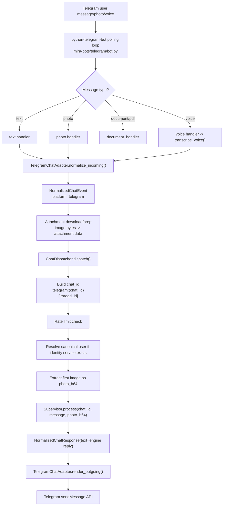
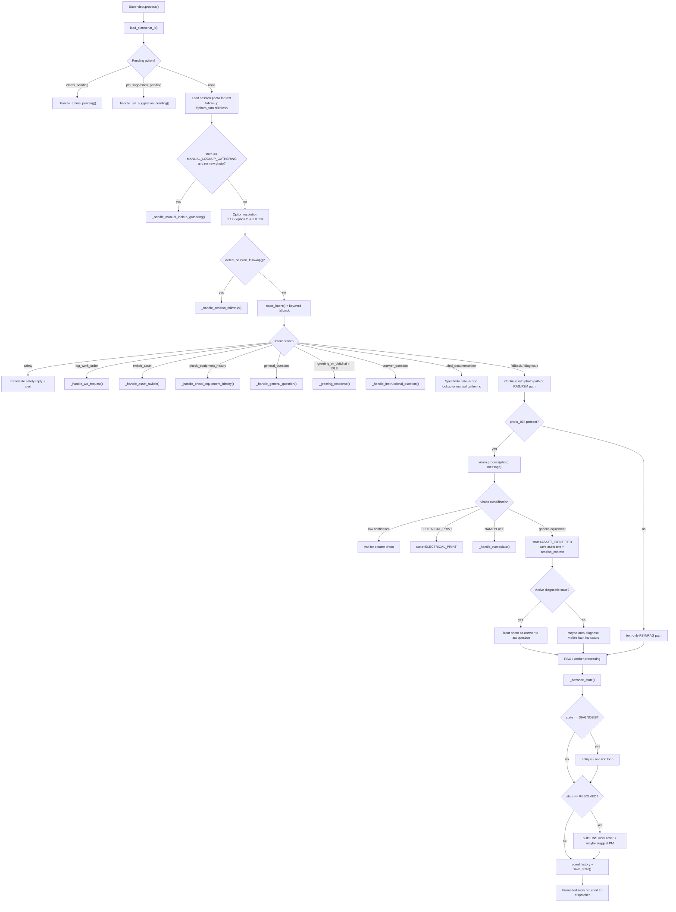
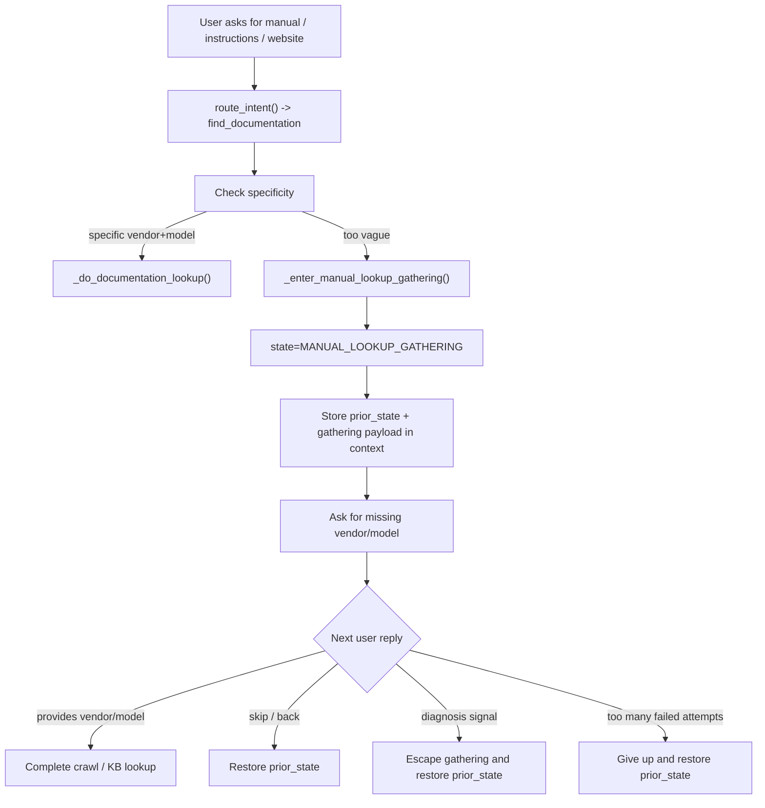
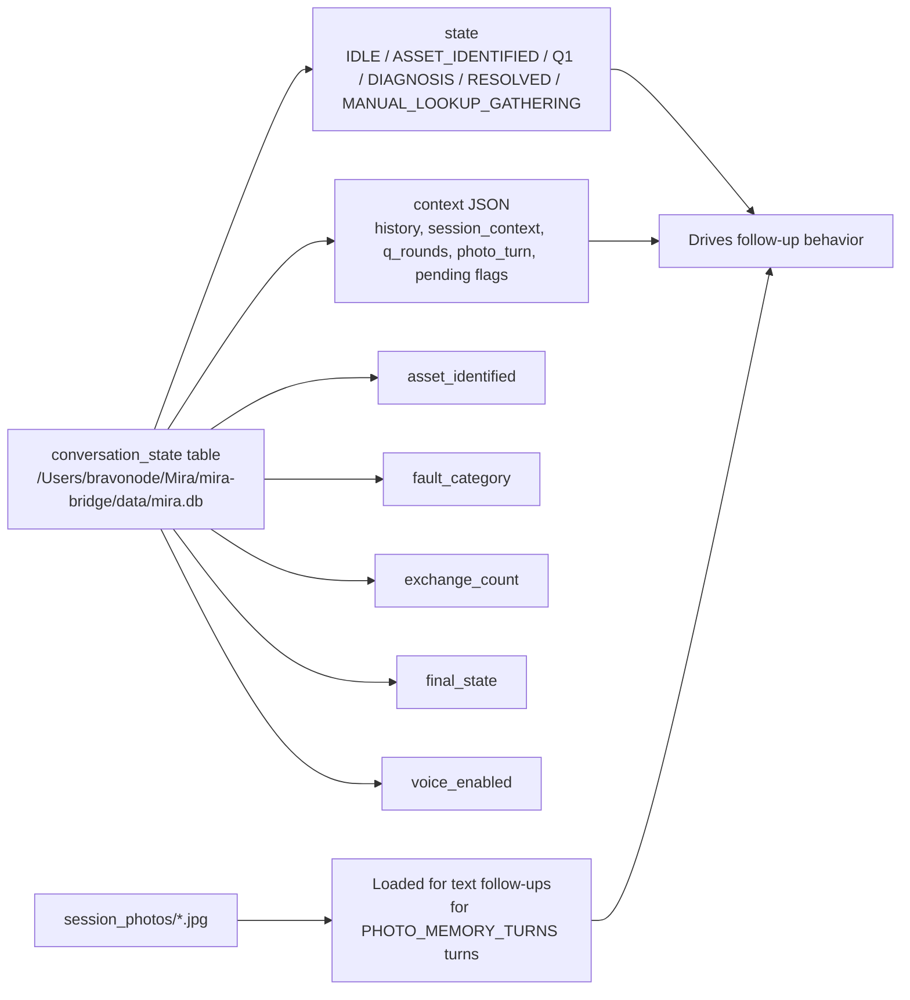
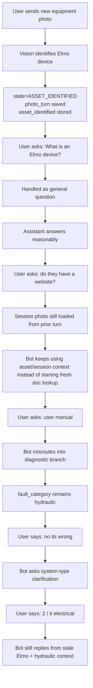
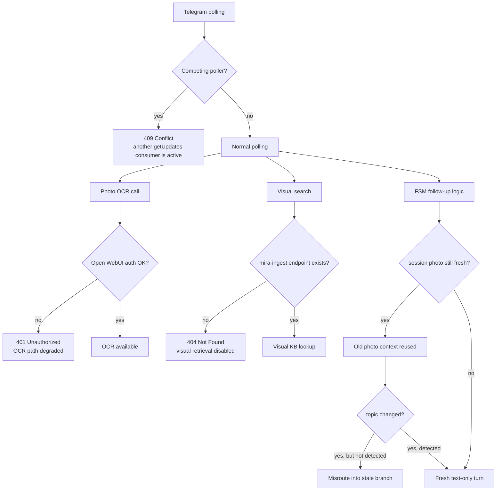

# Telegram Bot Logic Map

Date: 2026-05-01
Scope: live `mira-bot-telegram` flow, shared dispatcher path, `Supervisor` FSM, and the current failure pattern seen in chat `telegram:8445149012`.

Primary code paths:

- [mira-bots/telegram/bot.py](/Users/bravonode/Mira/mira-bots/telegram/bot.py)
- [mira-bots/telegram/chat_adapter.py](/Users/bravonode/Mira/mira-bots/telegram/chat_adapter.py)
- [mira-bots/shared/chat/dispatcher.py](/Users/bravonode/Mira/mira-bots/shared/chat/dispatcher.py)
- [mira-bots/shared/engine.py](/Users/bravonode/Mira/mira-bots/shared/engine.py)
- [mira-bots/shared/guardrails.py](/Users/bravonode/Mira/mira-bots/shared/guardrails.py)

Runtime state and evidence:

- DB: `/Users/bravonode/Mira/mira-bridge/data/mira.db`
- Session photos: `/Users/bravonode/Mira/mira-bridge/data/session_photos/`
- Live logs: `docker logs mira-bot-telegram`

## 1. Top-Level Telegram Flow

## 2. Supervisor Decision Tree

## 3. Documentation Subroutine

## 4. State Persistence Model

## 5. Current Failure Loop In Mike's Telegram Chat

Observed chat: `telegram:8445149012`

Stored state snapshot:

- `state = ASSET_IDENTIFIED`
- `asset_identified = Elmo device with PORT A / PORT B`
- `fault_category = hydraulic`
- `final_state = RESOLVED`
- `exchange_count = 19`

## 6. Live Failure Points

## 7. Practical Mental Model

Think of the bot as seven layers:

1. Telegram transport:
   receives updates, sends replies, downloads attachments.
2. Adapter:
   converts Telegram payloads into a platform-neutral event.
3. Dispatcher:
   rate limits, builds `chat_id`, extracts the first image, calls `Supervisor`.
4. Supervisor:
   the real orchestrator; loads state, decides whether this is follow-up, docs, safety, general Q, or diagnosis.
5. Workers:
   vision, electrical print, nameplate, RAG, doc lookup, CMMS.
6. FSM:
   stores where the conversation is and what the bot thinks the asset/problem is.
7. Persistence:
   SQLite state plus saved session photos that can bleed into later turns if reset logic is weak.

## 8. Most Likely Root Cause For The Current Chat

The current conversation is going wrong because three things are interacting badly:

1. The session photo is still considered fresh enough to load on later text turns.
2. The state never got properly reset when the user pivoted from identification to documentation lookup.
3. `fault_category` and `final_state` were left behind in a contradictory combination, so the bot is carrying stale diagnostic assumptions into a new question.

## 9. Best Fix Targets

If we patch this, the highest-value places are:

- [mira-bots/shared/guardrails.py](/Users/bravonode/Mira/mira-bots/shared/guardrails.py):
  `detect_session_followup()`
- [mira-bots/shared/engine.py](/Users/bravonode/Mira/mira-bots/shared/engine.py):
  photo follow-up load logic, documentation routing, and stale-state reset points
- Telegram ops:
  stop the duplicate poller causing `409 Conflict`
- OCR / ingest plumbing:
  fix the `401` OCR path and `404` visual search path

## 10. One-Line Summary

The Telegram bot is a transport -> adapter -> dispatcher -> FSM supervisor -> worker stack, and the current bug is a stale photo/FSM carry-over problem, not just a bad answer from the model.
