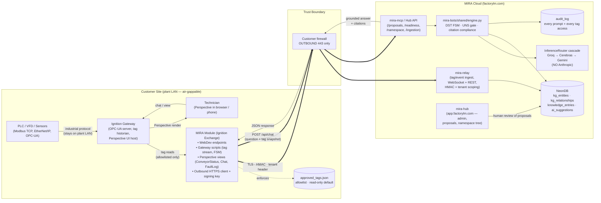

# MIRA Ignition Secure Architecture

**Status:** Active — target architecture for the customer-deployable product
**Authored:** 2026-05-31
**Owner:** Mike Harper
**Parent doctrine:** [`docs/THEORY_OF_OPERATIONS.md`](THEORY_OF_OPERATIONS.md)
**Sibling specs:** [`docs/specs/ignition-exchange-spec.md`](specs/ignition-exchange-spec.md) · [`docs/specs/maintenance-namespace-builder-spec.md`](specs/maintenance-namespace-builder-spec.md)

> **One-liner:** MIRA is an Ignition-connected maintenance reasoning system. The customer's PLC traffic never leaves their plant. Our agent reads through Ignition, writes nothing, and reasons in the cloud over approved data.

---

## 1. Plain-English Overview

The Theory of Operations names UNS / MQTT / Ignition as MIRA's **live context layer** and PLC writes as the **#1 hard non-goal**. This document makes that layer concrete:

1. **The customer owns the PLC.** They already run (or are buying) **Ignition** to talk to it. Ignition is the industry's de-facto SCADA / data hub. We meet them where they already are.
2. **MIRA installs as an Ignition asset** — a Perspective project + WebDev endpoints + a small gateway script bundle today, a packaged Ignition **Module** (JAR) tomorrow. It runs inside the customer's Ignition Gateway JVM.
3. **PLC traffic stays on the plant LAN.** MIRA never talks Modbus / EtherNet/IP / OPC-UA from the cloud. Ignition does, because that is what Ignition was built for.
4. **MIRA talks to the cloud via OUTBOUND HTTPS only.** No inbound port openings. No VPN. No exposed gateway. Customer's IT only has to allow `outbound 443 → *.factorylm.com`.
5. **Tag access is allowlist-only, read-by-default.** MIRA cannot enumerate or read a tag the customer hasn't put on the approved list. Writes are a separate, explicit, per-tag approval — and never available in the MVP.
6. **The Perspective UI is the technician's chat surface inside Ignition.** Same engine, same grounded answers, same UNS gate as Slack — but rendered in the dashboard the technician already has open.
7. **The cloud reasons; the gateway carries.** Ignition does I/O. MIRA Cloud does reasoning (engine, RAG, KG, UNS resolver, cascade LLM). Splitting it this way means the cloud can iterate fast (typed, tested) without touching the plant's safety-critical edge.

The MVP wedge: a customer installs the MIRA Module from the Ignition Exchange, names their lines and pastes their tag-export CSV, and within 30 minutes the technician can ask "why did Conveyor B16 fault?" inside Perspective and get a grounded answer citing their own manual, work-order history, and a live tag snapshot — *without their PLC ever being reachable from the internet*.

---

## 2. System Diagram



**Key invariant the diagram encodes:** the only arrows that cross the trust boundary go *outbound from the gateway*. The customer firewall sees zero inbound flows. The cloud cannot initiate a connection into the plant.

---

## 3. Data Flow

### 3.1 Tag stream (continuous, low-volume)

| Step | Where | What |
|---|---|---|
| 1 | PLC → Ignition | Ignition polls the PLC via its native driver. Already happening. |
| 2 | Ignition → MIRA Module | Gateway script subscribes to **tags on the allowlist only**. On change, captures `(tag_path, value, quality, ts)`. |
| 3 | MIRA Module → MIRA Cloud | Buffers and POSTs to `mira-relay` over HTTPS+HMAC. Batches every N ms or M values. Drops to `_streams/_failed/` on auth failure (visible to admin in Perspective). |
| 4 | mira-relay → NeonDB | Upserts `equipment_status` + appends `faults` (current shape, see `mira-relay/relay_server.py`). |
| 5 | KG | Async worker maps tags → `kg_entities` of type `tag` and links them via `belongs_to` edges. Proposed if unmapped, verified if from a previously approved tag-import CSV. |

### 3.2 Chat / troubleshooting (request/response)

| Step | Where | What |
|---|---|---|
| 1 | Technician | Types in Perspective chat panel: "why is B16 faulted?" |
| 2 | Perspective → WebDev | `POST /system/webdev/FactoryLM/api/chat` with `query`, `asset_id`, current tag snapshot (allowlisted tags only). |
| 3 | WebDev → MIRA Cloud | Forwards to `https://api.factorylm.com/api/v1/chat` with HMAC + tenant header. (Today the WebDev `doPost` posts to `localhost:5000/rag` — see Audit §11.) |
| 4 | MIRA Cloud engine | UNS gate resolves site/area/line/asset. If ambiguous → returns confirmation card. If confirmed → runs RAG over `knowledge_entries`, work-orders, fault-code table; LLM cascade composes answer with citations. |
| 5 | MIRA Cloud → WebDev → Perspective | JSON `{answer, sources[], confidence, suggested_actions[]}`. Perspective renders with clickable citations. |
| 6 | Audit | Every prompt + every tag read + every cited source is appended to `audit_log` with tenant + user + Ignition session id. |

### 3.3 Proposal loop (async, human-in-the-loop)

| Step | Where | What |
|---|---|---|
| 1 | Cloud worker | LLM extracts component / fault / relationship candidates from technician messages, manual uploads, work-order text. Writes `ai_suggestions` rows. |
| 2 | Hub `/proposals` | Manager reviews + confirms / edits / rejects. |
| 3 | Cloud → MIRA Module | Optional: pushes refreshed asset/component metadata back so Perspective views show the latest verified component profile. |

---

## 4. Security Model

The product wedge depends on this being a **boring** install for the customer's IT team. The model:

### 4.1 Network

- **Outbound-only.** MIRA Module opens TLS to `*.factorylm.com:443`. No listener on the gateway exposed to anything other than the plant LAN (which Ignition already does for Perspective).
- **No reverse tunnel, no VPN, no Tailscale, no NAT punch.** The cloud cannot initiate.
- **mTLS optional, HMAC required.** Every payload is signed with a per-tenant key held in the customer's Ignition gateway (Doppler-style env or Ignition's encrypted vault). Cloud rejects unsigned or mistimed payloads.
- **Replay protection.** Monotonic `nonce` per tenant; cloud rejects duplicates within a 10-minute window.

### 4.2 Tag access

- **Allowlist-first.** `approved_tags.json` lives in the Ignition project. A tag NOT in this file is invisible to MIRA — the WebDev tag-browse endpoint filters to the allowlist; gateway-script subscriptions only subscribe to allowlisted paths.
- **Read-only by default.** No WebDev or gateway-script path in MIRA's bundle calls `system.tag.writeBlocking`. (Distinct from `plc/live_monitor.py` which writes — that script ships in the *bench-development* tree, never in the customer module — see §11.) **Enforced** by `tests/regime7_ignition/test_no_customer_write_paths.py` (CI fails if a shipped Perspective view re-introduces `system.tag.write*`). The `SpeedControl` control view and the `FaultLog` clear-faults write were removed from the bundle on 2026-06-17 (v3.26.1) — VFD control is bench-only.
- **Writes require explicit two-step approval.** Even in a future "operator-assisted" mode: (1) tag added to a `writable_tags.json` by an Ignition admin (out-of-band) AND (2) cloud-side per-prompt approval bypass token. MVP ships with this feature **disabled** and the code path absent.
- **Per-tag observability.** Every read goes into `audit_log` with `{tag_path, asset_id, requester (chat/tag-stream), timestamp}`. The admin Perspective page shows a live tail.

### 4.3 Authentication

| Boundary | Auth |
|---|---|
| Ignition Gateway → mira-relay (tag stream) | HMAC-SHA256 over body + nonce, tenant id in header. `RELAY_API_KEY` rotated per tenant. |
| Ignition Gateway → MIRA Cloud chat API | Same HMAC + tenant id + Ignition session token. |
| Perspective UI → Ignition WebDev | Ignition's native auth (technician's logged-in session). |
| Hub admin → Hub API | NextAuth JWT (existing). |
| Cloud workers → NeonDB | RLS by `app.current_tenant_id`. |

### 4.4 Data residency

- **Manuals, work-order text, technician chat history** → cloud NeonDB (necessary for KG + RAG).
- **Raw live tag values** → optional retention in NeonDB `equipment_status` (latest snapshot only) + audit_log (read events). The full historian stays in Ignition. We don't replicate the historian; we cite from it on demand.
- **Customer can opt to send only fault events** (not raw tag streams) for the most conservative deployment — relay accepts both shapes.

### 4.5 Audit

- Every prompt, every cited source, every tag read is durable.
- Admin Perspective view + `/api/v1/audit` endpoint expose a live feed.
- Compliance-grade trail: which technician, which question, which sources, which LLM provider, which model, which inference run id.

### 4.6 LLM safety

- PII sanitization on by default (`InferenceRouter.sanitize_context()` — IP / MAC / serial scrubbing).
- Safety-keyword classifier (`SAFETY_KEYWORDS` in `mira-bots/shared/guardrails.py`) hard-stops on arc-flash / LOTO / confined-space and returns the escalation card. UNS gate is a no-op on safety branches.
- No fine-tune on customer chat without explicit opt-in (Knowledge Cooperative is contractual, anonymized).

---

## 5. Cloud SaaS Mode vs On-Prem Mode

| Aspect | **Cloud SaaS** (default) | **On-Prem** (future tier) |
|---|---|---|
| Where the engine runs | `factorylm.com` (DigitalOcean) | Customer's own VM / k8s in their DMZ |
| Where the KG lives | NeonDB (Cloud) | Customer-managed Postgres |
| Where the gateway module runs | Customer Ignition | Customer Ignition |
| Inference | Groq → Cerebras → Gemini cascade | Same cascade (if egress allowed) OR local Ollama+qwen2.5vl on a single GPU box |
| Updates | We push to cloud; module auto-updates via Exchange | Customer pulls a signed bundle on a schedule they control |
| Tag stream | Outbound HTTPS to MIRA Cloud | Outbound HTTPS to customer's own MIRA appliance |
| Knowledge Cooperative | Opt-in (default off; per-tenant anonymized) | Off (customer keeps everything) |
| Price point | $499/mo per line (per `NORTH_STAR.md`) | TBD enterprise tier |

The Module is identical in both modes — only the target URL changes. This is the wedge: every customer starts on Cloud SaaS, and the most regulated ones graduate to On-Prem **without re-engineering**.

---

## 6. MQTT / Sparkplug B Mode

Some customers already have a UNS broker (HiveMQ, Mosquitto, Cirrus Link) producing Sparkplug B. MIRA must be able to **consume** that without making the customer install Ignition just for us.

```mermaid
flowchart LR
    PLC --> EDGE[Edge Node\n(existing)]
    EDGE -- "spBv1.0/group/MESSAGE/edge/device" --> BROKER[MQTT Broker / UNS]
    BROKER -- "subscribe (allowlist topics)" --> CONN["mira-connect agent\n(outbound: subscribe MQTT,\npost to mira-relay)"]
    CONN == TLS + HMAC ==> RELAY[mira-relay]
```

- `mira-connect` (currently a deferred Python package — see Audit §11) is the right home for this. It is the non-Ignition counterpart to the Ignition Module.
- Sparkplug → UNS translation rules already in `.claude/rules/uns-compliance.md` + `mira-crawler/ingest/uns.py`.
- Same trust model: outbound-only, allowlist topics, HMAC-signed payloads to `mira-relay`.
- Chat path: customers in MQTT mode get Slack and Hub front doors (no Perspective). The Ignition Module is one of three adapters, not the only one.

Spec target: `docs/specs/sparkplug-uns-bridge-spec.md` (referenced in `.claude/mcp/mira-plc-map-mcp-spec.md` but not yet drafted). Post-MVP per the Theory of Operations roadmap.

---

## 7. MVP Scope (Build First)

The minimum customer-deployable artifact for **first paying customer**:

| # | Item | Lives in | State today |
|---|---|---|---|
| 1 | Ignition project bundle: Perspective views (`ConveyorStatus`, `Chat`, `FaultLog`, `NavBar`) | `ignition/project/` | ✅ Exists. Demo scope (one conveyor). Needs `ChatPanel` view added. |
| 2 | WebDev endpoints: `/chat`, `/tags`, `/status`, `/alerts`, `/connect`, `/ingest` | `ignition/webdev/FactoryLM/api/` | ⚠️ Exist as Jython stubs; `/chat` posts to wrong target (`localhost:5000`). Repoint to MIRA Cloud chat endpoint. |
| 3 | `approved_tags.json` + WebDev filter | `ignition/project/` | 🔲 Not built. Critical. |
| 4 | Gateway tag-change script → outbound POST | `ignition/gateway-scripts/tag-stream.py` | ⚠️ Exists. Verify it batches + uses HMAC + respects allowlist. |
| 5 | `deploy_ignition.ps1` — 3-command installer | `ignition/deploy_ignition.ps1` | ✅ Exists. Idempotent. |
| 6 | `mira-relay` — cloud tag ingest + auth | `mira-relay/` | ✅ Exists. Bearer auth + WebSocket + REST. Needs HMAC upgrade. |
| 7 | Cloud chat endpoint that the WebDev `/chat` calls | `mira-mcp` or `mira-hub` API | ⚠️ Engine exists; needs an Ignition-shaped wrapper (`POST /api/v1/ignition/chat`). |
| 8 | UNS gate, citation compliance, cascade | `mira-bots/shared/engine.py` | ✅ Active on Slack today. Adapter-agnostic. |
| 9 | Tag-import wizard (CSV → `ai_suggestions` of type `tag_mapping`) | `mira-hub` + `mira-mcp` | 🔲 Spec'd in `maintenance-namespace-builder-spec.md`; not built. |
| 10 | Admin audit view in Perspective + cloud audit query | new | 🔲 Not built. |
| 11 | Ignition Exchange listing (manifest + screenshots + install doc) | `ignition/EXCHANGE/` | 🔲 Not built. Gate to first customer install. |
| 12 | One real end-to-end test on the bench: Micro 820 → Ignition (laptop) → MIRA Cloud → grounded answer back in Perspective | live | 🔲 Done partial (live tag stream works; chat round-trip not verified end-to-end). |

**Single demo loop that defines MVP done:**

> A technician on the PLC laptop opens Perspective. The ConveyorStatus view shows live GS10 tags via the Ignition driver (existing). They type "why did the conveyor stop?" in the Chat panel. The WebDev `/chat` endpoint forwards (with allowlisted tag snapshot) to MIRA Cloud. MIRA Cloud's engine runs the UNS gate, confirms "Lake Wales / Bench / Conveyor / Conv_Simple", retrieves the GS10 manual page on F0004 from the KG, composes a grounded answer with citations, returns it to Perspective, and the technician sees it within 5 s. Audit_log captures the prompt + sources + tag reads.

Everything else is post-MVP.

---

## 8. What We Explicitly Should NOT Do

These are the anti-patterns that fall out of the architecture above. Each is a hard no, not a "later":

1. **❌ Direct Modbus / EtherNet/IP / OPC-UA from MIRA Cloud or any cloud-resident container.** Always go through Ignition (or `mira-connect` for the MQTT mode). The plant LAN stays the plant LAN.
2. **❌ MIRA Cloud initiating connections to the plant.** All sync is gateway-initiated outbound.
3. **❌ A MIRA-hosted local MQTT broker as the customer's edge.** That makes us the broker — out of scope, competes with HiveMQ/Mosquitto/Cirrus Link, and adds plant-side ops burden.
4. **❌ Customer-side `pymodbus` calls** in any package shipped to customers (`mira-connect/drivers/modbus_driver.py` is bench/dev tooling — must be clearly fenced).
5. **❌ Reading tags not on the allowlist**, ever. No "ah, the technician asked about it, let's just go grab it." If they need it, an admin adds it to `approved_tags.json` and re-deploys.
6. **❌ Writing to tags from the MVP.** Period. The code path doesn't ship.
7. **❌ Replacing Ignition.** We are *the maintenance brain on top of* their SCADA. Selling against IA is a losing fight; partnering with them is a winning one (Ignition Exchange listing is the distribution channel).
8. **❌ Replacing CMMS / SCADA / Historian.** Same logic. We integrate (`mira-cmms/atlas`, Ignition tag historian, MaintainX) — we never replace.
9. **❌ A LangChain / n8n abstraction over the LLM call.** PRD §4 forbids it; the InferenceRouter cascade stays direct.
10. **❌ Anthropic as an inference provider.** Removed PR #610 + #649; do not reintroduce. (Cascade: Groq → Cerebras → Gemini.)
11. **❌ Skipping the UNS gate for "convenience"** in the Perspective chat path. Same engine, same gate. A Perspective answer with no confirmed asset context is a bug.
12. **❌ Generic chitchat in Perspective.** If the technician asks "what is MQTT", the engine answers; if they ask "fix my conveyor", the gate fires first. No shortcut.
13. **❌ Tag streams from a feature branch hitting prod NeonDB.** Use staging.

---

## 9. Development Checklist (Toward MVP)

Ordered. Each item is independently shippable.

- [ ] **D1 — Allowlist enforcement** (`ignition/project/` + `ignition/webdev/FactoryLM/api/tags/doGet.py`). Add `approved_tags.json`, filter tag-browse to allowlist, reject `/chat` snapshots containing non-allowlisted paths. Add unit test in `ignition/tests/test_allowlist.py`.
- [ ] **D2 — Repoint WebDev `/chat` to MIRA Cloud.** Change [`ignition/webdev/FactoryLM/api/chat/doPost.py:73`](ignition/webdev/FactoryLM/api/chat/doPost.py:73) from `http://localhost:5000/rag` to `https://api.factorylm.com/api/v1/ignition/chat`. Add HMAC signing. Env-var the URL.
- [ ] **D3 — Cloud chat endpoint** `POST /api/v1/ignition/chat` in `mira-mcp` or `mira-hub` that takes `{query, asset_id, tag_snapshot, tenant_id, signed_with}`, calls `mira-bots/shared/engine.py` through the existing engine entrypoint, returns `{answer, sources, confidence, suggested_actions}`. Citation compliance flips to enforcing for this path.
- [ ] **D4 — `mira-relay` HMAC upgrade.** Replace bearer token with HMAC+nonce+tenant header in [`mira-relay/relay_server.py:154`](mira-relay/relay_server.py:154). Keep bearer as a fallback for the existing bench bridge until D5 migrates it.
- [ ] **D5 — Move `plc/live-plc-bridge/bridge.py` out of the customer-shipped story.** Rename / fence under `bench/` or document it as "bench developer tool, never deployed". This is the bench harness, not the product. Update `docker-compose.fault-detective.yml` comments accordingly.
- [ ] **D6 — Perspective ChatPanel view.** New view under `ignition/project/com.inductiveautomation.perspective/views/ChatPanel/resource.json`. Input box + answer pane with clickable citations.
- [ ] **D7 — Audit log.** Append `(tenant_id, user, channel='ignition', prompt, sources_json, tag_reads, latency_ms)` for every chat round-trip. Surface via `/api/v1/audit` and a Perspective admin view.
- [ ] **D8 — Tag-import wizard MVP slice.** CSV upload in Hub → `ai_suggestions` of type `tag_mapping` per [`docs/specs/maintenance-namespace-builder-spec.md`](specs/maintenance-namespace-builder-spec.md) §AI Pipeline. Manual approval in `/proposals`.
- [ ] **D9 — Ignition Exchange manifest.** `ignition/EXCHANGE/manifest.json`, screenshots in `docs/promo-screenshots/`, install doc, license, listing copy.
- [ ] **D10 — End-to-end bench test.** Single script that: deploys module, posts a chat, asserts grounded answer with citations + audit_log row. Lives in `tests/e2e/ignition_chat_roundtrip.py`.
- [ ] **D11 — Sparkplug B subscriber spec** `docs/specs/sparkplug-uns-bridge-spec.md`. Design only, no code yet. Establishes `mira-connect` as the non-Ignition path.
- [ ] **D12 — Document & ADR.** New ADR-0019 (or 0020) "Ignition-Module-First Edge Architecture" capturing the decisions in this doc as durable record.

---

## 10. Alignment Audit (Current Repo vs. Target)

Honest assessment of what's pulling toward the target vs. away from it.

### 10.1 What ALREADY aligns

| Area | Why it aligns |
|---|---|
| **UNS gate** (`mira-bots/shared/engine.py` line ~1316, PRs #1220/#1280/#1295/#1314) | Adapter-agnostic. Slack, Perspective, Web Hub all call the same gate. ✅ |
| **Citation compliance** (`mira-bots/shared/citation_compliance.py`) | Enforces grounded answers regardless of front door. ✅ |
| **InferenceRouter cascade** | Groq → Cerebras → Gemini, no Anthropic, PII sanitization on by default. ✅ |
| **`mira-relay/relay_server.py`** | Outbound-only HTTPS ingest pattern with bearer auth (needs HMAC upgrade, but model is correct). ✅ |
| **`ignition/` directory + WebDev endpoints + Perspective views** | The embryonic Ignition Module already lives in the repo. ✅ |
| **`ignition/webdev/FactoryLM/api/chat/doPost.py`** | Already implements: "receive query → snapshot tags → forward to MIRA → return grounded answer". Right shape, wrong target URL. ✅ shape |
| **`mira-machine-logic-graph/`** | TypeScript builder that produces Ignition tag exports from PLC ST source. Helps customers *ingest* their tag list — aligns with tag-import wizard (D8). ✅ |
| **`deploy_ignition.ps1`** | 3-command idempotent install — the right primitive for an Exchange listing. ✅ |
| **Knowledge graph + KG proposal queue + Hub `/proposals`** | The reasoning substrate the Ignition Module's chat path consumes. Already shipped through Phase 2 (project memory). ✅ |
| **Conversational engine v2 (3-layer)** (PR #1531 spec, #1551 impl) | Front-desk / router / grounded-specialist split is interface-agnostic. Plays nicely with adding Perspective as a third adapter. ✅ |
| **QA regression routine** | Locks against silent regressions — protects the bot grounding for ALL adapters including Perspective. ✅ |
| **CodeGraph integration** | Dev tooling. Neutral, helpful. ✅ |
| **Celery agent routines** | Async workers (proposal generation, audit log, recompute). Neutral, helpful. ✅ |

### 10.2 What does NOT align (or is at risk)

| Area | Misalignment | Severity |
|---|---|---|
| **`plc/live-plc-bridge/bridge.py`** | Direct `pymodbus` poll from a MIRA-named container to PLC `192.168.1.100:502`. Lives in our compose. If a customer ever ran this stack, they would be allowing a MIRA container to talk Modbus on their LAN — the exact pattern we're saying we won't do. | 🔴 Bench-only OK, but needs to be unambiguously fenced as bench. |
| **`docker-compose.fault-detective.yml`** | Spins up local `eclipse-mosquitto` broker + `mira-fault-sim` + `mira-fault-detective` + `live-plc-bridge` on `core-net`. The demo is internally consistent, but it implies an architecture (MIRA hosts the broker, MIRA polls the PLC) that we are *not* selling. | 🟡 Demo-only is defensible; needs README that says so + a parallel "Ignition demo" compose. |
| **`plc/live_monitor.py`** | Has F/R/S/X commands that **write** to GS10. Not customer code, but lives in `plc/` alongside `discover.py` and is easy to confuse. | 🟡 Already covered by `.claude/rules/fieldbus-readonly.md` for `discover.py`; extend the same fencing to live_monitor.py with a header comment + a `.claude/rules/` entry. |
| **`mira-connect/mira_connect/drivers/modbus_driver.py`** | `pymodbus` async driver in a customer-named package. Marked "deferred to Config 4" in root `CLAUDE.md`, but the package name suggests a shipped product. | 🟡 Rename or fence: this package should ship as the **MQTT/Sparkplug subscriber** (per §6), not as a Modbus driver. Modbus stays in `plc/` / `bench/`. |
| **`ignition/webdev/FactoryLM/api/chat/doPost.py:73`** | Points at `http://localhost:5000/rag` — that's the legacy `mira-sidecar`, sunset pending. It should point at MIRA Cloud. | 🔴 Single-line fix (D2 above), but blocks any real Perspective chat. |
| **`mira-relay` bearer auth** | Single shared `RELAY_API_KEY` env var. Fine for the bench; not fine for a multi-tenant SaaS where each tenant has their own gateway. | 🟡 Upgrade to HMAC + tenant header (D4). |
| **No allowlist on WebDev `/tags`** | [`ignition/webdev/FactoryLM/api/tags/doGet.py`](ignition/webdev/FactoryLM/api/tags/doGet.py) browses `[default]Mira_Monitored` and returns everything underneath. No filter against an approved-tags list. | 🔴 D1 above. This is the core trust-boundary primitive. |
| **No HMAC on WebDev → cloud** | The Jython `doPost` uses `urllib2.Request` with no signing. | 🔴 Couple with D2/D3. |
| **No audit log for tag reads** | Chat writes to `mira_chat_history`; tag reads do not. | 🟡 D7. |
| **`mira-sidecar` still referenced** | Legacy ChromaDB RAG sidecar, marked "sunset pending" in `CLAUDE.md`. Some Ignition code paths still expect it. | 🟡 Migrate fully before Ignition Exchange listing. |
| **Hub `/cmms` chat / Web Hub chat** | Parallel adapter that must use the same engine + UNS gate. Per `maintenance-namespace-builder-spec.md` Known Issues. | 🟡 Already on the radar; flag here for completeness. |

### 10.3 Demo-work alignment verdict

The user asked specifically about the in-flight demo work. My assessment:

| Stream | Verdict | Why |
|---|---|---|
| **Fault Detective demo (MQTT + fault-sim + Node-RED)** | 🟡 **Diverging** unless reframed. As a *bench* demo to prove the rule engine works against MQTT-shape data, it's fine and useful. As an *architecture preview* shown to customers, it implies the wrong story (MIRA hosts the broker and polls the PLC). Fix: rename the demo "MIRA Rule Engine — Bench Harness" and produce a parallel "Ignition Edge Demo" using the Ignition Module path. The rule engine code (`mira-fault-detective/`) is reusable in either deployment shape. |
| **Conveyor live monitor (direct Modbus TCP poll, F/R/S/X writes)** | 🔴 **Anti-pattern as a product feature.** As a developer harness to instrument the PLC and validate ladder logic, it's correct and stays. As anything customer-facing, it violates the security model and the "no PLC writes" non-goal. Fix: keep it in `plc/`, header-comment as bench-only, never reference from any customer-deployed compose. |
| **Conversational engine v2 (3-layer)** | ✅ **Aligned.** Front-desk / router / grounded-specialist is adapter-agnostic. Perspective slots in as a new adapter alongside Slack/Hub without changing the engine. |
| **QA regression routine** | ✅ **Aligned.** Lock against silent grounding regressions protects every front door. |
| **CodeGraph integration** | ✅ **Aligned.** Dev tooling. |
| **Celery agent routines** | ✅ **Aligned.** Right shape for proposal generation + audit + recompute workers behind the chat API. |

### 10.4 What needs to change FIRST (top of the queue)

1. **D1 — Allowlist on WebDev `/tags`.** Lowest-effort, highest-trust-impact change. Without this, the "approved tags only" claim is just a promise.
2. **D2 — Repoint WebDev `/chat` to MIRA Cloud.** Unblocks the entire Perspective chat path. Single-line URL + add HMAC + env-var.
3. **D3 — Cloud chat endpoint (`POST /api/v1/ignition/chat`).** Counterpart to D2. Wraps the existing engine for an Ignition-shaped client.
4. **D4 — `mira-relay` HMAC upgrade.** Makes the bench-shape relay multi-tenant-ready.
5. **D5 — Fence `plc/live-plc-bridge` + `plc/live_monitor.py` as bench tools.** Header comments + `.claude/rules/` extension. No code change to the bench tools themselves.

### 10.5 What can wait

- MQTT / Sparkplug B subscriber (D11) — design only; build after first Ignition customer.
- On-Prem mode (§5) — same architecture, different target URL; build when an enterprise prospect asks.
- Writable-tag flow (operator-assisted writes) — not in MVP; do not even add the code path.
- Knowledge Cooperative aggregation — post-MVP, contract-gated.
- Full Ignition Java/Kotlin Module (JAR) — the Perspective project + WebDev + gateway scripts cover the MVP. A packaged Module is post-MVP polish for the Exchange listing.

### 10.6 Next 5 Development Tasks Toward the Ignition Module

Concrete, in order:

1. **Add `ignition/project/approved_tags.json`** (start with the 36 Conveyor MIRA tags as the allowlist) and modify [`ignition/webdev/FactoryLM/api/tags/doGet.py`](ignition/webdev/FactoryLM/api/tags/doGet.py) to filter against it. Add `ignition/tests/test_allowlist.py` that asserts a non-allowlisted tag returns 404.
2. **Add `POST /api/v1/ignition/chat` to `mira-mcp`** (or a thin wrapper in `mira-hub` if MCP boundary is tighter): accepts `{query, asset_id, tag_snapshot, tenant_id, hmac, nonce}`, validates, calls the engine, returns `{answer, sources, confidence, suggested_actions}`. Write an integration test that posts a synthetic question, asserts the UNS gate fires, asserts citations are present.
3. **Repoint [`ignition/webdev/FactoryLM/api/chat/doPost.py`](ignition/webdev/FactoryLM/api/chat/doPost.py)** at the new endpoint, add HMAC signing using a `MIRA_CLOUD_SIGNING_KEY` env var (read from Ignition gateway's encrypted vault), env-var the URL so dev points at staging.
4. **Upgrade [`mira-relay/relay_server.py`](mira-relay/relay_server.py)** from bearer to HMAC + tenant header + nonce-window replay protection. Keep the bearer path active behind a `RELAY_LEGACY_BEARER=1` flag for the existing bench bridge until it migrates.
5. **End-to-end bench test (`tests/e2e/ignition_chat_roundtrip.py`)**: stand up `mira-relay` + the Hub chat endpoint, fire a synthetic chat through the WebDev shape, assert the response contains a citation, assert an `audit_log` row exists, assert no tag outside the allowlist was read. Single command, runs in CI.

After those five, the Ignition Exchange listing (D9) is the gate to a real customer install — and the rest of the development checklist falls naturally from there.

---

## 11. Open Questions

These deserve a Mike decision before the next planning round, but do not block the next five tasks:

1. **Where does the cloud chat endpoint live — `mira-mcp` or `mira-hub`?** MCP is the right layer per ARCHITECTURE.md (engine sits with MCP). Hub is the right layer for product-surface cohesion (proposals, namespace, readiness all there). Recommend MCP with a Hub UI feature flag that surfaces transcript history.
2. **Should `mira-connect` be renamed?** The name suggests a customer-shipped Modbus driver. Reality: it's the future MQTT/Sparkplug subscriber. Recommend renaming to `mira-edge-mqtt` and moving the existing Modbus driver to `bench/modbus-driver/` for clarity.
3. **HMAC key rotation.** Per-tenant signing key — where is it minted, where is it stored on the gateway, how is it rotated? Recommend: minted in Hub admin, stored in Ignition's encrypted gateway vault, rotated quarterly with overlap window.
4. **On-prem appliance shape.** Single container? Single VM? Compose stack? Recommend: deferred until enterprise prospect, but architecturally the cloud stack is already container-portable.

---

## 12. Cross-References

- [`docs/adr/0021-ignition-module-first-edge.md`](adr/0021-ignition-module-first-edge.md) — **durable record of this architecture as an ADR**
- [`docs/THEORY_OF_OPERATIONS.md`](THEORY_OF_OPERATIONS.md) — primary product doctrine
- [`docs/ARCHITECTURE.md`](ARCHITECTURE.md) — layer map, dependency rules
- [`docs/specs/maintenance-namespace-builder-spec.md`](specs/maintenance-namespace-builder-spec.md) — UNS gate, proposals, tag-import wizard
- [`docs/specs/ignition-exchange-spec.md`](specs/ignition-exchange-spec.md) — sibling spec for the Exchange listing
- [`docs/specs/uns-kg-unification-spec.md`](specs/uns-kg-unification-spec.md) — UNS authority
- [`.claude/CLAUDE.md`](../.claude/CLAUDE.md) — product rules
- [`.claude/rules/fieldbus-readonly.md`](../.claude/rules/fieldbus-readonly.md) — read-only discovery rule (extend to live_monitor.py)
- [`.claude/rules/uns-compliance.md`](../.claude/rules/uns-compliance.md) — UNS data shape
- [`.claude/rules/security-boundaries.md`](../.claude/rules/security-boundaries.md) — secrets, PII, safety
- [`.claude/skills/mira-architecture-guardian/SKILL.md`](../.claude/skills/mira-architecture-guardian/SKILL.md) — invariants enforced at PR time
- [`.claude/skills/mira-saas-scope-guard/SKILL.md`](../.claude/skills/mira-saas-scope-guard/SKILL.md) — scope classifier (matches §8 anti-patterns)

## 13. Change Log

- **2026-05-31** — Initial draft. Establishes Ignition-Module-as-edge as the customer-deployable target architecture. Calls out direct-Modbus and local-broker patterns in the current repo as bench-only, not product. Defines a 12-item development checklist with the first 5 tasks as the next planning unit.
