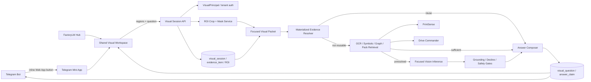
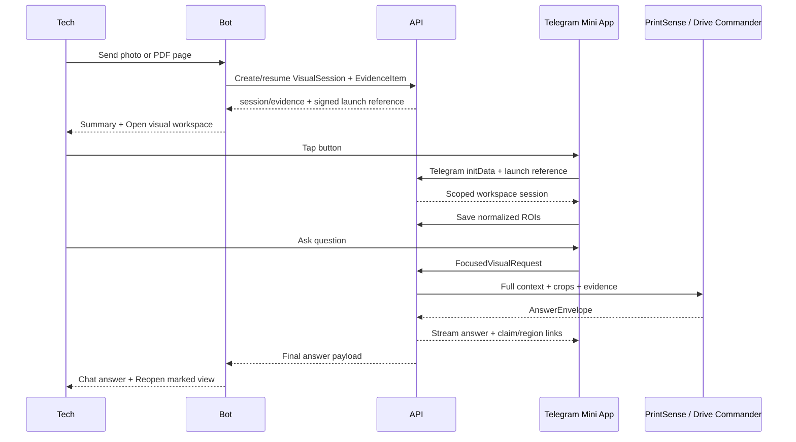

# PRD — PrintSense Visual Focus Workspace

**Product:** FactoryLM / MIRA  
**Scope:** PrintSense, Drive Commander, Telegram Mini App, FactoryLM Hub  
**Status:** Architecture-proven, implementation-ready proposal  
**Date:** 2026-07-20  
**Repository baseline inspected:** `Mikecranesync/MIRA@207c7849936950be4e359c7291cbc565548bb291`

> This PRD extends the existing MIRA Visual Technician PRD and ADR-0027. It does not replace the existing VisualSession, evidence, approval, PrintSense, Drive Commander, or Machine Pack contracts.

---

## 1. Executive decision

Build one shared **Visual Focus Workspace** that runs in two shells:

1. **Telegram Mini App:** launched from an inline button or bot menu after a technician sends a print, PDF page, drive photo, nameplate, HMI, or keypad image.
2. **FactoryLM Hub:** the same workspace embedded in the authenticated web application for longer sessions, complete print packages, engineering review, and cross-page work.

The technician can:

- tap a component;
- draw a box around a circuit;
- circle a terminal, wire number, fault code, or device;
- highlight a wire path;
- freehand-mark an unusual area;
- ask a question about one or several selected regions.

The selected regions become structured evidence, not pixels painted onto a screenshot. The system stores normalized geometry in the existing `region_of_interest` ledger, maps it back to the preserved original, generates high-resolution focus crops, and sends PrintSense or Drive Commander a focused request containing:

- the complete page or photo for context;
- one or more high-resolution region crops;
- the technician’s marks and question;
- nearby OCR, symbols, graph facts, cross-references, and machine context;
- compatible prior materialized answers and evidence.

The answer returns through the existing `AnswerEnvelope` contract and can visually point back to the exact regions supporting each claim.

### Feasibility verdict

**This is feasible with the current platform and repository.**

The difficult foundations already exist:

- Telegram photo/PDF intake and PrintSense/Drive Commander routing;
- a Next.js/React FactoryLM application;
- persistent tenant-scoped visual sessions;
- preserved evidence items;
- `region_of_interest.geometry`;
- transforms back to the original source;
- observation and answer-claim ledgers;
- PrintSense page/region/evidence-crop doctrine;
- Drive Commander photo-to-pack resolution.

The primary missing pieces are:

- the shared viewer and annotation component;
- Telegram Mini App launch/authentication;
- browser-facing Visual Session APIs;
- ROI crop/mask generation;
- a focused request adapter into PrintSense and Drive Commander;
- visual answer overlays;
- large-document page/tile delivery.

No new parallel evidence system is required.

---

## 2. Research conclusions

### 2.1 Telegram can host the interface

Telegram Mini Apps are HTML5 applications that run inside Telegram and can be launched from supported bot buttons and menu surfaces. They support full-screen mode, portrait/landscape orientation, safe-area information, theme integration, haptics, and device performance hints.

This makes a phone-based pan, zoom, and annotation workspace practical without forcing the technician to leave Telegram.

Important implementation constraints:

- Optimize v1 for the existing private technician-to-bot conversation.
- Use an inline **Open visual workspace** button and a persistent bot menu entry.
- Do not make Telegram attachment-menu access a v1 dependency.
- Do not use `WebApp.sendData` as the main transport. It is size-limited and closes the Mini App.
- Send annotation state and questions through authenticated FactoryLM HTTPS APIs.
- Telegram remains the launch and chat-return surface, while FactoryLM owns identity, evidence, storage, and inference.

Official references:

- Telegram Mini Apps: https://core.telegram.org/bots/webapps
- Telegram Bot API: https://core.telegram.org/bots/api

### 2.2 The browser rendering stack is proven

Recommended technologies:

- **PDF.js** for page-by-page PDF rendering.
- **Konva / react-konva** for touch/mouse shapes, free drawing, vector state, transforms, and undo/redo.
- **OpenSeadragon** for deep zoom, tiled images, overlays, rotation, and coordinate conversion on very large drawings.

Official references:

- PDF.js examples: https://mozilla.github.io/pdf.js/examples/
- Konva React drawing: https://konvajs.org/docs/react/Free_Drawing.html
- OpenSeadragon overlays: https://openseadragon.github.io/examples/ui-overlays/

### 2.3 The repository already contains the canonical data spine

At the inspected repository commit:

- `mira-hub/db/migrations/063_visual_sessions.sql` defines:
  - `visual_session`;
  - `evidence_item`;
  - `region_of_interest`;
  - `observation`;
  - `visual_question`;
  - `answer_claim`.
- `region_of_interest` already stores:
  - JSON geometry;
  - user/system origin;
  - a transform back to the original evidence.
- `mira-bots/shared/visual/models.py` already defines frozen:
  - `VisualSession`;
  - `EvidenceItem`;
  - `RegionOfInterest`;
  - `Observation`;
  - `AnswerEnvelope`.
- `mira-bots/shared/visual/store.py` already exposes `add_region(...)`.
- `mira-bots/shared/visual/session_service.py` already orchestrates quality scoring, classification, OCR/vision, print extraction, equipment/nameplate handling, observation persistence, and structured Q&A.
- `printsense/README.md` already defines page + region + evidence-crop citations and deterministic reuse.
- `mira-bots/telegram/bot.py` already has photo intake, PrintSense handling, nameplate-to-drive-pack routing, persistent Hub intake, and follow-up behavior.
- `mira-hub/package.json` confirms that the Hub is Next.js + React + TypeScript and can host a shared React workspace.

Therefore the work should extend existing contracts, not create a separate annotation database, visual chat engine, or Telegram-only intelligence path.

---

## 3. Product promise

> A technician can point to the exact part of a print or machine image they do not understand, ask a question, and receive an evidence-grounded explanation tied back to the selected area and the complete machine context.

This is stronger than “chat with a PDF.”

The system understands:

- **where** the technician is pointing;
- **what** is visibly inside that region;
- **what surrounds it** on the page or panel;
- **what it connects to** across the package;
- **what the manufacturer documents**;
- **what the machine pack verifies**;
- **what remains uncertain**;
- **what evidence should be collected next**.

---

## 4. Primary user journeys

### 4.1 Telegram — send, mark, ask

1. Technician sends a print photo, PDF page, drive photo, keypad, HMI, or nameplate to the existing bot.
2. Existing intake:
   - resolves tenant and identity;
   - creates or resumes a `VisualSession`;
   - preserves the original as an `EvidenceItem`;
   - begins current quality/classification/extraction work.
3. Bot replies with:
   - detected type and quality;
   - the first safe summary, when available;
   - an inline button: **Open visual workspace**.
4. The button opens the Telegram Mini App with a short-lived signed launch reference.
5. Mini App:
   - validates Telegram identity through the backend;
   - loads the session and selected evidence;
   - enters expanded/full-screen mode;
   - shows the image/page with pan and zoom.
6. Technician taps, circles, boxes, highlights, or freehands one or more regions.
7. Technician asks: “Why would this contact never energize?”
8. Workspace submits a `FocusedVisualRequest`.
9. Server:
   - persists user-origin ROIs;
   - creates padded high-resolution crops and optional masks;
   - retrieves nearby OCR and graph facts;
   - resolves reusable materialized evidence first;
   - invokes deterministic PrintSense/Drive Commander paths;
   - uses model inference only for unresolved interpretation.
10. The answer streams into the Mini App and is also posted back into the Telegram chat.
11. Claims can be tapped to flash the supporting region on the image.

### 4.2 FactoryLM Hub — full working session

1. Technician opens a machine, asset, upload, or prior Telegram session.
2. Hub displays:
   - page/image viewer;
   - package thumbnails and search;
   - annotation tools;
   - Q&A timeline;
   - evidence/claim panel.
3. Technician selects regions across multiple pages or photos.
4. System traces connections, compares equipment photos to prints/packs, and records contradictions.
5. Engineer or reviewer confirms, corrects, rejects, or requests field verification.
6. Accepted observations flow into the existing deterministic Print Pack / Machine Pack process.

### 4.3 Drive Commander — focus a code, terminal, or label

Examples:

- Circle `F004` on a keypad and ask what it means.
- Box the catalog number on a nameplate.
- Highlight terminals `13–14`.
- Circle a damaged connector.
- Select the keypad and motor leads in two different photos and ask whether they match the expected pack wiring.
- Select a parameter row in a manual page and ask how it affects the photographed drive.

The same ROI and answer contracts apply. The route changes from print-focused extraction to:

1. OCR on selected region;
2. drive family/model resolution;
3. deterministic pack lookup;
4. manual citation retrieval;
5. visual reasoning only when deterministic resolution is incomplete.

### 4.4 Very large PDF — 3,000-page package

The browser must not load or rasterize all 3,000 pages.

Ingestion creates a package manifest containing:

- document identity and content hash;
- page count;
- per-page hash;
- sheet/page labels;
- low-resolution thumbnails;
- selected-page raster or tile source;
- OCR/text index;
- detected devices, wire numbers, cross-references, and continuation links;
- processing state per page.

The client loads:

- the manifest;
- thumbnails/search results;
- one selected page;
- optionally the previous and next page.

For normal pages, render a selected page through PDF.js or use a pre-rendered page image. For very large/high-resolution sheets, serve a tile pyramid and use OpenSeadragon. The annotation coordinate model remains identical.

---

## 5. UX specification

### 5.1 Mobile layout

#### Top bar

- Back
- Session title / asset tag
- Page or image selector
- Search
- More/options

#### Viewer

- full-screen image/page;
- two-finger pan/zoom always available;
- double tap to zoom;
- fit page / fit width;
- rotate view without mutating the original;
- selected region handles;
- visual claim pins;
- quality warning when source resolution is insufficient.

#### Tool rail

Minimum tools:

- **Point**
- **Box**
- **Circle / ellipse**
- **Highlight**
- **Freehand**
- **Trace path**
- **Pan**
- Undo
- Redo
- Clear current selection

V1 may ship Point, Box, Highlight, and Pan first. Circle and freehand follow without changing the contract.

#### Bottom question sheet

- “Ask about the selected area…”
- voice input;
- selected-region chips;
- “Include surrounding circuit” toggle, default ON;
- Ask button;
- answer status and streaming text;
- evidence-state badges;
- next-best-evidence action.

#### Answer behavior

Each consequential claim can:

- highlight its supporting ROI;
- show page/sheet and source;
- distinguish `VISIBLE`, `DOCUMENTED`, `MACHINE_VERIFIED`, `LIKELY`, and `NEEDS_CONTEXT`;
- open the cited manual page or related print page;
- show a safety note without covering the drawing.

Do not expose raw confidence percentages as the primary technician UI.

### 5.2 Desktop/Hub layout

Recommended three-pane arrangement:

```text
┌──────────────────┬─────────────────────────────────┬───────────────────────┐
│ Package/pages    │ Zoomable visual workspace       │ Question / claims     │
│ thumbnails       │ with annotations and pins       │ evidence / review     │
└──────────────────┴─────────────────────────────────┴───────────────────────┘
```

The center viewer remains the dominant surface.

### 5.3 Gesture rules in Telegram

During drawing:

- disable Telegram vertical swipe-to-minimize when supported;
- enable closing confirmation when unsaved marks exist;
- respect safe-area and content-safe-area insets;
- request full screen;
- permit landscape;
- restore normal swipes when drawing ends or the app closes.

---

## 6. Canonical annotation contract

Do not store screen pixels. Store geometry relative to the preserved evidence.

```json
{
  "schema": "factorylm.visual-region.v1",
  "region_id": "uuid",
  "evidence_id": "uuid",
  "page_ref": "E-005",
  "origin": "user",
  "geometry": {
    "type": "rect",
    "coordinate_space": "normalized_original",
    "x": 0.4125,
    "y": 0.187,
    "width": 0.224,
    "height": 0.163
  },
  "style": {
    "intent": "focus",
    "tool": "box"
  },
  "transform_to_original": {
    "kind": "homography_or_affine",
    "matrix": [1, 0, 0, 0, 1, 0, 0, 0, 1]
  },
  "created_from": {
    "surface": "telegram_mini_app",
    "viewport_rotation": 0
  }
}
```

Supported geometry:

- `point`;
- `rect`;
- `ellipse`;
- `polygon`;
- `polyline`;
- `freehand`.

### Coordinate rule

Canonical coordinates are normalized to the original page/photo:

```text
0 ≤ x,y,width,height ≤ 1
```

Benefits:

- survives device size changes;
- survives zoom/pan;
- works in Telegram and Hub;
- maps to original pixels or PDF points;
- works with raster derivatives and deep-zoom tiles;
- remains stable for training and materialized evidence.

For corrected perspective or rotated derivatives, `transform_to_original` records the affine/homography transform.

### Derived fields

The server may calculate and cache:

- original-pixel bounding box;
- padded crop bounding box;
- crop URI/hash;
- binary/alpha mask URI/hash;
- OCR neighborhood;
- detected symbol/device IDs;
- region materialization key.

Derived fields do not replace original geometry.

---

## 7. Focused visual request contract

```json
{
  "schema": "factorylm.focused-visual-request.v1",
  "request_id": "uuid",
  "tenant_id": "server-derived",
  "session_id": "uuid",
  "evidence_id": "uuid",
  "surface": "telegram_mini_app",
  "mode": "printsense",
  "question": "Why would this contact never energize?",
  "region_ids": ["uuid"],
  "context": {
    "include_full_frame": true,
    "include_neighboring_ocr": true,
    "include_package_graph": true,
    "include_machine_context": true,
    "crop_padding_ratio": 0.08
  }
}
```

The client sends IDs and intent. It does not choose the tenant, raw storage URI, model, pack trust state, or approval state.

The server expands the request into a provider-neutral packet:

```text
FocusedVisualPacket
├── full_context_image_low_res
├── roi_crops_high_res[]
├── roi_masks_or_overlay_render[]
├── question
├── page/sheet/package identity
├── nearby OCR
├── visible entities/symbols/wires
├── cross-reference graph neighborhood
├── manual/drive-pack citations
├── verified machine facts
├── previous compatible materializations
└── safety policy
```

---

## 8. Intelligence pipeline

### 8.1 Reuse-before-inference order

```text
User regions + question
        ↓
Validate tenant/session/evidence/geometry
        ↓
Persist user-origin ROI
        ↓
Create deterministic region hash
        ↓
Exact compatible materialized answer/observations?
        ├── yes → reuse
        └── no
             ↓
ROI OCR + symbol/geometry extraction
             ↓
Package graph / drive-pack / manual / machine retrieval
             ↓
Deterministic answer possible?
        ├── yes → answer without model inference
        └── no
             ↓
Focused model request:
full context + high-resolution crops + evidence
             ↓
Grounding / honest-decline / safety gates
             ↓
AnswerEnvelope + observations + reusable evidence
```

This supports zero-token architecture:

- exact repeated questions over unchanged evidence reuse materialized answers;
- OCR and graph traversals are deterministic;
- known drive codes resolve through packs;
- model inference handles only unresolved visual interpretation;
- approved results become future deterministic evidence and training examples.

### 8.2 Focus without tunnel vision

The selected crop is not the only input.

Every focused request should carry:

1. **High-resolution ROI crop** for small labels and symbols.
2. **Full page/photo context** at lower resolution.
3. **Optional marked-context render** showing where the crop belongs.
4. **Neighbor expansion** around the ROI.
5. **Cross-page and package graph context** when available.

This prevents misunderstanding a contact, wire, or terminal because the technician’s box excluded the coil, power source, continuation arrow, or page reference.

### 8.3 Region materialization key

A compatible reusable result should be keyed from canonical inputs, for example:

```text
sha256(
  tenant_id
  + evidence_original_hash
  + canonical_region_geometry
  + question_contract_version
  + output_schema
  + producer_version
  + prompt_contract_version
  + dependency_versions
)
```

This connects the UI directly to the materialized-evidence resolver and invalidation architecture.

---

## 9. Shared frontend architecture

```text
packages/visual-workspace/
├── VisualWorkspace.tsx
├── ViewerShell.tsx
├── AnnotationToolbar.tsx
├── AnnotationLayer.tsx
├── QuestionComposer.tsx
├── AnswerOverlay.tsx
├── EvidencePanel.tsx
├── geometry/
│   ├── canonical.ts
│   ├── transforms.ts
│   ├── bounds.ts
│   └── schema.ts
├── viewers/
│   ├── RasterViewer.tsx
│   ├── PdfPageViewer.tsx
│   └── DeepZoomViewer.tsx
├── telegram/
│   ├── TelegramBridge.ts
│   └── theme.ts
└── api/
    └── visualClient.ts
```

### Viewer adapter interface

```ts
interface ViewportAdapter {
  fit(): void;
  zoomBy(factor: number, anchor?: ScreenPoint): void;
  rotateTo(degrees: number): void;
  screenToNormalized(point: ScreenPoint): NormalizedPoint;
  normalizedToScreen(point: NormalizedPoint): ScreenPoint;
  visibleBounds(): NormalizedRect;
  snapshot(): ViewportSnapshot;
}
```

Annotation tools depend on this interface, not PDF.js or OpenSeadragon directly.

### Recommended viewer implementations

- **RasterViewer:** standard image element or canvas.
- **PdfPageViewer:** PDF.js for one selected page.
- **DeepZoomViewer:** OpenSeadragon for pre-generated tiles.
- **AnnotationLayer:** react-konva in v1; geometry remains library-independent.

The accompanying prototype uses dependency-free HTML Canvas to prove the interaction and coordinate payload. Production should use the shared React component.

---

## 10. Backend and API architecture

### 10.1 Authentication unification

Both surfaces resolve to a server-created principal:

```ts
type VisualPrincipal = {
  tenantId: string;
  userId: string;
  actor: "hub" | "telegram";
  telegramUserId?: string;
  roles: string[];
};
```

#### Hub

Use the existing authenticated Hub session and tenant context.

#### Telegram Mini App

1. Bot creates a short-lived signed launch token:
   - session ID;
   - evidence ID;
   - intended Telegram user ID;
   - nonce;
   - issued and expiry times.
2. Mini App sends:
   - Telegram `initData`;
   - launch token.
3. Backend validates `initData` using Telegram’s documented HMAC procedure and checks `auth_date`.
4. Backend verifies token signature, expiry, nonce, session/evidence ownership, and intended Telegram user.
5. Backend maps Telegram user to the existing FactoryLM tenant identity.
6. Backend issues a short-lived scoped workspace session.

Never send these to the browser:

- Telegram bot token;
- `HUB_INGEST_TOKEN`;
- Neon credentials;
- raw cross-tenant storage URLs.

### 10.2 Proposed endpoints

Names must be reconciled with live repository conventions before implementation.

```text
POST /api/visual/telegram/exchange
GET  /api/visual/sessions/:sessionId
GET  /api/visual/sessions/:sessionId/evidence
GET  /api/visual/evidence/:evidenceId/view
POST /api/visual/evidence/:evidenceId/regions
PATCH /api/visual/regions/:regionId
POST /api/visual/sessions/:sessionId/questions
GET  /api/visual/questions/:questionId
GET  /api/visual/questions/:questionId/events
POST /api/visual/questions/:questionId/cancel
```

`POST .../regions`:

- validates geometry;
- verifies evidence belongs to principal tenant/session;
- writes through the canonical visual store;
- returns region ID and derived-crop status.

`POST .../questions`:

- accepts question and region IDs;
- creates immutable `visual_question`;
- queues or invokes the focused visual pipeline;
- returns question ID and progress endpoint.

Use server-sent events for progress where supported:

```text
accepted
→ crop_ready
→ deterministic_retrieval
→ inference_started
→ answer_partial
→ complete
```

The Telegram bot may independently post the final answer into chat.

---

## 11. Telegram integration architecture

### 11.1 Bot message

After photo/PDF ingestion:

```text
I found an electrical print. Quality: readable.

[Open visual workspace]
[Ask without marking]
```

The inline button uses `WebAppInfo(url=...)` with a short opaque launch reference.

Do not place raw session IDs, tenant IDs, or storage URLs in a reusable public URL.

### 11.2 Return-to-chat behavior

The Mini App persists the request through HTTPS. After completion:

- display the answer inside the Mini App;
- bot sends a normal chat message with:
  - concise answer;
  - evidence states/citations;
  - **Reopen marked view** button.

Do not depend on `sendData` for full payload transport.

### 11.3 Existing bot seam

Additive integration around the existing Telegram photo handler:

```text
existing photo intake
        ↓
existing classification / PrintSense / Drive Commander behavior
        ↓
create/resume VisualSession + EvidenceItem
        ↓
attach Open visual workspace button
```

Do not bypass current:

- `chat_tenant` resolution;
- Hub citable upload path;
- PrintSense commercial state;
- Drive pack resolution;
- conversation logging;
- safety and honest-decline logic.

---

## 12. PrintSense integration

### 12.1 ROI preprocessing

For every selected region:

1. transform normalized original coordinates into original pixels or PDF points;
2. calculate tight bounding box;
3. add configurable context padding;
4. clamp to page bounds;
5. generate:
   - high-resolution crop;
   - optional transparent mask;
   - marked-context preview;
6. hash every derivative;
7. preserve transform and parent evidence identity.

### 12.2 Extraction

Run region-specific:

- OCR;
- tag/wire/terminal grammar;
- symbol detection;
- connection geometry;
- off-page reference detection;
- page/sheet identity.

Merge with existing full-page observations rather than replacing them.

### 12.3 Package context

Use selected visible entities to retrieve:

- matching nodes and edges in `graph.json`;
- cross-page connections;
- coil/contact relationships;
- terminal and wire paths;
- related evidence crops;
- materialized theory-of-operation fragments.

### 12.4 Response

The response remains the existing `AnswerEnvelope`:

- `answer`;
- `claims[]`;
- `next_best_evidence`;
- `safety_notes[]`.

Each claim may additionally expose `region_ids[]` for visual highlighting. This is additive; do not replace `supporting_observation_ids`.

---

## 13. Drive Commander integration

Routing:

```text
print/schematic region → PrintSense
drive/nameplate/keypad/manual region → Drive Commander
mixed panel region → Visual Technician router
```

Deterministic-first examples:

- OCR `CE10` + resolved GS10 pack → exact fault card.
- OCR catalog number → exact/family pack.
- selected terminal label → pack terminal/pinout entry.
- selected manual parameter row → pack parameter card.
- selected status-word bits → pack decode table.

Use focused vision only for:

- unreadable or partial code;
- visual damage;
- ambiguous family/model;
- locating the correct label/terminal;
- comparing field appearance against expected documentation.

Successful, verified resolutions become evidence for pack/schema/extractor improvement.

---

## 14. Large-document architecture

### 14.1 Package manifest

```json
{
  "package_id": "uuid",
  "document_hash": "sha256",
  "page_count": 3000,
  "pages": [
    {
      "page_index": 0,
      "page_ref": "E-001",
      "page_hash": "sha256",
      "thumbnail_url": "signed",
      "view_kind": "raster|pdf_page|dzi",
      "view_url": "signed",
      "ocr_status": "complete",
      "graph_status": "complete"
    }
  ]
}
```

The initial response must return a paginated/searchable page index, not all page metadata in one unbounded payload.

### 14.2 Search before render

Locate pages by:

- sheet number;
- device tag;
- wire number;
- terminal;
- fault code;
- title block;
- full-text OCR;
- package graph relationship.

Then load only the selected page.

### 14.3 Honest processing states

Show:

- thumbnail ready;
- readable page ready;
- OCR pending;
- graph extraction pending;
- failed/unreadable;
- superseded/duplicate.

The interface must remain useful before the entire package is fully processed.

---

## 15. Security and safety requirements

### Tenant isolation

- derive tenant from authenticated principal;
- every session/evidence/region lookup includes tenant scope;
- preserve database RLS;
- signed URLs are short-lived and tenant-bound;
- never trust user-supplied tenant IDs;
- cross-tenant region IDs return not found, not metadata-rich forbidden responses.

### Evidence preservation

- never overwrite originals;
- annotations are separate vector records;
- corrected crops retain parent hash and transform;
- answer claims remain immutable;
- review creates corrections/supersession, not destructive edits.

### Industrial safety

- annotation does not imply safe state;
- never infer de-energized status from appearance;
- never turn a user circle into proof of function or installation;
- preserve evidence-state distinctions;
- no control writes;
- no automatic approval from model confidence.

### Upload and image security

- enforce MIME sniffing and size limits;
- reject decompression bombs;
- strip unsafe metadata while preserving required capture metadata separately;
- use signed object access;
- do not proxy arbitrary URLs;
- constrain crop dimensions and request counts;
- rate-limit question and crop endpoints.

---

## 16. Performance targets

### Mobile interaction

- Mini App first meaningful paint: ≤ 2 seconds after launch metadata is available.
- Existing image/page visible: ≤ 3 seconds p50.
- Drawing: 60 fps target, ≥ 30 fps on low-performance devices.
- Annotation persistence acknowledgment: ≤ 500 ms p50.
- Deterministic region answer: ≤ 3 seconds p50 when artifacts are available.
- Model-backed focused answer: progress immediately; first useful text target ≤ 12 seconds.
- No full 3,000-page PDF download to the phone.

### Payload

- annotation request excluding image bytes: target < 32 KB;
- viewer loads signed image/page/tiles separately;
- thumbnail and page requests cache by content hash;
- full context image is downscaled;
- focus crops retain sufficient label resolution.

---

## 17. Analytics and training data

Capture tenant-safe event records:

- tool selected;
- region geometry type;
- question;
- deterministic reuse vs new inference;
- OCR/extractor/model route;
- answer evidence states;
- accepted/corrected/rejected;
- technician usefulness feedback;
- whether next-best evidence was supplied;
- latency and cost;
- source/prompt/producer versions.

Training records link:

```text
original evidence
+ canonical ROI
+ question
+ retrieved evidence
+ candidate answers
+ chosen/corrected answer
+ approval state
```

Do not train on unreviewed answers as if they were truth.

---

## 18. Acceptance tests

### Core geometry

- same region maps to the same normalized geometry across phone and desktop;
- zoom/pan/rotation do not alter stored geometry;
- perspective-corrected derivative maps back to original;
- crop contains selected area plus configured padding;
- crop never exceeds original bounds;
- freehand/polygon produces deterministic canonical serialization.

### Telegram

- private-chat photo produces Open visual workspace button;
- valid user can open only their tenant-scoped session;
- modified/expired launch token fails closed;
- forged or stale Telegram `initData` fails;
- full-screen/viewport/safe-area behavior works on Android and iOS;
- unsaved marks trigger closing confirmation;
- final answer is visible in Mini App and bot chat;
- no bot/service token reaches client logs.

### PrintSense

- selecting a readable contact/wire/terminal improves or preserves extraction accuracy;
- full-page context prevents crop-only misclassification;
- answer cites selected page/region/evidence crop;
- no invented conductor destination;
- missing cross-reference returns `NEEDS_CONTEXT`;
- exact compatible region/question reuses materialized evidence.

### Drive Commander

- circled known fault code resolves exact pack card;
- circled catalog number resolves family/model;
- ambiguous code declines or requests clearer evidence;
- manual citation remains attached;
- no unsupported pack/model claim.

### Large PDF

- 3,000-page package opens without downloading full PDF;
- search finds page by sheet/tag/wire;
- only selected page/tiles load;
- annotation remains stable after page unload/reload;
- package processing can resume.

### Tenancy and safety

- Tenant A cannot load Tenant B’s launch token/session/evidence/region/crop;
- no cross-tenant cache-key collision;
- photo never establishes electrically safe state;
- no annotation can directly trigger a control write.

---

## 19. Success metrics

- ≥ 80% of visual questions use at least one explicit technician ROI after introduction.
- ≥ 30% reduction in irrelevant OCR/entities presented to the answer pipeline.
- ≥ 20% improvement in label/device identification on small-region benchmark cases.
- ≥ 25% reduction in “what part do you mean?” follow-up turns.
- ≥ 90% of claims visually relink to at least one supporting region or cited locator.
- zero cross-tenant evidence exposure.
- zero unsupported safety-state claims in the hard-gate corpus.
- measurable increase in deterministic reuse for repeated region/question pairs.
- technician usefulness ≥ 85% for accepted benchmark cases.

These are targets to measure, not current claims.

---

## 20. Phased PR plan

Keep each PR narrow and unmerged until its predecessor is verified.

### PR V0 — Contract and proof

- commit this PRD;
- add dependency-free proof page or static route;
- freeze `factorylm.visual-region.v1`;
- add canonical geometry tests;
- no runtime wiring.

### PR V1 — Shared Visual Workspace

- shared React package/component;
- raster image viewer;
- Point, Box, Highlight, Pan, Undo/Redo;
- normalized geometry;
- mobile touch tests;
- no inference integration.

### PR V2 — Hub Visual Session APIs and page

- authenticated session/evidence APIs;
- region create/update;
- Hub workspace route;
- signed evidence delivery;
- reuse existing visual tables/store;
- tenant-isolation integration tests.

### PR V3 — Telegram Mini App shell

- Mini App route/shell;
- Telegram `initData` validation;
- signed one-time launch token;
- inline button from existing bot photo flow;
- final answer return-to-chat seam;
- private-chat v1;
- no attachment-menu dependency.

### PR V4 — Focused PrintSense pipeline

- ROI crop/mask/context render;
- `FocusedVisualRequest`;
- ROI OCR/extraction;
- full-context + crop model packet;
- region-linked AnswerEnvelope claims;
- materialized-evidence resolver integration;
- benchmark against full-image baseline.

### PR V5 — Drive Commander visual focus

- fault-code/nameplate/terminal region routing;
- deterministic pack-first answers;
- manual-page/pack citation overlays;
- drive photo benchmark.

### PR V6 — Large PDF/package workspace

- page manifest;
- search/index;
- thumbnails;
- selected-page PDF.js rendering;
- tiled/deep-zoom adapter;
- resumable processing states;
- 3,000-page load/performance test.

### PR V7 — Review, contradiction, and training export

- confirm/correct/reject UI;
- contradiction overlays;
- training/preference export gated by approval;
- telemetry and cost dashboards;
- hard release gates.

---

## 21. Definition of done

The product slice is complete when a technician can:

1. send an electrical-print or drive photo to Telegram;
2. open it inside Telegram;
3. zoom and mark the exact region;
4. ask a question;
5. receive an answer grounded in the selected region, complete context, cited documents/packs, and verified machine evidence;
6. tap an answer claim to see the supporting area;
7. reopen the same cross-surface session in FactoryLM;
8. reuse the answer deterministically when evidence and contracts have not changed;
9. safely receive `NEEDS_CONTEXT` instead of invention when the selection is insufficient.

---

## 22. Claude Code execution directive

Claude Code must first inspect the live repository and reconcile this PRD against current heads. It must not assume the inspected SHA is still current.

Required initial inventory:

- current Telegram photo handler and button/rendering conventions;
- existing VisualSession creation and Telegram integration;
- current Hub auth/session conventions;
- current upload/object-storage delivery path;
- migrations after `063_visual_sessions.sql`;
- existing browser-facing visual APIs;
- current PrintSense crop/ROI support;
- current materialized-evidence resolver seam;
- current Drive Commander service-pack entry points;
- frontend package/workspace conventions;
- CI, migration, tenant-isolation, and design-token rules.

Implementation rules:

- extend the existing visual ledger;
- do not add a second ROI table;
- do not expose service credentials;
- do not weaken Telegram or Hub identity;
- do not create a Telegram-only answer path;
- do not make the UI responsible for trust or approval;
- do not send entire 3,000-page PDFs to a phone;
- do not call a model when exact compatible materialized evidence exists;
- preserve original evidence and transforms;
- keep self-consistency OFF unless separately authorized;
- do not merge or deploy without explicit authorization.

Every PR must report:

- exact base/head;
- files changed;
- contracts changed;
- tenant/safety implications;
- test commands and counts;
- before/after screenshots or Playwright evidence;
- mobile Telegram proof where applicable;
- deterministic reuse proof;
- cost/latency benchmark;
- rollback plan;
- unresolved gaps.

---

## 23. Multi-surface adapter architecture — Telegram / Teams / Slack / WhatsApp (amendment, 2026-07-20)

> **Framing:** this is a **future-surface architecture requirement**, not V1 scope. V1 remains the **shared Hub React viewer**. Telegram is **V3**. Teams, Slack, and WhatsApp follow later as **adapter-specific PRs** (after V1/V3), each a thin adapter over the existing contracts — never a fork.

The shared-workspace principle (§1) already anticipates thin-client parity. This amendment fixes the **implementation model per messaging surface** so later adapters cannot drift into platform-specific intelligence.

### 23.1 Per-surface launch + return model

| Surface | Launch model | Result return | Identity |
|---|---|---|---|
| **Telegram** | **Embedded Mini App** (in-Telegram HTML5 workspace, §11) | streams in the Mini App **and** posts back into the chat | `initData` HMAC + one-time launch token → `VisualPrincipal` (§10.1) |
| **Teams** | **Embedded tab / dialog** (Teams tab or task-module/dialog hosting the same workspace) | renders in the tab/dialog **and** returns to the Teams conversation | Teams SSO/Entra token → server-verified → `VisualPrincipal` |
| **Slack** | **Button opens an authenticated FactoryLM workspace** (link-out to the Hub workspace, not an in-Slack canvas) | **result returns to the originating thread** | Slack OAuth/identity → server-verified → `VisualPrincipal` |
| **WhatsApp** | **Signed FactoryLM link** (opens the workspace in the browser) | **result returns to WhatsApp** (message back to the conversation) | signed, short-lived, single-use link → server-verified → `VisualPrincipal` |

Whatever the launch shell, **FactoryLM owns identity, evidence, storage, and inference**; the surface is only a launch + conversation-return surface (§2.1 generalized to all four).

### 23.2 Hard invariants (all four surfaces)

1. **One contract spine.** All four reuse the **same** `VisualSession`, `region_of_interest` (ROI), `FocusedVisualRequest`, and `AnswerEnvelope` contracts. No surface introduces its own region table, request shape, or answer envelope.
2. **No platform-specific annotation engines.** The shared viewer/annotation component and the normalized-original coordinate contract (`factorylm.visual-region.v1`, §6) are identical on every surface. A box drawn on WhatsApp and a box drawn in Teams produce the same canonical geometry.
3. **No weaker or uncited answer paths.** Every surface renders the **same approved-context, evidence-grounded, cited answer** through the existing pipeline (§8) with the same grounding / honest-decline / safety gates. No surface gets a "quick, uncited" reply path.
4. **Cross-surface session continuity.** A session started on any surface **reopens on any other surface without losing marks, evidence, or history.** The `VisualSession` + ROI + observation/claim ledger is the single source of truth; surfaces are thin clients that hydrate from it.
5. **Server-owned trust.** No surface chooses tenant, storage URI, model, pack trust state, or approval state (§7). Cross-tenant IDs return not-found (§15). Bot/service tokens never reach a surface client.

### 23.3 What this does NOT authorize

- It does **not** add Teams/Slack/WhatsApp to V1 or V3. Those remain the Hub viewer (V1) and the Telegram Mini App (V3).
- It does **not** create per-surface inference, per-surface prompts, or per-surface evidence stores.
- Each new surface is a **thin adapter PR** that: authenticates the surface to a `VisualPrincipal`, launches the shared workspace, and wires the return-to-conversation seam — reusing every contract above unchanged.

---

## Appendix A — Architecture diagram



## Appendix B — Telegram sequence



## Appendix C — Proof package

The accompanying `printsense-visual-focus-poc.html` proves, without external libraries:

- image loading;
- mobile-sized viewer;
- pan and zoom;
- box, circle, highlight, point, and freehand marks;
- normalized-original coordinate storage;
- focus-crop generation;
- deterministic request-payload construction;
- annotated snapshot export.

It does not claim to prove Telegram authentication, backend persistence, model accuracy, or production performance. Those are covered by the staged acceptance plan.
