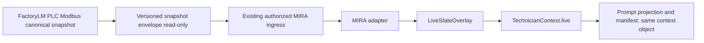

# PRD — MIRA × FactoryLM Phase 1: Read-Only Machine Evidence Handoff

**Status:** Ready to build
**Objective:** Make FactoryLM's canonical PLC snapshot available to MIRA's existing audited technician context as read-only live evidence, without creating a second runtime schema, a second relay, or any plant-control capability.

## Product outcome

A technician asking MIRA about a machine can receive a grounded answer that uses FactoryLM's current canonical PLC values. The same live evidence must be present in:

1. the technician prompt projection;
2. the `TechnicianContext` manifest/audit payload; and
3. the deterministic evidence rendering path.

The system must remain safe if no snapshot is available, stale, malformed, unauthorized, or unavailable.



## Scope

Build the first vertical slice only:

- FactoryLM emits a versioned, canonical, read-only machine snapshot.
- MIRA converts the snapshot into the existing `LiveStateOverlay`.
- MIRA adds the overlay to the existing `TechnicianContext.live` field.
- MIRA renders and audits that same context object.
- Tests prove mapping, isolation, tenant-boundary behavior, fail-open diagnosis, and no duplicate live-data prompt blocks.

This work is intentionally split into independently reviewable PRs. Do not bundle FactoryLM bugs, transport changes, MIRA context changes, security remediation, CMMS SSO, training, or production deployment into one branch.

## Non-goals

Do not do any of the following in this phase:

- Create a new MIRA context schema, alternate evidence model, or second "agent brain."
- Add LangChain, a new orchestration framework, or new cloud dependencies.
- Write to PLCs, Modbus registers, SCADA, MES, CMMS, or the knowledge graph.
- Add a MIRA-side socket client that polls FactoryLM directly.
- Create an unauthenticated HTTP endpoint, custom secret store, or committed `.env` file.
- Change FactoryLM's shared dirty checkout or overwrite an existing PR branch.
- Rework MIRA PR #3046, merge PRs, deploy to production, or rotate credentials.
- Implement FactoryLM CMMS SSO remediation (#192), MIRA security work (#2989/#3038), LoRA training, recovery flows, or visual/spatial evidence work.
- Promote candidate UNS paths to confirmed asset identity automatically.

## Existing architecture to preserve

MIRA already has the canonical evidence spine:

- `materialized_evidence/context_contract.py`
  - `LiveTag`
  - `LiveStateOverlay`
  - `TechnicianContext.live`
  - `live_overlay_from_machine_packet(packet)`
- `mira-bots/shared/technician_context.py`
  - `build_turn_context(...)`
  - `manifest_of(...)`
  - prompt projection helpers
- `mira-bots/shared/engine.py`
  - `_build_prior_decisions_context(...)`
  - `_context_manifest` carrier, which ensures the audited manifest represents the same context used for prompting
- `mira-bots/shared/live_snapshot.py`
  - read-only snapshot normalization and rendering

FactoryLM already has canonical PLC work to reuse:

- Existing draft PR #188, “Map PLC canonical tags for Hub UNS”
- `services/plc-modbus/src/factorylm_plc/modbus_tag_source.py`
  - `canonical_tag_name(...)`
  - `canonical_tags_from_snapshot(...)`
  - `ModbusTagSource.tick()`
- Existing canonical tag vocabulary includes:
  - `conv_simple.motor_run`
  - `conv_simple.vfd_speed_hz`
  - `conv_simple.vfd_current_amps`
  - `conv_simple.fault_code`
  - `conv_simple.comm_ok`
  - `conv_simple.height_sensor_mm`
  - `conv_simple.sort_divert_active`

**Doctrine:** ADR-0033 remains authoritative: one technician policy, many typed evidence producers. FactoryLM is an evidence producer, not a parallel MIRA runtime.

## Required preflight

Before editing code:

1. Read both repositories' `AGENTS.md`, MIRA `wiki/hot.md`, ADR-0033, and the MIRA unification PRD.
2. Fetch both remotes and compare every work branch against `origin/main`.
3. Do not use `/Users/charlienode/factorylm` for edits if it remains dirty or user-owned. Create a fresh worktree from `origin/main`.
4. Inspect live GitHub state before relying on prior PR claims:
   - MIRA #3046 is an incident/recovery dependency for live proof. Do not edit its branch.
   - FactoryLM #188 is an old draft; inspect and rebase before treating it as current.
   - FactoryLM #161 is a separate PLC-model correctness defect. Fix it independently before relying on affected VFD fields.
5. Search both repositories for an existing authenticated MIRA ingress for equipment status, relay data, or MQTT snapshots. Reuse it if it can carry this data safely.
6. If no existing ingress supports this payload, stop after the contract and fixture PRs. Report the gap; do not create a second relay or an unauthenticated endpoint.

Use fresh branches such as:

- `codex/mira-factory-snapshot-contract`
- `codex/factory-plc-snapshot-contract`
- `codex/mira-factory-snapshot-ingress`
- `codex/mira-factory-live-context`

Do not push, open PRs, merge, deploy, change GitHub labels, or modify production configuration without explicit approval.

## Contract: `factorylm.machine-snapshot.v1`

Create one shared JSON fixture and specification. The fixture is the compatibility boundary between repositories; both projects must test against the exact same payload.

```json
{
  "schema_version": "factorylm.machine-snapshot.v1",
  "snapshot_id": "uuid-or-stable-source-id",
  "source_system": "factorylm-plc-modbus",
  "captured_at": "2026-08-01T12:00:00Z",
  "tenant_id": "required-mira-tenant-id",
  "asset": {
    "source_record_id": "factorylm-machine-id",
    "proposed_uns_path": "Enterprise/Site/Area/Line/conv_simple"
  },
  "machine_state": "running",
  "active_conditions": [],
  "tags": [
    {
      "tag_path": "conv_simple.vfd_speed_hz",
      "value": 32.5,
      "quality": "good",
      "observed_at": "2026-08-01T12:00:00Z"
    }
  ],
  "provenance": {
    "gateway_id": "edge-gateway-id",
    "source_snapshot_ref": "source-specific-opaque-reference"
  }
}
```

### Contract rules

- `schema_version`, `snapshot_id`, `captured_at`, `tenant_id`, and `tags` are required.
- `tenant_id` must be authenticated and authorized by the existing ingress. Never default it, infer it, or accept it from an untrusted caller without validation.
- `tag_path` must be a canonical FactoryLM tag name; raw register numbers and arbitrary caller-defined paths are rejected or recorded as unknown, never silently remapped.
- `quality` must normalize to MIRA's existing live quality/freshness vocabulary.
- `proposed_uns_path` is provenance only. It is not a confirmed MIRA asset identity and must not create or mutate a KG/UNS record.
- Preserve source timestamp and provenance. Do not invent freshness.
- Invalid input produces no live overlay for that turn; diagnosis must still answer normally.
- The payload contains observation data only. No command, write, actuator, or control field is permitted.

## Work packages and PR boundaries

### PR 1 — MIRA contract adapter and shared fixtures

**Goal:** Accept the versioned FactoryLM envelope in pure Python and convert it to the existing `LiveStateOverlay`.

Implement:

- A small pure adapter adjacent to `live_overlay_from_machine_packet(...)` in `materialized_evidence/context_contract.py`.
- The adapter validates `factorylm.machine-snapshot.v1`, constructs the existing MachineContextPacket-compatible shape, and then reuses `live_overlay_from_machine_packet(...)`.
- Do not duplicate `LiveTag`, freshness mapping, or rendering logic.
- Add a shared fixture under a neutral contract/fixture location that FactoryLM can consume unchanged.
- Add a companion invalid fixture for missing tenant, missing timestamp, invalid schema version, and malformed tags.
- Extend `build_turn_context(...)` with an optional, explicitly supplied live packet/overlay input. It must populate the existing `TechnicianContext.live` field only after validation.

Acceptance tests:

- Good snapshot maps canonical tags, state, timestamp, quality, and active conditions correctly.
- Stale/unknown quality does not become `good`.
- Invalid/missing fields result in no live overlay and a non-fatal violation.
- Manifest includes the same `live` payload used to render the prompt.
- With the contract flag off, current behavior is byte-for-byte unchanged.
- No network calls, hardware handles, or fieldbus writers are imported or invoked.

### PR 2 — FactoryLM canonical-source correctness

**Goal:** Make FactoryLM's canonical snapshot source reliable before any handoff.

Implement only after inspecting the current state of FactoryLM issue #161 and PR #188:

- Fix #161 as an isolated bug-fix PR if named VFD/register data is actually missing from the current source model.
- Rebase and test the canonical mapping work from #188 in a clean branch/worktree.
- Generate `factorylm.machine-snapshot.v1` from canonical tag output; do not publish it remotely yet.
- Validate that the shared MIRA fixture can be generated/consumed without semantic changes.

Acceptance tests:

- A normal snapshot produces all required canonical tags.
- A faulted/comms-lost snapshot preserves `fault_code` and `comm_ok=false`.
- Tag names, values, timestamps, and quality are deterministic.
- The FactoryLM-produced fixture exactly matches the MIRA consumer contract.
- No write-capable Modbus method is called in the snapshot path.

### PR 3 — Existing-ingress integration only

**Goal:** Deliver the envelope through an existing, authorized MIRA transport.

First locate the established relay, equipment-status, or MQTT ingress. If there is no suitable existing path, stop and produce a short decision report with the discovered candidates and exact blocker.

If a suitable ingress exists:

- Add the smallest authenticated, tenant-scoped route/topic mapping required for this envelope.
- Use existing Doppler-managed credentials and existing authorization patterns.
- Rate-limit/deduplicate snapshots using existing project conventions.
- Preserve snapshot metadata without adding a new general-purpose persistence system.
- Do not connect the MIRA diagnosis engine directly to FactoryLM.

Acceptance tests:

- Authorized simulated FactoryLM publisher succeeds.
- Wrong-tenant or unauthorized publisher is denied.
- Malformed payload is rejected without affecting live diagnosis.
- Duplicate snapshot behavior is deterministic.
- No secrets are logged.
- No plant writes occur.

### PR 4 — MIRA live-context serving path

**Goal:** Make received FactoryLM evidence visible in the technician's single context path.

Implement:

- Wire the accepted snapshot from the established ingress/state carrier into `build_turn_context(...)`.
- Use `TechnicianContext.live`; do not add a competing “FactoryLM context” prompt block.
- Preserve the existing legacy `_build_live_data_context(...)` behavior when no FactoryLM overlay exists.
- When the FactoryLM overlay is present, ensure the answer does not render a duplicate or contradictory legacy live-data block.
- Keep the path flag-gated and fail-open: any intake or contract error returns an ordinary answer without live evidence.

Acceptance tests:

- Flag off: no behavior change.
- Flag on with a valid snapshot: prompt and `_context_manifest` contain the same live overlay.
- Flag on with no snapshot, stale snapshot, or invalid snapshot: normal diagnosis still completes.
- A FactoryLM snapshot does not create duplicate `[LIVE EQUIPMENT STATUS]` content.
- Decision-trace/audit manifest hash changes only when the actual context changes.

### PR 5 — Controlled integration proof

This is a separate verification PR/runbook update, not an implementation bundle.

Required proof:

1. FactoryLM simulated canonical snapshot.
2. Existing authorized MIRA ingress accepts it.
3. MIRA builds `TechnicianContext.live`.
4. Prompt projection and saved manifest agree.
5. A diagnostic answer uses the live evidence with timestamp/quality caveats.
6. A malformed/unauthorized/stale control case fails safely.
7. No external PLC, CMMS, KG, or control write occurs.

Do not call this “production proven” until MIRA #3046 is resolved, the relevant branches are current with `origin/main`, required CI is green, and a supervised live probe succeeds.

## Global engineering constraints

- Follow MIRA's Apache/MIT-only dependency rule and existing container/deployment conventions.
- Secrets are Doppler-managed only; never inspect, print, commit, or copy secrets.
- Use TDD: add a failing focused test, run it, implement the minimum change, rerun focused tests, then run the relevant suite.
- Keep commits conventional and small.
- Before any new helper or module, search both repositories and `origin/main` for equivalent code.
- Preserve separation between read-only evidence capture and human-approved plant/KG actions.
- Treat GitHub `DIRTY`, `BEHIND`, missing checks, or stale green checks as not merge-ready.
- Run one deployment-affecting change at a time. Re-check live state after deployment; back-to-back MIRA deploy smokes can collide.

## Definition of done for Phase 1

Phase 1 is complete only when:

- A shared v1 fixture passes in both repositories.
- FactoryLM emits canonical, read-only snapshot data.
- MIRA maps it into the existing `TechnicianContext.live`.
- Prompt and audit manifest reflect one identical context object.
- Invalid, stale, unauthorized, and absent data fail safely without preventing a diagnosis.
- Focused tests and relevant suites pass from fresh branches based on current `origin/main`.
- The integration proof is documented, reproducible, and does not overstate production verification.

## Required handoff after each PR

Report:

- exact base/head commits;
- changed files and reason for each;
- tests run and their results;
- live GitHub merge/check status;
- any dependency still blocked; and
- whether the PR is code-ready, integration-ready, or live-proven.

Do not describe a branch as merge-ready unless it is current with `origin/main`, non-draft, has required checks, and has no unresolved deployment or integration blocker.
