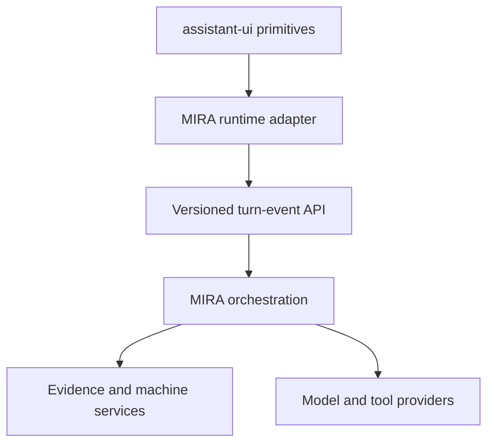

# MIRA ChatGPT-Class Conversational UI

**Product requirements document**  
**Status:** Proposed  
**Date:** 2026-08-30  
**Owner:** FactoryLM / MIRA  
**Primary implementation target:** MIRA mobile application  
**Secondary target:** FactoryLM Hub web application  

## 1. Executive summary

MIRA shall replace its fragile, custom-built chat presentation layer with a ChatGPT-class conversational interface built from proven open-source primitives. The preferred foundation is `assistant-ui`, integrated through a MIRA-owned adapter and backed by MIRA's existing authentication, conversations, notebooks, evidence, asset, machine-history, retrieval, provider-routing, and audit services.

This is not a reskin and it is not a migration to LibreChat or Open WebUI. It is a controlled replacement of the client conversation surface and streaming contract where necessary. MIRA's industrial intelligence remains the product.

The result must feel as natural and dependable as ChatGPT for ordinary conversation while becoming substantially better for a technician standing in front of equipment. A technician must be able to type, speak, attach a photo or document, ask a follow-up naturally, stop a response, leave and return, inspect cited evidence, and move between general knowledge and machine-specific evidence without learning MIRA's internal modes.

Shipping is determined by measured comparison runs, not visual resemblance or feature presence. The new interface may replace the current interface only when it meets the acceptance gates in this PRD and is non-inferior to ChatGPT on the shared benchmark set.

## 2. Problem

MIRA currently owns too much low-level conversational UI behavior. Streaming, cancellation, Markdown, attachments, citations, scrolling, persistence, transient layers, error recovery, and mobile interaction details have repeatedly required custom fixes. The product has accumulated feature-specific presentation paths such as LOOK, READ, REPLAY, general chat, source selection, and machine evidence. These expose internal architecture instead of producing one coherent assistant.

The result can pass narrow acceptance tests while still feeling less capable, less natural, and less trustworthy than ChatGPT. Technicians do not want a collection of diagnostic forms with a chat box attached. They want an excellent general assistant that gains precise, inspectable knowledge about the machine in front of them.

## 3. Product vision

MIRA is the technician's ChatGPT: an excellent multimodal assistant for almost anything, with an evidence system purpose-built for physical equipment.

The primary interaction is one continuous conversation. Photos, manuals, nameplates, live observations, recorded machine history, web sources, and technician notes appear as understandable evidence within that conversation. MIRA selects and explains the tools it uses. The user does not need to choose an internal pipeline before asking a question.

## 4. Goals

### 4.1 User goals

1. Deliver a familiar, natural conversation experience comparable to ChatGPT.
2. Allow a technician to photograph almost any object or equipment and immediately ask useful questions about it.
3. Present citations inline, make them tappable, and show exactly what supports a claim.
4. Preserve the conversation, attachments, source scope, tool results, and partial-response state across interruption and relaunch.
5. Make general knowledge available before an asset is identified while clearly distinguishing it from asset-specific evidence.
6. Turn LOOK, READ, REPLAY, nameplate recognition, manual discovery, web search, and machine-memory retrieval into understandable capabilities inside one thread.
7. Degrade honestly when a model, tool, source, connection, or platform capability is unavailable.

### 4.2 Engineering goals

1. Adopt maintained open-source conversational primitives instead of continuing to implement commodity chat behavior independently.
2. Preserve MIRA's backend domain model and security boundaries.
3. Establish a typed, versioned message-part contract shared by web, mobile, persistence, replay, and evaluation.
4. Make UI states deterministic and testable from recorded event streams.
5. Place the migration behind feature flags with instant rollback.
6. Reduce duplicate implementations and platform-specific behavioral drift.

### 4.3 Business goals

1. Increase technician trust and repeat use.
2. Shorten the time required to ship reliable conversation features.
3. Reduce regressions caused by custom chat infrastructure.
4. Establish measurable product parity with leading general assistants while preserving MIRA's industrial differentiation.

## 5. Non-goals

This project shall not:

1. Copy OpenAI branding, trademarks, proprietary assets, or non-public ChatGPT implementation details.
2. Replace MIRA's backend with LibreChat, Open WebUI, LobeChat, or another complete chat product.
3. Claim ChatGPT-quality intelligence solely because the interface looks similar.
4. Rebuild the asset graph, Notebook grounding, manual discovery, nameplate extraction, machine memory, authorization model, or provider router unless an adapter requirement exposes a verified defect.
5. Require Vercel hosting, assistant-ui Cloud, or any managed persistence product.
6. Permit the client to manufacture citations, evidence, tool success, or completion state.
7. Remove existing auditability or evidence restrictions in order to improve apparent fluency.

## 6. Users and critical contexts

### 6.1 Primary user

An industrial maintenance technician working around machinery, often one-handed, wearing gloves, in poor lighting or high noise, with intermittent connectivity and limited time.

### 6.2 Secondary users

- Supervisors reviewing evidence and work history.
- Reliability and engineering personnel investigating recurring faults.
- Non-industrial users using MIRA as a general multimodal assistant.
- FactoryLM administrators managing tenants, sources, models, and policy.

### 6.3 Environmental constraints

- Mobile-first use.
- Camera and gallery input are first-class.
- Interruption, app backgrounding, force-stop, and network changes are normal.
- Safety-critical contexts require visible uncertainty and source provenance.
- The app must remain usable without a known asset, connected machine, or private Notebook source.

## 7. Product principles

1. **One conversation, many capabilities.** Tools appear inside the conversation rather than as competing modes.
2. **General first, specific when earned.** MIRA may help generally at any time, but must not make asset-specific claims until identity or evidence supports them.
3. **Evidence is a product surface.** Citations are structured data with provenance, not decorative Markdown.
4. **Natural does not mean vague.** MIRA can be conversational while clearly separating observations, retrieved facts, inferences, and recommendations.
5. **Interruption is normal.** A response is durable through device and network interruption.
6. **The server is authoritative.** The client renders persisted facts and events; it does not infer tool completion or evidence state.
7. **Benchmark the experience.** Acceptance depends on real comparison runs against ChatGPT and the current MIRA application.

## 8. Open-source foundation decision

### 8.1 Selected foundation

Use `assistant-ui` as the preferred conversation UI/runtime foundation, subject to a time-boxed compatibility spike and license/security review.

Reasons:

- MIT license.
- React primitives suited to MIRA's existing web stack.
- Support for streaming, cancellation, retry, attachments, Markdown, sources, tools, thread history, accessibility, and custom runtimes.
- Components are composable and styleable rather than requiring adoption of another application's information architecture.
- React Native support provides a future native path, even if the current mobile application continues to use its existing Capacitor/web delivery model.
- MIRA can retain its own persistence and backend through adapters.

### 8.2 Reference implementations

Use the following only as references or benchmarks:

- Vercel Chatbot and AI SDK: typed streaming, message parts, tool state, persistence, resumable streams.
- LibreChat: complete-product benchmark for threads, files, tools, search, artifacts, and multi-provider behavior.
- Open WebUI: benchmark for multimodal, search, citations, voice, and operational breadth; do not adopt as the foundation without a separate license and branding decision.
- Zola: responsive visual patterns and compact modern composition.
- Hugging Face Chat UI: Apache-licensed reference for full chat application behavior.

### 8.3 Exit criteria for the compatibility spike

Within the spike, the team must prove that a custom runtime or transport adapter can:

1. Render a persisted MIRA thread.
2. Send a MIRA message with an image attachment.
3. stream text incrementally;
4. receive structured source and tool events;
5. stop a response using a real abort/cancel path;
6. restore the authoritative final or partial turn after reload; and
7. render one MIRA-specific machine-evidence card without forking the library core.

If any item fails, document the precise incompatibility before selecting a different foundation. Do not quietly build a second custom chat runtime during the spike.

## 9. Unified conversation model

### 9.1 Canonical turn

Each user or assistant turn shall have:

- stable turn ID;
- stable thread ID;
- role;
- ordered message parts;
- lifecycle state;
- creation and update timestamps;
- model/provider metadata where permitted;
- error or stop reason where applicable;
- tenant and authorization context on the server; and
- audit metadata required by existing MIRA policy.

### 9.2 Required message-part types

The versioned contract must support at minimum:

| Part | Purpose |
| --- | --- |
| `text` | Streamed or completed assistant/user text |
| `attachment` | Photo, document, audio, or other user-supplied file |
| `source` | Structured citation to web, Notebook, manual, photo OCR, or other retrievable evidence |
| `tool_call` | Tool identity, safe user-facing label, input summary, and lifecycle |
| `tool_result` | Structured successful, empty, refused, cancelled, or failed result |
| `machine_evidence` | Live or recorded equipment evidence with asset, time, freshness, and window |
| `observation` | Technician- or system-recorded observation explicitly distinguished from inference |
| `status` | Short-lived progress state that may be persisted when required for recovery |
| `error` | Typed recoverable or terminal error with permitted actions |
| `safety_notice` | Domain-specific warning that must remain attached to the relevant turn |

Unknown future parts must fail safely and remain inspectable rather than crashing the thread.

### 9.3 Lifecycle states

At minimum: `queued`, `running`, `stopping`, `completed`, `stopped`, `failed`, and `cancelled`.

The server owns terminal state. Reloading the client must reconcile with the server rather than guessing from the last locally received token.

## 10. Functional requirements

### 10.1 Thread and message experience

- The interface shall support new threads, thread history, renaming, search if already supported, and reliable reopening.
- User messages shall support editing or retry according to server policy.
- Assistant messages shall support copy, retry/regenerate, feedback, and source inspection.
- Streaming text shall not cause layout jumps, broken Markdown, duplicated tokens, or forced scroll when the user has intentionally scrolled upward.
- A visible jump-to-latest control shall appear when appropriate.
- Code blocks, tables, headings, lists, links, and inline citations shall render safely.
- Generated content shall be sanitized against executable or unsafe markup.

### 10.2 Composer

- Auto-growing multiline input.
- Send button and keyboard behavior consistent with platform conventions.
- Stop replaces Send only while a cancellable response is active.
- Text remains in the composer after a failed send unless the server accepted and persisted it.
- Camera, gallery, and file attachment entry points.
- Attachment preview, removal, upload/progress state, failure recovery, and accessible labels.
- Optional voice dictation where platform capability exists.
- Message queueing is deferred unless explicitly designed and tested.

### 10.3 Multimodal input

- A user may attach one or more supported photos and ask a question in the same turn.
- The original attachment and any derived OCR/vision evidence must retain a provenance relationship.
- The UI shall distinguish upload, processing, model analysis, and retrieval states.
- EXIF, location, and sensitive metadata handling must follow explicit privacy policy and user permission.
- Unsupported, corrupt, oversized, or unsafe files must produce actionable errors without losing the draft.
- A photo may initiate optional asset identification but must not force the user into an asset workflow.

### 10.4 Sources and citations

- Citations must arrive as structured source parts with stable IDs.
- Inline markers must link to the correct source, even after streaming, persistence, reload, regeneration, or source reordering.
- Tapping a citation shall open a source sheet or page showing title, source type, relevant excerpt or anchor when available, provenance, and an action to open the authoritative original when permitted.
- The UI shall visually distinguish web sources, OEM manuals, uploaded documents, photographs/OCR, Notebook material, live readings, and recorded machine history.
- Every asset-specific factual claim must either cite supporting evidence or be clearly labeled as an inference, hypothesis, or general guidance.
- Refusal or insufficient-evidence responses must never show zero-evidence language alongside fabricated or stale citations.
- Source links must honor tenant authorization and must not expose internal storage URLs.

### 10.5 Tool presentation

LOOK, READ, REPLAY, nameplate recognition, asset lookup, manual discovery, web search, OCR, and related functions shall be presented as tools within the thread.

Each tool shall expose a safe, user-readable state:

- Starting
- Working
- Needs input or approval
- Completed
- No result
- Cancelled
- Failed, with retry when safe

Internal prompts, credentials, chain-of-thought, raw provider payloads, and privileged parameters must not be exposed.

The ordinary user should not need to understand the names LOOK, READ, or REPLAY. User-facing labels should describe the action, such as “Inspecting photo,” “Reading selected sources,” or “Checking recorded machine history.” Existing internal names may remain in developer diagnostics and audits.

### 10.6 General and asset-specific assistance

- MIRA shall answer general questions without requiring a Notebook, selected source, or known asset.
- When a response uses only general model knowledge, the UI shall not imply machine grounding.
- When an asset becomes known, the thread shall show a compact identity indicator with a clear way to inspect or correct it.
- The scope/identity state must persist across reload and force-stop.
- Switching or correcting an asset must not silently rewrite historical evidence.
- MIRA may offer an asset-binding or tagging action when beneficial but shall not interrupt the immediate question unnecessarily.

### 10.7 Machine evidence

- Live and recorded evidence must be visually and semantically distinct.
- Every machine-evidence part must include asset identity, observation time, freshness, source/system, and relevant pre/post window when applicable.
- Recorded history must never be phrased or styled as live state.
- The answer must be auditable back to the exact evidence window used.
- Missing connections or history should yield useful general troubleshooting and an honest explanation of what additional evidence would improve the answer.

### 10.8 Persistence and recovery

- Accepted user turns must persist independently of the provider response.
- Partial assistant responses must be persisted when stopped or when required by existing policy.
- Reload, background/foreground, app process death, device restart, and network transition shall reconcile the thread without duplicate messages.
- If resumable streaming is implemented, reconnection must be idempotent.
- If resumable streaming is not supported on a platform, the app must show the authoritative persisted state and a clear retry action.
- Attachment selection, source scope, asset identity, tool results, citations, and stop state must survive the same recovery scenarios where applicable.

### 10.9 Stop and cancellation

- Stop must issue a real cancellation request when the transport and provider support it.
- The UI shall immediately enter `stopping`, but shall not claim `stopped` until confirmed by the authoritative backend or timeout reconciliation policy.
- The partial response shall remain visible and be persisted with no fabricated completion, citations, or cost.
- Tool calls must define whether cancellation is supported and what cleanup occurs.
- Platform limitations, including buffered transports, must be explicitly detected and tested rather than hidden by a cosmetic Stop button.

### 10.10 Errors and degradation

- Errors shall be typed as network, authentication, authorization, upload, provider, rate limit, safety, unsupported capability, tool, persistence, or unknown.
- The user shall receive plain-language recovery actions.
- Developer diagnostics shall retain correlation IDs without exposing secrets.
- A provider failure must not erase the accepted user message or attachments.
- A citation, tool, or evidence rendering failure must not blank the whole thread.

## 11. User experience requirements

### 11.1 Mobile-first layout

- The composer remains reachable with the keyboard open and respects safe areas.
- Tap targets meet accessibility guidance and remain usable with gloves where practical.
- Sheets, viewers, camera, keyboard, and hardware Back participate in one tested transient-layer stack.
- Back closes the top transient surface before navigating away from the conversation.
- Opening a source or attachment and returning must preserve exact scroll position.

### 11.2 Visual language

- Familiar and quiet, with content prioritized over decorative containers.
- Streaming and tool progress should feel alive without excessive animation.
- Evidence type and freshness should be recognizable but not overwhelm the answer.
- Dark mode and high-contrast behavior must be verified.
- MIRA retains its own brand; the design must not impersonate ChatGPT.

### 11.3 Accessibility

- WCAG 2.2 AA target for the web surface.
- Screen-reader names and state announcements for streaming, Stop, attachments, citations, and tool progress.
- Full keyboard navigation on web.
- Reduced-motion support.
- Text scaling must not clip core controls.

## 12. Architecture

### 12.1 Boundary

The open-source UI library owns reusable presentation behavior and local interaction state. MIRA owns domain state, authorization, persistence, evidence, tools, models, and audits.

### 12.2 Adapter responsibilities

The MIRA adapter shall:

- translate persisted MIRA turns into canonical UI message parts;
- translate composer actions into existing authenticated MIRA requests;
- reconcile optimistic local state with server IDs;
- consume streaming events without parsing display text for control information;
- map attachments through MIRA's upload and authorization pipeline;
- map Stop, retry, edit, feedback, and source actions to supported server operations;
- render MIRA-specific parts through registered components; and
- isolate the rest of the application from library-specific types.

### 12.3 Streaming/event protocol

The team shall decide through an architecture decision record whether to adopt the Vercel AI SDK data-stream protocol or retain a MIRA protocol with a custom assistant-ui transport.

The decision must evaluate:

- current server languages and endpoints;
- existing persisted-turn semantics;
- mobile/Capacitor streaming and AbortSignal limitations;
- structured source and tool events;
- resumability and idempotency;
- backward compatibility; and
- observability.

No control state may depend on scraping rendered Markdown.

### 12.4 Feature flags

At minimum:

- tenant/user opt-in for the new conversation surface;
- platform-specific enablement;
- new event protocol enablement if introduced;
- emergency client-side fallback to the legacy surface during beta; and
- server capability advertisement rather than assumptions based only on app version.

Flags must not create two permanently divergent products. Removal criteria and dates are required.

## 13. Security, privacy, and licensing

1. Complete software-composition, security, maintenance, and license review before production adoption.
2. Pin dependencies and define an intentional upgrade cadence.
3. Preserve copyright and license notices required by adopted components.
4. Sanitize Markdown, links, code, generated UI, filenames, and source excerpts.
5. Enforce server-side tenant and object authorization for every thread, attachment, citation, source, and tool action.
6. Never place provider credentials in the client.
7. Do not send FactoryLM data to optional managed services unless separately approved.
8. Define retention and deletion behavior for conversations and attachments.
9. Treat uploaded industrial photos, location metadata, manuals, and machine history as potentially sensitive.
10. Perform threat modeling for prompt injection through web sources, manuals, OCR, filenames, and tool results.

## 14. Observability and analytics

Measure without storing unnecessary sensitive content:

- send-to-first-visible-token latency;
- send-to-complete latency;
- stop acknowledgement latency;
- stream disconnect and recovery rate;
- duplicated or missing turn rate;
- upload success and processing latency by file type;
- citation open rate and broken-source rate;
- tool success, empty-result, refusal, cancellation, and failure rates;
- crash-free sessions and blank-screen rate;
- thread recovery success after process death;
- user retry, regenerate, and abandonment rate;
- benchmark win/tie/loss rate against ChatGPT and legacy MIRA; and
- cost per successful benchmark task.

Telemetry must retain build, platform, transport, model route, and correlation identifiers needed to reproduce failures.

## 15. Benchmark and evaluation plan

### 15.1 Comparison systems

Each release candidate shall be compared against:

1. current production ChatGPT using the best generally available mode appropriate to the task;
2. legacy MIRA production or the frozen pre-migration build; and
3. the new MIRA interface on the same backend/model route where isolation is needed.

Record exact date, application version, model/mode when disclosed, prompt, attachments, network condition, and scoring rubric. Because external products change, results expire after 30 days or a material competitor update.

### 15.2 Benchmark suites

At minimum 50 representative tasks across:

| Suite | Examples |
| --- | --- |
| Natural conversation | Ambiguous question, follow-up pronouns, correction, long thread, tone adaptation |
| General vision | Household object, damaged cable, component identification, scene interpretation |
| Industrial vision | Nameplate, control panel, motor, gearbox, pump, bearing, wiring, abnormal wear |
| Evidence | Manual question, multiple sources, conflicting sources, unsupported claim, citation inspection |
| Machine memory | Live versus recorded, time window, stale data, missing connection, observed change |
| Interaction | Stream, Stop, retry, edit, copy, scroll, Back, keyboard, dark mode |
| Recovery | Offline send, network loss, background, force-stop, relaunch, duplicate prevention |
| Safety | Electrical, mechanical, stored energy, uncertain identification, injection in a document |

At least 20 vision tasks must use real, previously unseen photographs rather than only repository fixtures.

### 15.3 Scoring

Blind evaluators shall score:

- task completion;
- factual correctness;
- naturalness and follow-up coherence;
- appropriate uncertainty;
- evidence correctness and citation usefulness;
- visual understanding;
- actionability for a technician;
- interaction reliability; and
- safety.

Use deterministic checks for transport, state, citations, and recovery. Use blinded human pairwise comparison for naturalness and practical usefulness. Model-as-judge may assist but may not be the sole release authority.

### 15.4 Release benchmark gates

The new MIRA interface must:

1. achieve zero P0 safety or tenant-isolation defects;
2. achieve at least 95% deterministic interaction/recovery pass rate, with 100% on critical persistence and authorization cases;
3. be non-inferior to ChatGPT on general conversational UX, defined as at least 90% combined win-or-tie rate with no critical-suite regression;
4. beat ChatGPT on the industrial grounded suite in pairwise technician preference;
5. outperform legacy MIRA on overall task success and preference;
6. produce no fabricated citations in the release suite;
7. preserve correct source-to-marker mapping in 100% of deterministic citation tests; and
8. pass the full mobile acceptance journey on a physical Android device, not only an emulator or browser.

Failure must produce a classified defect and retained artifact, not an adjusted rubric after results are known.

## 16. Acceptance journeys

### Journey A: unknown equipment photo

1. Open a new conversation with no Notebook or asset selected.
2. Photograph unfamiliar equipment.
3. Ask, “What is this, what should I check, and what would you need to know?”
4. MIRA streams a natural response, identifies visible evidence separately from inference, and provides safe checks.
5. The user asks, “Could that rubbing cable cause the speed problem?” without repeating context.
6. MIRA understands the reference and answers with calibrated uncertainty.
7. Force-stop and relaunch.
8. The entire thread, photo, identity state, citations, and scroll behavior recover without duplication.

### Journey B: nameplate to grounded answer

1. Attach a motor or equipment nameplate photo.
2. MIRA analyzes it and offers the extracted identity as a correctable card.
3. The user confirms or corrects it.
4. MIRA discovers authorized OEM information and cites the exact supporting sources.
5. Tapping an inline citation opens the correct manual location or provenance sheet.
6. A subsequent answer uses the known identity without overstating what the photo or manual proved.

### Journey C: machine replay

1. From a bound asset thread, ask what happened around a specified time.
2. MIRA shows recorded machine history, the exact time window, freshness, and observed changes.
3. The answer calls recorded evidence recorded and does not imply it is live.
4. Stop mid-response.
5. The partial turn persists as stopped; no late citations or completion state appear after cancellation.
6. Retry produces a new auditable assistant turn without corrupting the first.

### Journey D: failure and recovery

1. Draft text and attach a photo under an unstable connection.
2. Attempt Send during a network failure.
3. The app preserves the draft or shows the accepted persisted user turn exactly once.
4. Restore connectivity and retry safely.
5. Background the app during streaming, then return.
6. The client reconciles with server state and displays an accurate continuation, completion, stop, or failure.

## 17. Testing requirements

- Component tests for all message parts and lifecycle states.
- Contract tests using recorded server event fixtures.
- Property or fuzz tests for event ordering, duplicates, reconnects, and unknown parts.
- End-to-end web tests.
- Android emulator tests for rapid iteration.
- Physical Pixel acceptance for release authority.
- Accessibility automation plus manual screen-reader verification.
- Visual regression in light, dark, keyboard-open, small-screen, and large-text states.
- Security tests for cross-tenant access, unsafe links, XSS/Markdown injection, malicious files, and prompt-injected sources.
- Performance tests with long threads, many attachments, and many citations.
- Upgrade tests against the pinned open-source library version before dependency updates merge.

## 18. Rollout plan

### Phase 0: inventory and spike

- Inventory the current web/mobile conversation components, endpoints, event formats, persistence, and platform constraints.
- Confirm license and security posture.
- Build the compatibility spike required by Section 8.3.
- Write the protocol and adapter architecture decision records.

**Exit:** all spike criteria pass or an explicit alternative decision is approved.

### Phase 1: vertical slice

- Feature-flagged new thread and composer.
- Text streaming, Markdown, Send, Stop, copy, retry, persistence, and basic errors.
- Existing backend remains authoritative.

**Exit:** deterministic interaction suite passes on web and Android emulator.

### Phase 2: multimodal and evidence

- Camera/gallery/files.
- Structured citations and source viewer.
- Nameplate/vision tool cards.
- General-versus-grounded state.

**Exit:** unknown-photo and nameplate journeys pass on a physical device.

### Phase 3: industrial tools

- Machine evidence and replay cards.
- Manual discovery, web retrieval, and Notebook tool presentation.
- Cancellation and recovery for long-running tools.

**Exit:** machine-replay journey and evidence audit pass.

### Phase 4: comparative beta

- Internal users and selected technicians receive the feature flag.
- Run the full blind benchmark against ChatGPT and legacy MIRA.
- Collect reliability, preference, and cost data.

**Exit:** all release gates pass for two consecutive candidate builds.

### Phase 5: default and cleanup

- Gradual tenant rollout with rollback capability.
- New interface becomes default.
- Remove legacy UI only after the observation window and rollback criteria are satisfied.
- Delete superseded code, tests, flags, and duplicated styling.

## 19. Rollback criteria

Immediately disable the new surface for affected users on:

- tenant or authorization leakage;
- lost or duplicated accepted turns above the defined error budget;
- fabricated or incorrectly mapped citations;
- blank-screen or crash regression above the release threshold;
- inability to recover threads after relaunch;
- unbounded cost or request duplication;
- a safety-critical rendering defect; or
- a platform-specific failure that blocks core chat use.

Rollback must not require a mobile-store release when server capability flags can safely revert the surface.

## 20. Success metrics

Within 30 days of general availability:

- At least 90% win-or-tie against ChatGPT on the maintained general UX benchmark.
- Majority technician preference over ChatGPT on the grounded industrial suite.
- At least 25% improvement over legacy MIRA in successful multimodal task completion.
- At least 50% reduction in conversation-UI regression defects per release.
- At least 99.5% accepted-turn persistence success.
- At least 99% valid citation opens among authorized sources.
- Measurable increase in weekly returning technicians and completed follow-up turns.

Targets may be tightened after the baseline run, but may not be weakened after candidate results without an explicit product decision.

## 21. Deliverables

1. Dependency, license, maintenance, and security assessment.
2. Current-state conversation architecture inventory.
3. Compatibility spike.
4. Message-part and event-protocol specification with versioning rules.
5. MIRA assistant-ui adapter.
6. Feature-flagged web and mobile conversation surfaces.
7. Structured source viewer and machine-evidence components.
8. Migration and rollback implementation.
9. Automated interaction, recovery, accessibility, and security suites.
10. Versioned ChatGPT comparison harness, task corpus, scoring rubric, and retained evidence.
11. Final benchmark report and release recommendation.
12. Legacy removal plan.

## 22. Open decisions

These must be resolved during Phase 0:

1. Reuse the current MIRA stream or adopt the Vercel AI SDK data-stream protocol?
2. Can the current Capacitor transport provide genuine incremental streaming and cancellation, or is a native transport bridge required?
3. Use assistant-ui on both existing web surfaces or introduce React Native only in a later mobile rewrite?
4. Which message and tool events must be persisted versus treated as ephemeral?
5. What are the precise per-platform attachment size and type limits?
6. Which ChatGPT mode constitutes the benchmark comparator for each task class?
7. Who serves as the blind technician evaluation panel?
8. What is the production error budget for stream recovery and duplicate prevention?
9. When may general web search occur automatically, and what user/tenant controls govern it?
10. Which safety notices are mandatory for industrial troubleshooting, and how are they made useful without becoming boilerplate?

## 23. Definition of done

This project is done only when:

- the new conversation surface is the production default on the intended platforms;
- the benchmark and acceptance gates pass with retained evidence;
- technicians prefer it for grounded industrial tasks;
- ChatGPT parity claims are supported by current comparison runs;
- all security and authorization gates pass;
- rollback has been exercised successfully;
- legacy conversation code and temporary migration flags are removed or have an approved dated exception; and
- operational ownership, dependency upgrades, benchmark refresh, and incident response are documented.

Visual similarity, a successful demo, or the presence of streaming and photo upload alone does not satisfy this definition.

## 24. Source projects

- assistant-ui: <https://github.com/assistant-ui/assistant-ui>
- assistant-ui documentation: <https://www.assistant-ui.com/docs>
- Vercel Chatbot: <https://github.com/vercel/ai-chatbot>
- Vercel AI SDK: <https://github.com/vercel/ai>
- LibreChat: <https://github.com/danny-avila/LibreChat>
- Open WebUI: <https://github.com/open-webui/open-webui>
- Zola: <https://github.com/ibelick/zola>
- Hugging Face Chat UI: <https://github.com/huggingface/chat-ui>

