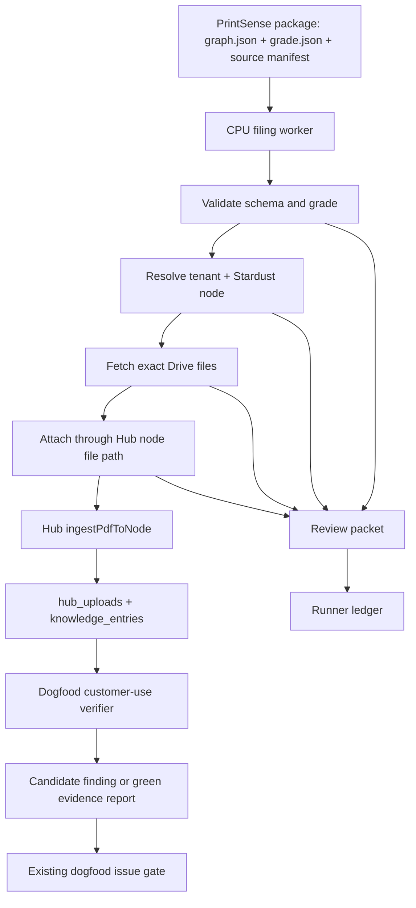

# Automated Agent Useful Work PRD

**Status:** Draft
**Date:** 2026-07-20
**Owner:** FactoryLM / MIRA
**Primary surfaces:** PrintSense, Hub namespace, approved source manifests, future Google Drive connector, dogfood runners, Dana/Linda ops agents, Celery CPU workers
**Related PRD:** `docs/product/dogfood-useful-work-prd.md`

## 1. Summary

Turn Dana, Linda, and the existing CPU-only automated runners into useful background workers that perform real customer work, generate evidence, and discover product bugs.

The first high-value workflow is Stardust Racers print filing:

1. PrintSense produces a `graph.json` artifact from an electrical print package.
2. A CPU worker reads the artifact, validates it, and identifies the likely Stardust Hub node.
3. The worker fetches exact approved source files. Google Drive file IDs remain a future connector seam until the project has an explicit approved cloud-source exception.
4. The worker attaches those files to the correct Hub namespace node.
5. MIRA indexes the documents through the existing node attachment path.
6. Dana/Linda create a concise review packet: what was filed, what is unresolved, what needs human verification, and what safety-sensitive items deserve attention.
7. Dogfood/browser agents verify that the attached documents are visible, searchable, and citable from the customer-facing Hub.

This is not a new autonomous-agent platform. It is a set of constrained work packs on top of existing runners, queues, Hub APIs, and proposal/review flows.

## 2. Problem

MIRA already has several scheduled workers:

- Dana morning brief runner.
- Linda safety alert runner.
- PM escalation runner.
- Dogfood judge and customer-use runner.
- Synthetic Hub persona runner.
- Celery ingest, freshness, historian, Google Drive, and synthetic dogfood tasks.
- Drive Commander scout.

The current weakness is that many scheduled agents either check narrow health signals or produce "all clear" summaries. They do not yet do enough real customer labor.

There is valuable CPU-suitable work waiting in the system:

- Filing drawing packages after PrintSense extracts structured JSON.
- Matching documents to Stardust assets and UNS nodes.
- Converting unresolved extraction items into retake/review checklists.
- Verifying that uploaded documents become citable from the right asset.
- Finding orphaned documents and proposing where they belong.
- Mining work orders and PMs for repeat-failure signals.
- Testing Hub flows as real customer personas.

If these agents only say "all good", they waste the automation budget and can hide real product failures. A useful green run should mean the worker completed a specific job and left auditable evidence.

## 3. Scope Classification

This work is **Core SaaS** when it covers:

- Manual, drawing, and datasheet ingestion.
- Component/profile proposals.
- Work-order and PM history mining.
- Knowledge graph proposals that remain human-reviewed.
- Customer-use dogfood verification.
- Demo/customer onboarding evidence preparation.

This work is **Adjacent but requires an explicit approval boundary** at the Google Drive connector:

- Google Drive access must be read-first and must be covered by an approved connector/ADR or updated project cloud policy before live network fetch is enabled.
- Every operation must be tenant-scoped.
- The worker must attach exact files by file ID or approved manifest when possible.
- Fuzzy Drive search may produce candidate matches but must not auto-attach unless confidence and tenant/path constraints are met.

This work must not become:

- Generic autonomous web browsing.
- SCADA/HMI control.
- PLC writes.
- CMMS replacement.
- Auto-verified knowledge graph promotion.
- Generic chatbot tasks disconnected from plant evidence.

## 4. Goals

1. Give Dana, Linda, and CPU workers useful work packs that operate on real MIRA artifacts.
2. Start with a concrete Stardust Racers PrintSense-to-Hub filing workflow.
3. Preserve trust boundaries: proposed facts stay proposed; verified facts require human action.
4. Make every worker output source-aware: what it inspected, what it changed, what it could not inspect, and where the evidence lives.
5. Use dogfood/browser agents to verify that backend work is actually useful to a customer in the Hub.
6. Produce actionable bug reports when work cannot be completed because the product is broken.
7. Reuse existing Hub, Celery, PrintSense, approved source manifests, runner ledger, and dogfood infrastructure.

## 5. Non-goals

- Do not build a generic multi-agent orchestration framework.
- Do not create a new document store parallel to Hub uploads and `knowledge_entries`.
- Do not use LangChain, n8n, TensorFlow, or any framework that abstracts MIRA's inference calls.
- Do not write directly to production NeonDB from local development sessions.
- Do not auto-promote `kg_relationships`, `relationship_proposals`, or PrintSense facts to verified.
- Do not infer live equipment state from drawings.
- Do not send commands to PLCs, SCADA systems, or HMI surfaces.
- Do not attach files to a tenant or node unless tenant scope is explicit.
- Do not let a runner report all-clear when a source was unavailable.

## 6. Existing Building Blocks

| Surface | Existing path | Reuse plan |
|---|---|---|
| PrintSense graph schema | `printsense/models.py` | Validate `graph.json` and trust states before filing |
| PrintSense CLI output | `printsense/README.md` | Watch output packages containing `graph.json`, `grade.json`, `brief.txt` |
| Stardust UNS seed | `tools/seeds/epic-universe-stardust-racers.sql` | Resolve candidate target nodes under `enterprise.celestial_park.stardust_racers` |
| Stardust QA runbook | `docs/runbooks/secret-shopper-testing-setup.md` | Respect tenant reality and account boundaries |
| Hub node file API | `mira-hub/src/app/api/namespace/node/[id]/files/route.ts` | Attach files where a human would attach them |
| Node PDF ingest | `mira-hub/src/lib/node-knowledge-ingest.ts` | Chunk PDFs into `knowledge_entries` and link to `hub_uploads.kg_entity_id` |
| Future Google connector seam | `mira-hub/src/app/api/picker/google/token/route.ts`, `mira-hub/src/lib/fetch-adapters.ts` | Reference for a later approved connector; not part of the first local filing worker |
| Google Drive Celery task | `mira-crawler/tasks/gdrive.py` | Reference only; current sync is too broad for asset-specific filing |
| Runner ledger | `mira-bots/agents/runner_ledger.py` | Record every useful-work run and unavailable source |
| Dogfood judge | `tools/crew/dogfood/judge.sh` | Keep as deterministic health/filing authority |
| Customer-use runner | `tools/crew/customer-use/runner.mjs` | Verify work through Hub UI |
| Synthetic workers | `tools/crew/run_synthetic_workers.sh` | Verify and promote reproducible discoveries |

## 7. Personas And Responsibilities

| Worker | Role | Allowed work | Not allowed |
|---|---|---|---|
| Dana | Maintenance manager / filing coordinator | Check package completeness, filing status, PM/work-order gaps, dashboard count consistency | Safety instructions, KG verification, destructive cleanup |
| Linda | Safety review watcher | Flag safety-sensitive docs, unresolved safety items, safety events, LOTO/e-stop/interlock mentions for review | Control advice, field procedure generation, "safe to operate" claims |
| Carlos | Technician dogfood persona | Verify attached docs are usable in the Hub, ask grounded questions, report UX failures | Backend attachment, tenant-wide cleanup |
| CPU filing worker | Backend clerk | Parse artifacts, resolve nodes, fetch exact files, attach documents, write review packets | Fuzzy unsafe attachment, tenant guessing, auto-verification |
| PM worker | Planner | Mine PM/work-order repeat patterns and propose review items | Replace CMMS, auto-schedule real maintenance without approval |
| Isolation worker | Privacy probe | Check tenant boundaries and wrong-tenant failure behavior | Access or mutate non-test tenants |

## 8. Primary Workflow: Stardust PrintSense Filing

### 8.1 Inputs

The filing worker consumes a PrintSense package directory containing:

- `graph.json`: typed PrintSynth graph.
- `grade.json`: deterministic import/quality verdict.
- `brief.txt`: technician-readable summary.
- Optional `map.txt`.
- Source file manifest with approved local paths. Google Drive file IDs may be carried as unresolved external source references until a live connector is approved.

The worker must not depend on raw screenshots being committed to git.

### 8.2 Validation

Before any attachment:

1. Load `graph.json` through the PrintSense model.
2. Confirm artifact schema version or compatible shape.
3. Confirm `grade.json` does not contain a hard failure that forbids filing.
4. Confirm package metadata exists or produce a needs-review result:
   - drawing number
   - cabinet or package name
   - sheet identifiers
   - project/location/customer fields when available
5. Confirm all facts remain in their PrintSense trust state. Filing a document does not verify the extracted facts.

### 8.3 Target Resolution

The worker resolves a Hub namespace node using a strict cascade:

1. Exact manifest-provided `tenant_id` and `node_id`.
2. Exact manifest-provided `tenant_id` and `uns_path`.
3. Tenant-scoped lookup by known Stardust paths:
   - `enterprise.celestial_park.stardust_racers.launch_1`
   - `enterprise.celestial_park.stardust_racers.launch_2`
   - `enterprise.celestial_park.stardust_racers.station_load`
   - `enterprise.celestial_park.stardust_racers.station_unload`
4. Candidate match from graph metadata such as drawing number, cabinet, sheet title, area, or asset tag.

Auto-attach is allowed only for levels 1-3. Level 4 creates a candidate review packet and stops.

### 8.4 Drive File Resolution

Preferred source:

- Explicit Google Drive file IDs in the manifest.

Fallback sources:

- Approved Drive folder plus exact filename match.
- Approved Drive folder plus checksum match.
- Approved Drive folder plus drawing number/cabinet match that yields one unambiguous result.

If Drive returns multiple candidates, no file is attached. The worker writes a review packet naming the candidates.

### 8.5 Attachment

For each approved file:

1. Fetch bytes from approved local source or an explicitly approved source connector.
2. Submit as the same multipart file upload a human would use on the Hub node file API, or call an internal service wrapper that preserves the same behavior.
3. Store direct upload metadata in `namespace_direct_uploads`.
4. For PDFs, let `ingestPdfToNode` create `hub_uploads` and `knowledge_entries`.
5. Capture returned upload IDs, chunk counts, warnings, and evidence paths.

### 8.6 Review Packet

Every run writes a review packet containing:

- Run ID and timestamps.
- Tenant ID and node ID/UNS path.
- Source artifact paths.
- Attached filenames and upload IDs.
- `knowledge_entries`/chunk count when available.
- PrintSense grade summary.
- Unresolved PrintSense items.
- Safety-sensitive terms or devices detected.
- Files not attached and why.
- Candidate external-source matches requiring human choice.
- Suggested next human review action.

## 9. Secondary Useful-Work Packs

### 9.1 Orphan Document Filing

Find Hub documents in an Inbox or unassigned state and propose a destination node.

Rules:

- Default mode is proposal-only.
- Auto-attach/move only when exact metadata or explicit manifest gives the destination.
- Produce a daily "filing debt" report for Dana.

### 9.2 Retake And Evidence Debt Sweeper

Read PrintSense outputs and produce a technician retake checklist:

- Low-confidence tags.
- Unresolved off-page references.
- Missing expected sheets.
- Blurry/degraded pages.
- Contradictions and safety-escalated ambiguities.
- Source files missing from Drive/Hub.

### 9.3 Nameplate Proposal Prep

Read nameplate extraction outputs and group them into reviewable work:

- Manufacturer/model/serial candidates.
- Possible existing component template match.
- Missing manual candidates.
- Duplicate asset/component candidates.
- Retake needed when model/serial is illegible.

### 9.4 PM And Work-Order Miner

Scan work-order and PM data for maintenance-intelligence proposals:

- Repeat fault patterns.
- Assets with recurring downtime and no PM.
- PMs due or overdue on critical assets.
- Work orders that mention missing documentation.
- Candidate component-profile improvements.

All outputs are proposals or review tasks. The worker does not replace a CMMS or schedule real work without human approval.

### 9.5 Safety Review Watcher

Linda scans:

- Safety alert interactions.
- PrintSense unresolved safety terms.
- Work orders with LOTO, e-stop, guard, interlock, arc flash, energized, bypass, or reset terms.
- Stale safety review items.

Linda reports:

- What source was checked.
- Count and newest timestamp.
- Items needing human review.
- Any source unavailable.

Linda must not state that equipment is safe to operate.

### 9.6 Customer-Use Verification

After useful backend work, a dogfood/browser agent verifies:

- The document appears on the correct Hub node.
- The document count updates correctly.
- The document is retrievable/citable by node chat.
- Wrong tenant/user cannot see it.
- If the answer refuses due to missing evidence, the refusal is honest and grounded.
- Screenshots/traces are saved.

## 10. System Architecture



## 11. Data Contracts

### 11.1 Source Manifest

```json
{
  "schema": "factorylm.printsense_source_manifest.v1",
  "tenant_id": "e88bd0e8-8a84-4e30-9803-c0dc6efb07fe",
  "target": {
    "node_id": "optional-hub-node-id",
    "uns_path": "enterprise.celestial_park.stardust_racers.launch_1"
  },
  "package": {
    "name": "SCU2",
    "drawing_no": "AP31971",
    "cabinet": "+SCU2"
  },
  "files": [
    {
      "drive_file_id": "google-drive-file-id",
      "filename": "SCU2-sheet-20.pdf",
      "kind": "drawing",
      "sheet": "20",
      "sha256": "optional"
    }
  ]
}
```

### 11.2 Worker Result

```json
{
  "schema": "factorylm.agent_work_result.v1",
  "runner": "printsense_filing_worker",
  "run_id": "printsense-filing-2026-07-20T18-00-00Z",
  "status": "green",
  "tenant_id": "e88bd0e8-8a84-4e30-9803-c0dc6efb07fe",
  "target_node_id": "node-id",
  "target_uns_path": "enterprise.celestial_park.stardust_racers.launch_1",
  "checked": ["graph.json", "grade.json", "source_manifest", "approved_local_source", "hub_node_files"],
  "attached": [
    {
      "filename": "SCU2-sheet-20.pdf",
      "upload_id": "hub-upload-id",
      "chunk_count": 18
    }
  ],
  "proposals_created": 3,
  "unable_sources": [],
  "evidence_path": "dogfood-output/useful-work/printsense-filing-2026-07-20T18-00-00Z",
  "next_action": "Review 3 unresolved off-page references"
}
```

### 11.3 Status Vocabulary

| Status | Meaning |
|---|---|
| `green` | Work completed; evidence saved |
| `yellow` | Work completed with review items or partial degradation |
| `red` | Product bug or data inconsistency blocked useful work |
| `infra` | Auth, network, Drive, DB, or Hub source unavailable |
| `needs_review` | Worker found candidates but could not safely choose |

## 12. Safety, Security, And Governance

1. Every write must be tenant-scoped.
2. No source failure can be reported as all-clear.
3. No Drive file is attached unless source scope is explicit.
4. No extracted PrintSense fact is marked verified by this workflow.
5. No `kg_relationships` row is promoted to verified by a worker.
6. Every generated relationship or filing suggestion must carry evidence.
7. All secrets stay in Doppler.
8. Prod writes require approved deployment/ops path, not local shell sessions.
9. Browser dogfood uses approved test/staging accounts or an explicitly provisioned customer-tenant QA account.
10. Safety-sensitive outputs are review alerts, not operating instructions.

## 13. Requirements

### R1. Work Registry

Create a registry of useful-work packs.

Minimum fields:

- `id`
- `owner_persona`
- `queue`
- `cadence`
- `input_sources`
- `allowed_writes`
- `forbidden_writes`
- `evidence_required`
- `verification_pack`
- `status`

### R2. PrintSense Filing Worker

Implement a CPU worker that:

- Accepts a package path or queue item.
- Validates `graph.json`.
- Reads `grade.json`.
- Reads source manifest.
- Resolves tenant and node.
- Fetches exact files.
- Attaches files through the Hub node attachment path.
- Writes review packet and ledger event.
- Returns `green`, `yellow`, `infra`, `red`, or `needs_review`.

### R3. Dana Filing Digest

Dana receives a daily digest:

- Packages filed.
- Packages needing review.
- Missing Drive files.
- Nodes with newly attached drawings.
- Nodes still lacking citable docs.
- Bugs discovered by customer-use verification.

### R4. Linda Safety Digest

Linda receives a daily digest:

- Safety-sensitive PrintSense packages.
- Unresolved safety-critical devices or circuits.
- Safety interactions in the bot logs.
- Safety-related work orders.
- Sources unavailable.

### R5. Customer-Use Verification Pack

Add a browser/dogfood pack that verifies:

- Open target Stardust node.
- Document is visible.
- Node document count is correct.
- Ask a document-grounded question.
- Verify citation references the attached document.
- Save screenshots/traces.
- Create candidate finding if any step fails.

### R6. Source-Aware All-Clear

Every runner must record:

- Source inspected.
- Row/file count.
- Latest timestamp or artifact ID.
- Evidence path.
- Unable sources.
- Next action.

An empty result is green only when the source was successfully inspected.

### R7. Proposal-Only Knowledge Work

Workers may create:

- `ai_suggestions` pending items.
- `relationship_proposals` proposed items.
- Review packets.
- Candidate findings.

Workers may not directly create verified KG facts except through existing human approval flows.

## 14. Implementation Plan

### Phase 0 - Design And Wiring Audit

- Confirm exact Hub route or service wrapper for backend attachment.
- Confirm whether Google Drive access receives an explicit approved cloud-source exception, and if so how a worker obtains tenant-scoped access.
- Confirm Stardust QA account strategy for customer-use verification.
- Confirm where PrintSense packages land after Telegram/package processing.

Done when: the worker input queue and attachment method are selected.

### Phase 1 - Work Registry And Ledger Integration

- Add useful-work registry config.
- Reuse or extend `runner_ledger.py` schema.
- Add a report builder that lists useful-work runs and stale sources.

Done when: a dry-run worker can record `needs_review` with evidence.

### Phase 2 - PrintSense Filing MVP

- Implement package validation.
- Implement manifest parsing.
- Implement strict Stardust node resolution.
- Implement exact file fetch from approved local path. Drive file IDs remain `infra`/connector-unavailable until explicitly approved.
- Implement attachment to Hub node.
- Implement review packet output.

Done when: one SCU2/Stardust package can be filed to a known node in staging or an approved QA tenant.

### Phase 3 - Dogfood Verification

- Add customer-use verification pack.
- Verify document visibility, count, retrieval, and citation.
- Convert failures into candidate findings.
- Keep `create_issue.sh` as the only issue filing path.

Done when: the browser verifier proves the filed document is usable or produces a reproducible finding.

### Phase 4 - Dana/Linda Digests

- Add Dana filing digest.
- Add Linda safety review digest.
- Add source-aware empty/unavailable semantics.

Done when: Dana and Linda can no longer say "all good" without naming sources and counts.

### Phase 5 - Expand Work Packs

- Orphan document filing.
- Retake/evidence debt sweeper.
- Nameplate proposal prep.
- PM/work-order miner.
- Tenant-boundary privacy verification.

Done when: each worker has a registry entry, evidence path, and verifier strategy.

## 15. Acceptance Criteria

1. A PrintSense package can be dry-run without writing and produces a review packet.
2. A package with explicit tenant/node/file IDs can be attached to the correct Hub node.
3. PDF attachment uses the existing Hub node ingest path and creates citable `knowledge_entries`.
4. A package with ambiguous Drive matches stops as `needs_review`.
5. A package with unavailable Drive/Hub/auth source reports `infra`, not all-clear.
6. Dana digest lists filed packages, unresolved items, unavailable sources, and next actions.
7. Linda digest flags safety-sensitive unresolved items without giving operating instructions.
8. Dogfood verifier confirms the attached file is visible and citable from the correct node.
9. Wrong-tenant access to the attached document is rejected or invisible.
10. Candidate product failures are saved with screenshots/traces and are not filed until verified.
11. No worker auto-promotes KG or PrintSense facts to verified.
12. Existing dogfood judge and runner tests remain green.

## 16. Success Metrics

| Metric | Target |
|---|---|
| Stardust filing throughput | At least 1 package per scheduled run when backlog exists |
| Attachment precision | 100 percent auto-attached files have explicit tenant/node/file evidence |
| Unsafe auto-attach rate | 0 |
| Useful green reports | 100 percent name work completed and evidence path |
| False all-clear rate | 0 known unavailable sources reported as clear |
| Retrieval verification | 100 percent filed PDFs get a dogfood visibility/citation check |
| Bug discovery | At least one verified finding or one verified useful-work completion per active run |
| Human review quality | Every `needs_review` packet names the decision needed |

## 17. Risks And Mitigations

| Risk | Mitigation |
|---|---|
| File attached to wrong tenant | Require explicit tenant ID and node ID/path for auto-attach; wrong-tenant dogfood check |
| Fuzzy Drive match attaches wrong drawing | Fuzzy matches produce `needs_review`; exact file ID preferred |
| Worker verifies facts accidentally | Filing and extracting remain separate; trust states unchanged |
| Linda produces unsafe advice | Linda outputs review alerts only; no "safe to operate" claims |
| Dogfood uses synthetic tenant for Stardust | Stardust verification requires Stardust-tenant account or explicit backend tenant scope |
| Duplicate bug filing | Use existing candidate finding and `create_issue.sh` dedupe gate |
| Runner becomes generic busywork | Registry requires allowed writes, evidence, and verifier for every work pack |

## 18. Open Questions

1. Should PrintSense packages land in a filesystem queue, a database queue, or a Hub-side upload inbox?
2. If Google Drive is approved as a live source connector, should fetch happen inside Hub using existing OAuth bindings, or in a backend worker using rclone/service credentials?
3. Which Stardust account should customer-use verification use: a dedicated tenant member, Mike-approved QA account, or staging clone?
4. Should Dana/Linda digests be Telegram messages, Hub tasks, GitHub issue comments, or all three?
5. Should filed document verification require node chat citation, asset chat citation, or both?
6. Should ambiguous packages create Hub review tasks or only filesystem review packets in the first version?

## 19. References

- `docs/product/dogfood-useful-work-prd.md`
- `docs/runbooks/secret-shopper-testing-setup.md`
- `docs/runbooks/synthetic-dogfood-agents.md`
- `tools/seeds/epic-universe-stardust-racers.sql`
- `printsense/README.md`
- `printsense/models.py`
- `mira-hub/src/app/api/namespace/node/[id]/files/route.ts`
- `mira-hub/src/lib/node-knowledge-ingest.ts`
- `mira-hub/src/lib/fetch-adapters.ts`
- `mira-crawler/tasks/gdrive.py`
- `mira-bots/agents/runner_ledger.py`
- `tools/crew/customer-use/runner.mjs`
- `tools/crew/dogfood/judge.sh`
