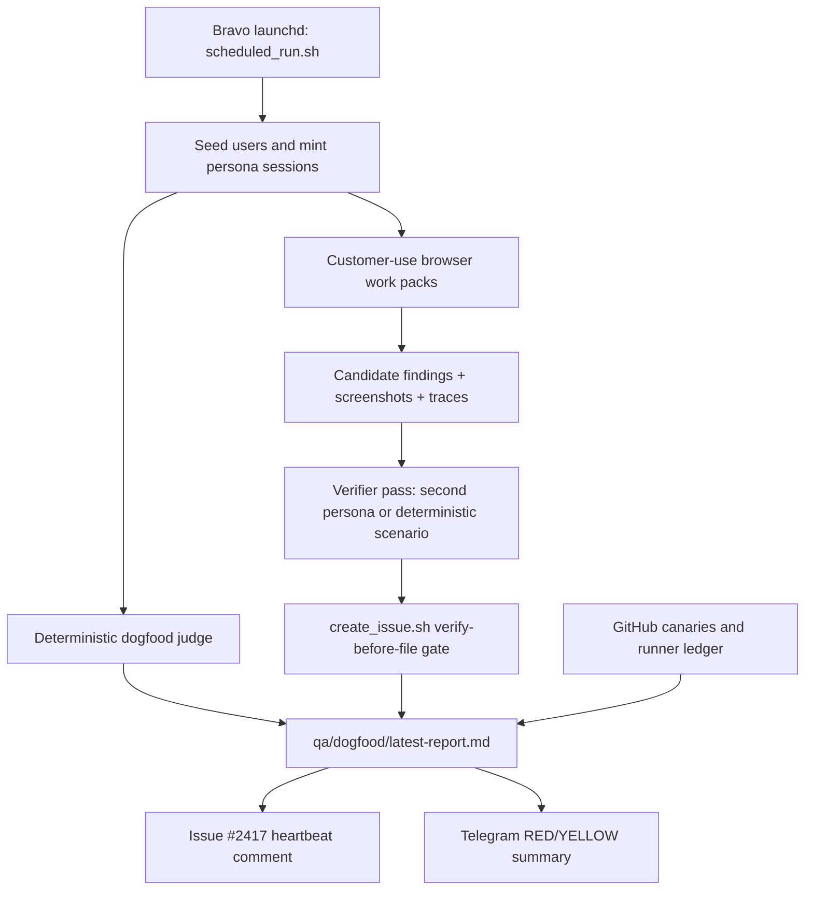

# Dogfood Useful Work PRD

**Status:** Draft
**Date:** 2026-07-19
**Owner:** FactoryLM / MIRA
**Primary surfaces:** Hub, staging Telegram bot, MIRA answer quality, work orders, PMs, tenant data boundaries
**Implementation target:** Existing dogfood and crew system, not a new autonomous platform

## 1. Summary

Turn the dogfood system that already exists into a useful customer-use routine.

Today the repo has several pieces:

- A durable dogfood judge: `tools/crew/dogfood/judge.sh`
- A 4-hour Bravo launchd runner: `tools/crew/dogfood/scheduled_run.sh`
- A gated issue filer: `tools/qa/create_issue.sh`
- A synthetic worker runner: `tools/crew/run_synthetic_workers.sh`
- Crew personas and runbook: `tools/crew/personas/`, `tools/crew/runbook.md`
- GitHub dead-man monitoring: `.github/workflows/dogfood-judge-heartbeat.yml`

The gap is not scheduling. The gap is usefulness. A green dogfood run should mean real customer workflows worked, not merely that scripts did not crash. When the product is broken, the routine should discover or re-verify bugs with enough evidence to fix them.

This PRD specifies a customer-use dogfood loop that uses browser/computer-use behavior as a customer, produces auditable evidence, proposes findings, and promotes reproducible failures into the existing deterministic judge and issue gate.

## 2. Problem

The current dogfood ecosystem is split:

- The dogfood judge is strong at repeatable path checks and safe issue filing.
- The crew day-loop is strong at human-like exploration, but not yet a scheduled, evidence-normalized product routine.
- Ops cron agents can send "all clear" messages without proving exactly what source was inspected.
- Several canaries and CI workflows detect infrastructure or regression classes, but their results are not folded into the daily dogfood narrative.

This creates a false sense of health. A scheduled message can say "all good" while the product may still fail basic customer tasks: upload a manual, ask a cited question, open an asset, create and close a work order, inspect PMs, or understand what needs attention first.

## 3. Goals

1. Make dogfood runs do useful customer work through the Hub UI and staging bot.
2. Make "green" mean specific workflows completed with evidence.
3. Make failures produce actionable, deduped, verified bugs.
4. Keep the existing verify-before-file gate as the filing authority.
5. Preserve safety: staging/seeded QA tenants only, no production Telegram bot, no destructive data or PLC writes.
6. Create a single operator report that says what was checked, what was learned, what failed, and what should be fixed next.

## 4. Non-goals

- Do not create a generic autonomous agent framework.
- Do not use LangChain, n8n, TensorFlow, or any abstraction over the MIRA inference call.
- Do not point feature-branch or dogfood traffic at `@FactoryLM_Diagnose`.
- Do not write directly to production NeonDB from a dev session.
- Do not perform destructive actions such as deleting work orders/assets, changing billing, or real checkout.
- Do not allow autonomous P0 filing without an explicit human override.
- Do not replace the existing dogfood judge or `create_issue.sh` gate.
- Do not make MIRA into SCADA. Plant/PLC/HMI surfaces remain read-only.

## 5. Users And Personas

The customer-use loop uses personas already present in the repo or seeded test accounts.

| Persona | Role | Useful work |
|---|---|---|
| Carlos | Maintenance technician | Find an asset, diagnose a fault, ask MIRA for a next check, create/close work orders |
| Dana | Maintenance manager | Review feed/KPIs, inspect PMs, prioritize backlog, validate counts |
| Scheduler | Planner | Create/read PM schedules, verify due dates and recurrence |
| Plant manager | Operations leader | Review health, open blockers, reports, and attention list |
| CFO | Executive buyer | Check summaries, value signals, and non-technical clarity |
| Isolation | Privacy probe | Confirm tenant boundaries and permission behavior |

Linda may remain the safety-alert persona for Telegram ops. If she becomes a Hub customer-use persona, she must be added as a seeded account with an explicit safety-coordinator brief before the runner uses her.

## 6. Desired Behavior

Every scheduled dogfood cycle should do three things:

1. **Prove core customer paths.** Run deterministic checks from `tools/crew/dogfood/checks/` and `tools/crew/scenarios/`.
2. **Perform useful customer work.** Drive a browser as one or more personas through realistic tasks in the seeded QA tenant.
3. **Convert discoveries into durable work.** Save candidate findings, verify them with a second persona or deterministic repro, dedupe them, then file only when the existing gate accepts them.

If no bugs are found, the report must still be useful: it should say which workflows were completed, which data was created or inspected, what evidence exists, and which sources were unavailable.

## 7. Architecture



The browser/customer-use component is a scout. It can notice confusing UX, data loss, uncited answers, stale counts, 500s, and broken flows. It does not get to file directly. The deterministic judge and issue gate decide what is real enough to file.

## 8. Requirements

### R1. Runner Registry And Evidence Ledger

Create a machine-readable runner registry and append-only evidence ledger.

Minimum ledger event:

```json
{
  "runner": "dogfood-customer-use",
  "run_id": "customer-use-2026-07-19T13-00-00Z",
  "started_at": "2026-07-19T13:00:00Z",
  "finished_at": "2026-07-19T13:07:12Z",
  "status": "green",
  "personas": ["carlos", "dana"],
  "checked": ["work-orders", "asset-detail", "ask-mira", "pm-schedule"],
  "counts": {"tasks_completed": 4, "candidate_findings": 1, "verified_findings": 0},
  "evidence_path": "dogfood-output/qa-runs/customer-use-2026-07-19T13-00-00Z",
  "unable_sources": [],
  "next_action": "none"
}
```

Requirements:

- Ledger lives under `dogfood-output/runner-ledger.jsonl` or a similarly gitignored runtime path.
- Every scheduled dogfood run appends one event per runner component.
- The latest dogfood report reads the ledger and reports stale/missing components as degraded.
- No runner may report all-clear without naming the source it inspected and the evidence path.

### R2. Customer-Use Work Packs

Add customer-use work packs that drive the Hub as a real customer through the UI.

Initial packs:

| Pack | Persona | Expected useful work |
|---|---|---|
| Shift start | Dana | Open feed, compare visible KPIs to list pages, identify top blocker |
| Fault triage | Carlos | Open asset, ask MIRA a fault question, verify cited evidence or honest refusal |
| WO round trip | Carlos | Create a test WO, read it back, add status/resolution, confirm persistence |
| PM due check | Scheduler or Dana | Inspect PM schedule, create/read a seeded PM if supported, validate due labels |
| Upload to answer | Carlos | Upload or use seeded tenant doc, ask a question, require tenant-owned citation |
| Privacy boundary | Isolation | Confirm own-tenant access works and cross-tenant/private access fails |

Each pack must:

- Use browser/UI paths when feasible, not only APIs.
- Save screenshots and browser traces under a run directory.
- Record created test data ids so cleanup or later inspection is possible.
- Return `GREEN`, `YELLOW`, `RED`, or `INFRA`.
- Treat network/auth/setup failures as `INFRA`, not product bugs.

### R3. Discovery Findings

Customer-use runs may create candidate findings.

Candidate finding fields:

- Title
- Persona
- Workflow
- Expected behavior
- Actual behavior
- Impact
- Evidence paths
- Screenshots/traces
- Repro hint
- Severity hunch
- Dedupe search terms

Candidate findings are saved under:

`dogfood-output/crew/<persona>/findings/`

or under the scheduled run directory:

`dogfood-output/qa-runs/<run_id>/findings/`

They are not GitHub issues until they pass verification.

### R4. Verification And Promotion

A candidate finding can be promoted in two ways:

1. A second persona reproduces it through the UI.
2. A deterministic repro is encoded as a `tools/crew/scenarios/*.scenario` or `tools/crew/dogfood/checks/*.check` file.

The filing body must satisfy the existing gate:

- Reproduces: yes
- Not expected shared/public data: yes
- Severity justified: yes
- Deduped: yes
- Evidence sufficient: yes
- Found by: `<persona>`
- Verified by: `<different persona or human>`

The gate remains `tools/qa/create_issue.sh`. Do not bypass it.

### R5. Extend The Existing Dogfood Report

Extend `qa/dogfood/latest-report.md` to include:

- Overall verdict
- Customer-use work completed
- Product path verdicts
- Candidate findings
- Verified/filed findings
- Stale or missing runners
- Unable sources
- Evidence paths
- Suggested next prompt

A healthy report should read like:

> Carlos completed fault triage on VFD-07, created WO `...`, got a cited answer from the tenant manual, and closed the loop. Dana checked the feed and PM list; counts matched. No verified product bugs. Evidence: `dogfood-output/qa-runs/...`.

Not:

> All good.

### R6. Dogfood Should Discover Bugs, Not Just Recheck Old Ones

At least one scheduled pass per day must include exploratory customer-use work.

Discovery heuristics to watch:

- UI 500s, console errors, or missing network responses
- Spinner or empty state where seeded data exists
- Count mismatch between dashboard and detail pages
- Values written but not returned on readback
- Work order status/resolution/date loss
- PM due date or recurrence mismatch
- MIRA answer with no citation where citation is required
- Citation points to wrong source or shared OEM source when tenant doc should win
- Cross-tenant/private data exposure
- Role/permission confusion
- Mobile layout blocking core customer work
- Slow page or answer beyond threshold

### R7. Fix False All-Clear Behavior In Ops Runners

Dana, Linda, and PM Scheduler must distinguish:

- `checked and none found`
- `checked and found N`
- `unable to inspect source`

Specific known issues to address:

- Dana selects `fsm_state`, `intent`, `created_at` but computes sessions from missing `chat_id`.
- Dana and Linda use ISO timestamp cutoffs against SQLite rows that may use `CURRENT_TIMESTAMP` format.
- Linda treats missing DB/open failure as no safety events.
- PM Scheduler treats import/query failure as no PMs due.

All all-clear messages must include the source, row count or latest inspected timestamp, and any unavailable source.

### R8. Canaries Feed The Dogfood Narrative

The dogfood report should summarize relevant external canaries:

- Dogfood heartbeat
- Provider-health canary
- QA regression
- PrintSense staging E2E
- Web-review canary
- Migration drift check

The first implementation may read local artifacts, GitHub issue comments, or workflow outputs opportunistically. If a source cannot be read, the dogfood report must say so.

### R9. Safety And Environment Boundaries

All customer-use work must run against staging or a seeded QA tenant.

Rules:

- No production Telegram bot.
- No production DB mutation from local sessions.
- No billing checkout.
- No deletion without explicit human approval.
- No PLC writes.
- No `kg_relationships` auto-promotion to verified.
- P0 filing requires explicit `--allow-p0` or human action.

## 9. Success Metrics

| Metric | Target |
|---|---|
| Useful work coverage | At least 4 customer workflows exercised per day |
| Evidence completeness | 100 percent of runs have screenshots/traces or explicit unavailable reason |
| False all-clear rate | 0 known source failures reported as all-clear |
| Bug verification rate | Every filed dogfood issue has second-persona or deterministic repro |
| Duplicate issue rate | 0 duplicate dogfood issues from scheduled runs |
| Stale runner detection | Missed dogfood cycle detected within 9 hours |
| Healthy-run value | Green report names completed workflows and evidence paths |

## 10. Implementation Plan

### Phase 1 - Trustworthy Runner Output

- Fix Dana, Linda, and PM Scheduler failure semantics.
- Add `chat_id` to Dana's interaction query.
- Normalize SQLite timestamp comparisons.
- Add unit tests for DB missing, query failure, empty checked source, and real matched rows.
- Route ops notifications through the shared notifier where practical.

Done when: an unavailable DB produces a degraded/unable message, never "none found."

### Phase 2 - Runner Ledger

- Add a small ledger writer shared by dogfood, ops runners, and customer-use packs.
- Update `scheduled_run.sh` to append run metadata.
- Teach `judge.sh` or a companion report builder to include runner freshness.

Done when: the latest report can show last-success age for dogfood judge, customer-use packs, PM Scheduler, Linda, Dana, and heartbeat.

### Phase 3 - Customer-Use Work Pack MVP

- Add `tools/crew/customer-use/` or equivalent.
- Implement two browser-driven packs first: Carlos fault triage and Dana shift start.
- Reuse saved auth states from `dogfood-output/.auth/`.
- Save screenshots, traces, and a compact Markdown report.
- Do not file issues from the scout.

Done when: a scheduled run can prove Carlos and Dana each completed one real UI workflow and emits evidence paths.

### Phase 4 - Discovery To Verification Bridge

- Add candidate finding schema and writer.
- Add a verifier command that turns a promoted finding into a deterministic `.scenario` or `.check` skeleton.
- Extend `run_synthetic_workers.sh` usage in the scheduled routine for selected promoted scenarios.
- Preserve `create_issue.sh` as the only issue filing path.

Done when: an injected known UI/API bug becomes a candidate, is verified by a second persona or deterministic repro, and would-file/files exactly one deduped issue.

### Phase 5 - Expand Product Coverage

Add checks for:

- Staging Telegram real question path
- PrintSense photo-to-answer path
- Upload to cited answer
- PM schedule round trip
- Live signal freshness for demo assets
- Role/tenant permission boundaries

Done when: green dogfood means the main customer value paths worked in the last 24 hours.

### Phase 6 - Ops Digest

- Fold dogfood, runner ledger, heartbeat, PM, safety, KB Growth, Drive Commander scout, and canary status into one concise digest.
- Keep individual RED alerts, but stop relying on multiple low-context "all clear" messages.

Done when: one morning digest says what was checked, what failed, what changed, and the next fix to do.

## 11. Acceptance Criteria

1. Running the dogfood scheduled command produces a latest report with customer-use work, deterministic checks, evidence paths, and runner freshness.
2. A healthy run identifies exact workflows completed and does not use vague all-clear language.
3. A missing DB, missing auth state, unavailable Hub, or failed query is reported as `INFRA` or `unable`, not as zero findings.
4. Customer-use packs save screenshots/traces for every workflow.
5. Candidate findings are saved but not filed until verified.
6. A filed dogfood issue contains the enforced verification block and is deduped by `create_issue.sh`.
7. A deterministic injected failure is discovered or reverified by the routine and appears in the report.
8. Existing hermetic tests for the dogfood judge, synthetic worker runner, and issue gate remain green.
9. No new dependency violates PRD section 4 constraints.
10. The production Telegram bot and production DB are not used for feature-branch dogfood work.

## 12. Open Questions

- Should the customer-use scout be invoked by `scheduled_run.sh` every 4 hours, or once daily with the judge continuing every 4 hours?
- Should candidate findings be stored only as files, or mirrored into a `dogfood_findings` database table later?
- Should Linda become a seeded Hub safety persona, or remain an ops-only Telegram safety agent?
- Which customer-use packs should be allowed to create test data on production QA tenant versus staging only?
- Should the Ops Digest live in the dogfood report builder or become a separate `mira-crawler/agents/ops_digest.py` runner?

## 13. References

- `tools/crew/dogfood/judge.sh`
- `tools/crew/dogfood/scheduled_run.sh`
- `tools/crew/run_synthetic_workers.sh`
- `tools/crew/runbook.md`
- `tools/crew/personas/`
- `tools/crew/scenarios/`
- `tools/qa/create_issue.sh`
- `docs/plans/2026-07-03-dogfood-routine-durability.md`
- `docs/runbooks/synthetic-dogfood-agents.md`
- `.github/workflows/dogfood-judge-heartbeat.yml`
- `.github/workflows/provider-health-canary.yml`
- `.github/workflows/qa-regression.yml`
