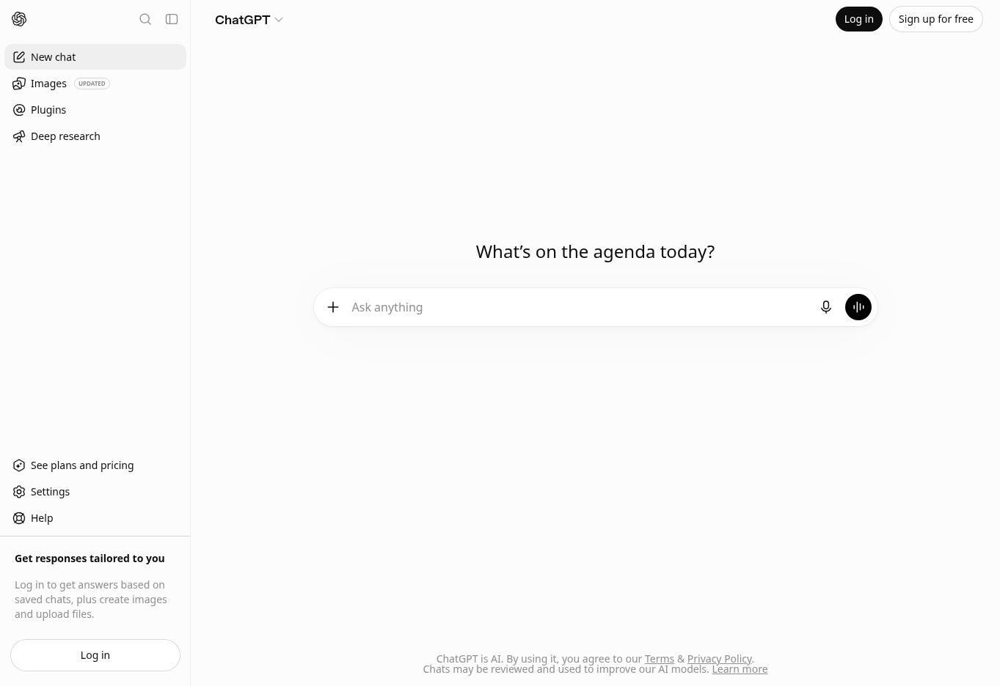
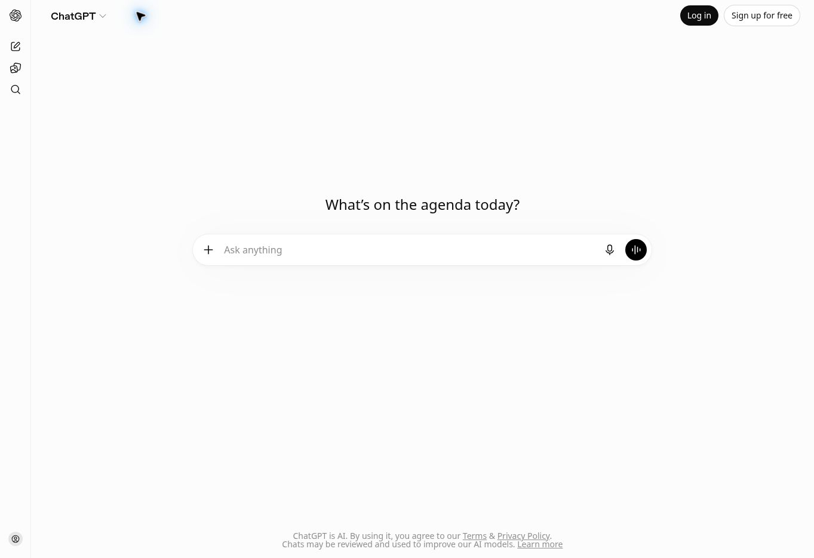
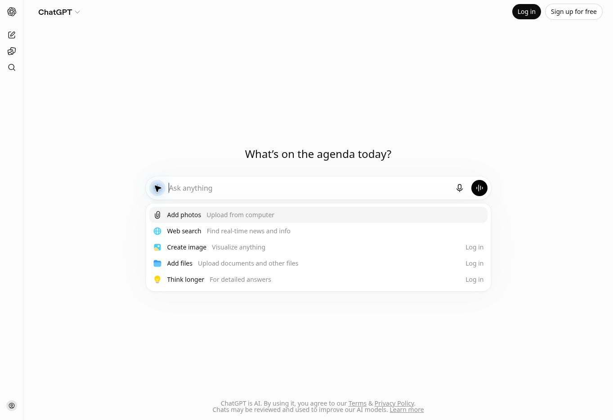

# FactoryLM V7 — Projects interaction catalog and next-build brief

Prepared September 13, 2026. Audience: Claude implementing FactoryLM/MIRA.

## Objective

Make Projects in the existing V7 interface understandable and complete: a technician opens a project, starts or resumes a conversation, and uses that project's evidence without learning a second app. Extend the canonical V7 shell across phone and web. Deliver a working flow, including menus, drawers, return navigation, persistence, and context boundaries.

Mike's direction: conversation first; Projects organize work; threads hold work history; manuals, photos, sensors, and notebooks support the conversation. Preserve a useful general chat before a machine or project is known. Use FactoryLM branding and the existing backend intelligence.

This document scopes the next build. It does not establish the current repository, PR, deployment, or phone state. Discover those before implementation. It does not introduce another UI version or a user-facing legacy/V7 switch.

## 1. Evidence and limits

**DOCUMENTED:** ChatGPT projects combine related conversations with common files, instructions, and sources. A project's Chats area lists conversations; Sources provides project context. Individual conversations remain separate. Users can begin outside a project and later move work into one. Official documentation also describes pinning, renaming, search, and chat archiving; presentation varies by client. [OpenAI: Projects and chats](https://learn.chatgpt.com/docs/projects)

**OBSERVED:** At https://chatgpt.com/ in a signed-out desktop browser, the left navigation collapses to an icon rail, the central composer remains available, and its plus control opens an anchored action list. Three genuine screenshots accompany this brief. They establish the public shell only.

**NOT OBSERVED:** Signed-in Projects, project dropdown contents, source drawers, instructions editors, creation dialogs, moving conversations, or native Android behavior. This browser was signed out. Exact dimensions, animations, menu order, and mobile gestures for those states remain uncaptured. Do not label proposed behavior below as observed ChatGPT behavior.

**PROPOSED:** Everything in sections 3–7 is a FactoryLM implementation contract informed by Mike's product direction. Verify reference details with the catalog in section 2; record deliberate differences.

### Captured shell references

| Evidence ID | File | What it establishes |
| --- | --- | --- |
| REF-01 | `chatgpt-sidebar-reference-20260913.jpg` | Expanded left navigation, sparse content region, central composer. |
| REF-02 | `chatgpt-collapsed-reference-20260913.jpg` | Collapsed icon rail; conversation area remains the primary workspace. |
| REF-03 | `chatgpt-attachment-menu-reference-20260913.jpg` | Plus-button menu anchored to composer; short action rows with secondary descriptions. |







## 2. Complete the signed-in reference catalog

Use an authorized, already signed-in ChatGPT session when available. Inspect interface controls without sending messages or changing real project content. Do not publish private screenshot content to public GitHub. Prefer a neutral existing test project, or request a test fixture only if one is necessary. No need to share, delete, or move real work to inspect a menu.

Capture each supported state below on desktop and the native Android app. If only a narrow browser viewport is available, label it **mobile web**, not Android. Record unavailable states and continue the build using explicitly proposed defaults; reference collection must not become an indefinite blocker.

| ID | State to capture | Question the capture must answer |
| --- | --- | --- |
| P01 | Sidebar with Projects visible | Section order, scrolling, project rows, active selection, overflow access. |
| P02 | Project row collapsed and expanded, if supported | Does the name navigate? Does a separate chevron reveal children? How many chats appear? |
| P03 | All-projects view/search, if present | How does someone find an older project or create another? |
| P04 | New-project dialog, without submitting | Fields, defaults, icon/color picker, primary/cancel actions. |
| P05 | Empty project workspace | Title, composer, empty state, sources/instructions access. |
| P06 | Populated project workspace | Chat rows, ordering, search, hover/touch actions. |
| P07 | Project title menu and row overflow | Exact labels, separators, submenus, and action destinations. |
| P08 | Sources closed and open | Entry control, panel direction/type, content, close behavior. |
| P09 | Add-source menu and file preview | Available inputs, status display, preview navigation. Do not upload private files. |
| P10 | Project-instructions editor | Where it opens, text field, save/cancel and dirty-state behavior. |
| P11 | Existing conversation in a project | Visible project identity, thread title, composer, project return path. |
| P12 | Conversation overflow and move picker | Exact actions, destination search, current project, cancellation. Do not commit a move. |
| P13 | Phone navigation drawer and overflow | Width, scrim, touch targets, dismiss control, system Back behavior. |
| P14 | Phone editor/panel with keyboard | Safe areas, keyboard overlap, scroll, saved draft behavior. |
| P15 | Archive/delete confirmation, only if safely inspectable | Affected items and cancellation; never confirm deletion of real work. |

For every capture, save: ID, timestamp, client/version if visible, viewport in CSS pixels, device if native, starting state, action, resulting state, dismissal/Back result, and evidence path. Label outcomes OBSERVED, DOCUMENTED, PROPOSED, or BLOCKED. Add a short screen recording for transitions if the available tool supports it. Screenshots alone do not prove persistence or context inheritance.

## 3. Organization contract for FactoryLM

| Concept | Technician meaning | Behavior |
| --- | --- | --- |
| General chat | Ask before knowing the machine | Works immediately; no project, QR scan, upload, or machine selection required. |
| Project | A continuing body of work; often one machine | Contains chats, shared sources, and project instructions. Project identity remains visible while chatting. |
| Chat / thread | One fault, investigation, or outcome | Separate transcript, title, draft, attachments, and history. New chat inside a project retains that project. |
| Sources | Evidence available to project conversations | Manuals, photos, notes, and supported records. Display ingestion status and provenance. |
| Project instructions | Standing guidance for this project | Editable in settings; applied to subsequent requests within that project. |
| Machine link | Optional equipment identity | Can be attached to a project without making it a prerequisite for creation or chat. |

**Example:** Project `Conveyor 12` contains chats `Motor overheating`, `Intermittent drive fault`, and `Weekly inspection`. Its shared Sources include the motor nameplate, drive manual, and approved notes. A fault photo attached to one chat stays local to that chat unless explicitly added to project Sources.

Use a flat project list for the initial interaction. Within Sources, reuse existing file/folder organization if it exists. Preserve existing subfolder data. Do not invent mandatory Site → Area → Machine → Notebook setup. If an accepted requirement needs subprojects, document its relationship and smallest implementation separately; do not misrepresent nested projects as a verified ChatGPT feature.

## 4. Drawer, menu, and navigation inventory

Each surface has one purpose. Navigation moves between workspaces; menus choose an action; panels inspect supporting material; dialogs collect a small change.

| Surface | Opens from | Contents / result | Desktop | Phone |
| --- | --- | --- | --- | --- |
| Global navigation | Header navigation button | New chat, search, Projects, recent chats, account | Collapsible left sidebar | Left drawer over scrim; selection closes drawer |
| Projects section | Sidebar section heading | Recent/pinned projects and All projects | Collapsible section | Same ordering and labels |
| Project row | Project name | Opens project home | Row hover reveals overflow; keyboard also supported | Overflow has an explicit touch target |
| Optional project expansion | Separate chevron, only if useful | Recent child chats | Expansion does not navigate | Separate touch target; never overload row click |
| All projects | Projects heading / All projects | Searchable list, New project | Main content view | Full-width main view with return navigation |
| New project | New project action | Required name; optional icon/color; Create/Cancel | Dialog | Dialog or sheet; keyboard-safe |
| Project workspace | Project row | Title, New chat/composer, recent chats, Sources control, overflow | Main content | Main content, no mandatory dashboard tiles |
| Project overflow | Project title/row ellipsis | Edit details, Instructions, Pin/unpin; supported lifecycle actions | Anchored menu | Touch menu or action sheet |
| Edit project | Project overflow | Name and supported optional metadata; Save/Cancel | Dialog | Sheet/full-screen editor if keyboard needs space |
| Project instructions | Project overflow | Text editor; explicit Save/Cancel | Dialog or secondary panel | Full-screen editor with visible return action |
| Sources panel | Sources count/control | Searchable source list, add action, status, preview | Right panel beside chat when space permits | Full-screen panel with Back/Close |
| Add source | Sources panel plus | Existing supported upload/link/note inputs | Anchored menu | Action sheet; only working inputs exposed |
| Source preview | Source row or answer citation | Document/photo plus provenance and location if available | Secondary viewer | Full-screen viewer; Back returns to exact originating view |
| Composer attachments | Composer plus | Camera/photo/file supported by host | Anchored menu | Sheet/native picker; cancel returns to composer draft |
| Chat overflow | Chat row / thread ellipsis | Rename, Move to project, supported archive actions | Anchored menu | Touch menu or action sheet |
| Move to project | Chat overflow | Search destinations, show current location, Move/Cancel | Picker dialog | Searchable sheet/full-screen picker |
| Search | Global search / project chat search | Results carry project identity; selection opens exact chat | Dialog or existing search surface | Full-screen search with clear scope |
| Lifecycle confirmation | A supported archive/delete action | Clearly names project/chat and consequences | Confirmation dialog | Confirmation dialog; cancel is safe |

**Scope-sensitive actions:** Global New chat creates a general draft. New chat inside a project creates a draft in that project. Selecting another project navigates; it does not silently relocate the current chat. Moving a chat is a separate explicit operation. Do not present a project selector that conflates these behaviors.

**Menu progression:** Selecting Edit from a menu closes that menu before opening the editor. On phone, prefer replacing a picker stage with a clear Back path over stacking drawers inside drawers. Keep one active modal surface. A source preview may be a new stage of the Sources panel with Back returning to its list.

## 5. Exact behavior and visual defaults

These are proposed starting targets, not measured ChatGPT dimensions. Reuse the shared design tokens and mature accessible overlay primitives already in the repository.

- Desktop navigation approximately 260 px; optional compact rail around 52 px. Phone drawer up to roughly 320 px, always leaving a visible dismissal affordance or scrim.
- Desktop source panel approximately 360–440 px. If it squeezes chat below a useful reading width, switch to an overlay/full-screen viewer using existing breakpoints.
- Quiet neutral surfaces, readable 16 px body text, restrained separators, a single primary action, and a comfortable chat reading width. Use existing V7 composer, typography, icons, spacing, and tokens.
- Use at least 44×44 CSS px hit areas on phone, including invisible padding around small glyphs. Labels and visible focus must support keyboard and assistive technology.
- Opening navigation or inspecting a source preserves the current thread, draft, pending attachments, and scroll position. Opening project settings does not reset chat.
- Outside tap and Escape dismiss transient menus. Modal drawers trap focus and restore it to the trigger on close; a persistent desktop sidebar does not trap focus.
- Native Android Back first lets the host dismiss an open keyboard, then the active transient surface, then navigates to the previous main view. Verify the host's actual event order. No force-close needed to escape a screen.
- If an editor contains unsaved changes, closing offers Save/Discard/Keep editing. Do not prompt when nothing changed.
- Explicit browser Back follows route history. Deep links open the requested project/chat; if no in-app history exists, visible Up goes to project home, then All projects.
- On small screens, the composer and primary editor actions stay above the keyboard and system safe areas. Long names truncate visually with an accessible full label.
- Loading, empty, permission-denied, failed-upload, failed-save, and no-results states must have a useful next action. Never show success before the server confirms persistence.
- Respect reduced motion. Use a short shared transition if the shell already provides one; correctness does not depend on animation.

## 6. Context and persistence contracts

These are required FactoryLM semantics, not claims about ChatGPT's internal architecture.

1. Reuse canonical project/thread IDs and current tenant authorization. A thread has one current project or is general; opening a drawer never changes that membership.
2. Project-wide evidence and chat-only attachments have distinct scopes. The interface makes the distinction understandable at the point of adding a source.
3. Project instructions and ready project sources become eligible context for that project's future requests through the existing grounding path. Do not claim every file is automatically inserted into every prompt.
4. A new chat starts with a fresh transcript. Cross-thread recall, if already supported, must be explicit and attributable. Do not merge transcripts or quietly promise project memory that the backend lacks.
5. Switching projects must not leak another project's sources, instructions, stale search results, or machine badge. Existing tenant boundaries remain enforced on the server.
6. Moving a chat preserves its ID, messages, and thread-owned attachments. The destination applies to future requests. Previously produced answers and citations remain historical records. Do not copy the origin project's shared files into the destination automatically.
7. Do not move a chat during an active response. Disable the move action with an explanation, or require stopping the response first.
8. Rename/pin/archive operations reuse existing persistence. A failed move leaves the original membership intact. Retried saves must not create duplicates.
9. Keep existing notebook/source records and their IDs behind the interface. If their relationship to Projects is incomplete, make the smallest explicit adapter or migration after inspecting current contracts.
10. Archive and delete are different operations. Only expose actions with complete backend behavior and clear recovery/consequences. Permanent project deletion is not necessary for the first usable slice.

## 7. Smallest useful build and acceptance evidence

Inspect current main, open overlapping PRs, canonical UI packages, project/thread APIs, source ingestion, and the mobile host before claiming/editing files. Record REUSE, CONNECT, REPAIR, or NEW for each item in section 4, with existing file/endpoint and owner. Existing accepted PR work takes precedence over recreating it.

Deliver one end-to-end slice first: **create project → start chat → add a project source → start another chat using that source → leave → return → resume**. Include the drawer, project menu, instruction editor, and Back paths that support it. Then complete rename, move, search, pin, and supported archive behavior. Avoid backend rewrites or a second conversation engine.

| Test | Required evidence |
| --- | --- |
| General question before setup | Real response without project/machine; correct general scope. |
| Create and reopen project | Server ID and visible project after reload/relaunch. |
| Two chats in one project | Separate thread IDs/transcripts; both listed under the same project. |
| Project source reuse | Ingest a benign test source; a later new chat uses it with a verifiable citation. |
| Project instructions | Save/reopen editor; inspect the actual request context or trace confirming application. Do not rely only on response wording. |
| Scope isolation | Distinct benign marker sources/instructions in projects A/B; retrieval evidence shows no cross-project leakage. |
| Navigation while drafting | Type draft, open/close drawer and source panel; text, attachments, thread, and scroll survive. |
| Move conversation | Same thread ID and history in destination; origin list updates; failed save leaves membership intact. |
| Source preview return | Citation → preview → Back restores the same conversation and reading position. |
| Phone keyboard and Back | Recording from drawer/editor/picker states; no trapped screen, obscured action, or force-close. |
| Failure and long-list states | Failed upload/save, no results, long title, and enough rows to scroll; correct recovery behavior. |
| Web/phone parity | Same account sees the same saved projects, chats, instructions, and sources after refresh/relaunch. |

Use the existing evals and mobile/browser E2E harnesses. Add focused tests for state and context risks; do not create a second testing architecture. Capture both visual state and functional evidence. Screenshots prove appearance; real requests plus persistence checks prove behavior.

For every final claim, include tested SHA, web deployment version if applicable, phone model/build/package and APK/bundle identity if applicable, test command, result, and evidence path. Verify the physical phone rather than assuming its model; prior context identifies Mike's device as a Pixel 9a. Mobile web screenshots or an emulator run do not establish a native phone pass.

## 8. Claude handoff prompt

```text
Goal: finish Projects inside FactoryLM's canonical V7 shell using this brief. Make it feel familiar to a ChatGPT user: conversation first, Projects organize chats, Sources and Instructions support them. General chat must work before machine/project selection.

First inspect current main, active owners, overlapping PRs, shared shell components, Projects/Threads APIs and source/notebook adapters. Produce a compact REUSE/CONNECT/REPAIR/NEW map; reuse accepted work. Do not create another shell, version switch, conversation engine or eval architecture.

Complete the signed-in ChatGPT reference catalog when an authorized session is available. Capture project sidebar, empty/populated workspace, create/edit, title/overflow menus, Sources, Instructions, chat menu/move picker, mobile drawer and Back/keyboard states. Record clicks, resulting state and dismissal. Label OBSERVED/DOCUMENTED/PROPOSED/BLOCKED. The attached screenshots show only the signed-out desktop shell; never claim they prove Projects or Android behavior. An unavailable reference is a documented gap, not a reason to stop useful work.

Implement the smallest full path: create project → chat → add shared source → new chat using that source → leave → return → resume. Connect project menu, instructions editor, source panel/preview and correct return navigation. Then complete rename/move/search/pin and supported archiving. Keep IDs/history, scopes and tenant isolation intact. Global New chat is general; project New chat stays in that project. Selecting another project never silently moves the current chat.

Use one shared component family for desktop sidebar/menus and phone drawer/sheets. Preserve drafts, attachments and scroll. Fix keyboard overlap, Escape/outside-dismiss, focus restoration, Android Back and visible return actions. No dead buttons or forced app restart to navigate.

Verify with existing E2E/eval tools and real backend requests. Prove two independent chats, persisted project instructions, cited shared-source reuse, isolation between projects, failed-save recovery and move integrity. Show web/phone parity at identified builds. Only claim native phone success after an actual device run.

Deliver updated interaction catalog, minimal implementation PR(s), screenshots/recordings and results tied to exact SHAs/builds. Honor existing merge/deploy/install authorization and repo gates; this brief creates no new approval. If blocked, finish independent work and report the precise missing access or dependency. Do not mark the flow done with mocked UI, static inspection alone or uncaptured phone behavior.
```

## Completion decision

The next build is ready for product review when a technician can organize and resume real work through the complete project flow, with predictable menus and return navigation, and the evidence above supports the claimed platforms. Any remaining reference-only visual gap is listed separately from a functional blocker.
