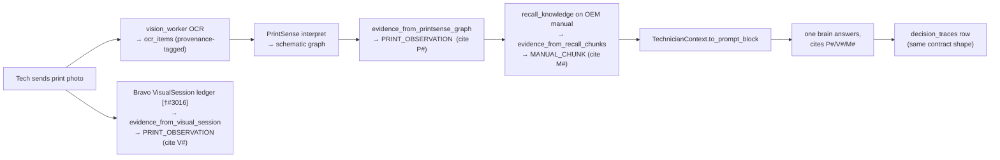

# Runbook — trace one evidence item end-to-end

**Audience:** agents + humans · **Hub:** [`bravo-evidence-lane.md`](../architecture/bravo-evidence-lane.md)

Use this to answer "where did this cited fact come from?" or "is this real or invented?" — the
groundedness question. You trace one `EvidenceItem` backward from a citation in an answer to the
physical source, or forward from a source to the prompt.

## Worked example — a print photo (`P#` / `V#` citation)

## The trace procedure (any kind)

1. **Start from the citation letter.** Map it via [catalog §A](../architecture/evidence-catalog.md):
   `M`→manual, `D`→drive pack, `G`→KG, `P`/`V`→print, `O`→ontology, `H`→historian, `W`→work
   order, `R`→prior decision, `T`→correction.
2. **Find the adapter** for that kind in the catalog (`context_contract.py:line`). Its
   `producer_name` names the upstream system.
3. **Open the upstream source** (catalog "Upstream source" column) — the manual chunk row, the
   pack file, the KG edge, the VisualSession ledger row, etc.
4. **Check trust + provenance.** `EvidenceItem.trust` tells you whether a human verified it
   (`verified`) or it's a `candidate`. `candidate` in an answer must be hedged, not asserted.
5. **Confirm the read-only gate** allowed only read/cite/suggest/explain actions.
6. **Cross-check the trace row.** `decision_traces` records the same contract shape (hub §2
   Layer 5), so the audit row and the prompt should agree.

## Red flags (report these)

- A cited fact whose citation letter has **no catalog row** → invented citation.
- A `verified` item with no human review signal in its source → trust-inflation bug (hub §3).
- A claim with **no** citation → refusal was owed, not an answer (ADR-0033).
- An `allowed_actions` value containing a write/control verb → read-only breach.

## Caveat — runtime not wired yet

On `main` the adapters are **not** consumed by the live runtime (hub §4). Until the runtime
migration lands, "trace forward to the prompt" is traced through the *contract + tests*, not a
live `mira-pipeline` turn. The backward trace (citation → catalog → source) is valid today for
reasoning about how an answer *should* be grounded once wired.
