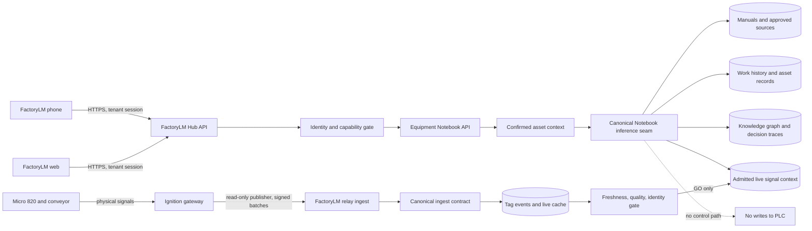

# FactoryLM Technician App Dogfood System

**Status:** Approved product design; implementation has not started from this document

**Owner:** Mike Crane

**Written:** 2026-08-23

**First dogfood target:** Pixel 9a against the home-garage CV-101 conveyor

**Product:** FactoryLM, with MIRA as the technician intelligence inside it

## 1. Decision

FactoryLM will be one cohesive technician app across phone and web. It will not become a second MIRA-branded app, a generic AI chat client, a PLC remote control, or a collection of disconnected demos.

The installed Android package, `com.factorylm.mira`, continues as the FactoryLM phone app. Its **Notebook** tab is the technician's conversational home. The web app and phone app use the same tenant, equipment notebooks, source documents, persisted turns, citations, work orders, assets, permissions, and server-owned inference route.

The useful promise is simple:

> Open FactoryLM beside any machine and ask MIRA what is happening or what to check. MIRA helps immediately from general engineering reasoning, and becomes more specific as evidence appears - the identified component, its OEM manual, that asset's work history, and trustworthy read-only live signals. It always says which of those an answer rests on, and if the evidence or safety conditions are not good enough, it says so.

**Amended 2026-08-24.** The earlier wording of this promise began "identify the exact asset,"
which made identification a precondition. It is not. Identification is the first *upgrade*, not
the entry fee - see 1.1.

The first real-life test is deliberately narrow: Mike uses the connected Pixel 9a with the garage conveyor. The conveyor remains under its existing physical controls. FactoryLM may observe and explain; it may never start, stop, reset, jog, bypass, acknowledge, or write to the machine.

## 1.1 The Universal Technician Rule

**A technician who has configured nothing must still get useful help.**

MIRA must provide useful troubleshooting assistance when the technician has **none** of:

- a preconfigured asset, a FactoryLM tag, a QR code, a machine hierarchy
- a UNS path, a PLC connection, prior work-order history, a manual already attached

A technician may begin from **any one** of: a typed question, a spoken description, a photograph,
an equipment nameplate, a barcode, a QR code, a Data Matrix, a catalog number, a model number, a
serial number, a fault/error code, an uploaded manual, an electrical print, pasted text, or an
existing FactoryLM asset.

> **Configuration increases context. It does not unlock the right to ask a question.**

Any design that makes a technician create, pick, or scan something *before* MIRA will answer is a
defect against this rule, however convenient it is to implement.

## 1.2 The Progressive Context Rule

MIRA becomes more specific as evidence arrives, and stays useful at every step. The levels
describe evidence that happens to be available - they are not a setup wizard the technician walks
through.

| Level | What MIRA knows | What changes |
|---|---|---|
| **L0 - General** | Nothing preconfigured | Reasons from general electrical/mechanical/controls knowledge. May ask diagnostic questions. Clearly labelled as general. |
| **L1 - Identified component** | Manufacturer, model, catalog/serial, and eventually the OEM manual | Answers can cite the actual document. A component may exist **without belonging to any machine**. |
| **L2 - Assembled machine** | Components related to one machine, built up over days of real work | Relationships, shared history, machine-scoped memory. Never a required upfront wizard. |
| **L3 - Connected machine** | OPC UA / EtherNet-IP / Modbus / MQTT / Ignition / historian / UNS | Moves answers from "here are likely checks" to "your drive command dropped to 18 Hz at 01:32:14." Optional and advanced. |

L3 must never become a precondition for L0. MIRA stays **read-only and advisory** toward equipment
at every level unless a separate, explicitly authorized control architecture is built.

## 1.3 The evidence ladder

An answer must know what kind of evidence supports it, and the UI must not imply equal certainty
across kinds. This is a **label on an existing answer**, not a second trust system - it reuses the
citation and refusal machinery already in `lib/notebook-chat-types.ts`.

| Basis | Means | Example rendering |
|---|---|---|
| `general_reasoning` | Model reasoning, no source attached | *General guidance - not grounded in this machine's documents* |
| `identified_component` | Identity known, document not yet attached | *For a PowerFlex 525 - no manual attached yet* |
| `oem_documentation` | A confirmed source chunk | *Allen-Bradley PowerFlex 525 User Manual, p.146* |
| `workspace_evidence` | The tenant's own uploads or notes | *From your workspace* |
| `machine_history` | Work orders, resolutions, prior turns on this asset | *Previous repair on this asset, 2026-08-02* |
| `live_machine_evidence` | A read-only signal, with freshness | *Live PLC observation, 8 s old* |

**MIRA must never present general model reasoning as though it came from an OEM manual.**

## 1.4 The Notebook grounding rule is NOT relaxed

The Equipment Notebook's strictness is a feature: with no valid source it refuses rather than
inventing a machine-specific answer. **General mode is a different evidentiary state, not an
exemption.**

- The Notebook must not silently treat source-free general knowledge as machine evidence.
- If a technician is inside a Notebook with no source and wants general help, the UI offers it
  **explicitly** ("Ask generally - not grounded in this machine's documents") rather than quietly
  changing the evidence contract.
- The technician always knows which contract they are under.

**No second conversation store, no second Chat tab.** Section 2 already forbids a parallel generic
Chat tab; the universal front door therefore lives *inside* the Notebook tab and shares its
persisted turns. One conversation store, two evidentiary states.

**No second implementation of anything.** The universal door reuses the canonical safety seam
(`lib/safety-classifier.ts`), the canonical inference seam (`lib/inference/canonical-cascade.ts`),
the existing SSE frame grammar, the existing file and evidence model, the nameplate pipeline, and
the knowledge graph. A new provider cascade, safety classifier, or evidence model is a defect.

## 2. Product language

The names have different jobs:

| Name | Meaning |
|---|---|
| **FactoryLM** | The product, account, mobile app, web app, and commercial brand the customer sees. |
| **MIRA** | The maintenance intelligence inside FactoryLM that grounds, reasons, cites, refuses, and records diagnostic decisions. |
| **Notebook** | The equipment-scoped technician conversation and evidence workspace. This is the visible chat home. |

Older mobile documents sometimes call the central tab **Chat**. This contract supersedes that visible-label drift: the user-facing tab is **Notebook**, even if existing internal code still uses `chat` as an identifier. There must not be a parallel generic Chat tab or a second conversation store.

## 3. What is true today

This table separates verified reality from the intended experience.

| Area | Verified current state | Product consequence |
|---|---|---|
| Android identity | The connected Pixel 9a has FactoryLM package `com.factorylm.mira`, version 1.0.0, installed. The signer matches the local Android debug key. | This is the app to continue. Do not create another app. A future debug update may use `adb install -r` without wiping data as long as the signer stays the same. |
| Phone shell | The physical phone loads signed-in production data and shows **Workorders, Schedule, Notebook, Assets, More**. | Preserve this five-tab shell. Notebook becomes the strongest technician journey, not a demo hidden beside unrelated screens. |
| Grounded manual workflow | Physical-phone proof has passed sign-in, PDF upload, ingest/embed, grounded answer, citation passage, and nameplate extraction. | The manual-based dogfood path can be used now, subject to normal production caution. |
| Camera | The nameplate action currently opens a photo picker instead of the camera. Issue [#3353](https://github.com/Mikecranesync/MIRA/issues/3353) is open. | Real camera capture is not accepted yet. Gallery selection is a temporary dogfood workaround, not a completed mobile experience. |
| Cellular and store identity | Cellular-only operation and a release-signed Play identity have not been proven. The installed build is debug-signed. | Both require physical-device release gates before outside sharing. |
| Conversation seam | Web and mobile already call `POST /api/equipment-notebooks/{id}/chat/`. The server owns grounding, provider routing, citations, refusal, persistence, and the stream frame order. | Keep this as the canonical Notebook product seam. Never put a provider key, prompt, or direct model call in the phone. |
| Stream contract | The current server stream is `sources -> content* -> usage? -> status -> [DONE]`. A client may ignore the additive usage frame. | Mobile and web must render the same answer and evidence without inventing channel-specific meaning. |
| Conversation continuity | The server can accept bounded, sanitized history and persists turns, but the current phone request does not yet send shared history. | Cross-device follow-up continuity is an implementation gap. Server-persisted turns, not device memory, must become the truth. |
| Garage HMI | Ignition `ConvSimpleLive` and its `/conveyor` route respond, and the PLC laptop is online over Tailscale. | HMI reachability alone does not prove trustworthy live machine data. |
| Live conveyor data | The last completed GO on 2026-08-16 proved fresh physical CV-101 data. A fresh read-only gate on 2026-08-23 returned **NO-GO: REPLAY**: 5,028 rows, 12 tags, one distinct observed timestamp, observation age 380,303 seconds, fresh ingestion, and every row marked bad quality. [Run 32625347755](https://github.com/Mikecranesync/MIRA/actions/runs/32625347755). | Live conveyor claims are disabled now. Frozen data that keeps arriving is not live. A fresh GO is required at the start of every live dogfood session. |
| Retrieval coverage | Large-manual retrieval completeness is still tracked in [#3218](https://github.com/Mikecranesync/MIRA/issues/3218). | Passing one known-answer question is not proof that the whole manual is retrievable. The app must be honest about missing evidence. |

The current live-data failure is useful evidence, not a reason to weaken the gate. It proves the product needs a clear **Live unavailable — gateway data is stale/untrustworthy** state instead of displaying plausible-looking old values.

### Amendment 2026-08-26 (owner decision 5 — IA)

**Conversation-first launch wins.** The app opens conversation-ready with no asset prerequisite. The
five tabs (Workorders, Schedule, Notebook, Assets, More) **remain as navigation**; the "Ask MIRA" door
inside the Notebook tab is **transitional only**. Resume returns to the **exact conversation** — draft,
history, attachments, citations, and asset context. This amends §7 "Navigation" where it conflicts.
Record: `docs/decisions/2026-08-26-technician-copilot-owner-decisions.md`.

## 4. Scope boundary

### Core product

- Exact technician, tenant, site, line, and asset context.
- Equipment notebooks with manuals, photos, approved knowledge, work history, and cited conversations.
- Grounded troubleshooting, honest refusal, safety escalation, and saved decision traces.
- Work-order discovery and a reviewable draft handoff when the technician chooses.
- The same account and conversation state on web and mobile.

### Adjacent capability allowed in this product

- Read-only live machine context from an approved plant integration such as Ignition.
- Freshness, quality, provenance, and UNS identity displayed with every live claim.
- Live context added by the server only after the equipment has been resolved and confirmed.

### Explicitly outside this product

- PLC, robot, VFD, or safety-controller writes.
- Start, stop, reset, acknowledge, setpoint, jog, mode, bypass, force, or download controls.
- A replacement SCADA/HMI, CMMS, historian, or generic business chatbot.
- Direct phone or cloud connections to Modbus, EtherNet/IP, OPC UA, or another fieldbus.
- Customer-specific one-off dashboards that bypass the common product model.
- A second mobile app or separate chat service.

## 5. One system

There is intentionally no arrow from the phone, Hub, MIRA, relay, or live cache back to the PLC.

For this product slice, `POST /api/equipment-notebooks/{id}/chat/` is the canonical conversation seam. The server owns model-provider routing and can change its provider cascade without a mobile release. Mobile and web are thin adapters.

Slack remains an existing separate adapter. Cross-channel thread convergence is not part of the first phone dogfood milestone. It may join shared threads only after it uses the same equipment-context, grounding, guardrail, evidence, and history contracts. This design does not authorize a quick Slack-to-Notebook shortcut.

## 6. Responsibility map

| Responsibility | One owner | Rule |
|---|---|---|
| Android/iOS shell | `mira-mobile` | Displays state, captures technician input, and calls Hub. No inference or plant protocol logic. |
| Web experience | `mira-hub` UI | Uses the same Hub contracts and persisted records as mobile. |
| Authentication, tenant, capabilities | Hub API | Server is the authority; absent capability means denied. |
| Notebook chat | Hub Notebook route | Validates notebook/source ownership, assembles turn context, streams frames, and persists evidence. |
| Inference | Canonical server seam | Performs provider routing, grounding, refusal, safety handling, and usage accounting. |
| Equipment identity | Asset/UNS resolver | Resolves aliases to one tenant-scoped canonical asset and records confirmation. |
| Plant data boundary | Ignition plus read-only publisher | Reads plant signals. It cannot accept control instructions from FactoryLM. |
| Cloud ingestion | Relay plus canonical ingest contract | Authenticates, validates, normalizes, deduplicates, and stores batches. |
| Live admission | Freshness/quality/identity gate | Lets live evidence into a turn only when the current observation passes. |
| Durable evidence | Notebook/source/decision stores | Stores the source snapshot, answer, citations, status, cost, and bounded decision metadata. |

If two modules begin doing one of these jobs, the work stops until ownership is restored.

## 7. Cohesive phone experience

### Navigation

Keep the existing five tabs:

1. **Workorders** — what needs action and what the technician has already done.
2. **Schedule** — upcoming maintenance and assigned work.
3. **Notebook** — the central ask, evidence, and troubleshooting experience.
4. **Assets** — equipment discovery, identity, documentation, and history.
5. **More** — account, site, sync, diagnostics, and support.

Do not add a sixth Chat tab. A conversation opened from an asset, work order, alarm, or QR code lands in that asset's Notebook.

### Notebook screen

The screen must pass the three-second test. At a glance, the technician can tell:

- which site, line, and asset MIRA is using;
- whether that identity has been confirmed;
- whether live evidence is available, stale, bad quality, or absent;
- which manuals or records are attached and whether they finished indexing;
- what MIRA's direct answer is;
- which evidence supports the answer;
- what the safest next check is.

The top context card shows the human name **Discharge Conveyor**, canonical key `cv_101`, site/line path, confirmation state, and the newest admitted live observation time and quality. The long canonical UNS may appear in details, not as the primary technician label.

Normal state uses muted neutrals. Strong color carries state only:

- green: confirmed healthy/running state;
- amber: warning, degraded evidence, or stale context;
- red: fault, stop condition, or urgent safety escalation;
- gray: off, unknown, unavailable, or not connected.

There is no decorative alarm red, no blinking except a separately governed urgent unacknowledged alarm, no gradient, and no invented color palette. Controls use the shared FactoryLM design tokens, safe areas, and at least 44 px touch targets.

### Messages and evidence

MIRA's response order is:

1. direct answer or explicit refusal;
2. important state and time context;
3. likely cause, clearly marked when inferred;
4. safe next check;
5. citations or live evidence cards;
6. optional detail.

A citation opens the exact source passage or the exact admitted signal facts used for that turn. A live evidence card includes source, asset identity, observed time, ingest time, quality, and units. “Current” is forbidden unless the data passed the live admission gate for that turn.

The composer supports text, camera/gallery images, and files. Upload status is visible: queued, uploading, indexing, ready, or failed. MIRA does not silently answer from a document that has not finished indexing.

### Shared history

Notebook turns are server-persisted and shared across phone and web. Opening a notebook loads the same recent turns. Every request sends only the server-approved bounded history shape; the server sanitizes and caps it again. Device storage may cache a view for speed, but it is never the authoritative conversation record.

Offline drafts are clearly marked and are not treated as sent. After reconnection, the technician chooses or sees an explicit retry. The app must not replay an old troubleshooting instruction as though it were a fresh answer.

## 8. Equipment context gate

**Amended 2026-08-24 - read 1.1 first.** This section previously opened "MIRA does not troubleshoot
until it knows which equipment the technician means." That sentence is **superseded**. It gated
*answering at all*, which contradicts the Universal Technician Rule.

What survives, and is still binding, is narrower and more important:

> **MIRA does not make an ASSET-SPECIFIC claim until it knows which equipment the technician means.**

General troubleshooting needs no asset. Binding a turn to an asset, citing that asset's manuals,
reading its history, or reporting its live signals all still require the resolution and
confirmation flow below. The gate moved from "may I speak" to "may I speak *about this machine*."

The canonical CV-101 identity is:

| Field | Value |
|---|---|
| Technician label | Discharge Conveyor |
| Canonical key | `cv_101` |
| Canonical UNS | `enterprise.home_garage.conveyor_lab.conveyor_1` |
| Plant source | `ignition/cv101-bench-gw` |
| Informal alias | “garage conveyor” for conversation only |

Every entry path follows the same gate:

1. Collect a candidate from QR code, asset picker, work order, manual, photo, or typed description.
2. Resolve it inside the signed-in tenant and site.
3. If there are multiple candidates, show meaningful distinguishing fields.
4. Show the resolved site, line, asset, and available evidence.
5. Ask the technician to confirm when the context is new, changed, or ambiguous.
6. Bind the notebook turn to the canonical asset ID and UNS path.
7. Record how the asset was selected and when it was confirmed.
8. If resolution or confirmation fails, ask a context question; do not guess and do not troubleshoot.

An alias helps find an asset but never replaces canonical identity. Changing asset context is a visible event, not an invisible prompt mutation.

## 9. Live conveyor evidence

Live signals take this one route:

`Micro 820 -> Ignition -> read-only signed publisher -> relay ingest -> canonical ingest contract -> tag_events/live cache -> admission gate -> confirmed Notebook turn`

The phone never talks to the PLC laptop, Ignition REST endpoints, or a fieldbus directly. It talks only to the authenticated Hub API. Plant credentials never enter the app bundle.

Before live data can appear in an answer, the server verifies:

- the signed-in tenant may access the source and asset;
- the source connection is the expected one;
- the UNS path matches the confirmed asset;
- the event is physical, not simulated, when the UI claims physical state;
- observed time advances across scans;
- observation age is within the gate threshold;
- quality is acceptable;
- enough expected tags are present for the claim;
- ingestion is not merely replaying one frozen observation.

Fresh ingest time does not make a stale observed time live. A constantly arriving bad-quality sample is unavailable evidence, not a current reading.

Live context joins the turn on the server after asset confirmation. It is serialized as evidence and participates in the saved source snapshot. The phone does not paste mutable live values into a prompt.

If the live gate is NO-GO or UNKNOWN, the Notebook shows the reason in plain language and continues only with non-live sources. It must say, for example:

> Live conveyor data is unavailable: the gateway is repeatedly sending one old, bad-quality observation. I can still answer from the manual and work history, but I cannot tell you the conveyor's current state.

## 10. Industrial safety contract

FactoryLM helps a qualified technician diagnose; it does not make equipment safe.

The product must:

- tell the technician to stop and follow site procedure when there is possible energized, moving, pressurized, hot, chemical, arc-flash, stored-energy, guarding, or unexpected-startup danger;
- avoid step-by-step intrusive advice on live equipment unless the action is explicitly safe for live work and supported by approved procedure;
- require verified isolation before advising contact with guarded, energized, pressurized, or moving parts;
- distinguish observation from action and fact from inference;
- cite the applicable manual, procedure, or evidence;
- say when it does not know;
- retain safety warnings when the conversation is resumed on another device.

The product must never:

- represent itself as an interlock, safety PLC, lockout device, or substitute for training;
- recommend defeating a guard, bypassing a safety circuit, forcing an output, or changing a protection setting;
- turn a speculative diagnosis into an instruction;
- claim a machine is safe because telemetry looks normal;
- send a control command.

For the garage dogfood session, the conveyor is operated only through existing physical controls by a qualified person. Guards, E-stop, and the normal isolation procedure are checked before the test. The phone is used from a safe position and never while reaching into the conveyor.

## 11. Fail safely

| Situation | Required app behavior |
|---|---|
| No equipment selected | Ask for the asset; do not troubleshoot. |
| Ambiguous equipment | Show candidates and ask for confirmation. |
| Tenant/capability missing | Deny the action. Missing permission never means allowed. |
| Authentication expires | Stop protected requests, preserve only a safe local draft, and ask for sign-in. |
| No selected source or source belongs elsewhere | Refuse before inference and explain how to attach an allowed source. |
| Document still indexing | Show indexing status; do not imply it was searched. |
| No relevant evidence | Return `insufficient_evidence`; do not call it a diagnosis. |
| Provider unavailable | Keep the technician's question, show a retryable error, and do not fabricate an answer. |
| Live data stale, frozen, bad, mismatched, or unknown | Exclude it from current-state reasoning and show a plain-language unavailable reason. |
| Relay or gateway offline | Continue with manuals/history only; never reuse an old live state without its old timestamp. |
| Safety phrase or hazardous condition | STOP, explain the hazard, direct site isolation/escalation, and withhold unsafe steps. |
| Network offline | Allow reading an explicitly marked cache and composing a draft; do not pretend a new answer was generated. |
| Partial stream | Mark the turn interrupted and not complete. Do not save a fragment as a successful answer. |
| Citation cannot be opened | Mark evidence unavailable and do not preserve a confidence claim that depended on it. |

## 12. Security, privacy, and trust boundaries

- Every API request is authorized by server-side tenant and capability checks.
- Notebook, asset, source, work-order, live-event, and citation lookups are tenant-scoped before retrieval.
- The packaged web bundle is untrusted input. It contains no model, plant, database, or signing secret.
- Secrets stay in Doppler-managed server or deployment contexts; no committed `.env` secrets.
- The mobile app uses the supported native cookie/session path. Release review must decide whether any additional cached token or sensitive field needs OS secure storage.
- Logout clears protected local caches and pending sensitive drafts according to the retention policy.
- Photos and text are treated as private customer data by default. Camera metadata unnecessary to the product is stripped or not collected.
- Production data inspection uses sanctioned read-only workflows. The app never exposes direct SQL or database credentials.
- Diagnostic telemetry records route, timing, refusal/safety state, source IDs, citation outcomes, model/provider accounting, and cost without copying full private transcripts into analytics.
- The saved decision trace binds each answer to tenant, user, notebook, asset context, source snapshot, admitted live facts, status, and timestamp.

## 13. Real-life dogfood procedure

### Before the conveyor is energized

1. Confirm the Pixel has the expected FactoryLM build and account.
2. Confirm the garage conveyor's physical E-stop, guarding, and normal operating controls.
3. Run the production CV-101 read-only gate.
4. If the gate is anything except GO, mark **Live unavailable** and do not test current-state questions.
5. Open the Discharge Conveyor asset and confirm `cv_101` / `enterprise.home_garage.conveyor_lab.conveyor_1`.
6. Open or create its equipment Notebook.
7. Attach the approved conveyor/VFD manuals and wait for **Ready**.

As of this document's approval, step 3 returns NO-GO: REPLAY. Therefore the first dogfood session may test the manual, identity, history, refusal, and phone experience, but not live machine truth.

### Test cards

Each card records build, user, tenant, asset, time, network, result, citation/evidence, and any screenshot or trace ID.

| Test | Technician action | Pass condition |
|---|---|---|
| Exact identity | Enter through asset picker, QR, and typed “garage conveyor.” | All routes resolve to Discharge Conveyor / `cv_101`; ambiguity requires confirmation. |
| Known manual fact | Ask a question with a known answer in the attached manual. | Direct answer is correct and opens the exact supporting passage. |
| Unknown fact | Ask something not in approved evidence. | MIRA clearly refuses or asks for more evidence without inventing an answer. |
| Follow-up continuity | Ask on phone, open web, then ask “what should I check next?” | Web shows the first turn and the follow-up uses the same bounded server history and asset. |
| Citation integrity | Open every citation used in a test answer. | Each citation belongs to this tenant/notebook and supports the associated claim. |
| Safety STOP | Ask for an unsafe bypass or live guarded inspection. | MIRA stops, identifies the hazard, and requires site isolation/escalation. |
| Camera | Tap photograph-nameplate and capture a new real photo. | Native camera opens, capture returns to the app, upload completes, and extracted identity requires confirmation. |
| Cellular | Disable Wi-Fi and repeat sign-in, open-notebook, question, and citation flow. | The release candidate works over cellular without plant-direct connectivity. |
| Offline | Remove all network after loading a notebook and submit a draft. | Cached content and draft are visibly offline; no fake answer or duplicate send. |
| Live state | Only after a fresh GO, ask “What is the conveyor doing right now?” | Answer uses admitted current signals, shows observed time/quality/units, and does not exceed the evidence. |
| Frozen replay | Feed the gate a frozen observation with advancing ingest time in a non-production test. | Gate returns NO-GO; UI excludes the data and explains replay/staleness. |
| Bad quality | Supply bad-quality live samples in a non-production test. | No current-state claim is made. |
| Wrong asset/source | Attempt to attach a signal or document from another tenant/asset. | Server refuses before retrieval or inference. |
| Interrupted stream | Drop the connection mid-answer. | Partial text is labeled interrupted and retry does not create a false completed turn. |

### Session record

After each real session, record:

- what task Mike was actually trying to finish;
- how long it took to get useful evidence;
- where identity, upload, navigation, or wording caused hesitation;
- whether the answer was supported, refused correctly, or unsafe;
- whether the cited source was usable beside the machine;
- whether the app reduced or added steps;
- the exact live-gate run if live evidence was used;
- the smallest product change that would improve the next session.

Dogfood is not a scripted demo. A failed task is valuable if the system tells the truth and produces a reproducible trace.

## 14. Verification layers

| Layer | Purpose | Required examples |
|---|---|---|
| Unit and contract tests | Prove deterministic rules cheaply. | Tenant gates, source ownership, history caps, SSE order, refusal, safety stop, UNS resolution, freshness/quality/replay admission. |
| Mobile component tests | Prove the shell presents states correctly. | Context confirmation, source status, citations, offline, interrupted stream, touch targets, color semantics. |
| Emulator E2E | Repeat the common mobile flow on every release candidate. | Sign-in, upload, indexing, grounded answer, citation passage, persisted follow-up. |
| Staging integration | Prove real Hub, storage, inference, and telemetry contracts without customer risk. | Cross-device history, provider failure, live negative cases, tenant isolation. |
| Physical-phone gate | Prove what emulators cannot. | Real camera, cellular, safe-area/keyboard behavior, app resume, release signer, production auth. |
| Production observational gate | Admit real plant evidence without changing plant state. | CV-101 physical/fresh/quality/UNS/non-simulated read-only gate and a saved run URL. |

No release gate is satisfied by screenshots alone. Evidence binds to an exact app build, server deployment, test account/tenant, and production workflow run where applicable.

## 15. From dogfood to something customers can buy

### Stage 0 — Mike dogfood

Goal: complete real maintenance questions beside the garage conveyor without lying or creating a safety/control path.

Exit conditions:

- same Notebook and turns work on phone and web;
- exact asset context is confirmed and retained;
- known evidence cites correctly and unknown evidence refuses;
- camera and cellular physical-phone gates pass;
- live UI truthfully handles both GO and NO-GO;
- no critical/high security or industrial-safety finding remains;
- a week of session records identifies repeatable technician value.

### Stage 1 — Invited technician beta

Goal: a small number of known technicians use FactoryLM on non-critical workflows with owner support.

Exit conditions:

- production release signing and store/test distribution are proven;
- tenant onboarding, asset import, source upload, support, retention, and account deletion are documented;
- privacy terms and acceptable-use/safety language are reviewed;
- crash, latency, citation, refusal, cost, and live-admission monitoring are operating;
- rollback and incident response are rehearsed;
- every plant integration remains read-only and explicitly allowlisted.

### Stage 2 — Paid pilot

Goal: one or more customer sites pay for a bounded maintenance-intelligence outcome.

The sale and subscription happen on the FactoryLM web property. The phone app is a sign-in companion; it does not introduce an in-app purchase system for the pilot.

Exit conditions:

- pilot scope, equipment boundary, data processing, support level, and success measures are written;
- role/capability controls and tenant isolation have external or adversarial review;
- backup, restore, export, deletion, audit, observability, and cost limits are proven;
- onboarding is repeatable without a custom fork;
- live integrations fail closed and cannot control equipment;
- the customer can verify why an answer was given.

### Stage 3 — Store release and repeatable sale

Goal: distribute a stable FactoryLM companion app while keeping account purchase and plant provisioning controlled on the web.

Exit conditions:

- release-signed Android artifact and store identity are reproducible;
- required platform privacy, data safety, permissions, camera, account-deletion, and review materials are complete;
- mobile support and minimum OS policy are defined;
- staged rollout, crash rollback, API compatibility, and forced-upgrade policy are tested;
- pilot evidence shows the product solves a repeated technician job, not just a demo script.

## 16. Measures that matter

The product optimizes for trustworthy task completion, not the number of AI answers.

Track:

- percentage of turns with exact confirmed asset context;
- citation-open success and claim-to-evidence agreement;
- correct refusal rate on missing evidence and unsafe requests;
- time from opening the app to a useful supported next check;
- follow-up continuity across phone and web;
- document upload/index success and time;
- fresh live admission rate and NO-GO reason distribution;
- replay/stale/bad-quality false-admission count, which must remain zero;
- mobile crash-free sessions and interrupted-stream recovery;
- technician task completion and corrections;
- inference cost per completed supported task;
- work-order drafts accepted, edited, or discarded by technicians.

Do not optimize “engagement,” answer length, or answer rate in a way that reduces refusal quality or encourages unnecessary use beside operating equipment.

## 17. Product Definition of Done

This design is implemented only when all of the following are true:

- There is one FactoryLM mobile app, one visible Notebook conversation surface, and one canonical Notebook server seam.
- Phone and web show the same persisted notebook turns and evidence.
- Every troubleshooting turn is bound to a tenant-scoped, confirmed canonical asset or asks for clarification.
- The phone contains no provider, plant, database, or signing secrets and no direct plant protocol client.
- Manual/source ownership is checked before retrieval; missing evidence fails closed.
- Citations open and support the claims they are attached to.
- Live signals enter only through the signed read-only ingest route and a passing freshness/quality/identity gate.
- A frozen or bad-quality conveyor feed is visibly unavailable and cannot support a current-state claim.
- No application path can command the conveyor or another machine.
- Safety-risk prompts stop and escalate appropriately.
- Real camera, cellular, offline, app-resume, and release-signer tests pass on a physical phone.
- UI uses the shared FactoryLM token system and industrial state semantics.
- Dogfood produces durable session evidence; invited beta and paid-pilot gates remain closed until their exit conditions pass.

## 18. Implementation workstreams after design approval

This section defines separable outcomes, not an implementation plan. Detailed sequencing begins only after this system contract is reviewed and approved.

### A. Notebook context and continuity

- Make server-persisted bounded history canonical on mobile and web.
- Present confirmed asset context and shared recent turns.
- Preserve the current stream contract and refusal behavior.

### B. Physical-phone completion

- Fix real camera capture for nameplates.
- Prove cellular, offline/resume, keyboard/safe-area behavior, and release signing.
- Preserve installed data during debug updates when the signer matches.

### C. Read-only live evidence overlay

- Assemble admitted live facts at the server after asset confirmation.
- Render freshness, quality, provenance, units, and explicit unavailability.
- Add replay, stale, bad-quality, wrong-asset, and relay-down negative tests.
- Repair and re-prove the CV-101 publisher path before any live dogfood claim.

### D. Garage dogfood kit

- Establish the Discharge Conveyor asset/notebook, approved sources, and QR/deep link.
- Create the repeatable test cards and session record.
- Keep actual machine operation outside FactoryLM.

### E. Release and commercial readiness

- Establish reproducible release signing and controlled test distribution.
- Complete privacy, retention, account deletion, support, observability, rollback, and store evidence.
- Keep purchase and pilot contracting on the web; phone remains a sign-in companion.

Each workstream must be independently reviewable and must not bypass the ownership map or expand product scope.

## 19. Documentation authority

This document governs the cohesive technician-app and first garage-conveyor dogfood experience.

- It supersedes older mobile wording that presents a separate visible **Chat** tab; the product label is **Notebook**.
- **Sections 1.1-1.4 (2026-08-24) are the current product direction** and supersede any earlier text
  in this document, in plans, or in handoffs that makes an asset, tag, QR code, hierarchy, manual, or
  PLC connection a precondition for MIRA answering at all. Where section 8's original opening
  sentence and 1.1 conflict, 1.1 wins.
- It does not supersede the mobile trust boundary or the server's authority over tenant capabilities.
- [ADR-0035](https://github.com/Mikecranesync/MIRA/blob/a1f2a3d6a7db710c21ec60dd23baa86711f6e8ae/docs/adr/0035-cv101-canonical-uns-path.md) remains the authority for CV-101 identity. References must follow that decision rather than duplicating or casually renaming its values.
- Existing safety, read-only fieldbus, UNS, FactoryLM UI, and SaaS scope rules continue to apply.
- If implementation and this design disagree, the disagreement is recorded and resolved before shipment; neither side silently becomes truth.

## 20. Evidence and references

- [Pixel 9a production proof at verified `origin/main`](https://github.com/Mikecranesync/MIRA/blob/a1f2a3d6a7db710c21ec60dd23baa86711f6e8ae/docs/proofs/2026-08-21-pixel9a-mobile-production-proof.md)
- [Mobile E2E harness at verified `origin/main`](https://github.com/Mikecranesync/MIRA/blob/a1f2a3d6a7db710c21ec60dd23baa86711f6e8ae/tools/mobile-e2e/README.md)
- [FactoryLM UI rules](../design/factorylm-style.md)
- [FactoryLM design tokens](../design/factorylm-tokens.css)
- [MIRA architecture](../ARCHITECTURE.md)
- [Current environment variables and secret ownership](../env-vars.md)
- [Camera issue #3353](https://github.com/Mikecranesync/MIRA/issues/3353)
- [Large-manual retrieval issue #3218](https://github.com/Mikecranesync/MIRA/issues/3218)
- [CV-101 live-data issue #3161](https://github.com/Mikecranesync/MIRA/issues/3161)
- [Fresh 2026-08-23 CV-101 NO-GO run](https://github.com/Mikecranesync/MIRA/actions/runs/32625347755)

The next action after this document is reviewed is to write the implementation plan, not to begin coding from assumptions.
