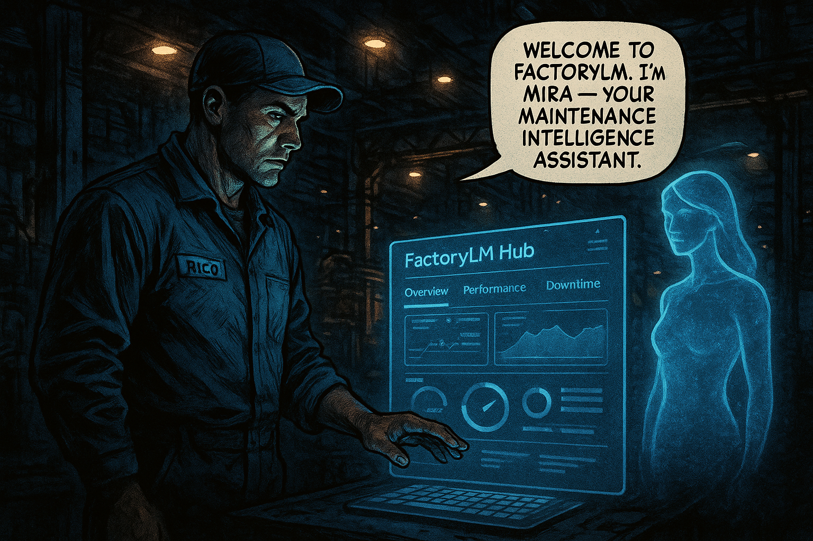

# FactoryLM Hub — Onboarding Walkthrough

> Comic-book style, 7 panels. Art direction: dark steel blue + amber palette,
> bold panel borders, industrial floor setting. Characters follow the established
> Rico / MIRA universe (see `marketing/comic-pipeline/config.yaml` master_style_context).
>
> To generate panel images: `cd marketing/comic-pipeline && doppler run -- python run_pipeline.py --scene onboarding`

---

## Panel 1 — Welcome



**Alt text:** Rico, a floor technician in blue coveralls and glasses, stands at a steel workbench holding a tablet. The FactoryLM Hub login screen glows on the display. A holographic outline of MIRA — rendered as a calm, professional woman in a hard hat — appears beside the screen. Factory floor stretches behind them, dim and industrial.

**Caption (top):** *First shift with FactoryLM Hub.*

**Speech bubble — MIRA:**
> "Welcome. I'm MIRA — your maintenance AI.
> I live in your equipment, your manuals, and your team's institutional knowledge.
> Let me show you what that means."

**Speech bubble — Rico (thought):**
> *She knows the plant.*

**Image prompt (gpt-image-1):**
Industrial comic book art style. Dark steel blue and amber color palette, high-contrast black panel borders. Rico (dark hair, glasses, blue coveralls with name patch) stands at a steel workbench holding a tablet. The FactoryLM Hub login screen glows on the tablet. A translucent holographic figure of MIRA — calm, professional woman, hard hat, blueprint-line rendering — appears above the screen. Factory conveyor floor behind them, dramatic diagonal lighting from overhead industrial lamps. Cinematic, gritty. No superheroes. Panel size: landscape 3:2.

---

## Panel 2 — Equipment


**Alt text:** Split panel. Left: Rico photographing a motor nameplate with his phone on the factory floor. Right: The FactoryLM Hub Assets screen showing the motor's profile card — model number, spec sheet thumbnail, maintenance history timeline.

**Caption (top):** *Your equipment. All of it. Finally in one place.*

**Speech bubble — MIRA:**
> "Upload a manual, snap a photo of the nameplate, or scan a QR code.
> MIRA reads it, indexes it, and makes it searchable — instantly."

**Speech bubble — Rico:**
> "Even the old Siemens drive that nobody touches?"

**Speech bubble — MIRA:**
> "Especially that one."

**Image prompt (gpt-image-1):**
Industrial comic book art style. Dark steel blue and amber palette, bold panel borders. Split composition: left half shows Rico (dark hair, glasses, blue coveralls) crouching on the factory floor, holding his phone up to photograph a motor nameplate on industrial equipment — dramatic lighting, grease-stained metal. Right half shows the FactoryLM Hub UI on a tablet screen: an asset profile card for "Siemens VFD — Line 3", with a thumbnail of the nameplate photo, model specs, and a maintenance history bar chart. Clean UI inside a gritty industrial frame. Cinematic comic panel.

---

## Panel 3 — MIRA Chat


**Alt text:** Rico stands in front of a VFD panel with a flashing fault code. He types into the FactoryLM Hub chat interface on his phone. MIRA's response fills the screen with a clear, step-by-step procedure pulled from the equipment manual, with the relevant page highlighted.

**Caption (top):** *E.LF. The drive is faulting. Again.*

**Speech bubble — Rico (typing):**
> "E.LF fault on the Line 3 drive. What does it mean and how do I clear it?"

**Speech bubble — MIRA:**
> "E.LF = DC bus undervoltage. Likely causes: input phase loss, loose L3 terminal, or voltage dip below 300V during ramp.
>
> Step 1: Check input voltage at L1/L2/L3 terminals.
> Step 2: Inspect terminal tightness — torque spec 4 Nm.
> Step 3: Reset with P-key hold 3 seconds.
>
> Source: GS10 Series Manual, p.47 — from your uploaded copy."

**Caption (bottom):** *Not the internet. YOUR manuals.*

**Image prompt (gpt-image-1):**
Industrial comic book art style. Dark steel blue and amber color palette, heavy black panel borders. Rico (dark hair, glasses, blue coveralls) stands in front of an open VFD panel, a red fault indicator light flashing. He holds his phone with the FactoryLM Hub chat interface visible — his question typed, MIRA's response displayed with a highlighted manual excerpt. Inset panel-within-panel: close-up of the phone screen showing the fault code procedure in clean UI with a "Source: GS10 Manual p.47" citation. Factory floor, dramatic amber uplighting. Gritty realism. No superheroes.

---

## Panel 4 — Work Orders


**Alt text:** Rico walks the floor during his rounds, speaking into his phone as a Telegram voice note. Above him, a translucent pipeline visualization shows the voice note converting to text, the MIRA AI extracting equipment, priority, and description, and a completed work order appearing in the Hub — all without Rico touching a keyboard.

**Caption (top):** *Hands full. Work order still gets made.*

**Speech bubble — Rico (into phone):**
> "Create a work order for Pump 7. Seal is leaking. Priority medium, assign to the morning crew."

**Caption (middle):** *3 seconds later...*

**Speech bubble — MIRA (work order card):**
> **WO-0847 — Pump 7 Seal Leak**
> Priority: Medium · Assigned: Morning Crew
> Asset: Pump 7 (Bldg A, Line 2)
> Description: Mechanical seal leaking. Inspect and replace per PM procedure.

**Caption (bottom):** *No app. No form. No keyboard.*

**Image prompt (gpt-image-1):**
Industrial comic book art style. Steel blue and amber palette, bold panel borders. Rico (dark hair, glasses, blue coveralls) walks between industrial machines on the factory floor, speaking into his phone. Dynamic diagonal composition. Above him, a translucent comic-style flow diagram shows: voice wave → text → AI extraction nodes (equipment icon, priority badge, crew icon) → a completed work order card dropping into the Hub UI. The work order card shown clearly: "WO-0847 — Pump 7 Seal Leak". Cinematic gritty lighting. Energy and motion in the panel. No superheroes.

---

## Panel 5 — Morning Brief


**Alt text:** Early morning. The factory floor is quiet between shifts. Marcus, the maintenance manager, sits at his desk with a mug of coffee, reading the FactoryLM morning brief on his phone — Dana's 5 AM Telegram message with the overnight summary, PM due list, and safety events, all formatted cleanly in the chat.

**Caption (top):** *5:00 AM. Before the floor wakes up.*

**Speech bubble — Dana (Telegram message):**
> ☀️ **Dana (Morning Brief) — 05:00**
>
> Good morning, Marcus.
>
> **Overnight:** 2 WOs created · 0 safety events · 1 PM completed
> **Due today:** VFD Fan Inspection (Line 3) · Compressor Oil (Bldg A)
> **Queue:** 33 manuals remaining for KB growth
>
> No action required. ✓

**Caption (bottom):** *Fifteen seconds. Everything you need.*

**Image prompt (gpt-image-1):**
Industrial comic book art style. Dark steel blue with warm amber accent, bold panel borders. Marcus (dark complexion, thoughtful expression, maintenance manager) sits at a desk in a dimly lit supervisor office, early morning, holding a coffee mug in one hand and his phone in the other. The Telegram morning brief message fills the phone screen — Dana's name and sun emoji visible at the top, clean formatted text below. Through the window behind him, the factory floor is visible but still. Quiet, contemplative mood. Warm desk lamp light contrasts with the blue-dark exterior. No superheroes.

---

## Panel 6 — Knowledge Cooperative


**Alt text:** Wide, dramatic panel. A network visualization floats above the factory floor — nodes representing different plants and equipment types connected by glowing lines. Each time a technician adds a manual or resolves a fault, the network pulses and grows. MIRA stands at the center of the web, visible as a calm holographic figure.

**Caption (top):** *One plant's hard lesson. Every plant's shortcut.*

**Speech bubble — MIRA:**
> "Every manual uploaded, every fault resolved, every work order created —
> it all flows back into the knowledge base.
>
> Your plant gets smarter. And so does every plant running MIRA."

**Speech bubble — Elena (on phone, remote):**
> "We solved the same E.LF fault on Line 7 last month. The fix is already in there."

**Caption (bottom):** *The more your team uses MIRA, the smarter she gets — for everyone.*

**Image prompt (gpt-image-1):**
Industrial comic book art style. Dark steel blue, amber, and electric white palette, bold dramatic panel borders. Wide cinematic panel. Factory floor below, perspective looking up. A large holographic network visualization floats above — glowing nodes representing plants and equipment, connected by pulsing light-lines. MIRA appears as a calm translucent figure at the center of the web, hard hat, blueprint rendering. Small inset panels in corners: Rico uploading a manual, Elena (engineering manager, remote, laptop) sending a chat, a new node lighting up in the network. Sense of scale and interconnection. Epic scope, gritty industrial base. No superheroes.

---

## Panel 7 — Get Started


**Alt text:** Final panel. Rico stands at the Hub onboarding screen, the cursor hovering over an "Upload a Manual" button. MIRA stands beside him in semi-transparent form, pointing at the button. The factory stretches behind them, full of equipment waiting to be understood.

**Caption (top):** *Ready.*

**Speech bubble — MIRA:**
> "You've got equipment. You've got manuals somewhere.
>
> Upload one. I'll read it overnight.
> Tomorrow morning, your team will know everything in it."

**Speech bubble — Rico:**
> "Which one first?"

**Speech bubble — MIRA:**
> "The one your techs ask you about most often."

---

> **[ Upload a Manual →]**

---

**Caption (bottom — final):** *FactoryLM. Your maintenance team's second brain.*

**Image prompt (gpt-image-1):**
Industrial comic book art style. Dark steel blue and amber palette, bold panel borders. Final splash-style panel with strong sense of resolution. Rico (dark hair, glasses, blue coveralls) stands at a tablet or kiosk showing the FactoryLM Hub UI — the "Upload a Manual" button prominent and glowing amber on screen. MIRA appears semi-transparently beside him, pointing at the screen with a calm expression. Behind them, the full factory floor stretches back in perspective — conveyor belts, motors, VFD panels, all waiting. Optimistic, purposeful mood. A beginning, not an ending. Bold typography overlay: "Your maintenance team's second brain." No superheroes.

---

## Production Notes

### Art Direction
- **Style:** Industrial comic book, gritty realism. NOT cartoon, NOT SaaS-tech minimal.
- **Palette:** Dark steel blue (#1a2f4a) + industrial amber (#f59e0b) + high-contrast black borders.
- **Characters:** Consistent across all panels — Rico, MIRA (holographic), Marcus, Elena. See `config.yaml` for canonical character descriptions.
- **Panel ratio:** 3:2 landscape (1536×1024 for gpt-image-1 generation).

### Generating Images
```bash
cd marketing/comic-pipeline
doppler run --project factorylm --config prd -- \
  python run_pipeline.py --scene onboarding --quality high
```

Add onboarding panels to `scripts/storyboard_v2.yaml` under a new `onboarding` scene block, then run the pipeline. Images output to `output/panels/scene_onboarding/`.

### Replacing Placeholders
Replace each `placeholder-panel-N.png` with the generated image:
```bash
cp output/panels/scene_onboarding/panel_1.png mira-hub/public/onboarding/panel-1.png
# update walkthrough.md image src accordingly
```

### Accessibility
All panels include `alt` text describing the scene content for screen readers. Keep alt text updated if panel images change.
