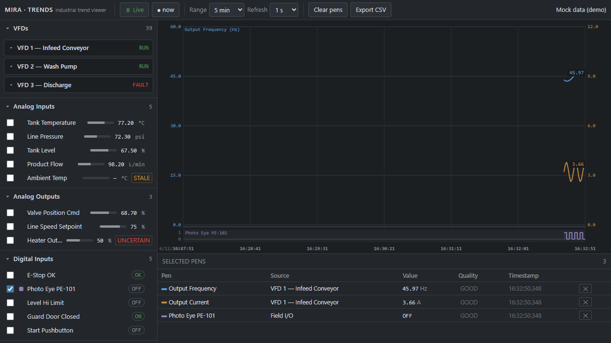

# MIRA Industrial Trend Viewer

A platform-agnostic, ISA-101 / High-Performance-HMI trend viewer for FactoryLM/MIRA — built to
feel like a real PLC/SCADA trend tool (Ignition / FactoryTalk / WinCC / AVEVA), not a SaaS
dashboard. Dependency-free static web app (vanilla ES modules) + a vendor-neutral data-source
adapter layer. Works fully on mock data before any live PLC/SCADA is connected.



## Run

```bash
# any static server (ES modules need http://, not file://)
cd mira-trend-viewer && python -m http.server 8791
# open http://127.0.0.1:8791/index.html        (defaults to mock data)
```

Adapter is chosen by query string:
- `?source=mock` (default) — simulated factory: 3 VFDs, analog IO, digital IO.
- `?source=historian&base=http://<plc-laptop>:8766` — the real MIRA bench trend historian
  (`plc/conv_simple_anomaly/trend_historian.py`). Proves the same UI on a different real source.

## What it does

- **Grouped source browser** (left): VFDs · Analog Inputs · Analog Outputs · Digital Inputs ·
  Digital Outputs. VFDs are expandable device cards with child registers. Analog rows show a live
  value + bar + units + range; digital rows show a read-only ON/OFF indicator. **Every trendable
  row has a checkbox** — the trend-selection control (multi-select; never radio).
- **Trend chart** (center): analog pens = continuous auto-scaled lines (first two get labeled
  left/right Y-axes in their pen color + a value tag at the live edge); digital pens = stacked 0/1
  **step lanes** in a distinct strip so they read clearly against analog lines. Time X-axis, grid,
  hairline cursor readout, wheel-zoom + drag-pan, live/pause with a loud **VIEWING HISTORY /
  PAUSED** indicator.
- **Selected-pen list** (bottom): every checked signal with source, value, units/state, quality,
  timestamp, and a Remove button. Remove unchecks the browser box (and vice-versa) — one source of
  truth, the store.
- **Toolbar**: Live/Pause · jump-to-now · time range (1m–8h) · refresh rate · clear pens · export
  CSV · connection/health chip.

## ISA-101 / HP-HMI discipline

Neutral gray canvas; **red/amber/green reserved for state only** (alarm/warn/ok); muted pen
colors for data; minimal decoration, no gradients/3D; bad/stale quality shown honestly (dashed
trace segments, STALE/UNCERTAIN badges, "—" not a fake number, "timestamp unavailable" when
absent). The data is the boldest thing on screen.

## Architecture (platform-agnostic)

```
 adapter (vendor-specific) ──normalized Tag[]──▶ TrendStore ──▶ UI (browser / chart / penlist / toolbar)
   connect / browse / subscribe / disconnect            the UI knows ONLY the store + model
```

- **`js/model.js`** — the vendor-neutral `Tag` (`createTag`) + enums + display helpers + grouping.
- **`js/store.js`** — DOM-free state: catalog, pen selection (bidirectional checkbox↔pen sync),
  per-pen history ring buffers, live/pause, CSV, observer. **Engineering scaling (`value =
  raw*scale + offset`) is applied once here at ingest** — a raw-count adapter (Modbus/OPC-UA) just
  reports raw + sets `scale`/`offset`.
- **`js/adapters/adapter.js`** — the `DataSourceAdapter` contract (`connect`/`browse`/`subscribe`/
  `disconnect`, plus an optional `onStatus` feed-health callback). Implement this to plug in:
  **Ignition · Allen-Bradley · Modbus · MQTT/Sparkplug · OPC-UA · Factory I/O · OpenPLC · CSV**.
- **`js/adapters/mockAdapter.js`** — the tested reference implementation (simulated factory).
- **`js/adapters/historianAdapter.js`** — a real second source (the bench trend historian).
- **`js/ui/*`** — browser, chart, penlist, toolbar. No vendor coupling.

To add a real source: implement `DataSourceAdapter`, return `createTag(...)` objects from
`browse()`, push `[{id, currentValue, quality, timestamp}]` from `subscribe()`. Nothing else
changes. **Read-only by design** (no write path) per `.claude/rules/fieldbus-readonly.md` +
train-before-deploy.

## Tests

```bash
node --test            # 25 tests: grouping, pen select/remove, checkbox sync, VFD expansion,
                       # analog-vs-digital, stale/bad quality, scale/offset, WORD/hex, mock updates, CSV
```

## Deferred to v2 (from the controls/PLC · architecture · QA · HMI review)

- **VFD "last/previous fault" register** — the workhorse for chasing *intermittent* trips (the
  active `fault_code` clears on reset). Highest-value functional add.
- **Status-word bit decode** — currently shown as honest hex (`0x0007`); decode into named
  boolean child traces (running/at-speed/faulted/…) for real troubleshooting.
- **Contactor command-vs-feedback** pairing (catch a sticking/dropping contactor).
- **History backfill** — an optional `history(id, from, to)` on the adapter so a historian /
  Ignition tagHistory / timestamped CSV pre-seeds the chart instead of drawing from "now".
- **Pen-list patch-render** (avoid full rebuild each tick) and a head-pointer history ring (drop
  the O(n) splice) for high-frequency, many-pen sources.
- **Live engineering reasoning hand-off to MIRA** — "discuss this trend with MIRA" deep-link.
