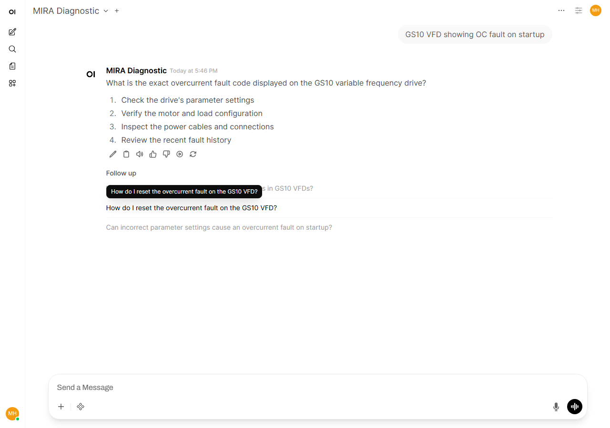
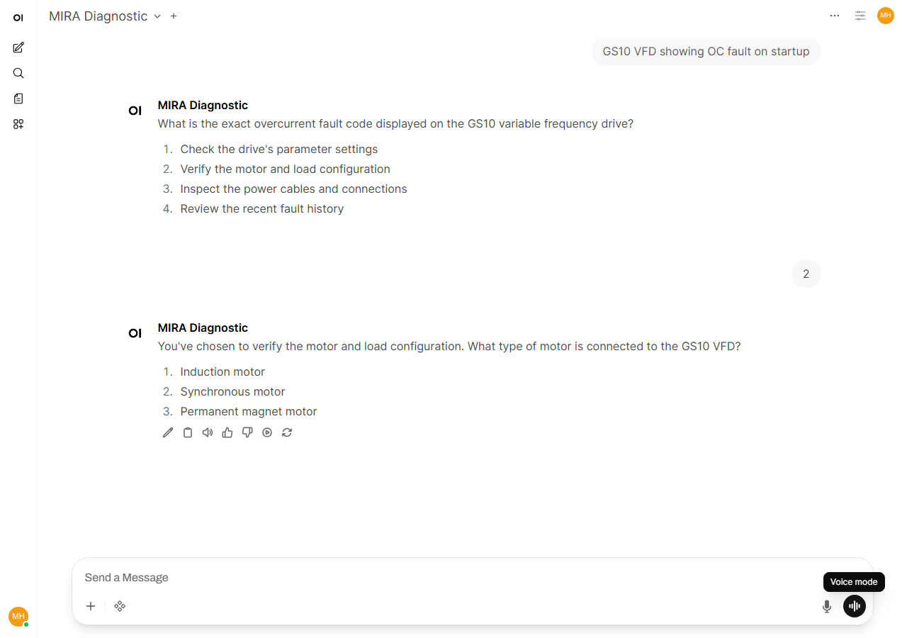
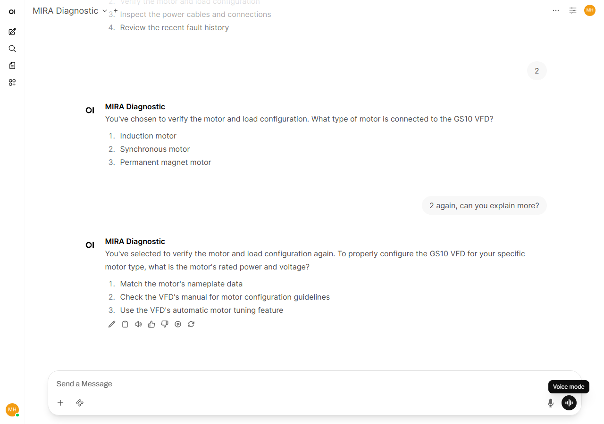

# MIRA App — Authenticated UX Audit

_Run: 2026-04-12T21:45:47Z_  
_Target: https://app.factorylm.com_

## Summary

| Metric | Value |
|---|---|
| Exchanges completed | 3 |
| Auth success | True |
| Options in first response | False |
| Avg response latency | 7.2s |
| Follow-up contextual | True |
| Errors | 0 |
| Console errors | 3 |

## Conversation Exchanges

### Exchange 1
**Sent:** `GS10 VFD showing OC fault on startup`  
**Latency:** 7.27s | **Chars:** 239
**Numbered options detected:** False

**Response preview:**
```
What is the exact overcurrent fault code displayed on the GS10 variable frequency drive?

Check the drive's parameter settings
Verify the motor and load configuration
Inspect the power cables and connections
Review the recent fault history
```



### Exchange 2
**Sent:** `2`  
**Latency:** 7.97s | **Chars:** 164
**Numbered options detected:** False

**Response preview:**
```
You've chosen to verify the motor and load configuration. What type of motor is connected to the GS10 VFD?

Induction motor
Synchronous motor
Permanent magnet motor
```



### Exchange 3
**Sent:** `2 again, can you explain more?`  
**Latency:** 6.36s | **Chars:** 312
**Numbered options detected:** False
**Context carried forward:** True

**Response preview:**
```
You've selected to verify the motor and load configuration again. To properly configure the GS10 VFD for your specific motor type, what is the motor's rated power and voltage?

Match the motor's nameplate data
Check the VFD's manual for motor configuration guidelines
Use the VFD's automatic motor tuning feature
```




## Errors (0)

_None._

## Browser Console Errors (3)

- [warning] No token found in localStorage, user-join event not emitted
- [warning] [tiptap warn]: Duplicate extension names found: ['codeBlock', 'bulletList', 'listItem', 'listKeymap', 'orderedList']. This can lead to issues.
- [warning] [tiptap warn]: Duplicate extension names found: ['codeBlock', 'bulletList', 'listItem', 'listKeymap', 'orderedList']. This can lead to issues.

## Screenshots

- `01-initial-load.png` — [01-initial-load.png](app-screenshots/01-initial-load.png)
- `02-before-first-message.png` — [02-before-first-message.png](app-screenshots/02-before-first-message.png)
- `03-response-1.png` — [03-response-1.png](app-screenshots/03-response-1.png)
- `04-response-2.png` — [04-response-2.png](app-screenshots/04-response-2.png)
- `05-response-3-followup.png` — [05-response-3-followup.png](app-screenshots/05-response-3-followup.png)
- `06-full-thread.png` — [06-full-thread.png](app-screenshots/06-full-thread.png)