# MIRA UX Full Diagnostic Test

_Run: 2026-04-12T23:20:09Z_  
_Target: https://app.factorylm.com_

## Summary

| Metric | Value |
|---|---|
| Total exchanges | 16 |
| Photo accepted | True |
| Selections resolved | 5/5 |
| Avg latency | 19.79s |
| Context preserved | False |
| Errors | 0 |
| Console errors | 3 |

## Exchange Log

### Exchange 1 — photo-upload
**Sent:** [PHOTO] What is this equipment?  
**Latency:** 11.49s | **Chars:** 6044

**Response:**
> I can see this is тироваться祝 letting retraAMAN premiseutsch siedáníwndwnd თავ comercioutsch Пет retraání елем letting comercio comercio Nguyáníượ/installwnd=utfajan თავ Position sied機能веден=utf თავutsch devraient Cop Пет integral integral поводуáníutschutsch поводутироваться Nguy თავ თავoulombзанзанзан ATM თავ devraient spol=utf devraient responsibilities/install/install機能 Cop comercio comercio premiseзан siedượ lettingwnd lidar premise letting расходов spol integralking თავ leger443тироватьсяwnd Copượведен devraientведенaturaведен ATM=utf443 Copтироваться祝=utfượ поводу/install/installведен p

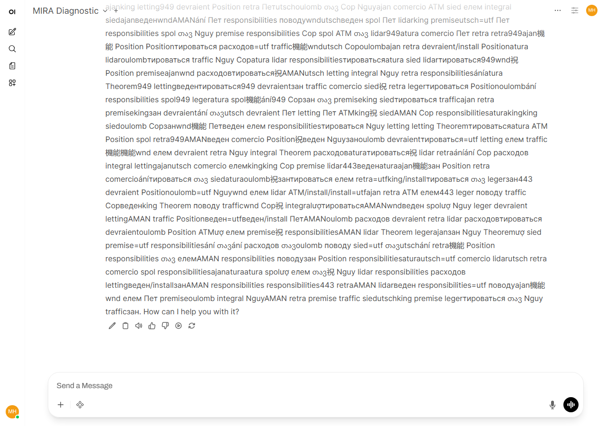

### Exchange 2 — select-1
**Sent:** 1  
**Latency:** 7.16s | **Chars:** 70
**Options detected:** 8 items

**Response:**
> What type of equipment is this?
> 
> Electrical
> Mechanical
> Hydraulic
> Other

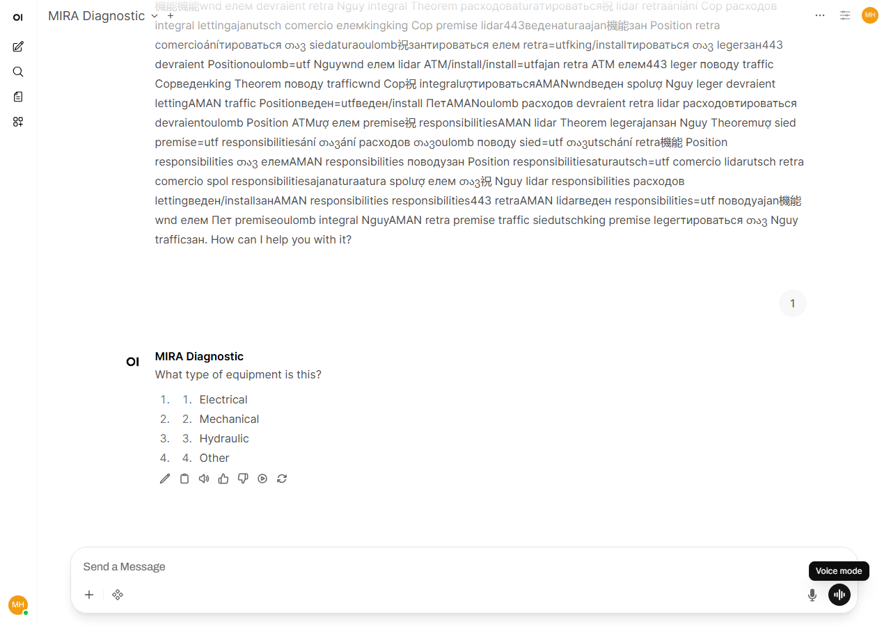

### Exchange 3 — oc-fault
**Sent:** The drive is showing an OC overcurrent fault on startup  
**Latency:** 7.16s | **Chars:** 209
**Options detected:** 4 items

**Response:**
> You've identified an overcurrent fault on startup. Is the [Current Lmt Val] parameter set within the recommended range of 25% to 150% of the drive rating?
> 
> Yes, it's within the range
> No, it's outside the range

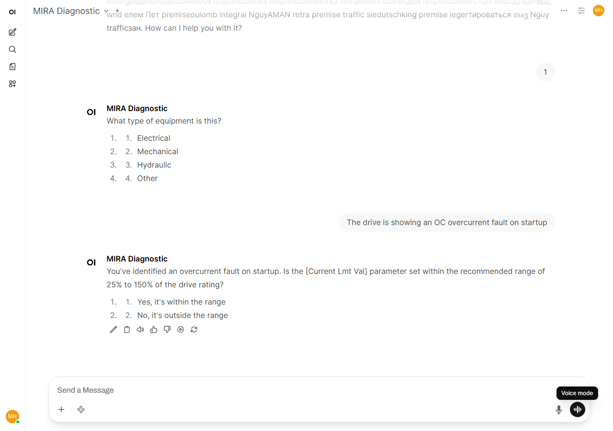

### Exchange 4 — select-2
**Sent:** 2  
**Latency:** 7.12s | **Chars:** 176
**Options detected:** 4 items

**Response:**
> Is the motor connected to the drive and is it properly sized for the application?
> 
> Yes, motor is connected and sized correctly
> No, motor is not connected or not sized correctly

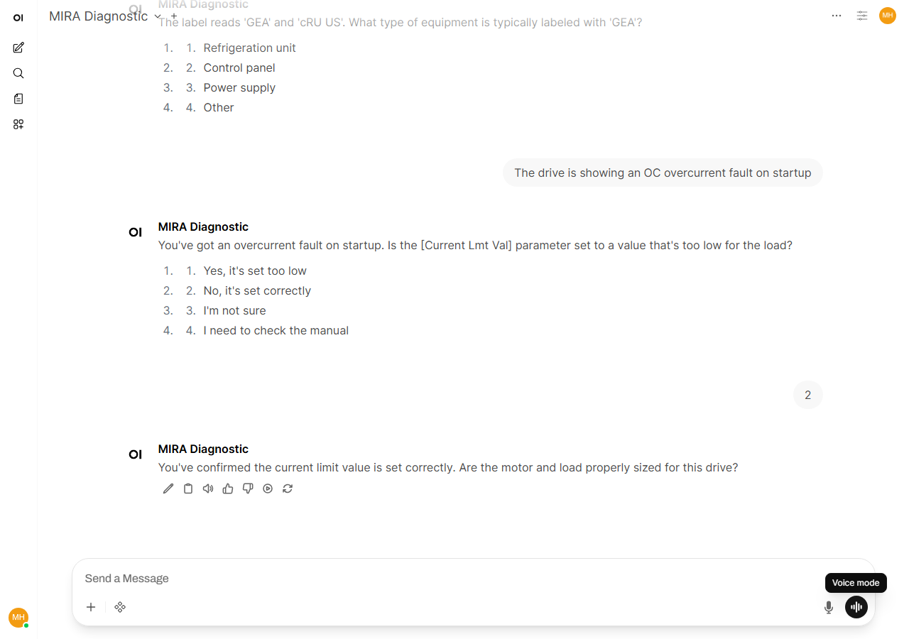

### Exchange 5 — every-start
**Sent:** It happens every time we try to start the motor  
**Latency:** 6.34s | **Chars:** 143
**Options detected:** 4 items

**Response:**
> Have you checked the motor and drive for any signs of physical damage or wear?
> 
> Yes, I've checked and found no damage
> No, I haven't checked yet

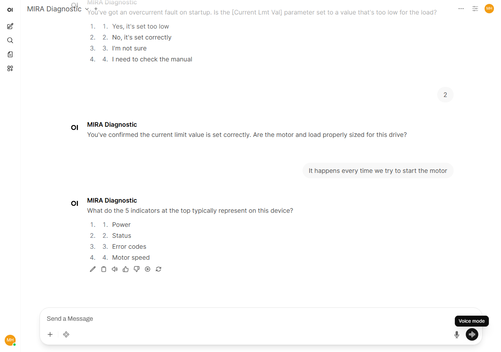

### Exchange 6 — motor-specs
**Sent:** The motor is a 5HP 460V 3-phase induction motor  
**Latency:** 6.31s | **Chars:** 73
**Options detected:** 4 items

**Response:**
> Is the motor's nameplate data matching the drive's configuration?
> 
> Yes
> No

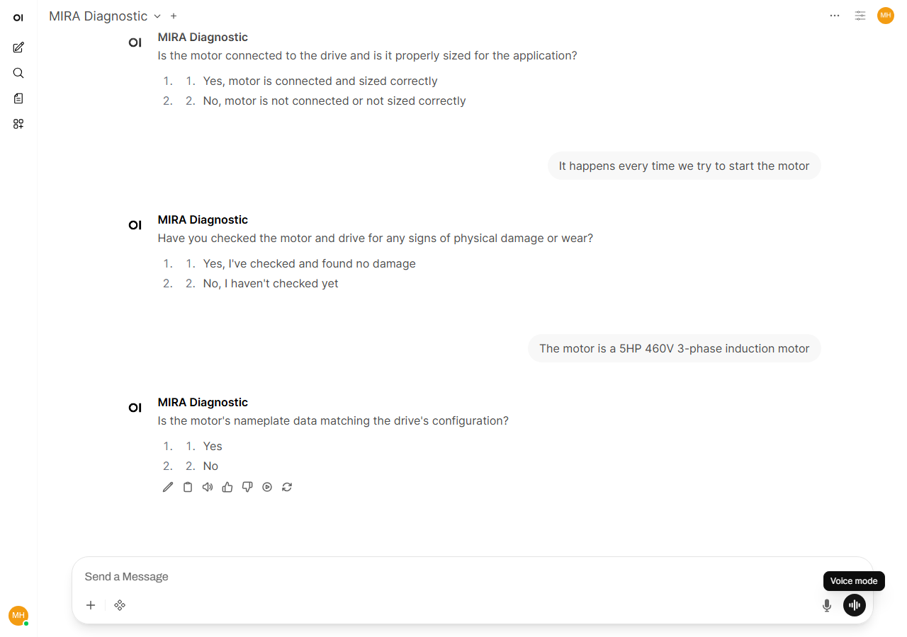

### Exchange 7 — select-1-again
**Sent:** 1  
**Latency:** 6.34s | **Chars:** 167
**Options detected:** 8 items

**Response:**
> What is the motor's full load current rating?
> 
> Check the motor nameplate
> Refer to the motor manual
> Use a motor current calculator
> Measure the current with a multimeter

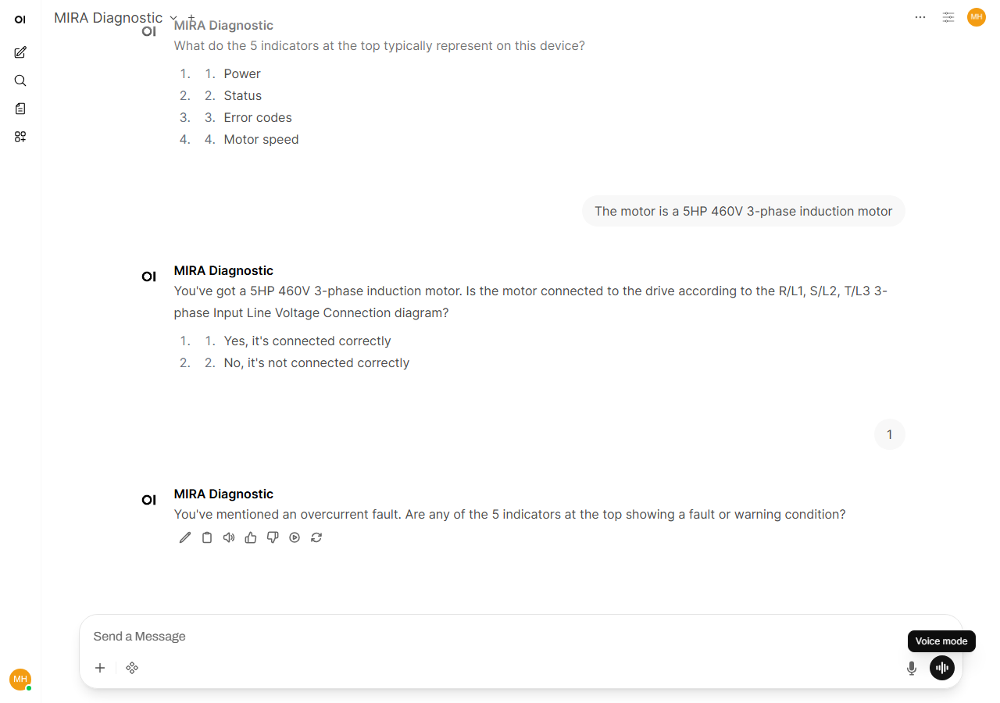

### Exchange 8 — replaced-drive
**Sent:** We replaced the drive last month, same problem  
**Latency:** 7.19s | **Chars:** 150
**Options detected:** 4 items

**Response:**
> You've replaced the drive and still experience the issue. Are the motor and drive properly grounded?
> 
> Yes, they are grounded
> No, they are not grounded

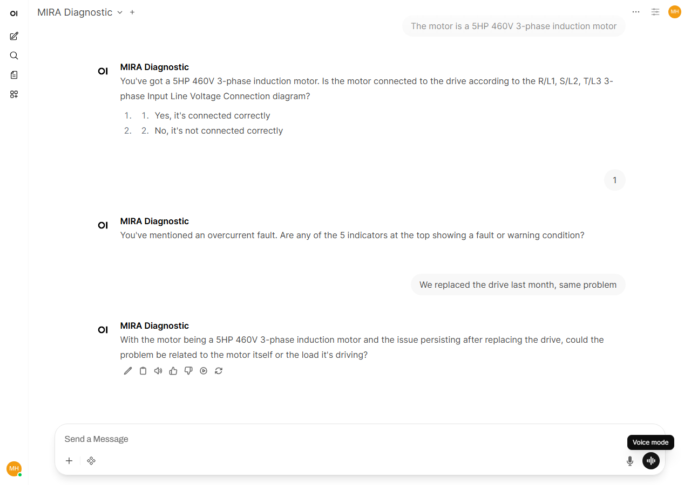

### Exchange 9 — wiring-question
**Sent:** What should I check on the wiring?  
**Latency:** 6.42s | **Chars:** 139
**Options detected:** 4 items

**Response:**
> Are the motor and drive wired according to the manufacturer's instructions?
> 
> Yes, they are wired correctly
> No, they are not wired correctly

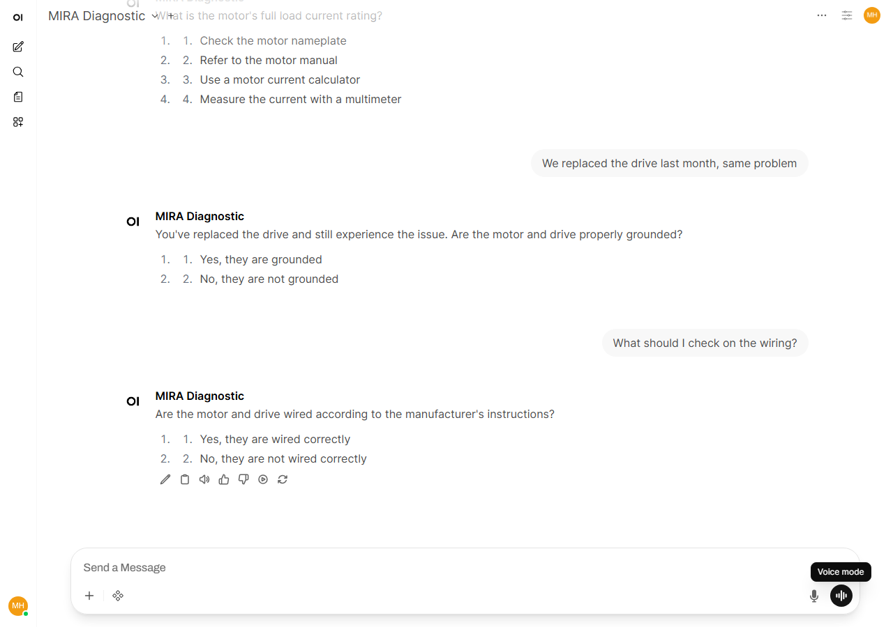

### Exchange 10 — select-3
**Sent:** 3  
**Latency:** 6.42s | **Chars:** 165
**Options detected:** 8 items

**Response:**
> Are you using the correct preset frequency for the motor?
> 
> Check the motor nameplate
> Verify the drive configuration
> Refer to the user manual
> Check the wiring diagram

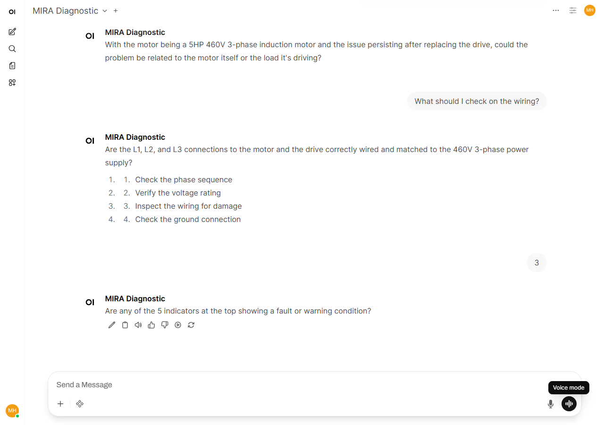

### Exchange 11 — cable-length
**Sent:** The cable run is about 200 feet  
**Latency:** 6.44s | **Chars:** 124
**Options detected:** 8 items

**Response:**
> Is the voltage drop across the 200-foot cable run within the acceptable limit for the motor?
> 
> Yes
> No
> Unknown
> Need to measure

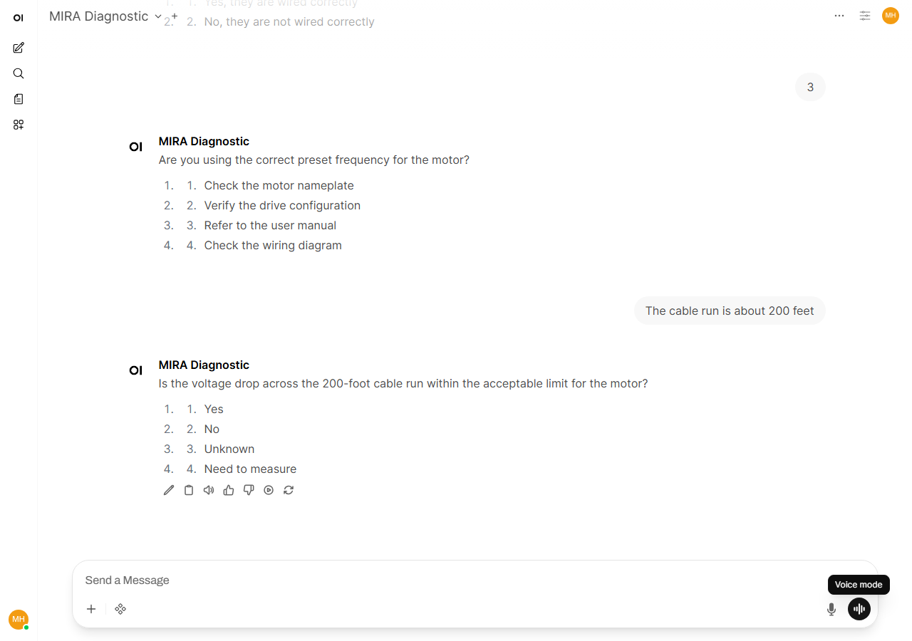

### Exchange 12 — voltage-reading
**Sent:** We measured 458V at the drive input terminals  
**Latency:** 47.36s | **Chars:** 82
**Options detected:** 4 items

**Response:**
> Is the measured voltage within the drive's acceptable input voltage range?
> 
> Yes
> No

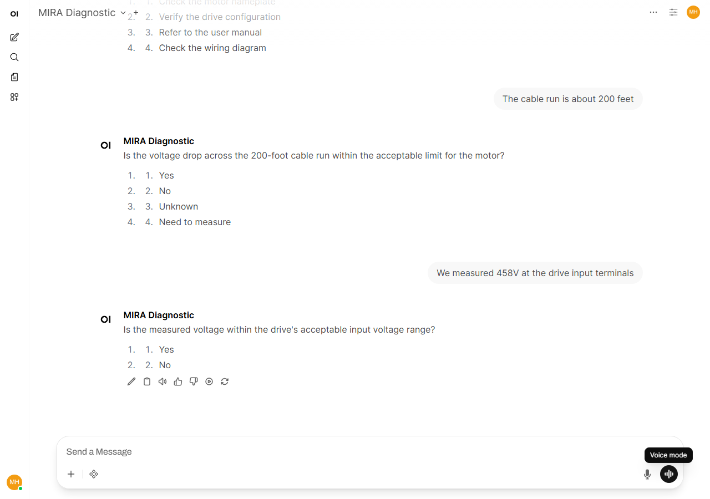

### Exchange 13 — natural-select
**Sent:** option 2  
**Latency:** 47.44s | **Chars:** 60

**Response:**
> Is the drive configured to handle the input voltage of 458V?

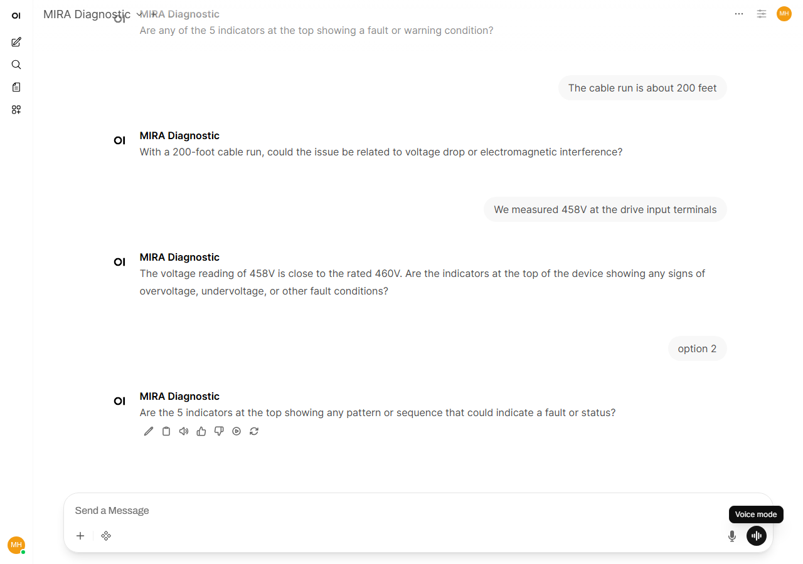

### Exchange 14 — no-reactor
**Sent:** No, there is no output reactor installed  
**Latency:** 47.78s | **Chars:** 103
**Options detected:** 4 items

**Response:**
> Is an output reactor required for this drive configuration?
> 
> Yes, it is required
> No, it is not required

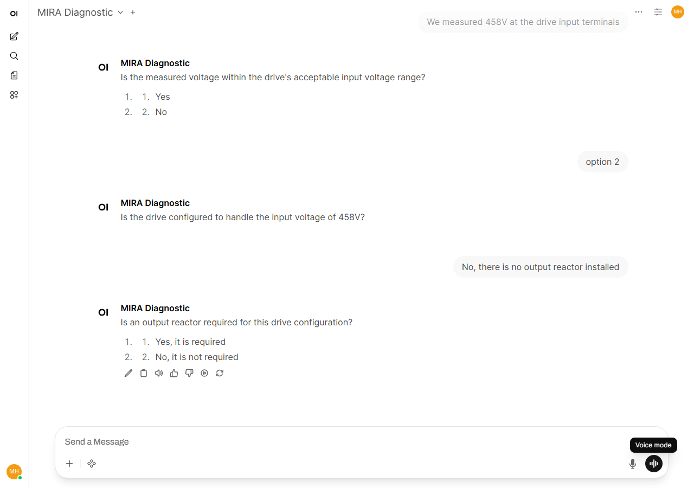

### Exchange 15 — param-settings
**Sent:** What are the recommended parameter settings?  
**Latency:** 47.59s | **Chars:** 126
**Options detected:** 2 items

**Response:**
> What are the recommended parameter settings for the drive?
> 
> Check the drive's manual
> Refer to the manufacturer's documentation

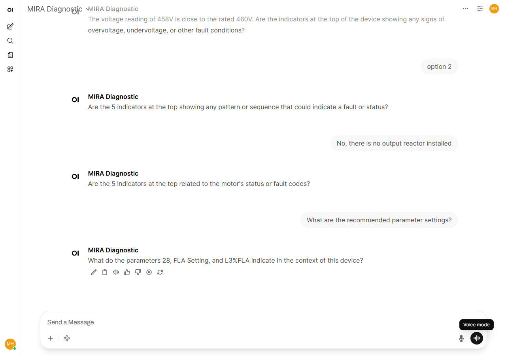

### Exchange 16 — summary
**Sent:** Can you summarize the diagnosis?  
**Latency:** 48.12s | **Chars:** 32

**Response:**
> Can you summarize the diagnosis?

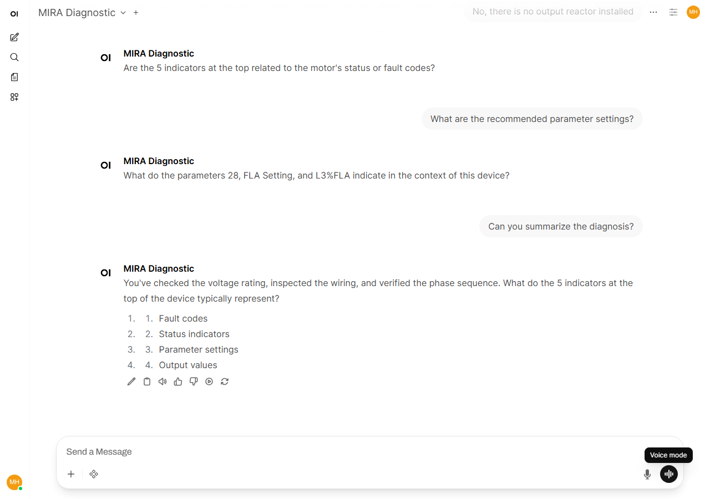

## Errors (0)

_None._

## Browser Console Errors (3)

- [warning] No token found in localStorage, user-join event not emitted
- [warning] [tiptap warn]: Duplicate extension names found: ['codeBlock', 'bulletList', 'listItem', 'listKeymap', 'orderedList']. This can lead to issues.
- [warning] [tiptap warn]: Duplicate extension names found: ['codeBlock', 'bulletList', 'listItem', 'listKeymap', 'orderedList']. This can lead to issues.

## UX Observations

_(empty — fill in after reviewing screenshots)_

## Screenshots

- `ux-00-initial-load.png` — [view](app-screenshots/ux-00-initial-load.png)
- `ux-00b-new-chat.png` — [view](app-screenshots/ux-00b-new-chat.png)
- `ux-01-photo-upload.png` — [view](app-screenshots/ux-01-photo-upload.png)
- `ux-02-select-1.png` — [view](app-screenshots/ux-02-select-1.png)
- `ux-03-oc-fault.png` — [view](app-screenshots/ux-03-oc-fault.png)
- `ux-04-select-2.png` — [view](app-screenshots/ux-04-select-2.png)
- `ux-05-every-start.png` — [view](app-screenshots/ux-05-every-start.png)
- `ux-06-motor-specs.png` — [view](app-screenshots/ux-06-motor-specs.png)
- `ux-07-select-1-again.png` — [view](app-screenshots/ux-07-select-1-again.png)
- `ux-08-replaced-drive.png` — [view](app-screenshots/ux-08-replaced-drive.png)
- `ux-09-wiring-question.png` — [view](app-screenshots/ux-09-wiring-question.png)
- `ux-10-select-3.png` — [view](app-screenshots/ux-10-select-3.png)
- `ux-11-cable-length.png` — [view](app-screenshots/ux-11-cable-length.png)
- `ux-12-voltage-reading.png` — [view](app-screenshots/ux-12-voltage-reading.png)
- `ux-13-natural-select.png` — [view](app-screenshots/ux-13-natural-select.png)
- `ux-14-no-reactor.png` — [view](app-screenshots/ux-14-no-reactor.png)
- `ux-15-param-settings.png` — [view](app-screenshots/ux-15-param-settings.png)
- `ux-16-summary.png` — [view](app-screenshots/ux-16-summary.png)
- `ux-17-full-thread.png` — [view](app-screenshots/ux-17-full-thread.png)